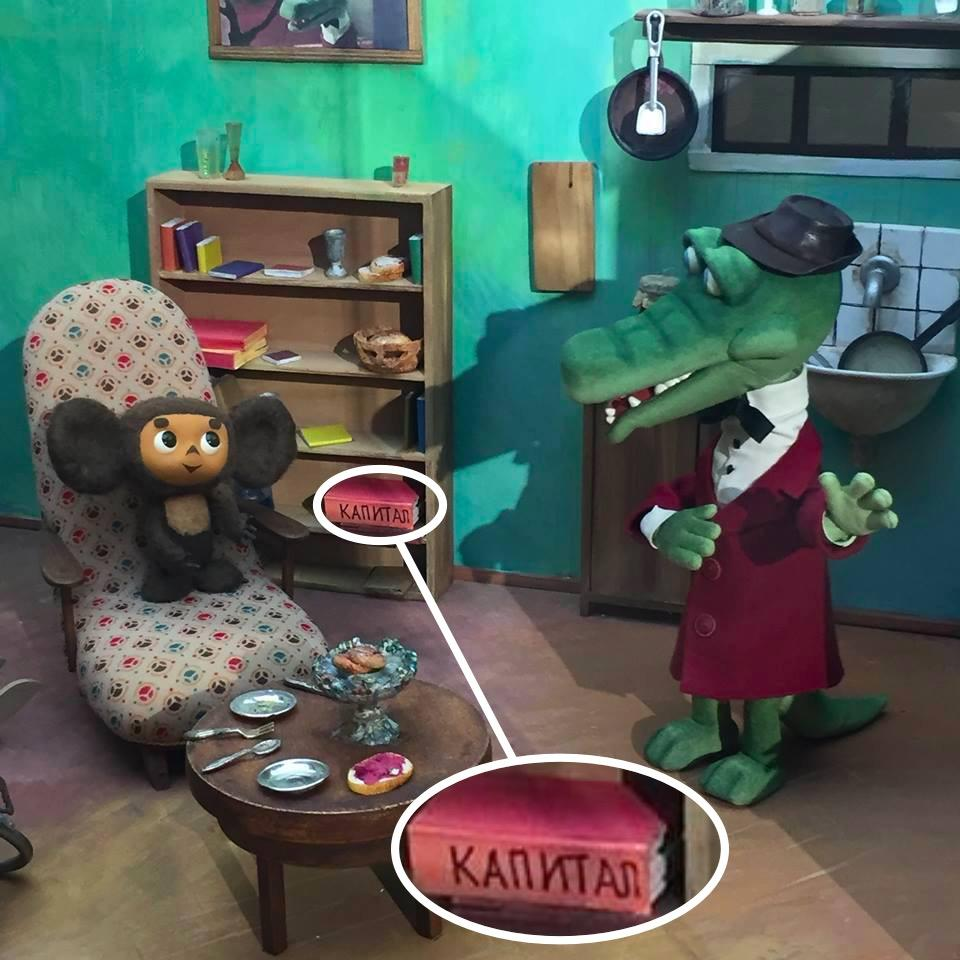
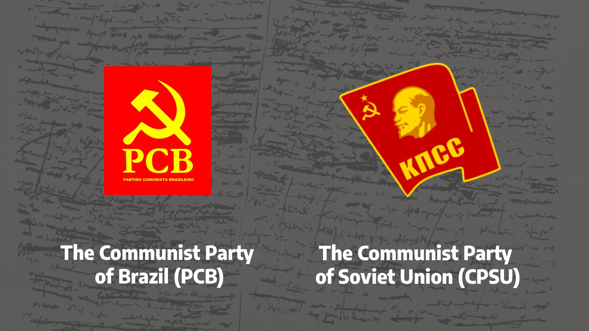
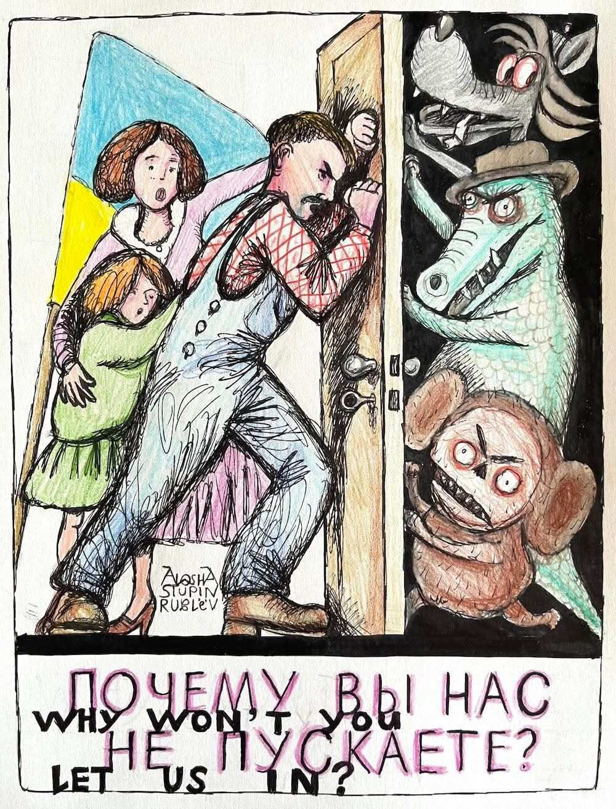
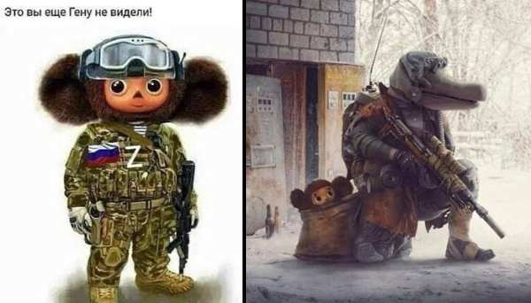
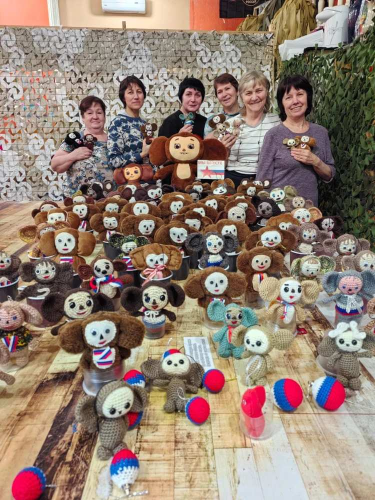

# Portrait of a Russian Intellectual as a Crocodile

Up until the 1960s there still remained in the USSR a naïve faith in Leninism, partly
maintained through the physical destruction of dissenters during the Stalinist years. But by
the late 1960s, when mass terror had ceased, Soviet television aired a cartoon about
Crocodile Ghena and his friend — the fantastical creature Cheburashka[^1]. In this cartoon,
almost by accident, the real attitude of Soviet intellectuals toward Leninism broke through.
This is explained in the Russian journalist Alexey Munipov’s parody sketch below, which
takes a humorous approach.

“The only noticeable book in Crocodile Ghena’s library is Marx’s Capital. How should this be
explained in light of the realities of 1969 (the year the first cartoon about him appeared)?

*Fig.1 The only noticeable book in Crocodile Ghena’s library is Marx’s “Capital”*

Ghena is a young Marxist of the 1960s, from the circle of Genrikh Batishchev[^2]. Obsessed
with the idea of returning to “true socialism”, he avidly reads the young Marx, Gramsci,
Marcuse, and Ivan Illich. He tries to preach to the Pioneers[^3]. He works in a cushy but
somewhat shameful sinecure — as an intellectual at a research institute, that is, as himself,
“a crocodile in the zoo”; later, as an employee of the Higher Komsomol School in Veshnyaki.
An aesthete (pipe, hat, bow tie, the much-remembered habit of wearing a velvet robe over a
white shirt). In his spare time he likes to play the bandoneon, being one of the first in the
USSR to discover and, as best he can, promote the music of Astor Piazzolla, and, according
to legend, introducing it to the young Leonid Desyatnikov.

He develops — with pleasure though without much success — plans for socialist
transformations in Third World countries[^4], which is how he befriends Cheburashka who has
arrived from Africa. For a short time he works at Levada’s Institute for Concrete Social
Studies. He lives in a one-room apartment near Aeroport metro, inherited from his
grandmother, a star of Stalin-era cinema (who had already gotten him out of trouble more
than once, and would do so again). His circle of acquaintances and interests naturally leads
him into the editorial offices of Problems of Peace and Socialism[^5]. In the 1990s, watching the

astonishing career turns of his colleagues at the journal — Yuri Kariakin and Vladimir Lukin —
he too prepares to enter politics. And so the aging, heavier, disillusioned Ghena — Gennady
Andreyevich — embarks on a new life.” (Munipov 2016)

The key idea of the above humorous fragment is that although the creators of the cartoon
may not have embedded all this content into it, the mere presence of Marx's “Capital” on the
shelf of the cartoon crocodile, who clearly parodies Soviet intelligentsia with his entire
appearance, testifies to the loss of all reverence and awe before Marxism in the USSR. In just
ten years, this light irony would transform into genuine revulsion. This quote from
Lenin—"The teaching of Marx is omnipotent because it is true"—eventually became a kind of
proto-meme even in the 1970s, and later in the 1990s some stand-up comedians used it in
their jokes. Later many Lenin’s quotes became targets of mockery and laughingstocks in the
USSR.

In the Cheburashka stories, Crocodile Gena embodies the Soviet intellectual: dressed as an
educated, respectable worker who assumes the role of teacher, organizer, and moral
authority. Cheburashka, in contrast, is a rootless, exotic creature “from Africa,” whose lack of
origins and social function makes him dependent on Gena’s guidance and integration into
Soviet society. Read allegorically, their relationship can be seen as reflecting the dynamics
between Soviet Marxism and Western (including Latin American) Marxism in the 20th
century: Soviet intellectuals positioned themselves as the guardians of “true” Marxist
doctrine, treating alternative or localized Marxist movements as naïve, immature, or exotic,
yet in need of guidance. Just as Gena “educates” and legitimizes Cheburashka, Moscow
sought to subsume diverse Marxist currents under its ideological authority, offering
paternalistic mentorship to movements in the “Third World” and the West while dismissing
their independent interpretations.

The case of Brazilian Marxism illustrates this dynamic vividly. The Communist Party of Brazil
(PCB), strongly influenced by the Soviet Union, adopted the framework of Marxism-Leninism
as articulated by the Third International, applying its theses on “colonial, semi-colonial, and
dependent countries” to Brazil’s context. While this provided an external model and a sense
of revolutionary legitimacy, it also produced tensions: Soviet influence fueled internal
factionalism, particularly after Khrushchev’s de-Stalinization in 1956, and eventually led to
the 1962 split that created the Communist Party of Brazil (PCdoB). Moreover, conservatives
and the military exploited fears of “international Bolshevism” to justify the 1964 coup,
demonstrating how Soviet authority over Brazilian Marxism, much like Gena’s tutelage of

Cheburashka, was both formative and destabilizing—at once a source of identity and a cause
of dependence and conflict.

*Fig.2 Comparison between two logos: The Communist Party of Brazil (PCB) and the Communist Party of Soviet Union (CPSU)*

From this perspective, Cheburashka can be imagined as a Brazilian, uneducated student who
must be instructed by the Moscow intellectual, Crocodile Ghena, in the “correct” and
practical version of Marxism. Later, Cheburashka would return to Brazil to apply the acquired
knowledge in practice, under the watchful supervision of Russian curators. In the long run,
Brazil could even be envisioned as becoming the sixteenth republic of the USSR.

Gradually, even this pair — Crocodile Ghena and Cheburashka — came to be regarded as
symbols of Russian imperialism, much like the numerous Lenin monuments once scattered
across Ukraine. Since 1991, when the USSR collapsed, some 3,200 Lenin statues have been
demolished in Ukraine. In the caricature below (drawn by Russian artist Ihor Ponochevny in
2025), three Russian cartoon characters — Crocodile Ghena, Cheburashka, and the Wolf —
appear as monsters attempting to invade the home of a Ukrainian family. Ironically, even this
“young Marxist of the 1960s” has, by the 2020s, become a symbol of Russian imperialist
aggression. The caption “Why won’t you let us in?” satirically depicts Russian cultural
symbols as instruments of imperialist aggression against Ukraine.

*Fig.3 “Why won’t you let us in?” depicts Crocodile Ghena and Cheburashka invading a Ukrainian family household, by Ihor Ponochevny, 2025*

This caricature is simply an ironic reflection on the real exploitation of Cheburashka in
Russia’s war against Ukraine. Cheburashkas can be seen painted on Russian self-propelled
multiple rocket launchers, while Russian children and school teachers produce thousands of
Cheburashka toys for soldiers of the occupying army. They say: “This is ChebuRusshka. We
will be ‘cheburusshing’ the fascists.” In Russian usage, “fascists” refers to anyone who
defends Ukraine against aggression or supports its defenders.

*Fig.4 “You have not even seen Ghena yet!” Modern Russian images of Crocodile Ghena and Cheburashka as “real heroes” in war against Ukraine*

*Fig.5 Russian women are making thousands of Cheburashka toys by hand to send as mascots to Russian soldiers fighting in Ukraine.*

Cheburashka, a beloved Soviet cartoon character from the 1960s, has become widely used
in Russia’s aggression against Ukraine because of its strong cultural symbolism. For
generations of Russians (and many people in former Soviet republics including Ukraine),
Cheburashka represents innocence, childhood, and shared Soviet identity. By co-opting this
figure, Russia tries to get many goals.

   ●   Mobilize nostalgia – Cheburashka is a character almost every Russian recognizes
       with affection. Using it in war propaganda evokes emotional unity and taps into
       Soviet-era pride.

   ●   Mask aggression with innocence – a “cute” character softens the image of war,
       making military actions appear less brutal or even playful.

   ●   Reassert cultural dominance – just as Lenin statues once symbolized Soviet power
       across Ukraine, using Cheburashka signals that Russian culture still claims
       ownership of shared Soviet heritage.

   ●   Produce propaganda for children – Cheburashka toys made by schoolchildren for
       soldiers normalize war, turning participation in aggression into a patriotic duty
       disguised as play.

This whimsical cartoon image took on a darker meaning in today’s Russia: Cheburashka is
now deployed as a talisman by Russian invading forces in Ukraine, with toys and symbols
sent to the front to inspire soldiers and “soften” the public image of aggression.

Bibliography

Munipov 2016: Munipov, Alexey. Facebook post, 30 March 2016.
https://www.facebook.com/munipov/posts/10207862382130548

---

[^1]: Crocodile Ghena and Cheburashka are characters from a popular Soviet children’s cartoon
created in the 1960s by Eduard Uspensky. Ghena is depicted as a crocodile who works in a zoo and
wears a suit, bow tie, and hat — the attire of a Soviet intellectual — symbolizing respectability,
education, and social usefulness. Cheburashka, a small fantastical creature with large ears, arrives
“from Africa” inside a crate of oranges, a narrative device that both exoticized him and reflected the
Soviet fascination with distant lands, while also justifying his lack of origins or identity. This imagery
also echoed the paternalistic attitude of many Soviet intellectuals toward so-called “Third World”
countries: simultaneously romanticizing them as exotic and childlike, while casting the Soviet Union in
the role of benevolent guide and educator.
[^2]: Genrikh Stepanovich Batishchev (1932-1990) was a prominent Soviet philosopher and doctor of
philosophical sciences who worked as a senior researcher at the Institute of Philosophy of the USSR
Academy of Sciences. A student of the influential Marxist philosopher Evald Ilyenkov, Batishchev
developed original theoretical work on dialectical contradictions, human creative activity, and what he
termed "deep communication," later incorporating Orthodox Christian elements into his philosophical
framework after converting in 1977.
[^3]: The Pioneers were a youth organization established in 1922 for children aged 10-15, serving as the
primary communist educational and social movement in the USSR. Pioneer members wore distinctive
red neckerchiefs, participated in community service projects, outdoor activities, and ideological
education designed to instill socialist values and prepare them for eventual membership in the
Komsomol (Communist Youth League). The organization played a central role in Soviet childhood,
with most schoolchildren becoming Pioneers as part of the standard educational and social
development process in communist society.
[^4]: The term "Third World" originated during the Cold War to describe countries that were not aligned
with either the Western capitalist bloc (First World) or the Eastern communist bloc (Second World),
initially referring to non-aligned nations seeking independence from colonial powers. Over time, the
term evolved to broadly categorize developing nations in Africa, Asia, and Latin America that faced
challenges such as poverty, limited industrialization, and economic dependence on former colonial
powers or superpowers. While still commonly used, many scholars and policymakers now prefer
terms like "developing countries," "Global South," or "emerging economies" to avoid the hierarchical
implications and Cold War-era connotations of the original terminology.
[^5]: Problems of Peace and Socialism (originally Problemy mira i sotsializma in Russian) was an
influential international communist theoretical journal published in Prague from 1958 to 1990, serving
as a key platform for ideological discussions among communist parties worldwide. The magazine
featured articles on Marxist-Leninist theory, socialist economic development, anti-imperialist
movements, and strategies for achieving socialism in different national contexts, with contributions
from leading communist intellectuals and party officials from various countries. Published in multiple
languages and distributed globally, it played a significant role in coordinating communist ideology
during the Cold War and facilitating theoretical exchanges between socialist movements in the Third
World and established communist states.
