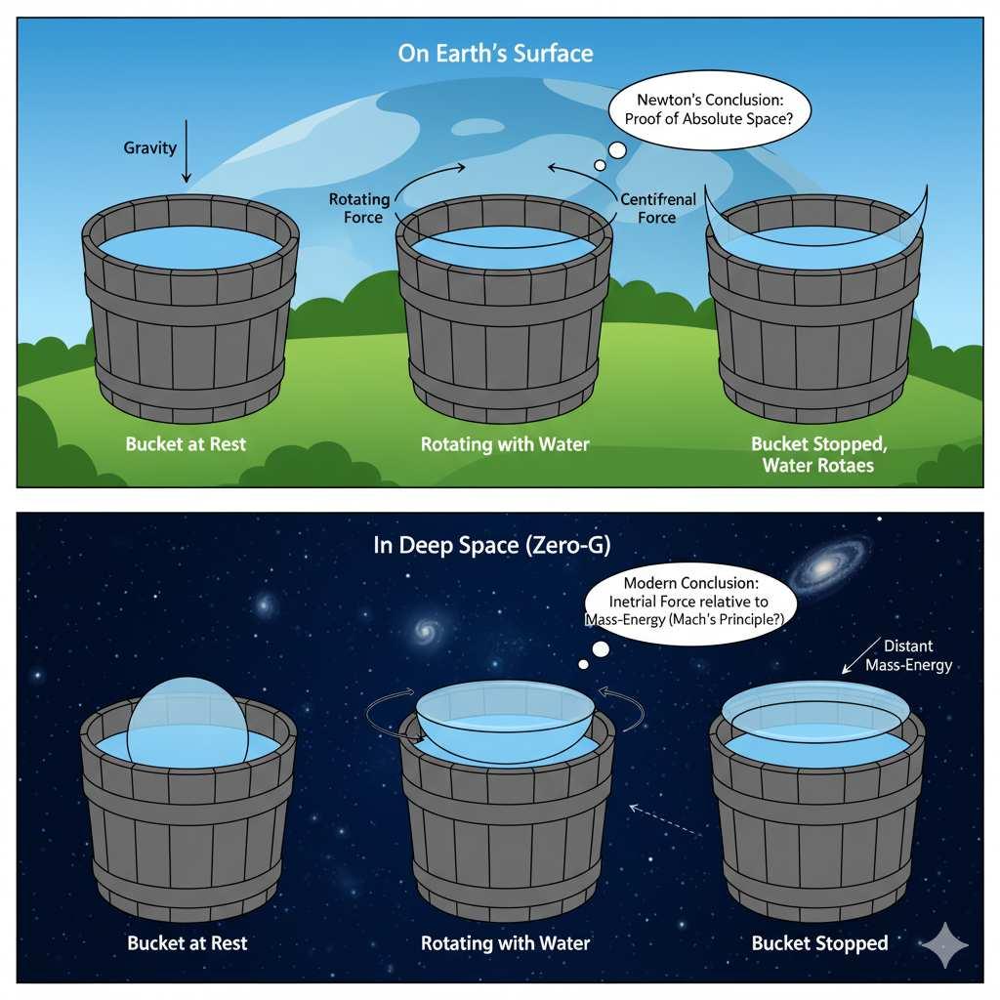
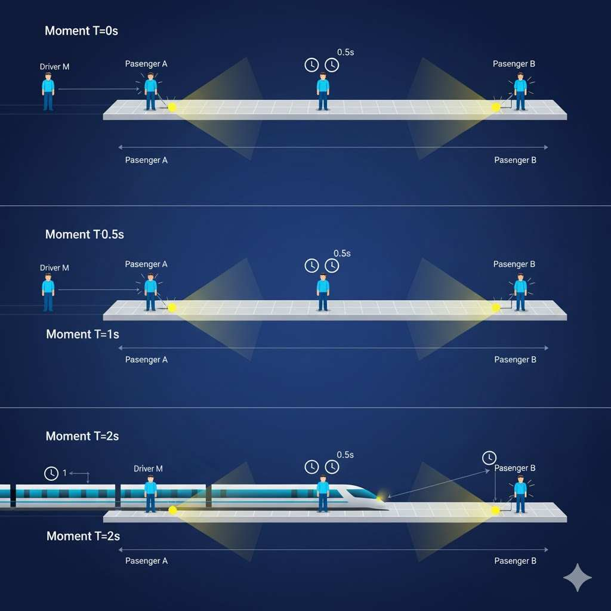
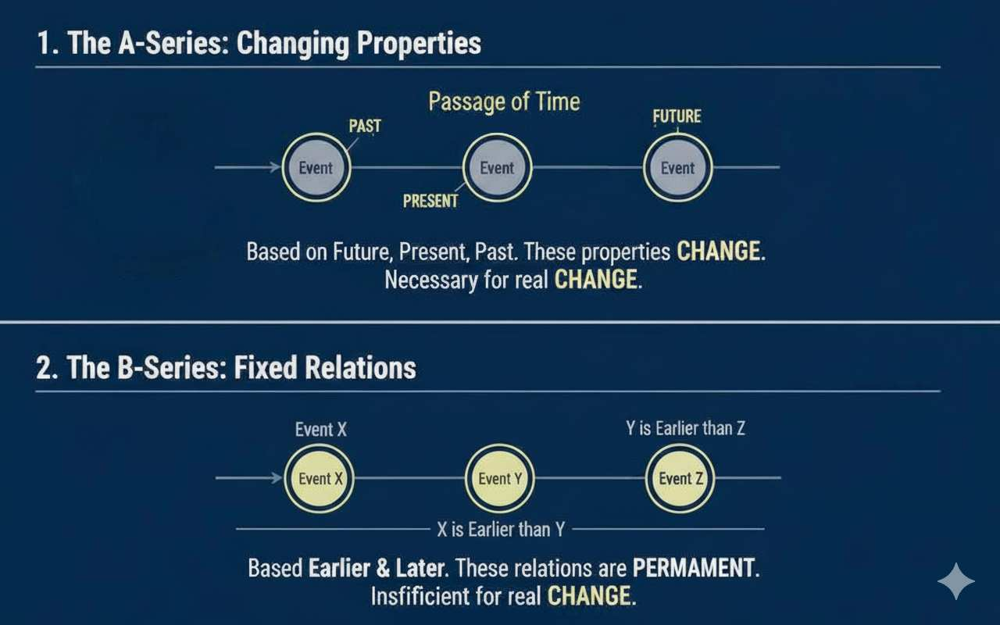

# Metamodern Timescapes: The Changing Image of Time

It is fairly obvious that time is not a tangible object, yet we treat it as if it were
one. This delusion is rooted in the significant role time plays in our lives and the
many, sometimes very precious, devices for measuring time that surround us.

For example, the most expensive clock in the world is the Graff Diamonds
Hallucination, a wristwatch valued at $55 million. It features more than 110
carats of extremely rare and colorful diamonds set in a platinum bracelet, making
it a unique blend of exquisite jewelry and watchmaking. (Graff Diamonds
Hallucination 2025) Big Ben (the clock and bell inside the Elizabeth Tower,
London) does not have a formal market value since it is a historic landmark, state
property, and an irreplaceable symbol of British heritage. However, the most
recent restoration costs for the entire tower—including the clock mechanism and
bell—have reached nearly £80 million (about $97–111 million USD) as of 2022.
(Washington Times 2025) The global watches and clocks market size in 2025 is
estimated at approximately $58.94 billion USD. The market is projected to grow
further, reaching about $71.75 billion USD by 2029. This includes all types of
time-measuring devices such as wristwatches, wall clocks, desk clocks, and
smartwatches. (Clocks Market Share 2025)

It’s hard to believe that such a gigantic sum of money is invested in something
that lacks any material representation, yet that’s the reality. Let’s open the Oxford
English Dictionary for an example of a definition: “Time. (uncountable) what is
measured in minutes, hours, days, etc.” (Oxford 2025) If time is uncountable, that
means nobody can count time by saying, “I had five times, but I lent two times to
my friend until next Monday.”

“Time is a measured or measurable period and a continuum without spatial
dimensions”, Britannica says (Britannica 2025). And it sounds very foggy,
because we can easily imagine a continuum of a space, but what is a continuum
without spatial dimensions?
“A number, as of years, days, or minutes, representing such an interval: ran the
course in a time just under four minutes”, explains the American Heritage Dictionary of the English Language. (Dictionary 2012) And it is much more
productive in terms of understanding.

Hours, minutes, and seconds originated from ancient civilizations’ need to divide
the day for practical reasons. Nobody knows for sure, but it is believed that one
of the ancient Egyptians or Babylonians counted the joints of his long fingers
using his thumb and discovered there were twelve. Thus, we have twelve hours of
day and twelve hours of night. (Britannica 2025, 2)

Perhaps later, the same Babylonians invented the base-60 system that gave us
minutes and seconds. Remarkably, modern empirical science is still built on this
ancient finger-counting system. Just imagine if those ancient Egyptians had used
a finger from their other hand to count the joints — they would have counted
fourteen. In that case, our day would consist of twenty-eight hours, which would
lead to many unexpected consequences.

For example, each new hour would be shorter:

```js
H₍₂₈₎ = 24/28 = 0.857`
```

Accordingly, minutes and seconds would also be shorter in the same proportion.
If the speed of light in a vacuum is now c = 299,792,458 meters per second, the
new value of this constant would be:

```js
C₍₂₈₎ = 299,792,458 × 0.857 = 256,964,964 meters per second
```

Thus, the “speed of light” would depend on one extra thumb of the ancient
Babylonians. Of course, the actual speed of light remains constant: “Calendar
reform will not shorten pregnancy” (Lec 1972) — but for us humans, any constant
exists only as a measurable phenomenon.

This simple example shows that the very essence of time depends on people’s
mutual agreements. Time is not a real physical object but a construct — the
result of our collective conventions. If so, it would be both useful and fascinating
to trace how and why this construct of time has evolved over the centuries up to
the present day.

## Ancient concept of time

In the past, the concept of time arose from social interactions to measure the
duration of work and ensure a fair distribution of labor or determine a
competition winner, but the precision of time-measuring devices often varied
greatly.

Before accurate chronometers appeared in the 18th century, sailors used
hourglasses to measure time intervals for dead reckoning — estimating a ship’s
speed and distance traveled. “Starting in the 14th century, and until the
appearance of marine chronometers, at sea, the time was regulated each day at
noon, when the sun was at its highest point. A sundial was used for this purpose,
and the hourglasses were then used to measure the passage of time during the
day. The 30-minute hourglass was used to measure the length of watches. Each
time the hourglass was turned, the helmsman would sound the ship's bell – one
ring, or "bell", after the first half-hour, two after the second, and so on, until "eight
bells" marked the end of a four-hour watch”. (Navigation and Time 2025)

This precision was necessary due to the complex nature of around-the-globe
expeditions, which required highly accurate measurements for their success.
However, it is useful to view time management from a perspective distant from
the main centers of civilization, to see that sundials, hourglasses, and
chronometers are not essential devices—and that the very measurement of time
can take different forms under different social conditions.

Douglas Raybeck in his article “The coconut-shell clock” (1992) found that
notions of time among Kelantan Malays help to maintain “village solidarity and…
their distinctive cultural identity” (Raybeck 1992)

In traditional Kelantanese villages, time is social and experiential, tied to natural
and social rhythms rather than mechanical hours. People describe time in
relation to activities, like “before Zohor” for midday prayer, instead of precise
clock hours. Punctuality is judged socially—lateness matters only if it disrupts
harmony or causes embarrassment. Mechanical watches arrived with
modernization, but villagers often wore them as symbols of status or modernity
rather than accurate instruments. As people in Africa say, “Westerners have
watches. Africans have time.” (Guinness 2016). A stopped or broken watch still “worked” culturally, expressing identity, aspiration, and awareness of Western
time. The coconut-shell clock is a local timer used in competitions. “This is a
simple construction consisting of a pail of water in which is floated a half
coconut-shell with a small hole bored through the center. The measured interval
is simply the amount of time it takes for the shell to fill with water and sink,
usually three to five minutes”. Though technically imprecise, the coconut clock is
preferred for its visibility and fairness, allowing everyone to see the timing. This
timer emphasizes social exactness over physical precision, preventing envy and
conflict within the community. Using a hidden mechanical watch would undermine
trust, whereas the coconut clock protects harmony and transparency. In
Kelantan, time serves human relationships first, showing that cultural meaning
and social participation outweigh strict temporal accuracy. (Raybeck 1992)

It is clear that the coconut-shell clock was sufficient in societies where time held
little economic importance and was largely inconsequential. In simple terms, it
was worth almost nothing. However, the Industrial Revolution in Western
societies greatly increased the value of time. In 1748, Benjamin Franklin wrote in
his essay Advice to a Young Tradesman, “Remember that time is money” (Fisher
1748). When one must literally pay for another person’s time, even a difference
of “three or five minutes” becomes crucial, demanding an entirely new level of
precision.

From the Newton “medieval” idea of absolute time to Einstein relativity
Newton was one of the first scientists to notice that, while sand, solar, and even
mechanical clocks measure time with varying degrees of accuracy, there must
exist a certain ideal, absolute “super-clock” to which real clocks only approximate
in precision. This idealism was a common tendency among many scientists of
that era, when the authority of religion was shaken during the Enlightenment but
still strong enough to punish those who disagreed with the official view of the
universe. Thus, idealism became a transitional stage from a religious worldview
to positivism.

Newton lived in a time when physics did not yet have a unified system for
describing motion. Observing the movement of planets, the falling of bodies, and
phenomena of inertia, he realized that an accurate description of motion required
a constant “stage,” independent of events, on which motion occurs. This led him to the concept of absolute time—time that flows uniformly and independently of
any external phenomena or observations. He distinguished between absolute
time (mathematically constant, “in itself”) and relative time (which we measure
with clocks by observing events). For example, a clock might run fast or slow due
to mechanical limitations, but absolute time flows steadily regardless.

To support his hypothesis, Newton conducted the famous bucket experiment. By
rotating a bucket of water, he observed the water’s surface curving from the
center toward the sides due to centrifugal force. When the bucket was stopped,
the water continued to rotate and maintained the curved shape for some time.
According to Newton, this effect demonstrates that the motion of an object
relative to absolute space and time has physical consequences that cannot be
explained merely by the relative motion between two objects: the water and the
bucket. Newton could not have imagined then that the water in the bucket was
under the influence of inertial force not so much relative to the walls of the
bucket, but rather relative to the Earth's gravity. At a certain distance from the
Earth, a similar experiment would not be possible at all.



*Figure 1. Newton's Bucket Experiment scheme under two conditions: on Earth and in space.*

This idea persisted for almost 300 years, until Einstein’s **Theory of Relativity**
emerged. The most interesting point in the context of this article, however, is
Ernst Mach’s remark: "No one is competent to predict things about absolute
space and absolute motion; they are pure things of thought, pure mental
constructs, that cannot be produced in experience”. (Mach 1960) Mach saw in
Newton’s idealism “medieval” notions of absolute space and absolute time.
(Galison 2003)

It only became definitively evident in the 20th century that it is impossible even to
imagine absolute reference frames, because our planet, our Solar System, and
even our Galaxy are continuously moving at enormous speeds, and therefore,
both temporal and spatial measurements depend on the reference frame.

Between 1900 and 1905, Albert Einstein worked at the Swiss Patent Office in
Bern and was working on the problem of synchronizing clocks at the railway
station. It was there that the idea of the impossibility of events being
simultaneous for all observers occurred to him. Imagine a platform 300,000
kilometers long, at both ends of which two lights are simultaneously switched on
at a moment we designate as “0.” Light travels from one end of the platform to
the other in 1 second. A passenger stands in the middle of this platform. For
them, the clocks will turn on simultaneously, but half a second after they turn on
for the two passengers standing next to those two lights. Thus, this will happen at
moment “0.5.” A train approaches the platform, and its driver will see the first
light, the closest to him, at moment “0,” and the second light—the distant one—at
moment “1.” If the engineer switches on a light on the train exactly at the moment
he sees the distant light, the distant passenger will notice this at moment “2.”



*Figure 2. Illustration of the relativity of simultaneity.*

Thus, the idea of visually synchronizing clocks turns into an almost impossible
problem to solve, as there are no means to transmit information faster than light.

Einstein argued that a better and nonarbitrary solution to the simultaneity
question was this: set clocks not to the time that the signal was launched, but to
the time of the initial clock plus the time it took for the signal to travel the distance

from the initial clock to the clock being synchronized. Specifically, he advocated
sending a round-trip signal from the initial clock to the distant clock and then
setting the distant clock to the initial clock’s time plus half the round-trip time. In
this way the location of the “central” clock made no difference–one could start the
procedure at any point and unambiguously fix simultaneity. (Galison 2003)

It was not easy to abandon the idea of absolute time, but it was even more
difficult to relinquish the concept of objective time, which exists as an element of
physical reality independent of human consciousness and is not merely a product
of our minds. Due to the complexity of accepting this fact, fierce debates began
and persisted throughout the 20th century between Presentists and Eternalists.

## Presentism, eternalism and McTaggart’s dead-end

Despite the latest staggering scientific discoveries, Idealism continued to defend
its positions. J. M. E. McTaggart was one of the most prominent representatives
of British Idealism, a school of philosophy that opposed the growing scientific
materialism and empiricism of the time. His commitment to Idealism was deeply
rooted both in his academic heritage as a follower of Hegel.

Thus, his systematic philosophy, presented in his work **The Nature of Existence**
(McTaggart 1921), was an attempt to construct a worldview that would provide a
spiritual anchor and solace. This worldview asserted that true reality is Absolute,
non-temporal, and composed of eternal essences (minds) bound by love. His
argument for the unreality of time was a key part of this consolation: if time is
unreal, then suffering, change, and death are illusions, and the true essence of
existence is eternal and good.

McTaggart, like other British Idealists, saw a threat in science (and the
materialism it generated) to the human spirit and eternal values. His argument
that time is contradictory, and thus illusory, was a direct blow to the scientific
worldview, which is based on physical, temporal existence. By proving that the
foundations investigated by science are unreal, he defended the supremacy of
spirit and eternity over matter and time.

In a famous paper **“The Unreality of Time”** published in 1908, J. M. E. McTaggart
argued that the appearance of a temporal order to the world is a mere illusion.
His argument begins by distinguishing two ways time positions can be ordered:

   - **the A-series** (defined by changing properties like future, present, and past)

   - **the B-series** (defined by fixed relations like earlier and later).

McTaggart argued the **B-series** alone is insufficient for a proper time series
because, without the **A-series**, it cannot account for genuine change. He then
asserted that the **A-series** is inherently contradictory because every time must
possess the incompatible properties of being future, present, and past.
McTaggart claimed attempts to resolve this contradiction by referring to further
times (e.g., saying a time was future and will be past) fail, merely generating an
infinite regress of the same contradiction, proving time is unreal. (McTaggart
1908)



*Figure 3. McTaggart's distinction between A-series and B-series.*

McTaggart's ideas initiated a whole series of idealist conceptions regarding the
nature of time and the existence of objective reality within it. The fundamental
ontological question concerning time asks whether the property of being past,
present, or future determines an object's existence.

**Presentism** asserts that, necessarily, only objects that are currently present
exist; therefore, a complete list of existing things would exclude all merely past
objects (like Socrates) and merely future objects.

In contrast, **Eternalism** is the non-presentist view that objects from the past and
the future exist now in a general ontological sense, even if they lack present
temporal location.

A third stance, the **Growing Block Theory**, is a non-presentist view that posits
that only past and present objects exist, constantly expanding the realm of reality
as time progresses. Both **Presentism** and the **Growing Block Theory** align with
the **A-theory** of time (which emphasizes temporal passage), while **Eternalism**
typically aligns with the **B-theory** (which emphasizes fixed, earlier-later relations).
However, **Presentism** faces significant philosophical challenges, particularly in
accounting for meaningful talk about non-present entities (e.g., referring to
Socrates) or explaining truth-makers for past and future truths (e.g., that there
were dinosaurs). Ultimately, this debate addresses whether temporal location
affects ontology, maintaining a core tension in the philosophy of time. (Emery
2024)

The dispute between Eternalists and Presentists, as well as McTaggart's
conception issue, can be resolved if we reject the idea of time having an
objective existence independent of human consciousness.

When McTaggart says that there cannot be a time that is simultaneously past,
present, and future because this is incompatible, his error begins with the words
"a time that is," because time does not exist in reality; it exists only in the human
imagination, and is an integral and crucial component of it. This implies that the
past, present, and future do not exist objectively and independently of humanity
as elements of physical reality, but are instead mental constructs that help a
person comprehend the surrounding reality and organize their life. Just as Mach
stated that absolute space and absolute motion are "pure things of thought, pure
mental constructs, that cannot be produced in experience," the same applies to
time. The future becomes the present, and then the past, not by virtue of some unknown physical principles, but only because we name them as such in our
subjective conceptions.

If time does not exist in an objective sense, the disputes between Eternalists and
Presentists lose meaning.

If, from the Presentist perspective, only the present is real, and the past and
future do not exist in reality, this is true because the past and future exist not in
reality, but in our imagination. But the present is also a mental construct, as we
recall from Einstein's theory of relativity that it is impossible to synchronize distant
clocks so that they show the same time.

If, from the Eternalist perspective, the reality of the past and future exists, it exists
only in our imagination or fantasy (for the future) or memories (for the past).

So, if time is a socio-cultural phenomenon, it logically follows that it exists within
the dominant cultural mindsets.

## How time became metamodern

The phenomenon of time, apart from our consciousness, does not exist outside
the medium that transmits it, even if that medium is a leaky coconut shell. That is
why, to understand how time has changed from ancient times to the present, it is
important to trace the evolution of these media.

In the **premodern era**, private clocks did not exist or were very rare, so people
learned the time from the large clock on the city tower or from the cathedral’s
bell, both of which embodied the power of government and faith in God. If you
didn’t hear the bells or see the clock, all you could rely on was the rooster’s
crowing, which never truly knew the hour. Accurate knowledge of time was a
privilege of wealthy city dwellers, who used it to maintain their prosperity.

**Modernity** not only made wristwatches popular, but also introduced many
alternative means of tracking and recording time. Now time could be learned
from radio signals and newspapers. However, you still could not know the time
instantly: you had to wait for the time signals, broadcast once an hour. After the
exact time signal, listeners were offered the latest news, which was meant to teach them how to think correctly. The radio was always a voice governing
citizens on behalf of the government.

**Postmodern** time arrived with television, which soon became multi-channel. Time
appeared more frequently on screen, sometimes constantly during certain
broadcasts. Along with time, viewers received a great deal of knowledge they
didn’t really need, as they watched television indiscriminately for hours. Under
these conditions, even if television was strictly controlled by the government, the
sheer abundance of moving images and stories already undermined this control.

**Metamodern** time began with cheap smartphones, which guaranteed 24/7
inexpensive access to the Internet. An estimated 5.5 billion people are online in
2024, an increase of 227 million individuals based on revised estimates for 2023,
according to new figures from the International Telecommunication Union (ITU
2024). This phenomenon is simply unprecedented in the history of all mankind,
as a significant number of people constantly look at the clock throughout the day
and coordinate their daily activities with it.

In this context, it is very interesting how the images of old media have evolved,
as they were previously the only sources for communicating the time. Cathedral
bells have either become tourist attractions or apocalyptic symbols, as in László
Krasznahorkai's novel, Sátántangó.

*“Futaki woke to hear bells. The closest possible source was a lonely chapel
about four kilometers southwest on the old Hochmeiss estate but not only did
that have no bell but the tower had collapsed during the war and at that distance
it was too far to hear anything”. (Krasznahorkai 1985)*

The bell in the final scene of Krasznahorkai's Sátántangó *“suggests that the
world we’re seeing turns on a contradiction between the materiality–the almost
painfully exact rendering of the physical, the concrete, the particular…–and
something mysterious and unaccounted for, an essence, perhaps spiritual,
conspicuous by its absence"*. (Vickers 2019) There can be various versions here,
as the interpretations of an artwork are unlimited, but the reminder of the
immaterial nature of time, its existence only in the human consciousness
(because only Futaki hears the bell), seems the most relevant.

Metamodern time has many characteristic features that have already been noted
and described in numerous studies. In Douglas Rushkoff's book, Present Shock:

When Everything Happens Now (Rushkoff 2013), five characteristic features are
presented, with a separate chapter dedicated to each.

### 1. Narrative Collapse

This concept of Narrative Collapse describes the breakdown of traditional, linear
storytelling in media, culture, and politics. Old narratives that gave meaning,
direction, and structure are replaced by fragmented, present-focused
experiences. In a world saturated with instantaneous information and reality TV,
the comfort of stories with beginnings, middles, and ends fades, leaving people
trying to make sense of everything as isolated, immediate events rather than
coherent narratives.

This collapse has only intensified with the spread of private news channels on
social networks and messaging apps. News use across online platforms
continues to fragment, with six online networks now reaching more than 10%
weekly with news content, compared with just two a decade ago. Around a third
of our global sample use Facebook (36%) and YouTube (30%) for news each
week. Instagram (19%) and WhatsApp (19%) are used by around a fifth, while
TikTok (16%) remains ahead of X at 12%. (Newman 2025)

According to a new study by the NGO "Internews-Ukraine," "Ukrainian Media:
News Consumption and Trust in 2025," social networks have definitively
established themselves as the main source of news for Ukrainians. The
smartphone has become a "window to the world of information" even for older
segments of the population. 86% of Ukrainians get their news from social
networks, and 37% use only them. 91% read news on their smartphones.
(Internews-UA 2025)

A vivid example of narrative collapse in news consumption is the Russian
messaging app “Telegram,” used for this purpose by 51% of Ukrainians
(RG/EUAM 2025). Telegram’s advantage as a news source lies in its hybrid
nature, which can confidently be called metamodern. Users can subscribe to
unlimited channels, and their authors are not only (or even primarily) journalists
or celebrities, but ordinary people who have found themselves in unusual
circumstances and gained access to unique events. These individuals, who can
be called **“metanewsmakers,”** record videos or photos from the scene and immediately post them to their channels, usually accompanied by very subjective
comments. Metanewsmakers do not always publish their own videos; sometimes
they share footage found on the smartphones of captured or deceased soldiers.
Videos can also be staged, created using artificial intelligence. No rules or
standards of journalistic ethics apply in this context. This contributes to the
spread of rumors and conspiracy theories. Ukrainian media watchdogs attempt to
address breaches of journalistic standards in Telegram channels, but these
efforts yield no tangible results, since activity on Telegram is not regulated by
anyone, and government agencies have no influence unless criminal laws are
violated—only then can a channel owner be arrested, ceasing their channel’s
operation either independently or at law enforcement’s request. The number of
metanewsmakers increases daily. They produce such a volume of posts that
Telegram channel audiences are literally in a hypnotic trance, consuming news
for hours each day in an endless scrolling process. If previously news broadcasts
aired at strictly scheduled times and one could say “evening news broadcast,”
anticipating it at a set hour, now news consumption has become impulsive:
readers can suddenly start reading news because they have two free minutes,
receive a sound notification, or simply feel bored. Even elderly people now spend
hours bed-rotting, endlessly scrolling through Telegram channels. This kind of
media consumption starts to resemble an illness. Under these conditions, real
media that operate by the rules and have expertise stand almost no chance of
entering this stream—even if they have their own Telegram channels.

Metanewsmakers can be private, state-affiliated, or of a mixed hybrid nature. A
vivid example of a hybrid metanewsmaker is the Telegram channel "MAGYAR,"
run by Róbert Bródi (callsign — Magyar), a Ukrainian citizen of Hungarian origin.
He is the commander of Ukraine’s Drone Systems Forces and the organizer and
head of the Ukrainian Armed Forces’ aerial reconnaissance unit “Magyar’s
Birds”. The channel features a series of drone footage showing the destruction of
Russian occupation army equipment and personnel. Currently, the "Magyar’s
Birds" unit eliminates up to 330 Russian soldiers per day. All confirmed kills are
documented on video, with particularly noteworthy ones edited into compilations.
The funniest moments are featured in a special segment called “Yoblyk of the
Day.” (Yoblyk is a derogatory nickname for a Russian soldier.) Typically, the
elimination of a Russian soldier involves 2–3 drones, so each subsequent drone
records the target’s reaction to the strikes or what remains of their body.
Sometimes short videos in this segment are titled, for instance, *“A failed attempt to escape one’s own grave.”* Videos from this segment receive tens of thousands
of positive reactions and hundreds of enthusiastic comments.

Formally, these messages are news, but in essence they are not, because they
do not report anything new, leaving the audience in a very characteristic state of
metamodern flickering: they are simultaneously news consumers and spectators
of a regular bloody spectacle that tempts and satisfies the desire for revenge, as
happened historically during public executions in front of crowds in the city
square. Narrative collapse means that now it is impossible to determine whether
new media are telling any kind of story at all. Old mainstream media also offered
a similar opportunity, but in a much more limited way, with constant debates
about the ethical boundaries of showing death or brutality on screen. Now all
these limitations have been lifted, except for conventional media, which have
permanently fallen behind in this race.

### 2. Digiphrenia

Digiphrenia refers to how digital technology splits people between multiple roles,
places, and timelines at once. Emails, texts, and constant online engagement
force individuals to inhabit overlapping moments and identities — creating stress
and confusion as personal coherence is disrupted. Time is no longer experienced
sequentially but as a barrage of simultaneous demands from various sources
and platforms.

Social Media Profiles & Simultaneous Identities: People maintain multiple
social media accounts (Twitter, Facebook, Instagram, LinkedIn) and message
feeds, each projecting a different version of themselves at the same time. This
fragments their attention and identity, making it hard to be fully present in any one
context.

Work-Life Overlap: Professionals juggle work emails, texts from family, social
notifications, and news feeds all at once, even in supposedly “off” hours. The
barrage of simultaneous demands disrupts personal focus, causing ongoing
stress and blurring boundaries between roles.

Military Drone Operators: Rushkoff notes that drone pilots might control deadly
machines on the other side of the world from behind safe screens — occupying contradictory moral and physical realities at the same time. They live in two
places and two ethical worlds at once, enabled by digital mediation.

Constant Context Switching: People rapidly switch between open browser
tabs, work chats, social notifications, and entertainment streams. This process
(sometimes called “tab overload”) produces stress and cognitive exhaustion, as
individuals fail to inhabit a single, continuous timeline or focus.

Dinner Table Distraction: Even in social situations like meals with friends or
family, people are pulled away by notifications and engage absent-mindedly with
smartphones instead of those physically present. “Digiphrenia” manifests in the
habitual division of self between digital and real-world presences.

### 3. Overwinding: The Short Forever

Overwinding is the compression of long-term processes or goals into shorter time
frames than they are meant for. In business and finance, this translates to the
expectation of instant results, rapid trading, and immediate returns. The push to
fit everything into the present moment, including processes that historically took
years to mature, causes instability and a loss of long-term perspective.

Artificial intelligence tools have greatly accelerated this process. Now, people
who don’t have time to read lengthy books of hundreds of pages can simply
create a 2–3 page digest, compile a list of ten main points, or make a podcast.
Then, new texts are generated based on these rapid digestions, which in turn are
quickly read with ChatGPT or Perplexity. Eventually, the real authors and readers
of texts become language models, while humans are left with only a general idea
from brief summaries.

### 4. Fractalnoia: Finding Patterns in the Feedback

Fractalnoia describes the urge to find patterns and meaning in the overwhelming
feedback loops of real-time information. With traditional timelines gone, people
seek connections between events and data, sometimes inventing links where
none exist. This can lead to paranoia or conspiracy thinking — or a networked
sensibility, depending on whether the patterns are personal or shared.

### 5. Apocalypto

Apocalypto captures society's longing for finality or clear endings in a
never-ending present. The persistent anxieties of living in "present shock" prompt
fantasies of total collapse, reset, or apocalypse — responses to the stress of
having no narrative resolutions or ultimate goals. This mindset manifests in
prepping, fascination with doomsday scenarios, and apocalyptic media, as
people look for closure amid chronic uncertainty.

The Netflix limited series Carol and the End of the World (2023) serves as an
essential cultural artifact for mapping this Apocalypto metamodern temporality.

The series is set seven months before the rogue planet Keppler 9C is scheduled
to collide with Earth, an event that frees most of humanity to embrace hedonism
and pursue lifelong dreams, rendering jobs and money obsolete.


*Figure 4. Mysterious rogue planet Keppler 9C is scheduled to collide with Earth.*

Protagonist Carol Kohl, a quiet, middle-aged woman, is one of the few who feels
lost by this newfound freedom and instead finds profound comfort in the
monotony of her previous life. Her search for routine unexpectedly leads her to a
secret, seemingly pointless office called "The Distraction," where she forms
genuine human connections with other lost souls, finding meaning not in grand adventures, but in the small, shared rituals of a normal workday before the inevitable end. The environment itself reflects a metamodern aesthetic of memory: the surviving fragments of the preceding epoch (the corporate infrastructure) are reinvested with new, sincere purpose.

The show’s central conflict between mass apocalyptic hedonism and Carol’s
dedicated routine resolves in favor of the latter, affirming the cultural utility of
informed naivety (Metamodernism 2015). Carol and her coworkers proceed as if
the routine, the friendship, and the shared coffee matter, fully cognizant that
these structures are ultimately doomed. This reconciliation of hope (sincerity)
with detachment (irony) is the essence of the metamodern temporal strategy.

The rogue planet Keppler 9C, this gigantic, celestial object is not just a threat; it
is a static image of the future catastrophe. It is fixed, terrifying, and omnipresent.
(Zeoli 2024) This functions as a crystal-image where the banal, slow present
(Carol pouring coffee, doing paperwork) is simultaneously juxtaposed against the
fixed, certain reality of its inevitable, violent end. Because the end is
mathematically assured and visually constant, linear cause-and-effect (the need
for immediate movement or survival) collapses. What remains is a pure duration,
focusing the viewer and the characters entirely on the quality and authenticity of
the present moment, thereby producing the specific affective aesthetics of
metamodern temporality.

Against the backdrop of societal chaos and maximalist despair, the protagonist,
Carol Kohl, embodies the metamodern counter-response: the construction of
genuine meaning through intentional routine and structure.

Episode 6, "Holidays," perfectly encapsulates the metamodern temporal paradox.
The characters consciously organize and celebrate future holidays—such as
Christmas, birthdays, and Halloween—that are guaranteed not to arrive before
Keppler 9C crashes. (Zeoli 2024)

This is a definitive act of temporal oscillation. The Ironic Pole (Postmodern
knowingness) acknowledges that these traditions are meaningless rituals, as
their scheduled purpose in linear time (e.g., Christmas in December) has been
destroyed by extinction. Yet, the Sincere Pole (Modernist commitment to ritual)
involves performing the celebrations anyway, accessing the deep, collective
emotional meaning (affect) associated with community and shared tradition.
(Zeoli 2024) By celebrating a future that cannot arrive, the characters perform an

intentional collapse of linear time. The past meaning of the holiday and the
certainty of its future absence coexist simultaneously to enrich the fleeting
present. The temporary community formed during these rituals grants immediate,
authentic temporal value where none structurally exists.

In a world where time is endlessly mediated and exploded, the individual no
longer simply inhabits a timeline but becomes an editor—curating memories,
reactions, rituals, and micro-narratives across devices and media. Identity is
forged from assembling these fragments into a livable present as time is only a
fruit of our imagination.

### Bibliography

Britannica 2025: “Time.” In Encyclopaedia Britannica. Last updated September 14,
2025. https://www.britannica.com/science/time Accessed October 7, 2025.
Britannica 2025, 2:“12-Hour Clock.” Encyclopædia Britannica.
https://www.britannica.com/topic/12-hour-clock. Accessed October 12, 2025.

Clocks Market Share 2025: Global Watches and Clocks Market Share 2025,
Forecast      To     2034.      The     Business    Research      Company.
https://www.thebusinessresearchcompany.com/market-insights/watches-and-cloc
ks-market-overview-2025. Accessed October 7, 2025.

Dictionary 2012: The American Heritage Dictionary of the English Language (Fourth
ed.). 2011. Archived from the original on 19 July 2012.

Emery 2024: Emery, Nina, Ned Markosian, and Meghan Sullivan, "Time", The
Stanford Encyclopedia of Philosophy (Fall 2024 Edition), Edward N. Zalta & Uri
Nodelman (eds.), Last updated Fall 2024.
https://plato.stanford.edu/archives/fall2024/entries/time/ Accessed October 12,
2025.

Fisher 1748: Fisher, George (accomptant). The Instructor: or, Young Man's Best
Companion. Containing, spelling, reading, writing, and arithmetick, in an easier way
than any yet published;... To which is added, the family's best companion:... and a
compleat treatise of farriery;... 1748. Available at:
https://archive.org/details/bim_eighteenth-century_the-instructor-or-youn_fisher-ge
orge-accompta_1748/page/23/mode/2up.

Galison 2003: Galison, Peter. Einstein's Clocks and Poincaré's Maps: Empires of
Time. New York: W. W. Norton & Company, 2003.

Graff Diamonds Hallucination 2025: $55 Million Quartz Watch. A Blog to Watch.
https://www.ablogtowatch.com/graff-diamonds-hallucination-55-million-dollar-quar
tz-watch/. Accessed October 11, 2025.

Guinness 2016: Guinness, Os. Impossible People: Christian Courage and the
Struggle for the Soul of Civilization. InterVarsity Press, Downers Grove, 2016.

Internews-UA 2025: Ukrainian Media: News Consumption and Trust in 2025.
Internews Ukraine. https://internews.ua/media-research. Accessed October 7,
2025.

ITU 2024: International Telecommunication Union. “Global Internet use continues
to rise but disparities remain.” ITU Press Release, 27 November 2024.
https://www.itu.int/en/mediacentre/Pages/PR-2024-11-27-facts-and-figures.aspx

Krasznahorkai 1985: Krasznahorkai, László. Sátántangó. Translated from
Hungarian by George Szirtes. New Directions, 2012. Originally published in
Hungarian in 1985 by S. Fischer Verlag, Frankfurt.

Lec 1972: Lec, Stanisław Jerzy. Myśli nieuczesane. Kraków: Wydawnictwo
Literackie, 1972.

Mach 1960: Mach, Ernst (1960). The Science of Mechanics: A Critical and
Historical Account of Its Development, 6th ed. Translated by T. J. McCormack.
LaSalle, Illinois: Open Court.

McTaggart 1908: McTaggart, J. M. Ellis, 1908, “The Unreality of Time”, Mind,
17(4): 457–474. Reprinted in Le Poidevin and McBeath 1993: 23–34.
doi:10.1093/mind/XVII.4.457

McTaggart 1921: McTaggart, John McTaggart Ellis (1921). The Nature of
Existence. Vol. 1. Cambridge: The University Press.

Metamodernism 2015: Metamodernism: A Brief Introduction.
metamodernism.com, January 12, 2015.
https://www.metamodernism.com/2015/01/12/metamodernism-a-brief-introductio
n/. Accessed October 13, 2025.

Navigation and Time 2025: “Navigation and Time.” The Saint-Malo Shipwrecks
(Archeologie.culture.gouv.fr).
https://archeologie.culture.gouv.fr/epaves-corsaires/en/navigation-and-time.
Accessed October 12, 2025.

Newman 2025: Newman, Nic. Overview and key findings of the 2025 Digital News
Report. Digital News Report 2025. Reuters Institute for the Study of Journalism,
University of Oxford (Online Report, URL:
https://reutersinstitute.politics.ox.al.uk/digital-news-report/2025/dnr-executive-sum
mary), 2025.

Oxford 2025: Oxford English Dictionary. “Time.” In Oxford Advanced Learner’s
Dictionary. https://www.oxfordlearnersdictionaries.com/definition/english/time_1.
Accessed October 7, 2025.

Raybeck 1992: Raybeck, Douglas. The Coconut-Shell Clock: Time and Cultural
Identity. Time & Society, vol. 1, no. 3, 1992, pp. 323–340. SAGE Publications
(London, Newbury Park, and New Delhi).

RG/EUAM 2025: RG EUAM Report, August 2025.
https://cdn.prod.website-files.com/685c279caf66f4023ad2cab4/68d520ca901d40
677cdcdab4_RG_EUAM_082025_UA_fin_compressed.pdf. Accessed October 7,
2025.

Rushkoff 2013: Rushkoff, Douglas. Present Shock: When Everything Happens Now.
Current, a member of Penguin Group (USA) Inc. (New York), 2013.

Vickers 2019: Vickers, Jon. “Those Bells.” Establishing Shot – IU Blogs. December
4, 2019. https://blogs.iu.edu/establishingshot/2019/12/04/those-bells/

Washington Times 2025: Big Ben Clock Tower Restoration Doubles Cost, Wins
Critical Acclaim. The Washington Times.
https://www.washingtontimes.com/news/2025/sep/4/big-ben-clock-tower-restorati
on-doubles-cost-wins-critical-acclaim/. Accessed October 12, 2025.

Zeoli 2024: Rowan Zeoli. “Carol & The End of the World” Teaches Us How to Survive
the Apocalypse. Autostraddle, February 1, 2024.
https://www.autostraddle.com/carol-and-the-end-of-the-world-queer-community/
. Accessed October 13, 2025.