# Обличчя війни: як кіно формує і спотворює історичну пам'ять в Україні  

**(Стаття для журналу «Кіно-Коло», 24 1 (39) «Україна у вогні»)**  

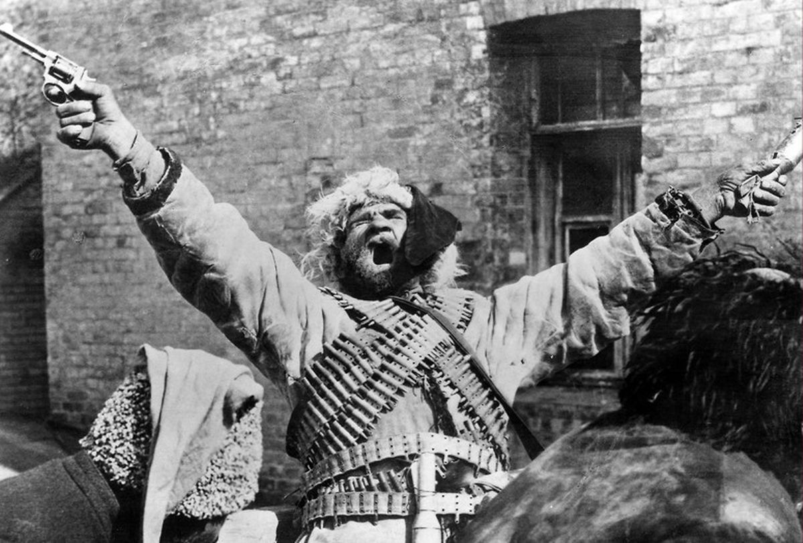 

Кожна війна має своє обличчя, утворене мільйонами облич її учасників. Усі вони врешті стають обличчями персонажів фільмів про війну, а вираз цих облич — емоції, погляди, жести — персоніфікує для нас ці трагічні події в історії. Ніхто не знає, як усе насправді відбувалося, тому акторська гра стає замінником справжніх спогадів. Якщо актор має виразну зовнішність і грає переконливо, його зображення може затінити спогади про реальні події та створити «справжню» реальність, яку за бажання можна використовувати для пропаганди.

Це твердження найкраще ілюструє гра **Семена Свашенка (Тимоша)** у фільмі Олександра Довженка «Звенигора» (1928). Довженко — переконаний комуніст і російський імперіаліст, що пристосував свої погляди заради порятунку й отримання прихильності московського керівництва, — відкинув типовий червоний пропагандистський плакат, покликаний таврувати «українських буржуазних націоналістів», висміяти Українську Народну Республіку і назавжди об'єднати зросійщених українців з московським більшовизмом. Ця позиція призвела до конфлікту зі сценаристами **Миколою (Майком) Йогансеном** і **Юрієм Тютюнником**.

Довженко розповів про їхню реакцію у своїй **автобіографії 1939 року**:  

> «У сценарії було багато нісенітниць і явних націоналістичних тенденцій. Тому я переробив його на 90 відсотків, у результаті чого автори демонстративно «зняли свої прізвища», що стало початком мого розходження з харківськими письменниками».  

На нараді українських письменників, скликаній **ВУФКУ (Всеукраїнським фото-кіно управлінням)** **13–14 вересня 1928 року**, Йогансен також висловив свою незгоду з виробництвом фільмів, перенасичених пропагандистськими комуністичними мотивами:  

> «Звичайно, нам треба знімати більше фільмів з нашим радянським змістом, але такого типу, якими були американські фільми. А таких немає жодного. Не мені казати вам, які фільми пролетаріат любить найбільше, але ця прогалина не тільки не заповнюється, а навіть існує тенденція її уникати, і є небезпека загибелі художніх фільмів».  

У підсумку автори «неправильного» сценарію, **Йогансен і Тютюнник, були розстріляні**, а Довженко отримав **орден Леніна**, дві **Сталінські премії** та одну **Ленінську премію**.

У цьому фільмі Семен Свашенко грає роль комуніста **Тимоша**, брат якого **Павло** — *петлюрівець*[^1] — тікає до Праги після падіння УНР і веде жалюгідне й абсурдне існування, постійно намагаючись покінчити з життям.

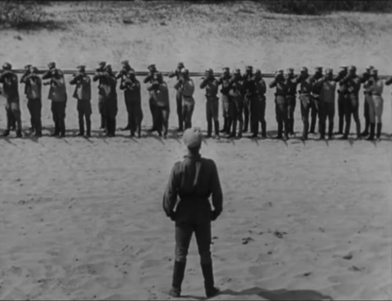  
*Тимош командує власним розстрілом. Кадр з фільму Олександра Довженка «Звенигора» (1928).*  

Довженко відверто знущається з УНР, прагнучи втоптати її спадщину в бруд. Цікаво, що в той час у [Празі існувала значна дипломатична представленість УНР](https://www.istpravda.com.ua/articles/2021/03/4/159087/), що, очевидно, дратувало вірних ленінців.

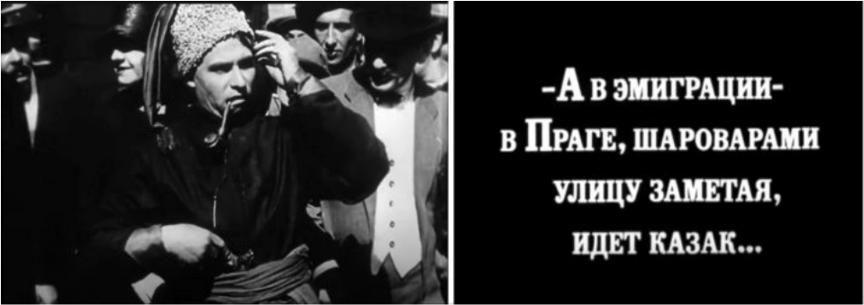  
*«І в еміграції, в Празі, замітаючи вулицю своїми широкими штанями, ходить козак...» Кадр з фільму Олександра Довженка «Звенигора» (1928).*  

Оскільки фільм **німий**, актори мусять компенсувати відсутність діалогу **підкресленою театральною мімікою** та приймати плакатні, навіть комічні пози. Семен Свашенко часто спалахує очима і робить напружені жести руками, що нагадують рухи робітника на сучасному автомобільному конвеєрі.

Це особливо помітно в сценах, що зображують **Першу світову війну**, коли він вдирається до **німецьких окопів** голіруч або командує власним розстрілом.

---

Талановитий актор **Амвросій Бучма** теж присвятив свій талант московській пропаганді. В одному зі своїх ранніх фільмів, «Макдональд», він висміював «гниючий Захід», а у «Подвигу розвідника», який дуже сподобався Сталіну, зобразив покірного малороса, агронома **Лещука**.

Після арешту розлючений німецький окупант допитує його:

> «Українець чи росіянин?»  
> «В даному випадку це не має значення... Ну, українець», — відповідає він.  

Бучма був провідним актором знаменитого театру **«Березіль»**, агентом **Чека**[^2] і нагороджений **орденом Леніна** та двома **Сталінськими преміями**.

Проте важливо зазначити, що Бучма іноді виявляв яскраві людські емоції. Зокрема, вражає його триxвилинна роль **задихаючогося німецького солдата** в потужному експресіоністському фільмі Довженка «Арсенал». Цей божевільний, помираючий сміх із широко відкритим ротом, де бракує половини зубів, виглядає гротескно і особливо моторошно в контексті: здається, сама смерть насміхається.

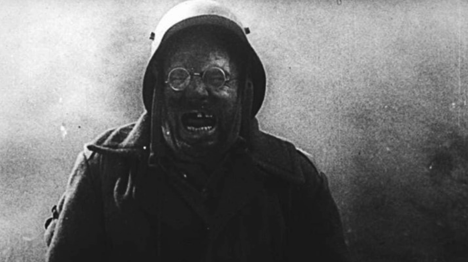  
*Амвросій Бучма як німецький солдат у фільмі Довженка «Арсенал» (1929).*  

**Наталія Ужвій** отримала **орден Леніна** за роль партизанки **Олени Костюк** у фільмі Марка Донського «Веселка» (1943). Потрапивши в полон до ворога, вона стикається зі страшним вибором:  

> Нацисти або розстріляють її новонародженого сина, або вона мусить видати своїх товаришів-партизанів.  

Олена обирає вірність товаришам. Чи так воно було насправді? Як поводилися справжні жінки в подібних ситуаціях? Ми цього не дізнаємося з «Веселки», однак зображення **Наталії Ужвій** таке переконливе — повне пафосу й емоцій, — що глядачі відразу вірять у її відданість Леніну.

У цьому фільмі німці **карикатурно жорстокі**, розмовляють по-російськи з **комічним німецьким акцентом**, тоді як російська Олени Костюк завжди **бездоганна**. Нас переконують, що вона готова пожертвувати дитиною заради **перемоги СРСР у Другій світовій війні**.

У своїй [книзі *«Кіно і радіопропаганда в Другій світовій війні»*](https://archive.org/details/filmradiopropaga0000unse_c5d0) дослідник **Кеннет Шорт** зазначив, що «Веселка» стала:  

> «Найбільш потужним і ефективним прикладом радянської пропаганди протягом усієї війни».  

**Американський посол** у Москві особисто рекомендував фільм **президенту США Франкліну Рузвельту** для перегляду. У результаті він був відзначений:  

- **Великим призом** **Асоціації кінокритиків США**  
- **Вищою нагородою** *Daily News* за **найкращий іноземний фільм в американському прокаті в 1944 році**  
- Призом **Національної ради кінокритиків**  

---

**Іван Миколайчук** не лише зіграв **Петра**, сина музиканта Дзвонаря, у фільмі Юрія Іллєнка «Білий птах з чорною ознакою» (1971), але й був співавтором сценарію цього видатного твору.

Дія розгортається **з 1937 по 1947 рік на Буковині** в момент, коли Румунія втратила цю територію на користь Радянської України. Фільм Іллєнка виділяється серед більшості тогочасних картин не лише складними оригінальними образами, а й використанням **української мови** в діалогах.

Проте мова зберігає **сильний місцевий західноукраїнський акцент**, що робить частину діалогів важкодоступними. Вона уникає **простих гасел**, типових для пропаганди. Проте **політичні теми** все одно пронизують фільм.

Петро (**Іван Миколайчук**) сварився з **гуцулом-упівцем**[^3], бо той підтримує **Гітлера**, тоді як батько Петра поцілував руку **радянського командира**.

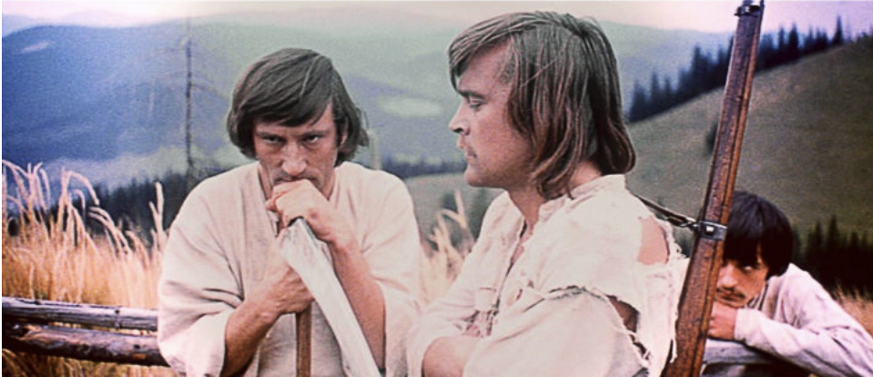  
*Іван Миколайчук (у профіль) як Петро, син музиканта Дзвонаря у фільмі Юрія Іллєнка «Білий птах з чорною ознакою» (1971).*  

Невипадково, що незабаром син **Дзвонаря** вступає до **Червоної Армії**, хоча й не з **комуністичних міркувань**: його вибір зумовлений **передчуттям поразки нацистів**. Тим часом брат Петра **Орест** приєднався до **УПА**, що призводить до **трагічного конфлікту в родині Дзвонарів**.

Миколайчуку вдається створити **складний і суперечливий характер**, що робить цей фільм **безчасовим**, на відміну від короткого появи Миколайчука в телесеріалі «Визволення» (*артилерист Савчук*, частина перша «Дуга вогню», 1968).

У короткій сцені **Іван Миколайчук** прицілюється у **танки, що наступають**, але **отримує кулю в голову** і падає. **Російський капітан Сергій Цвєтаєв** (**Микола Олялін**) швидко займає його місце, і за мить **танк знищує артилерійський підрозділ**.

**Приголомшений Савчук** кричить із **явним українським акцентом**:  

> «Товариш капітан, залишилося п'ять снарядів!»  

Пізніше **медсестра, закохана** в Цвєтаєва, кидається на поле бою.  
А де **Савчук**?  

Це нікого більше не цікавить; він лише **послужив непомітним тлом** для **героїчного російського капітана**.

Цікаво, що російський актор **Микола Олялін**, який зіграв Цвєтаєва, **того ж року перейшов до категорії українських акторів**.

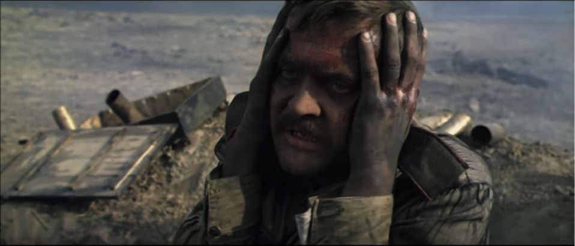  
*Іван Миколайчук як артилерист Савчук у телесеріалі Юрія Озерова «Визволення» (1968).*  

Хоча він **не знав жодного слова по-українськи**, знімався в **проектах кіностудії імені Довженка**, виступав на **українських культурних заходах**, отримав **орден князя Ярослава Мудрого**, здобув звання **Народного артиста України**, був нагороджений **довічною стипендією** від **президента Віктора Ющенка** і похований на **Байковому кладовищі**[^4] в Києві.

Однак **«українізація»** не завадила Олялі брати участь у **шовіністичному серіалі** «Русский проект» (навіть разом із **Нікітою Михалковим**, який відчуває **глибоку ненависть до України**), що сприяло **зростанню реваншизму і мілітаризму в російському суспільстві**, яке врешті вилилося у війну.

---

Роль Леоніда Бикова у виконанні **капітана Олексія Титаренка** на прізвисько **Маестро** — командира другої ескадрильї — у радянській кінематографічній класиці «У бій ідуть одні старики» (**1974**) займає особливе місце серед **українських кіноакторів**.

Биков також **зняв цей фільм**, дозволивши собі **вільності**, що могли б не знайти схвалення навіть у СРСР 1974 року.

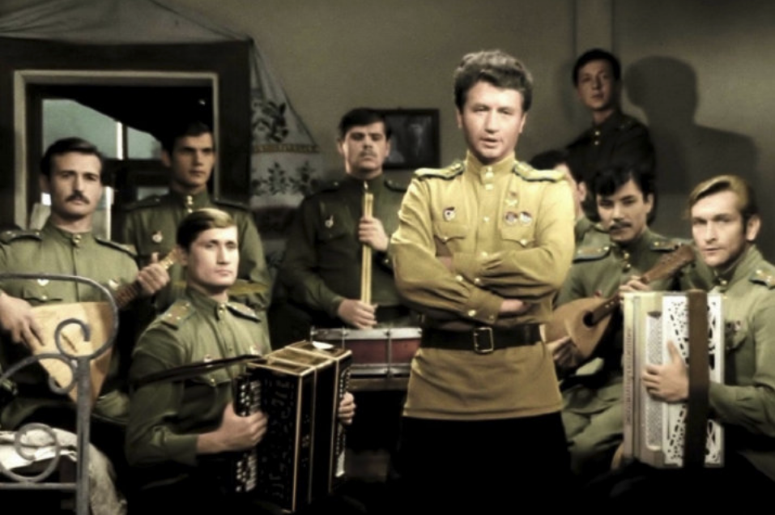  
*Леонід Биков в ролі капітана Олексія «Маестро» Титаренка у фільмі «У бій ідуть одні старики» (1974).*  

Його монолог:  

> **«Як ви не помітили? Ми воювали сьогодні над моєю Україною!»**  

став **поворотним моментом** — вперше в радянському кіно Биков зображує **активного, харизматичного, дотепного і навіть зухвалого українця** так, як нам нині важко повністю оцінити.

Помітьте, як він відповідає:  

> **«Будь ласка!»**  

**по-українськи** замість **по-російськи**.

У цьому контексті ці **українські слова** передають не **подяку**, а звучать **майже як образа**.

На жаль, цей **талановитий фільм** став одним із **найяскравіших прикладів так званого «радянського героїчного наративу»**, що врешті проклав шлях **для російської агресії проти України**.

Під YouTube-публікаціями цього фільму чимало коментарів відлунює такі настрої:  

> *«Як чітко зображено єдність радянських солдатів різних національностей у боротьбі з фашизмом».*  

Більше того, варто зазначити, що **Міністерство культури Української РСР** намагалося **заборонити фільм**.

Hlіб Шандибін, виконуючий обов'язки **директора кіностудії імені Довженка**, переконав **начальника державного кінематографа Української РСР** Василя Большака не створювати **українського дублювання** для цієї картини (що було вкрай незвично, бо зазвичай так не робили), заявивши:  

> **«Зникне тема інтернаціоналізму».**  

Справді, **справжній інтернаціоналізм можливий лише російською мовою!**  

---

Окрему спостереження заслуговує такий факт. Аналізуючи **українські фільми XX століття**, відчувається відчутна **штучність** в обмеженні **української мови**:  

> **Якщо фільм мав потенціал для комерційного успіху і широкого прокату, він, швидше за все, існував виключно по-російськи.**  

Показовий випадок «За двома зайцями» (**1961**): фільм знятий **по-українськи**, але пізніше **перекладений на російську**, коли продюсери оцінили його **комерційні перспективи**; відповідно, **український оригінал «загубився» на 52 роки**, щоб бути **знайденим пізніше в Маріупольському кінофонді**.

Це **кіносховище**, до речі, містило понад **80 тонн необстежених кіноматеріалів**, значна частина яких майже напевно **загинула назавжди внаслідок знищення, влаштованого російськими загарбниками в 2022 році**.

Принцип **обмеження української мови в кіно** зберігався ще тривалий час **після розпаду СРСР** у комерційному кіновиробництві, і лише в останні роки почав суттєво відходити в минуле.

---

Після **розпаду СРСР** актори, звільнившись від **радянської цензури** та тягаря **російського імперіалізму**, почали з'являтися в Україні, хоча це й не вирішувало складних **художніх завдань**.

**Григорій Гладій** встиг зіграти в «У бій ідуть одні старики» Леоніда Бикова (**безіменного технічника «Кольта», Олександрова**), але його **найзначніша роль** — **Роман Шухевич** у фільмі **Олеся Янчука** «Нескорений» (**2000**).

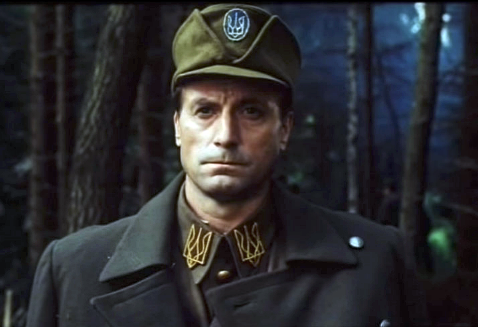  
*Григорій Гладій як Роман Шухевич у фільмі Олеся Янчука «Нескорений» (2000).*  

На жаль, незважаючи на **керівництво Аскольда Лозинського, президента Світового конгресу українців**, фільм дотримується **близького до радянського «реалістичного» підходу**, позбавленого яскравих **художніх відкриттів** або переконливих зображень.

Він нагадує **маловиразні постановки** **кіностудії імені Довженка 1970-х**.

**Режисер Олесь Янчук**, здається, або **уникав творчого дослідження й нестандартних режисерських рішень**, або просто **міг не бути з ними знайомий**.

Григорій Гладій також не намагається **осягнути складний характер** Романа Шухевича, лише проходячи **по сценах і вимовляючи стерильні репліки**, написані далеко не ідеальним сценарієм **банальної костюмної драми**.

> **Для ефективного художнього відтворення історичних подій у кіно недостатньо просто правильно одягнути акторів, забезпечити їх відповідними діалогами та почати знімати.**  

Робота **справжнього митця** вимагає більшого; кожен проект — це **складне творче завдання** без **готових рішень**, де **жодна порада не є універсально чинною** і **ніхто не застрахований від помилок або невдач**.

---

Натомість **Євген Ламах**, граючи **старшого матроса Мишку** у фільмі **Тимура Ященка** «Черкаси» (**2014**), досягнув **вражаючих результатів** у розумінні й відтворенні свого персонажа, незважаючи на молодість.

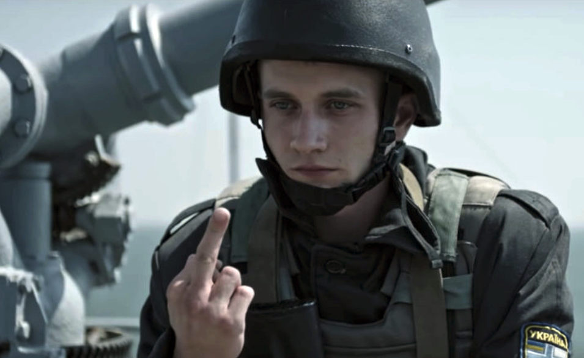  
*Євген Ламах як старший матрос Мишко у фільмі Тимура Ященка «Черкаси» (2014).*  

Мишко постає як **складна й захоплива фігура**:  

- Спочатку представлений як **нетямущий сільський хуліган**, якого приваблює флот,  
- Наприкінці фільму він **перетворюється на трагічного героя** з **нації, яка вирішила не захищатися** від **російської агресії 2014 року**.  

Мишко **вплутується у ключові історичні події**, що формують його характер.

Важливо, що режисер **Тимур Ященко** уникає **надмірного пафосу й пропаганди**, показуючи **неприємні сторони повсякденного життя**; кожен персонаж його фільму **має вади**, що врівноважують **героїчні зображення**.

---

**Євген Ламах** також відіграє більш **декоративну роль** студента **Андрія Савицького** у фільмі **Олексія Шапарєва** «Крути 1918» (**2019**), що виглядає **надто стандартно зрежисованим** — як **костюмна драма**, де київські студенти ведуть **штучні діалоги**, більш придатні для **театру ляльок**, ніж для **розповіді про українських героїв**.

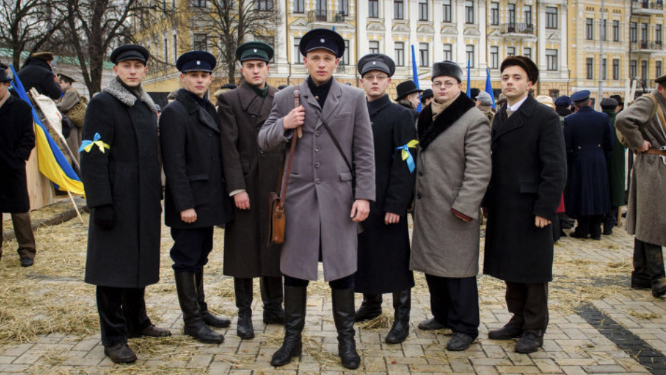  
*Євген Ламах як студент Андрій Савицький у фільмі Олексія Шапарєва «Крути 1918» (2019).*  

> Їхні репліки виглядають такими ж **незграбними й вимушеними**, як і **французькі акценти** контррозвідників, яких грають **українські актори**.  

---

**Оксана Черкашина** грає **Тетяну, бойового медика**, загартованого жорстокістю війни, у фільмі **Наталії Ворожбіт** «Погані дороги» (**2020**).

Цей фільм зачаровує **унікальною і безпрецедентною точністю** у відтворенні подій на екрані.

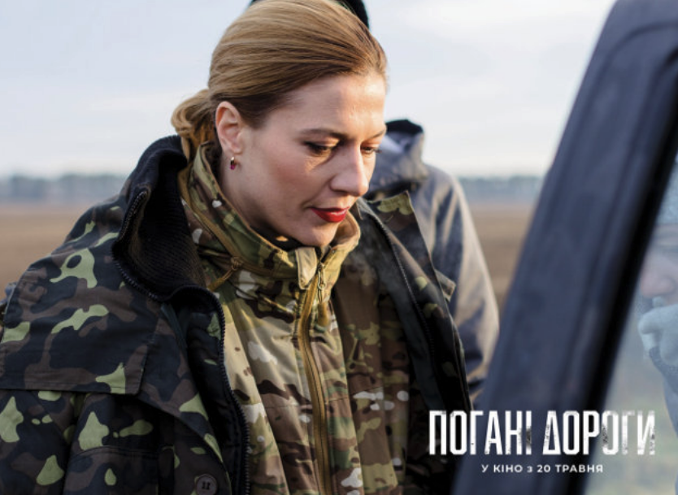  
*Оксана Черкашина як бойовий медик Тетяна у фільмі Наталії Ворожбіт «Погані дороги» (2020).*  

Здається, що **режисер хронометрував кожну сцену секундоміром** під час зйомок, із:  

- **Витонченими ракурсами**  
- **Ретельно вибудуваними інтонаціями**  
- **Кожним діалогом, що слугує захопленню аудиторії**  

> **Аудиторія майже відчуває себе зануреною в дію.**  

Наприклад, під час **зворушливих спогадів Тетяни** про загиблого коханого, фоновий **вульгарний поп** робить її слова **значно ближчими до реальності**.

Виникає враження, що **говорить не Оксана Черкашина**, а **бойовий медик Тетяна**, стираючи межу між **виставою та документалістикою**.

---

Особливо потужний момент — коли вона співає **банальну, але мелодраматичну пісню** **російської поп-співачки Тані Буланової** — її несподівана присутність у фільмі про **воєнний героїзм** є водночас **зворушливою і художньо виправданою**.

**Марина Клімова** також демонструє **сильну гру** у фільмі, виконуючи роль журналістки **Юлії**, взятої в полон терористом **Стасом**.

У її зображенні **кожна репліка, вигук, схлипування та раптове непритомніння** настільки розраховані й точні, що **резонують як симфонія**.

---

**Наталя Половинка** у ролі **матері зниклого військового пілота Софії Кулик** у фільмі **Заза Буадзе** «Матері апостолів» (**2020**) втілює **стереотипний образ** матері солдата на війні, **готової на все заради своєї дитини**.

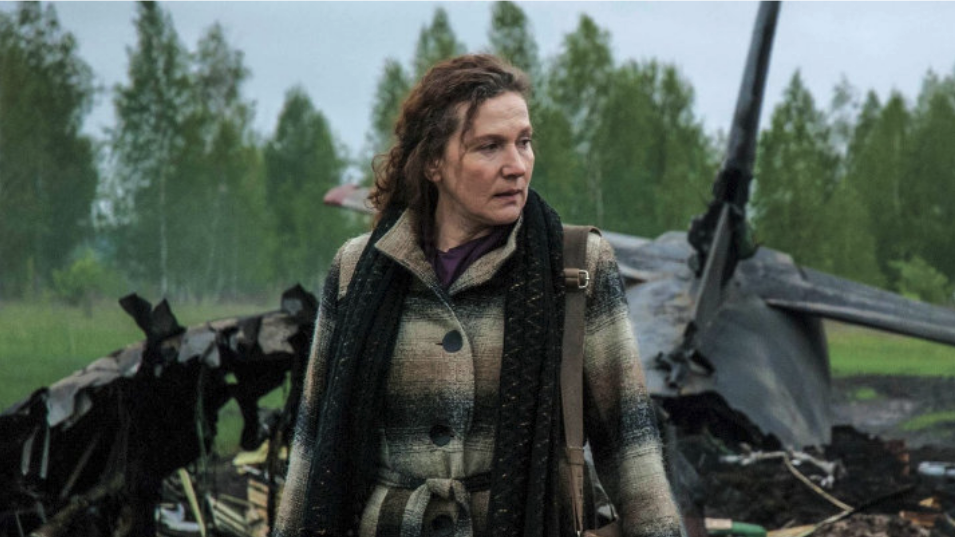  
*Наталя Половинка як мати зниклого військового пілота Софії Кулик у фільмі Заза Буадзе «Матері апостолів» (2020).*  

Софія вирушає на **окупований Донбас**, де зустрічає:  

- **Стереотипних терористів**  
- **Стереотипну жінку-алкоголічку**  
- **Стереотипного телевізійного журналіста**  

У певний момент глядач може відчути, що дивиться не **фільм**, а захоплюючу **комп'ютерну гру** під назвою *«Вижити та втекти з ДНР»*[^5].

> У цьому фільмі **Наталя Половинка не грає у традиційному сенсі**; натомість вона **старанно опрацьовує сценарій**.  

Режисер **Буадзе**, відомий передусім зйомкою **телевізійної реклами та шоу** — комерційна цінність яких будується на **жорстких стереотипах**, — використовує **прийоми, покликані захопити глядачів** і, відповідно, **підвищити рейтинги**. Очевидно, він **продає цю історію аудиторії перевіреними комерційними методами** і **домагається успіху**, навіть якщо **стереотипне мистецтво позбавлене високих художніх достоїнств**.

> **Воно є відображенням свого часу і може відкривати фрагменти правди про реальність.**  

---

**Комік Георгій Делієв** у ролі **терориста Батяні (Попа)** у фільмі **Сергія Лозниці** «Донбас» (**2018**) виглядає **цілком органічно**.

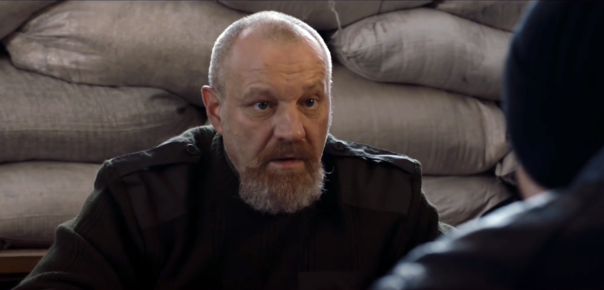  
*Георгій Делієв як терорист Батяня (Піп) у фільмі Сергія Лозниці «Донбас» (2018).*  

Усі терористи в **окупованих регіонах** — по суті **блазні**, що надає **цирковий вигляд** не лише цьому фільму, а й **документальним кадрам із тих регіонів**.

Персонаж **«невисокого лисого чоловіка із сивою бородою»**, який переконує бізнесмена **передати свою машину «повстанцям»**, виглядає **автентично в зображенні Делієва**.

Частково тому, що **режисер Лозниця відтворює тональність оповіді, що нагадує жорстокий і кривавий цирк, влаштований на українській землі, окупованій росіянами**.

---

**В'ячеслав Довженко** у ролі **командира групи оборони Донецького аеропорту**[^6] з позивним **«Серпень»** у фільмі **Ахтема Сеітаблаєва** «Кіборги» (**2017**) зіткнувся зі **складним завданням** автентичного відтворення **героїчної боротьби**.

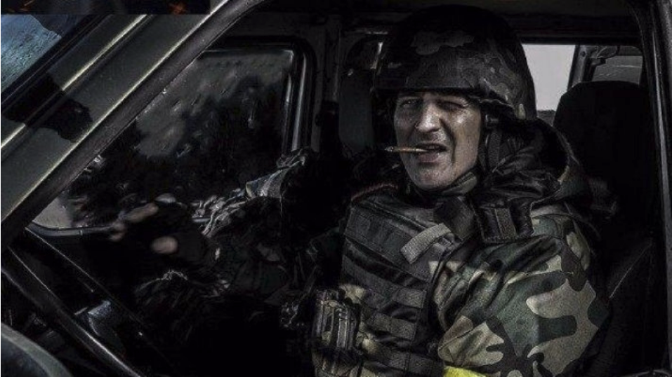  
*В'ячеслав Довженко як командир групи оборони Донецького аеропорту у фільмі Ахтема Сеітаблаєва «Кіборги» (2017).*  

### **Виклик:**  
- Уникнути **дешевого й банального пафосу**.  
- Зобразити **реалістичний сучасний бій**.  
- Збалансувати **історичну точність і драматичну напруженість**.  

Тимур Ященко успішно подолав це у фільмі «Черкаси», обравши **правильний акторський склад** і показавши **недоліки персонажів**.

> **На противагу цьому, Сеітаблаєв обрав у своєму фільмі стиль гри Counter-Strike.**  

Це **помітно в сценах** із:  
- **Нічними рейдами і перестрілками в темних коридорах.**  
- **Персонажами, що використовують тепловізори для виявлення ворогів.**  

Проте **В'ячеслав Довженко** виголошує **важливий монолог**:  

> *«У цій війні недостатньо просто виконувати накази... ми мусимо думати, любити, відчувати несправедливість...  
Ми воюємо не лише проти росіян і кадировців[^7], а й проти власне наших українців...  
Ми мусимо вчитися, знати історію, аналізувати помилки.  
Якщо ми тут, то погоджуємося платити за минуле.»*  

Ця перспектива є **критичною після багатьох років слухняної державної кінопропаганди**, де **все було зрозуміло від початку**.

---

Справжній фільм повинен:  
✅ **Кидати виклик переконанням глядачів**  
✅ **Спонукати до сумніву, а не до сліпої довіри**  
✅ **Виховувати критичний погляд на реальність**  

Сцена у фільмі Сеітаблаєва **не могла б з'явитися в попередніх патріотичних творах**:  
> **Коли один солдат вигукує: «Я люблю Україну!», інший голосно сміється, відчуваючи фальш у цьому, і жартує: «Пропаганда в дії!»**  

Раніше фільми можна було класифікувати як:  
- **«Успішну» пропаганду**  
- **«Менш успішну» пропаганду**  

Тепер, **вперше**, **сумнів сміливо вимовляється на екрані**:  
> **Любов до України може бути нещирою, а лише результатом пропаганди.**  

Усвідомлення цього **знаменує потенційний якісний зсув у наративі українського кіно**.

---

## **Реальність складна і багатогранна.**  
Адекватне її відтворення **на екрані** вимагає **значних зусиль**, що засвідчують роботи **найвідоміших світових метамодерних митців**.

Слід сподіватися, що **українські режисери** також приймуть цю **тенденцію**.

---

## **Виноски**
[^1]: *Послідовник або прихильник Симона Петлюри — видатного українського політичного і воєнного діяча доби Визвольної боротьби (1917–1921). Петлюра був головою Директорії Української Народної Республіки та ключовою постаттю в боротьбі за незалежність України після падіння Російської імперії.*  
[^2]: *ЧК (скорочення від «Всеросійська надзвичайна комісія з боротьби з контрреволюцією та саботажем») — перша таємна поліцейська організація, заснована в Радянській Росії в 1917 році за Леніна. Вона уславилася жорстокими методами, включаючи арешти, розстріли та використання таборів примусової праці. ЧК стала попередницею пізніших радянських спецслужб — НКВС і КДБ.*  
[^3]: *Гуцули — субетнічна група українців, що проживає в Карпатах, переважно в Західній Україні. УПА (Українська Повстанська Армія) — українська націоналістична воєнна організація, сформована під час Другої світової війни в 1942 році. Її основна мета полягала в боротьбі за незалежність України, чинячи опір як нацистській Німеччині, так і Радянському Союзу.*  
[^4]: *Байкове кладовище — Historic Cemetery in Holosiivskyi District of Kyiv, national historic monument. Відоме як некрополь видатних людей.*  
[^5]: *Донецька Народна Республіка (ДНР) — самопроголошене, невизнане сепаратистське утворення, засноване в 2014 році в Донецькому регіоні Східної України. За підтримки Росії ДНР відігравала центральну роль у війні на Донбасі. Україна та більшість міжнародного співтовариства вважають ДНР незаконним утворенням під російською окупацією.*  
[^6]: *Донецький аеропорт у 2014–2015 роках став символічним і стратегічним осередком збройного конфлікту. Українські солдати, прозвані «Кіборгами» за свою стійкість, захищали його 242 дні. Інтенсивні бої стали символом українського опору. Зрештою, у січні 2015 року сепаратисти захопили руїни.*  
[^7]: *Кадирівці — чеченські паравоєнні формування, лояльні Рамзану Кадирову, главі Чечні і союзнику Путіна. Вони функціонують як частина російського воєнного апарату і відомі своєю жорстокістю та порушеннями прав людини.*  
