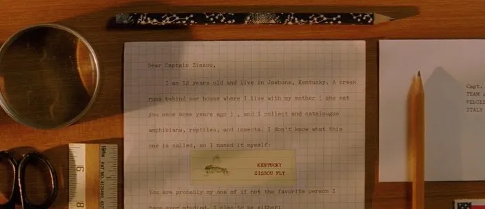
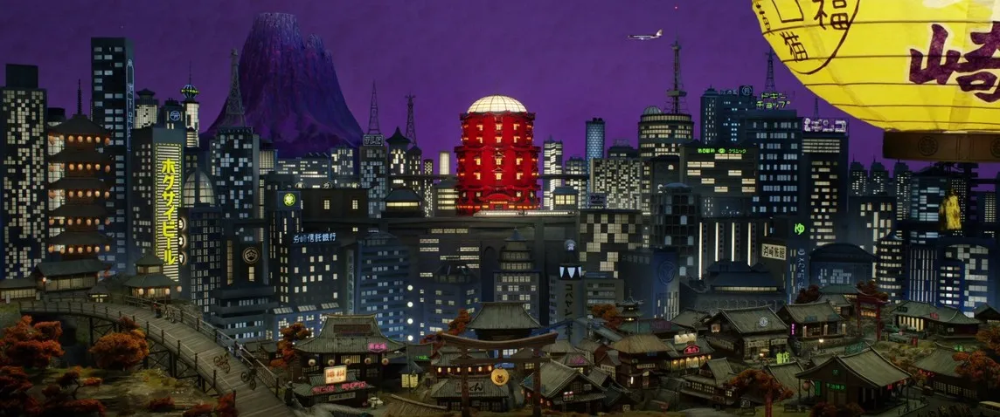
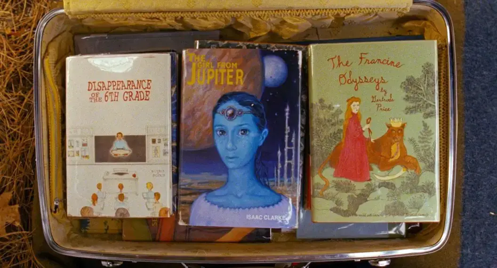
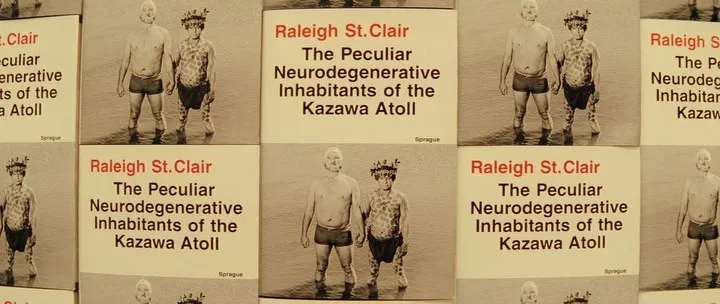

# **Маніфест метамодернізму**

 

## **Реальність не стала складнішою.**

Ми просто почали помічати більше, ніж раніше. У якийсь момент ця складність вражень зросла настільки, що вибухнула ще до настання Технологічної сингулярності.

Сучасна людина нагадує пацієнта із **синдромом Аспергера**, який одночасно помічає найдрібніші деталі навколишнього середовища, і це знання так його (або її) відволікає, що він (або вона) вже не в змозі охопити ціле. Він (або вона) збирає велику колекцію фотоапаратів, не маючи жодного інтересу до фотографії. Таке накопичення інформації призводить до виникнення нової гібридної свідомості, яка поєднує нероздільні, протилежні, антагоністичні явища і загалом усе, що можуть вловити очі і почути вуха. Звідси виникає нова форма художнього методу і новий метафоричний апарат осмислення дійсності.

---

## **Позиція митця і довіра до реальності**

**Реалісти** довіряють лише тому, що бачать.
>  - Чайльд Гарольд вирушив у своє паломництво, аби торкнутися всього власними руками.
>  - Містер Піквік, «зі зорильною трубою в кишені пальта і записником напоготові», одержимий спостереженням і документуванням.

**Модерністи** довіряють лише тому, чого не бачать.
>  - Малевич та його послідовники вбачали сенс лише у відтворенні **неіснуючої** реальності.
>  - Адольф Гітлер вірив у **неіснуючу** єврейську змову, а Йосип Сталін — у **mythічну** класову боротьбу.

**Постмодерністи** не довіряють нічому.
>  - Семюел Беккет, переховуючись від гестапо в домі Наталі Саррот, писав *Уотта* не про фашизм чи антифашизм, а про втрату реальністю свого сенсу.
>  - Мова перетворилася на відбілювач, що робить усі слова однаково непереконливими.

**Метамодерністи** довіряють усьому.
>  - У фільмах Веса Андерсона **все** правда.
>  - Собаки та лисиці справді розмовляють, усі події взаємопов'язані, і кожен предмет рухається у досконало **симетричній** та **вкладеній** манері, вкладеній під дев'яносто градусів у вишуканому ноллінгу.

 

---

## **Метамодернізм завжди контрінтуїтивний**

Якщо ви думаєте, що **знаєте** щось напевно, це **не** так.

Це — **радикальна суперечність** метамодернізму з романтизмом, який цілком покладався на **інтуїтивні прозріння**. Проте Google і ретельна документація дійсності мільйонами людей поклали **кінець** усім прозрінням. Тепер усе **перевіряється**, а точність залежить від **кількості перевірок**.

Перебування в романтичних і модерністських традиціях породжує чимало проблем:

- Деякі країни та індивіди **досі існують** у парадигмі романтизму або модернізму.
- **Сучасна метамодерністська** людина **завжди** шокуватиме носіїв романтичного ідеалу.
- Існувати в ситуації **метамодернізму** дуже **некомфортно**.

Щоб визнати сучасність і вирватися з **солодкого полону** архаїчної свідомості, треба постійно докладати **значних зусиль**, на які Романтики **неспроможні**, бо це суперечить їхній **ідеалістичній моделі**.

---

## **Цінність авторської чистоти та ідеал метамодернізму**

 

Феномен цінності авторської чистоти дуже поширений серед літературних критиків. Чистота — це сукупність специфічних характеристик напряму, яким автор мусить відповідати, щоб здобути визнання критика. Нечистота чужої парадигми критик відчуває буквально як бруд. Звідси — взаємна зневага. Це схоже на кастову систему давньої Індії.

Щоразу форми чистоти різні. Існують романтично-реалістичні, модерністські, постмодерні та метамодерні ідеали чистоти.

- **Реалістичний ідеал** вбачає у літературі дотепне й гостре відображення життя, але відкидає натуралізм і гру, що є невід'ємними елементами самого буття.

- **Модерністський ідеал** безпосередньо пов'язаний з націоналізмом і тому передбачає максимальну гомогенізацію та уніфікацію творчого методу. З точки зору модерністського критика, ідеальний автор має бути революціонером, але творити гомогенну реальність: наприклад, революційний роман про перемогу національної ідентичності на терені власної країни та за кордоном. Твір обов'язково має бути про боротьбу ідентичностей як широких уявлень масової свідомості. Індивідуальні персонажі повинні бути лише тимчасовими втіленнями ідентичностей, що, по суті, нічого не вирішують, — на відміну від романтично-реалістичного ідеалу, де індивідуальні ідентичності вирішують завжди все.

- **Постмодерністський ідеал** ґрунтується на вмілому застосуванні різноманітних поп-патернів, якими автор має досконало оволодіти та сконструювати з них тканину твору, використовуючи іронію для підтримання певної дистанції, аби читач не відчув самодостатності цих патернів, бо вони — не руки, а лише рукавички (або рукавичкові ляльки), що тимчасово надягаються на руки.

- **Метамодерністський ідеал** — це постійна осциляція зразка, і він дуже схожий на постмодернізм, але є одна суттєва відмінність: для метамодерніста немає різниці між руками і рукавичками (між рукою ляльки та самою лялькою). Усі попередні побудови — і романтичні, і реалістичні, і модерністські, і постмодерністські — мають для нього однакову цінність і можуть існувати як почергово, так і одночасно. Здавалося б, це має виглядати як жахливий хаос, але всіх рятують фрагменти (колись звані інтерлюдіями), в які автор просто направляє зразки, аби уникнути плутанини. Загалом, метамодернізм — дуже незручне явище, бо він контрінтуїтивний, не визнає жодної ієрархії, а його постійна осциляція призводить до того, що часто незрозуміло, що відбувається: хочеться, щоб автор нарешті зупинився на чомусь одному, але в метамодернізмі це просто неможливо.

Метамодернізм мав би виглядати як **жахливий хаос**, але натомість він зберігає **фрагменти** — невеликі **інтерлюдії**, що запобігають плутанині.

 

---

## **Фрагменти в метамодернізмі**

Фрагменти у фільмі Веса Андерсона **«Королівство повного місяця»** являють собою **явище Західної культури**:

Сьюзі Бішоп носить із собою шість книжок, які позичила і не повернула:

1. *Shelly and the Secret Universe*
2. *The Francine Odysseys*
3. *The Girl from Jupiter*
4. *Disappearance of the 6th Grade*
5. *The Light of Seven Matchsticks*
6. *The Return of Auntie Lorraine*

 

Жодна з цих книжок насправді не існує. Андерсон вигадав усі ці назви і написав фрагменти книжок, які цитуються вголос у фільмі. Художники, яких замовив режисер, намалювали обкладинки. Усі ці книжки — фантастичні романи для дівчат-підлітків. Такі романи займають значне місце в англомовній культурі, і настільки значне, що вже почали виходити за традиційні межі свого існування. Наприклад, британський співак і лідер гурту **The Cure** **Роберт Сміт** використав образну систему фантастичного роману **Пенелопи Фармер** *«Charlotte Sometimes»* для однойменної пісні.

Звичайно, фрагменти існували в мистецтві дуже давно, але лише в метамодернізмі вони завжди симулюються автором, присутні у великій кількості і відзначаються надмірною деталізацією.

 

---

## **Швидке уявлення про метамодерн**

Щоб швидко скласти досить точне уявлення про метамодерн, треба уявити мешканців певного будинку, які викинули все своє майно на смітник і доручили художникові створити щось цінне, але обов'язково з використанням кожної речі так, щоб це не виглядало як колаж або збірка, а нагадувало щось нове і якісне, щойно куплене в магазині. Художник на це відповів:

*«Ви що, збожеволіли? Хто повірить, що це нова і якісна річ?»*

*«Заспокойтеся,»* — сказали господарі викинутих речей, *«ми повіримо. Ви просто помийте там, протріть... ось, бачите, тут ганчірка лежить? Протріть ганчіркою. Щоб трохи блищало і виглядало як нове.»*

*«Але ж ви впізнаєте свої речі!»* — дивується художник.

*«Не впізнаємо,»* — відповідають господарі речей, *«бо ми забули, як вони виглядали. Тут є один старий дід. Він щось пам'ятає. Але його ніхто не слухає.»*

---

## **Тріада невизначеності**

Багато конфліктів у сучасному світі виникає через **нерозуміння** його **природи**. Три головні принципи **метамодернізму**:

1. **Більше не існує речей, які не можуть бути смішними.**
2. **Не існує речей, визначених у такий спосіб, що про них можна з певністю сказати щось визначене.**
3. **Не існує речей, про які можна сказати, що вони перебувають на своєму місці.**

 

---

## **Цей маніфест відкритий для подальших доповнень**

Цей маніфест може бути **розширений**, **деталізований** або **повністю заперечений** — у повній відповідності до **самого метамодернізму**.
