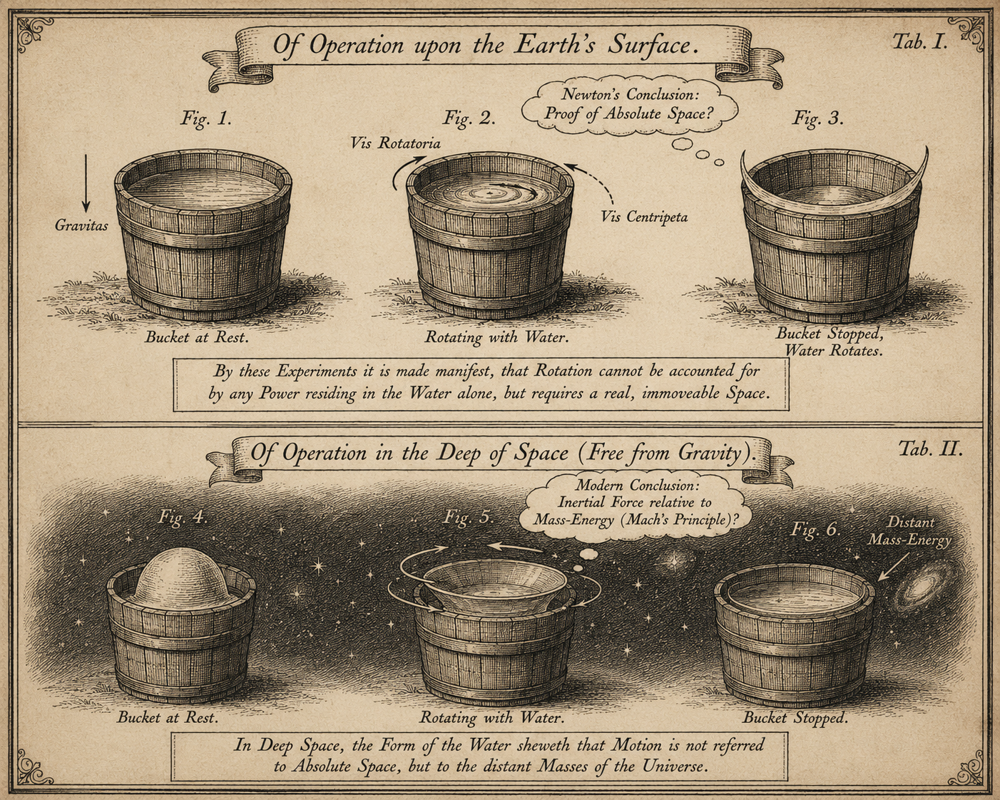
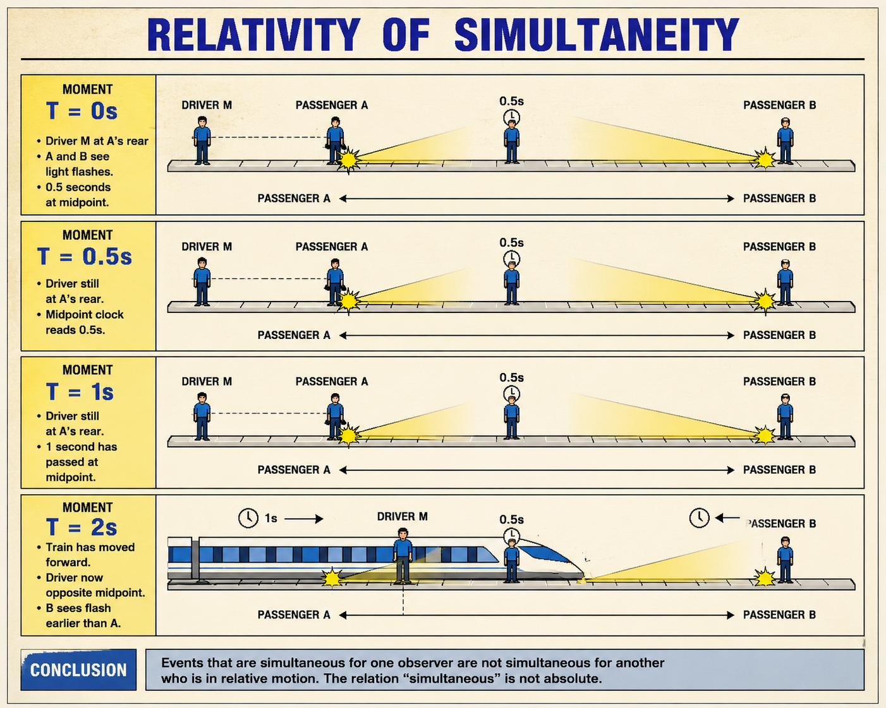
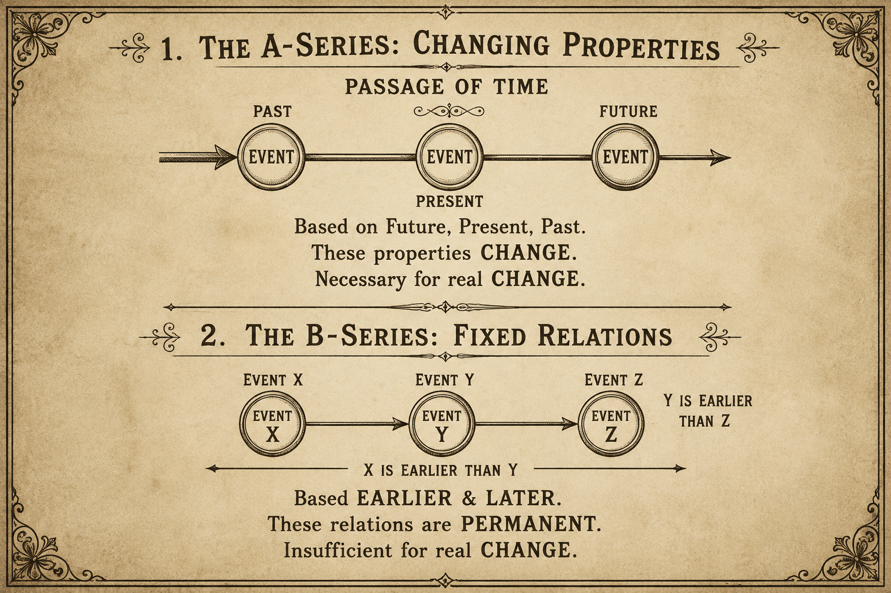
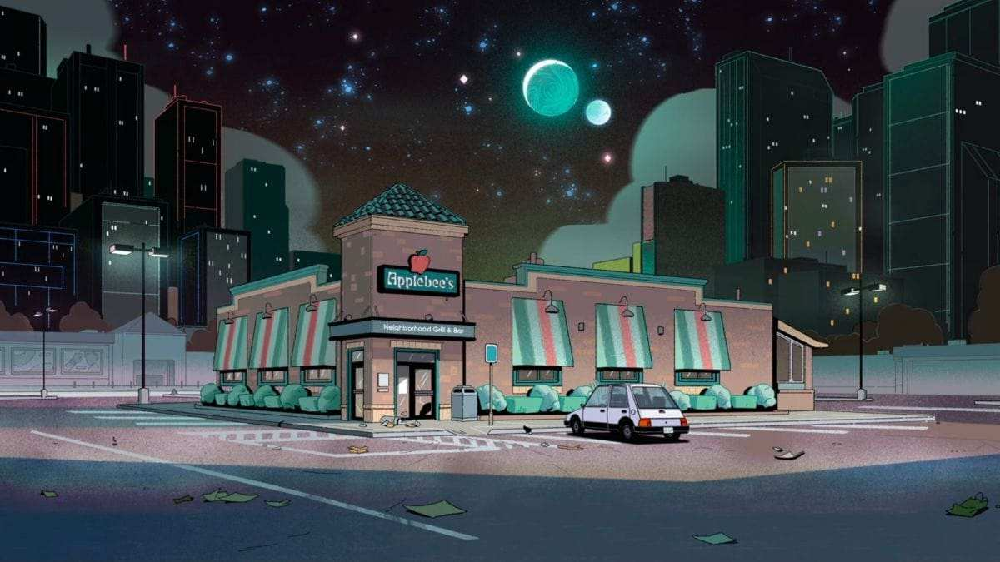

# Метамодерні пейзажі часу: мінливий образ часу

Цілком очевидно, що час не є відчутним об'єктом, проте ми ставимося до нього так, ніби він ним є. Ця ілюзія укорінена у значній ролі, яку час відіграє в нашому житті, та в численних — іноді дуже дорогоцінних — пристроях для вимірювання часу, що нас оточують.

Наприклад, найдорожчий годинник у світі — Graff Diamonds Hallucination — наручний годинник вартістю 55 мільйонів доларів. Він прикрашений понад 110 каратами надзвичайно рідкісних і яскравих діамантів, вправлених у платиновий браслет, що робить його унікальним поєднанням вишуканих ювелірних прикрас і годинникового мистецтва. (Graff Diamonds Hallucination 2025) Велика Бен (годинник і дзвін у башті Єлизавети, Лондон) не має офіційної ринкової вартості, оскільки є історичною пам'яткою, державною власністю та незамінним символом британської спадщини. Проте найновіші витрати на реставрацію всієї вежі — включно з годинниковим механізмом і дзвоном — сягнули майже 80 мільйонів фунтів стерлінгів (близько 97–111 мільйонів доларів США) станом на 2022 рік. (Washington Times 2025) Обсяг світового ринку годинників і хронометрів у 2025 році оцінюється приблизно в 58,94 мільярда доларів США. Прогнозується, що ринок продовжуватиме зростати, досягнувши близько 71,75 мільярда доларів до 2029 року. (Clocks Market Share 2025)

Важко повірити, що такі колосальні кошти вкладаються в щось, що не має матеріального втілення, — але це реальність. Відкриймо Оксфордський словник англійської мови для прикладу визначення: «Час. (незлічуване) те, що вимірюється в хвилинах, годинах, днях тощо». (Oxford 2025) Якщо час незлічуваний, це означає, що ніхто не може сказати «у мене було п'ять разів, але я позичив два рази своєму другу до наступного понеділка».

«Час — це вимірюваний або таке, що піддається вимірюванню, проміжок і континуум без просторових вимірів», — стверджує Britannica (Britannica 2025). І це звучить дуже туманно, бо ми легко можемо уявити просторовий континуум, але що таке континуум без просторових вимірів?

«Число — наприклад, років, днів або хвилин, — що позначає такий проміжок: пройшов дистанцію за час трохи менше чотирьох хвилин», — пояснює *The American Heritage Dictionary of the English Language*. (Dictionary 2012) І це значно продуктивніше для розуміння.

Години, хвилини й секунди виникли з потреби стародавніх цивілізацій ділити день з практичних міркувань. Ніхто не знає напевно, але вважається, що хтось із давніх єгиптян або вавилонян порахував фаланги своїх довгих пальців великим пальцем і виявив, що їх дванадцять. Звідси — дванадцять годин дня і дванадцять годин ночі. (Britannica 2025, 2)

Можливо, пізніше ті самі вавилоняни винайшли шістдесяткову систему числення, яка дала нам хвилини та секунди. Примітно, що сучасна емпірична наука досі будується на цій древній системі підрахунку пальців. Уявіть, якби ті древні єгиптяни рахували фаланги іншою рукою — вони б нарахували чотирнадцять. У такому разі наш день складався б із двадцяти восьми годин, що мало б безліч несподіваних наслідків.

Наприклад, кожна нова година була б коротшою:

```js
H₍₂₈₎ = 24/28 = 0.857
```

Відповідно, хвилини і секунди були б коротшими в тій самій пропорції. Якщо швидкість світла у вакуумі нині c = 299 792 458 метрів на секунду, нове значення цієї константи було б:

```js
C₍₂₈₎ = 299 792 458 × 0.857 = 256 964 964 метрів на секунду
```

Таким чином, «швидкість світла» залежала б від одного зайвого великого пальця давніх вавилонян. Звичайно, фактична швидкість світла залишається незмінною: «Реформа календаря не скоротить вагітність» (Lec 1972) — але для нас, людей, будь-яка константа існує лише як вимірюване явище.

Цей простий приклад показує, що сама суть часу залежить від взаємних домовленостей людей. Час — це не реальний фізичний об'єкт, а конструкт — результат наших колективних угод. Якщо так, то буде і корисно, і захоплююче простежити, як і чому цей конструкт часу еволюціонував упродовж століть аж до сьогоднішнього дня.

## Давня концепція часу

У минулому поняття часу виникло із суспільних взаємодій для вимірювання тривалості праці та забезпечення справедливого розподілу робочого часу або для визначення переможця змагання, проте точність приладів для вимірювання часу часто суттєво варіювалась.

До появи точних хронометрів у XVIII столітті моряки використовували пісочний годинник для вимірювання часових інтервалів у разі навігації за допомогою методу обчислення поточного місцезнаходження за пройденим курсом — визначення швидкості і відстані, яку пройшло судно. «Починаючи з XIV століття і до появи морських хронометрів, на морі час регулювався щодня опівдні, коли сонце перебувало в найвищій точці. Для цього використовувався сонячний годинник, а пісочний годинник — для вимірювання плину часу протягом дня. 30-хвилинний пісочний годинник використовувався для вимірювання вахт. Щоразу, коли пісочний годинник перевертали, рульовий бив у корабельний дзвін: один удар після першої півгодини, два — після другої, і так далі, поки «восьмий удар» не позначав кінець чотиригодинної вахти». (Navigation and Time 2025)

Ця точність була необхідна через складний характер кругосвітніх експедицій, успіх яких вимагав дуже точних вимірювань. Однак корисно розглянути управління часом з перспективи, далекої від головних центрів цивілізації, щоб побачити: сонячний, пісочний і навіть механічний годинники не є обов'язковими пристроями — і саме вимірювання часу може набувати різних форм за різних соціальних умов.

Дуглас Рейбек у своїй статті «Годинник з кокосової шкаралупи» (1992) виявив, що уявлення про час серед малайців Келантану допомагають підтримувати «сільську солідарність і… їхню самобутню культурну ідентичність». (Raybeck 1992)

У традиційних келантанських селах час є соціальним і переживальним, пов'язаним з природними і соціальними ритмами, а не з механічними годинами. Люди описують час відносно видів діяльності, наприклад «до Зогору» (полуденної молитви), а не точних часових показань. Пунктуальність оцінюється соціально — запізнення має значення лише тоді, коли порушує гармонію або спричиняє незручності. Механічні годинники з'явилися разом із модернізацією, але сільські жителі часто носили їх як символи статусу або сучасності, а не точні прилади. Як кажуть в Африці: «У західних людей є годинники. У африканців є час». (Guinness 2016) Годинник, що зупинився або зламався, все одно «працював» культурно, виражаючи ідентичність, прагнення та обізнаність про західний час. Годинник з кокосової шкаралупи — місцевий таймер для змагань. «Це проста конструкція, що складається з відра з водою, в яке опущена половинка кокосового горіха з маленьким отвором у центрі. Вимірюваний інтервал — просто час, потрібний шкаралупі, щоб наповнитися водою і потонути, зазвичай три-п'ять хвилин». Попри технічну неточність, кокосовий годинник цінується за видимість і чесність: кожен може бачити відлік часу. Цей таймер підкреслює соціальну точність, а не фізичну, запобігаючи заздрощам і конфліктам у громаді. Використання прихованого механічного годинника підірвало б довіру, тоді як кокосовий годинник захищає гармонію і прозорість. У Келантані час служить насамперед людським стосункам, показуючи, що культурний сенс і соціальна участь важливіші за строгу часову точність. (Raybeck 1992)

Очевидно, що годинник з кокосової шкаралупи цілком задовольняв суспільства, в яких час мав мало економічного значення і був здебільшого несуттєвим. Говорячи просто, він коштував майже нічого. Однак промислова революція в західних суспільствах різко підвищила цінність часу. У 1748 році Бенджамін Франклін писав у своєму есе «Порада молодому торговцю»: «Пам'ятай, що час — це гроші». (Fisher 1748) Коли буквально треба платити за час іншої людини, навіть різниця в «три чи п'ять хвилин» стає вирішальною, вимагаючи зовсім нового рівня точності.

## Від «середньовічного» уявлення Ньютона про абсолютний час до відносності Ейнштейна

Ньютон був одним із перших учених, хто помітив: хоча піщаний, сонячний і навіть механічний годинник вимірюють час з різним ступенем точності, мусить існувати певний ідеальний, абсолютний «надгодинник», до якого справжні годинники лише наближаються за точністю. Такий ідеалізм був поширеною тенденцією серед багатьох учених тієї епохи, коли авторитет релігії похитнувся під час Просвітництва, але все ще був достатньо сильним, щоб карати незгодних з офіційним поглядом на Всесвіт. Таким чином, ідеалізм став перехідним етапом від релігійного світогляду до позитивізму.

Ньютон жив у часи, коли у фізиці ще не існувало єдиної системи опису руху. Спостерігаючи рух планет, падіння тіл і явища інерції, він зрозумів: точний опис руху потребує незмінної «сцени», незалежної від подій, на якій цей рух відбувається. Це привело його до концепції абсолютного часу — часу, що тече рівномірно й незалежно від будь-яких зовнішніх явищ або спостережень. Він розрізняв абсолютний час (математично постійний, «сам по собі») і відносний час (який ми вимірюємо годинниками, спостерігаючи за подіями). Наприклад, годинник може поспішати або відставати через механічні обмеження, але абсолютний час тече рівно, незважаючи ні на що.

На підтримку своєї гіпотези Ньютон провів знаменитий дослід з відром. Обертаючи відро з водою, він спостерігав, як поверхня води вигинається від центру до країв під дією відцентрової сили. Коли відро зупиняли, вода продовжувала обертатися і деякий час зберігала увігнуту форму. За Ньютоном, цей ефект демонструє: рух об'єкта відносно абсолютного простору й часу має фізичні наслідки, які неможливо пояснити лише відносним рухом між двома об'єктами — водою і відром. Ньютон тоді не міг припустити, що вода у відрі перебуває під впливом сили інерції не стільки відносно стінок відра, скільки відносно земного тяжіння. На певній відстані від Землі подібний дослід взагалі не був би можливий.



*Рисунок 1. Схема досліду Ньютона з відром у двох умовах: на Землі і в космосі.*

Ця ідея трималась майже 300 років — аж до появи **теорії відносності** Ейнштейна. Найцікавіший момент у контексті цієї статті — зауваження Ернста Маха: «Ніхто не може передбачити щось про абсолютний простір і абсолютний рух; вони є чистими думками, чистими розумовими конструктами, що не можуть бути відтворені в досвіді». (Mach 1960) Мах вбачав в ідеалізмі Ньютона «середньовічні» уявлення про абсолютний простір і абсолютний час. (Galison 2003)

Лише в XX столітті стало остаточно очевидно, що неможливо навіть уявити абсолютні системи відліку, адже наша планета, наша Сонячна система і навіть наша Галактика постійно рухаються з величезними швидкостями, і тому як часові, так і просторові вимірювання залежать від системи відліку.

Між 1900 і 1905 роками Альберт Ейнштейн працював у Швейцарському патентному бюро в Берні над проблемою синхронізації годинників на залізничній станції. Саме там у нього виникла ідея про неможливість одночасності подій для всіх спостерігачів. Уявіть платформу завдовжки 300 000 кілометрів, на обох кінцях якої одночасно вмикаються два ліхтарі у момент, який ми позначаємо як «0». Світло проходить від одного кінця платформи до іншого за 1 секунду. Пасажир стоїть посередині цієї платформи. Для нього ліхтарі ввімкнуться одночасно, але через пів секунди після того, як вони ввімкнуться для двох пасажирів, що стоять поруч із цими ліхтарями. Таким чином, це відбудеться в момент «0,5». До платформи наближається потяг, і його машиніст побачить перший ліхтар, найближчий до нього, у момент «0», а другий — дальній — у момент «1». Якщо машиніст вмикає ліхтар на потязі точно в той момент, коли бачить дальній ліхтар, дальній пасажир помітить це в момент «2».



*Рисунок 2. Ілюстрація відносності одночасності.*

Таким чином, ідея синхронізації годинників за допомогою зорового сигналу перетворюється на майже нерозв'язну проблему, адже не існує засобів передавати інформацію швидше за світло.

Ейнштейн стверджував, що краще і менш довільне рішення питання одночасності таке: встановлювати годинники не на час відправлення сигналу, а на час вихідного годинника плюс час, необхідний сигналу для проходження відстані від вихідного до синхронізованого годинника. Зокрема, він пропонував надсилати сигнал по колу від вихідного годинника до дальнього і назад, а потім встановлювати дальній годинник на час вихідного плюс половину часу кругового маршруту. Таким чином розташування «центрального» годинника не мало значення — можна було розпочинати процедуру з будь-якої точки й однозначно фіксувати одночасність. (Galison 2003)

Відмовитися від ідеї абсолютного часу було нелегко, але ще важче — від концепції об'єктивного часу, що існує як елемент фізичної реальності незалежно від людської свідомості і є не лише продуктом нашого розуму. Через складність прийняття цього факту розпочались запеклі суперечки між презентистами й eternalists, що тривали протягом усього XX століття.

## Презентизм, іменуватизм і глухий кут Мактаґарта

Незважаючи на найновіші приголомшливі наукові відкриття, ідеалізм продовжував відстоювати свої позиції. Дж. М. Е. Мактаґарт був одним із найвидатніших представників британського ідеалізму — філософської школи, що протистояла зростаючому науковому матеріалізму й емпіризму того часу. Його прихильність до ідеалізму була глибоко вкорінена в академічній традиції як послідовника Гегеля.

Його систематична філософія, викладена у праці **«Природа існування»** (McTaggart 1921), була спробою побудувати світогляд, що забезпечив би духовну опору і втіху. Цей світогляд стверджував, що справжня реальність є Абсолютом, позачасовою і складається з вічних сутностей (свідомостей), об'єднаних любов'ю. Його аргумент про нереальність часу був ключовою частиною цього розради: якщо час нереальний, то страждання, зміна й смерть є ілюзіями, а справжня сутність існування є вічною і благою.

Мактаґарт, як і інші британські ідеалісти, вбачав у науці (та породженому нею матеріалізмі) загрозу для людського духу й вічних цінностей. Його аргумент, що час є суперечливим і, відтак, ілюзорним, — це прямий удар по науковому світогляду, що ґрунтується на фізичному, часовому існуванні.

У знаменитій статті **«Нереальність часу»** (1908) Дж. М. Е. Мактаґарт стверджував, що видимість часового порядку у світі є лише ілюзією. Його аргумент починається з розрізнення двох способів упорядкування часових позицій:

   - **серія A** (визначається змінними властивостями: майбутнє, теперішнє і минуле)

   - **серія B** (визначається фіксованими відношеннями: раніше і пізніше).

Мактаґарт стверджував, що **серія B** сама по собі недостатня для належного часового ряду, оскільки без **серії A** вона не може пояснити справжню зміну. Потім він стверджував, що **серія A** внутрішньо суперечлива, бо кожен момент часу мусить одночасно мати несумісні властивості — бути майбутнім, теперішнім і минулим. Мактаґарт вважав, що спроби розв'язати це протиріччя посиланням на подальші моменти часу лише породжують нескінченний регрес тієї самої суперечності, доводячи нереальність часу. (McTaggart 1908)



*Рисунок 3. Розрізнення Мактаґарта між серією A і серією B.*

Ідеї Мактаґарта започаткували цілу низку ідеалістичних концепцій щодо природи часу й існування об'єктивної реальності в ньому. Фундаментальне онтологічне питання щодо часу: чи визначає властивість бути минулим, теперішнім або майбутнім існування об'єкта?

**Презентизм** стверджує, що необхідно існують лише об'єкти, що перебувають у теперішньому; отже, повний список існуючих речей виключав би всі лише минулі об'єкти (як Сократ) і лише майбутні об'єкти.

Натомість **іменуватизм** — непрезентистська позиція, що об'єкти з минулого і майбутнього існують зараз у загальному онтологічному сенсі, навіть якщо їм бракує теперішнього часового розташування.

Третя позиція, **теорія зростаючого блоку**, — непрезентистська позиція, що постулює: існують лише минулі й теперішні об'єкти, постійно розширюючи царину реальності по мірі плину часу. Дискусія зрештою стосується питання, чи впливає часове розташування на онтологію, зберігаючи глибинну напругу у філософії часу. (Emery 2024)

Суперечку між іменуватистами й презентистами, а також концептуальну проблему Мактаґарта можна розв'язати, якщо відкинути ідею об'єктивного існування часу незалежно від людської свідомості.

Коли Мактаґарт каже, що не може існувати момент, одночасно минулий, теперішній і майбутній, бо це несумісно, його помилка починається зі слів «момент, що є», адже час не існує в реальності; він існує лише в людській уяві і є її невід'ємним і важливим компонентом. Це означає, що минуле, теперішнє і майбутнє не існують об'єктивно й незалежно від людства як елементи фізичної реальності, а є розумовими конструктами, що допомагають людині осягнути навколишню дійсність і організувати своє життя. Як Мах стверджував, що абсолютний простір і абсолютний рух є «чистими думками, чистими розумовими конструктами, що не можуть бути відтворені в досвіді», — те саме стосується і часу.

Якщо час не існує в об'єктивному сенсі, суперечки між іменуватистами й презентистами втрачають сенс.

Якщо з точки зору презентизму лише теперішнє є реальним, а минуле й майбутнє не існують у реальності, це вірно, бо минуле й майбутнє існують не в реальності, а в нашій уяві. Але й теперішнє є розумовим конструктом, адже ми пам'ятаємо з теорії відносності Ейнштейна, що неможливо синхронізувати далекі годинники так, щоб вони показували однаковий час.

Якщо з точки зору іменуватизму реальність минулого й майбутнього існує, вона існує лише в нашій уяві або фантазії (для майбутнього) чи спогадах (для минулого).

Отже, якщо час є соціально-культурним явищем, логічно випливає, що він існує в межах домінуючих культурних світоглядів.

## Як час став метамодерним

Явище часу поза нашою свідомістю не існує поза середовищем, яке його передає, навіть якщо це середовище — дірява кокосова шкаралупа. Саме тому, щоб зрозуміти, як час змінився від давнини до нашого часу, важливо простежити еволюцію цих медіумів.

У **передмодерну епоху** приватних годинників не існувало або вони були дуже рідкісними, тому люди дізнавалися час з великого годинника на міській вежі або дзвону собору — обидва уособлювали владу уряду і віру в Бога. Якщо ви не чули дзвонів і не бачили годинника, ви могли покладатися лише на крик півня, який ніколи по-справжньому не знав години. Точне знання часу було привілеєм заможних городян, що використовували його для підтримки власного добробуту.

**Сучасність** не лише популяризувала наручні годинники, а й запровадила безліч альтернативних засобів відстеження та фіксації часу. Тепер час можна було дізнаватися з радіосигналів і газет. Проте й тепер не можна було дізнатися час миттєво: треба було чекати сигналів точного часу, що транслювалися раз на годину. Після точного часового сигналу слухачам пропонувались останні новини, покликані навчити їх правильно мислити. Радіо завжди було голосом, що керував громадянами від імені уряду.

**Постмодерний** час прийшов із телебаченням, яке незабаром стало багатоканальним. Час з'являвся на екрані частіше, іноді постійно під час певних трансляцій. Разом із часом глядачі отримували величезну кількість знань, що їм насправді не були потрібні, бо вони дивилися телебачення без розбору годинами. За таких умов, навіть якщо телебачення суворо контролювалося урядом, сама рясність рухомих зображень і розповідей вже підривала цей контроль.

**Метамодерний** час розпочався зі здешевленням смартфонів, що гарантували цілодобовий недорогий доступ до Інтернету. За підрахунками, у 2024 році в Інтернеті перебуває близько 5,5 мільярда людей — збільшення на 227 мільйонів осіб порівняно з переглянутими оцінками для 2023 року, згідно з новими даними Міжнародного союзу електрозв'язку. (ITU 2024) Це явище просто безпрецедентне в історії всього людства: значна кількість людей постійно дивиться на годинник протягом дня і координує свою щоденну діяльність із ним.

У цьому контексті дуже цікаво, як змінились образи старих медіумів, що раніше були єдиними джерелами повідомлення часу. Собори дзвони перетворилися або на туристичні атракції, або на апокаліптичні символи — як у романі Ласло Красснагорхаї «Сатантанго».

*«Футакі прокинувся від дзвону. Найближчим можливим джерелом була самотня каплиця приблизно за чотири кілометри на південний захід від старого маєтку Гохмайсс, але там не було не лише дзвону, а й вежа обвалилася під час війни, та й на такій відстані нічого не почути.»* (Krasznahorkai 1985)

Дзвін у фінальній сцені «Сатантанго» Красснагорхаї *«натякає, що світ, який ми бачимо, обертається навколо суперечності між матеріальністю — майже болісно точним відтворенням фізичного, конкретного, часткового — і чимось таємничим і незрозумілим, сутністю, можливо духовною, що впадає в очі своєю відсутністю»*. (Vickers 2019) Можуть бути різні версії, адже інтерпретації мистецького твору необмежені, але нагадування про нематеріальну природу часу, його існування лише в людській свідомості (бо лише Футакі чує дзвін), видається найбільш доречним.

Метамодерний час має чимало характерних рис, вже помічених і описаних у численних дослідженнях. У книзі Дугласа Рашкоффа «Present Shock: When Everything Happens Now» (Rushkoff 2013) представлено п'ять характерних рис, кожній з яких присвячено окремий розділ.

### 1. Розпад наративу

Концепція розпаду наративу описує руйнування традиційного лінійного сторітелінгу в медіа, культурі та політиці. Старі наративи, що надавали сенс, спрямування і структуру, замінюються фрагментарними, зосередженими на теперішньому переживаннями. У світі, перенасиченому миттєвою інформацією і реаліті-шоу, комфорт від розповідей із початком, серединою і кінцем слабшає, і люди намагаються осмислити все як ізольовані, негайні події, а не зв'язні наративи.

Цей розпад лише посилився з поширенням приватних новинних каналів у соціальних мережах і месенджерах. Споживання новин на онлайн-платформах продовжує фрагментуватися: шість онлайн-мереж зараз охоплюють понад 10% аудиторії щотижня своїм новинним контентом, порівняно лише з двома десять років тому. Близько третини нашої глобальної вибірки використовують Facebook (36%) і YouTube (30%) для новин щотижня. Instagram (19%) і WhatsApp (19%) — приблизно п'ята частина, тоді як TikTok (16%) залишається попереду X із 12%. (Newman 2025)

Згідно з новим дослідженням НУО «Інтерньюз-Україна» «Українські медіа: споживання новин і довіра у 2025 році», соціальні мережі остаточно утвердилися як головне джерело новин для українців. Смартфон став «вікном у світ інформації» навіть для старших верств населення. 86% українців отримують новини із соціальних мереж, і 37% використовують лише їх. 91% читають новини на смартфонах. (Internews-UA 2025)

Яскравим прикладом розпаду наративу в споживанні новин є російський месенджер Telegram, яким для цієї мети користуються 51% українців (RG/EUAM 2025). Перевага Telegram як джерела новин криється в його гібридній природі, яку впевнено можна назвати метамодерною. Користувачі можуть підписуватися на необмежену кількість каналів, авторами яких є не лише (а то й не переважно) журналісти чи знаменитості, а й звичайні люди, що опинилися в незвичних обставинах і отримали доступ до унікальних подій. Ці особи, яких можна назвати **«метаньюзмейкерами»**, записують відео або фото з місця подій і негайно публікують їх у своїх каналах, зазвичай із дуже суб'єктивними коментарями. Метаньюзмейкери не завжди публікують власні відео; іноді вони поширюють кадри, знайдені на смартфонах захоплених або загиблих солдатів. Відео також можуть бути постановочними, створеними за допомогою штучного інтелекту. У цьому контексті не застосовуються жодні правила або стандарти журналістської етики. Це сприяє поширенню чуток і теорій змови. Число метаньюзмейкерів зростає щодня. Вони виробляють такий обсяг публікацій, що аудиторія Telegram-каналів буквально перебуває в гіпнотичному трансі, споживаючи новини годинами щодня в нескінченному процесі прокручування. Якщо раніше випуски новин виходили в строго визначений час і можна було сказати «вечірній випуск новин», очікуючи його в певну годину, то тепер споживання новин стало імпульсивним: читачі можуть раптово починати читати новини, бо мають дві вільні хвилини, отримали звукове сповіщення або просто нудьгують. Навіть люди похилого віку тепер проводять години в «ліжковому гнитті», безкінечно прокручуючи Telegram-канали. Такий вид медіаспоживання починає нагадувати хворобу. За таких умов справжні медіа, що діють за правилами й мають експертизу, практично не мають шансів увійти в цей потік — навіть якщо мають власні Telegram-канали.

### 2. Дигіфренія

Дигіфренія описує, як цифрові технології розщеплюють людей між кількома ролями, місцями й часовими лінійками одночасно. Електронні листи, текстові повідомлення й постійна онлайн-залученість змушують людей населяти накладні моменти й ідентичності — створюючи стрес і плутанину, коли особиста цілісність порушується. Час більше не переживається послідовно, а як шквал одночасних вимог із різних джерел і платформ.

Профілі в соціальних мережах і одночасні ідентичності: люди ведуть кілька акаунтів у соціальних мережах (Twitter, Facebook, Instagram, LinkedIn) і стрічки повідомлень, кожна з яких одночасно проектує різну версію їхнього «я». Це фрагментує їхню увагу та ідентичність, унеможливлюючи повну присутність у жодному контексті.

Змішування роботи та особистого життя: фахівці жонглюють робочими листами, повідомленнями від сім'ї, соціальними сповіщеннями й стрічками новин — і все це одночасно, навіть у начебто «вихідні» години. Шквал одночасних вимог порушує особисту зосередженість, викликає постійний стрес і розмиває межі між ролями.

Операторів бойових дронів: Рашкофф зазначає, що пілоти дронів можуть керувати смертоносними машинами на іншому кінці світу з-за безпечних екранів — одночасно займаючи суперечливі моральні й фізичні реальності. Вони живуть у двох місцях і двох етичних світах одночасно, завдяки цифровому посередництву.

Постійне перемикання контексту: люди швидко перемикаються між відкритими вкладками браузера, робочими чатами, соціальними сповіщеннями й розважальними потоками. Цей процес (іноді званий «перевантаженням вкладками») породжує стрес і когнітивне виснаження, бо люди не можуть перебувати в єдиній, безперервній часовій лінійці або зосередитися.

Відволікання за обіднім столом: навіть у соціальних ситуаціях — наприклад, за обідом із друзями або родиною — люди відволікаються на сповіщення і неуважно взаємодіють зі смартфонами замість тих, хто фізично поруч. «Дигіфренія» виявляється у звичці ділити себе між цифровим і реальним присутністю.

### 3. Перекрут: Коротке вічне

Перекрут — це стиснення довготривалих процесів або цілей у коротші часові рамки, ніж вони призначені. У бізнесі й фінансах це виявляється в очікуванні миттєвих результатів, швидкої торгівлі та негайних доходів. Прагнення вмістити все в теперішній момент, включаючи процеси, що історично потребували років для дозрівання, спричиняє нестабільність і втрату довгострокової перспективи.

Інструменти штучного інтелекту значно прискорили цей процес. Тепер люди, які не мають часу читати довгі книги на сотні сторінок, можуть просто створити дайджест на 2–3 сторінки, скласти список десяти головних тез або зробити подкаст. Потім на основі цих швидких перетравлень генеруються нові тексти, які своєю чергою швидко зчитуються через ChatGPT або Perplexity. Зрештою, реальними авторами й читачами текстів стають мовні моделі, тоді як людям залишається лише загальне враження від коротких резюме.

### 4. Фракталноя: Пошук закономірностей у зворотному зв'язку

Фракталноя описує потяг знаходити закономірності й сенс у приголомшливих петлях зворотного зв'язку від інформації в реальному часі. З відходом традиційних часових ліній люди шукають зв'язки між подіями й даними, іноді вигадуючи зв'язки там, де їх немає. Це може призводити до параної або конспірологічного мислення — або до мережевої чутливості, залежно від того, чи є закономірності особистими або спільними.

### 5. Апокаліпсо

Апокаліпсо фіксує потяг суспільства до остаточності або чітких фіналів у нескінченному теперішньому. Стійкі тривоги від перебування в «шоці теперішнього» спонукають до фантазій про тотальний колапс, скидання чи апокаліпсис — реакції на стрес від відсутності наративних розв'язок або кінцевих цілей. Цей стан свідомості виявляється в підготовці до катастроф, захопленні сценаріями кінця світу та апокаліптичними медіа, бо люди шукають завершеності посеред хронічної невизначеності.

Мінісеріал Netflix «Керол і кінець світу» (2023) є суттєвим культурним артефактом для картографування цієї апокаліптичної метамодерної темпоральності.

Дія серіалу відбувається за сім місяців до того, як блукаюча планета Кеплер-9С має зіткнутися із Землею — подія, яка звільняє більшість людства прийняти гедонізм і здійснити мрії всього свого життя, роблячи роботу й гроші застарілими.



*Рисунок 4. Таємнича блукаюча планета Кеплер-9С має зіткнутися із Землею.*

Головна героїня Керол Коль — тиха жінка середнього віку — є однією з небагатьох, хто відчуває себе загубленим від цієї нової свободи і натомість знаходить глибоку втіху в монотонності свого попереднього життя. Пошук рутини несподівано приводить її до таємничого, начебто беззмістовного офісу під назвою «Відволікання», де вона утворює справжні людські зв'язки з іншими загубленими душами, знаходячи сенс не у великих пригодах, а в маленьких спільних ритуалах звичайного робочого дня перед неминучим кінцем.

Центральний конфлікт серіалу між масовим апокаліптичним гедонізмом і відданою рутиною Керол вирішується на користь останньої, стверджуючи культурну корисність поінформованої наївності. (Metamodernism 2015) Керол та її колеги продовжують діяти так, ніби рутина, дружба і спільна кава мають значення, цілком усвідомлюючи, що ці структури приречені. Це поєднання надії (щирості) й відстороненості (іронії) є сутністю метамодерної часової стратегії.

Блукаюча планета Кеплер-9С — цей гігантський небесний об'єкт — є не лише загрозою; вона є статичним образом майбутньої катастрофи. Вона фіксована, жахлива й всюдисуща. (Zeoli 2024) Це функціонує як кристалічний образ, де банальне, повільне теперішнє (Керол наливає каву, оформляє папери) одночасно зіставляється з фіксованою, певною реальністю її неминучого жорстокого кінця.

Шостий епізод, «Свята», досконало уособлює метамодерний часовий парадокс. Персонажі свідомо організовують і святкують майбутні свята — такі як Різдво, дні народження та Геловін, — що гарантовано не настануть до зіткнення Кеплер-9С. (Zeoli 2024)

Це — остаточний акт часової осциляції. Іронічний полюс (постмодерна поінформованість) визнає, що ці традиції є беззмістовними ритуалами, бо їхнє заплановане призначення в лінійному часі знищено зникненням. Проте щирий полюс (модерністська відданість ритуалу) передбачає все одно проводити святкування, звертаючись до глибокого колективного емоційного сенсу, пов'язаного зі спільнотою і спільними традиціями. (Zeoli 2024)

У світі, де час нескінченно медіюється й вибухає, людина більше не просто живе на часовій лінійці, а стає редактором — відбираючи спогади, реакції, ритуали й мікронаративи на різних пристроях і медіа. Ідентичність кується зі складання цих фрагментів у придатне для існування теперішнє, адже час — лише плід нашої уяви.

### Бібліографія

Britannica 2025: «Time.» In Encyclopaedia Britannica. https://www.britannica.com/science/time

Clocks Market Share 2025: Global Watches and Clocks Market Share 2025. The Business Research Company.

Dictionary 2012: The American Heritage Dictionary of the English Language (Fourth ed.). 2011.

Emery 2024: Emery, Nina, Ned Markosian, and Meghan Sullivan, «Time», The Stanford Encyclopedia of Philosophy (Fall 2024 Edition).

Fisher 1748: Fisher, George (accomptant). The Instructor: or, Young Man's Best Companion. 1748.

Galison 2003: Galison, Peter. Einstein's Clocks and Poincaré's Maps: Empires of Time. New York: W. W. Norton & Company, 2003.

Graff Diamonds Hallucination 2025: $55 Million Quartz Watch. A Blog to Watch.

Guinness 2016: Guinness, Os. Impossible People. InterVarsity Press, 2016.

Internews-UA 2025: Ukrainian Media: News Consumption and Trust in 2025. Internews Ukraine.

ITU 2024: International Telecommunication Union. «Global Internet use continues to rise but disparities remain.» ITU Press Release, 27 November 2024.

Krasznahorkai 1985: Krasznahorkai, László. Sátántangó. Translated by George Szirtes. New Directions, 2012.

Lec 1972: Lec, Stanisław Jerzy. Myśli nieuczesane. Kraków: Wydawnictwo Literackie, 1972.

Mach 1960: Mach, Ernst. The Science of Mechanics. 6th ed. Translated by T. J. McCormack. LaSalle, Illinois: Open Court.

McTaggart 1908: McTaggart, J. M. Ellis. «The Unreality of Time». Mind, 17(4): 457–474.

McTaggart 1921: McTaggart, John McTaggart Ellis. The Nature of Existence. Vol. 1. Cambridge: The University Press.

Metamodernism 2015: Metamodernism: A Brief Introduction. metamodernism.com, January 12, 2015.

Navigation and Time 2025: «Navigation and Time.» The Saint-Malo Shipwrecks.

Newman 2025: Newman, Nic. Overview and key findings of the 2025 Digital News Report. Reuters Institute for the Study of Journalism, University of Oxford.

Oxford 2025: Oxford English Dictionary. «Time.» In Oxford Advanced Learner's Dictionary.

Raybeck 1992: Raybeck, Douglas. The Coconut-Shell Clock: Time and Cultural Identity. Time & Society, vol. 1, no. 3, 1992.

RG/EUAM 2025: RG EUAM Report, August 2025.

Rushkoff 2013: Rushkoff, Douglas. Present Shock: When Everything Happens Now. Current, 2013.

Vickers 2019: Vickers, Jon. «Those Bells.» Establishing Shot – IU Blogs. December 4, 2019.

Washington Times 2025: Big Ben Clock Tower Restoration Doubles Cost, Wins Critical Acclaim. The Washington Times.

Zeoli 2024: Rowan Zeoli. «Carol & The End of the World» Teaches Us How to Survive the Apocalypse. Autostraddle, February 1, 2024.
