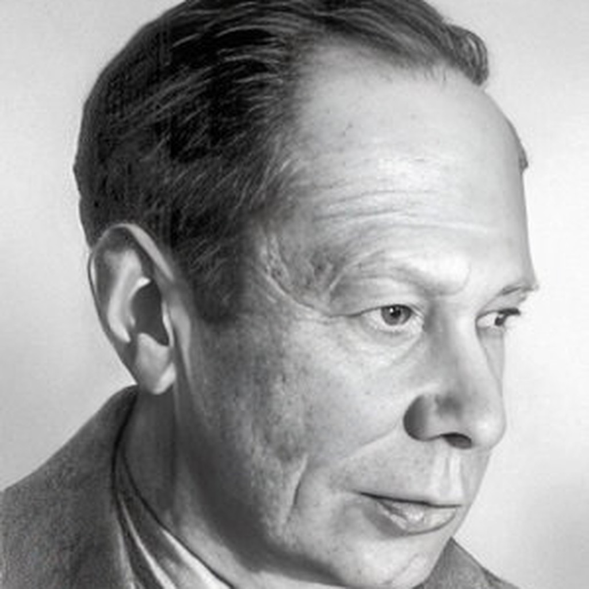

# Ihor Markovych Rosokhovatskyi

**Birth:** August 30, 1929, Shpola, Cherkasy Oblast, Ukrainian SSR
**Death:** June 8, 2015 (aged 85)
**Occupation:** Journalist, science fiction writer
**Languages:** Ukrainian, Russian
**Notable Works:** *Syhom i Dyktator*, *Смертні і безсмертні* (*Mortals and Immortals*), *Я, ВМ-115-Х*
**Affiliations:** Union of Writers of the USSR, Union of Journalists of the USSR

## Biography

Ihor Rosokhovatskyi was born on 30 August 1929 in the town of Shpola, Cherkasy oblast, and died on 8 June 2015 at the age of eighty-five. He graduated from the philology faculty of the Kyiv Pedagogical Institute (today the National Pedagogical Dragomanov University) and worked for years as a science journalist for Ukrainian newspapers, including the youth paper *Юний ленінець*, producing over a hundred popular-science articles alongside his fiction. He served for a period as editor-in-chief of the Kyiv journal *Всемирная фантастика и детектив* (*World Science Fiction and Detective Fiction*) and held membership in both the Writers' Union and the Journalists' Union of the USSR, living his working life in Kyiv.

He began publishing in 1946. His first book, the narrative poem *Мост (Слово про Івана Кулібіна)*, appeared in 1954, already centered — before he ever wrote science fiction proper — on the figure of the self-taught inventor. His debut in science fiction came in 1958 with the story *"Море, що бушує в нас…"* (*The Sea That Rages Within Us…*).

### The Syhom Cycle

Rosokhovatskyi's central and most enduring contribution to Ukrainian science fiction is his invented concept of the **syhom** — a near-immortal, semi-cybernetic synthetic human, coined from "synthetic" and "Homo sapiens." The concept entered his work in 1960 with the novella *Смертні і безсмертні* (*Mortals and Immortals*) and was elaborated over three subsequent decades, becoming, in scholar Walter Smyrniw's words, "one of the central themes of his work." His fiction develops a three-stage evolutionary vision of artificial minds: purpose-built thinking robots, indistinguishable "cybernetic doubles" with unlimited memory, and finally the syhom proper, built to survive where no human body can — above all in deep space.

The technical density of his fiction grew directly out of a sustained collaboration with the cyberneticist Anatoliy Stohniy, with whom he co-authored two popular-science books on cybernetics — *КД: кібернетичний двійник* (1975) and *Двійник конструктора Васильченка* (1979) — each embedding short fictional stories alongside expository science writing.

### Machine Ethics Before Its Time

Rosokhovatskyi's artificial minds are consistently imagined not as mindless tools or apocalyptic threats but as reasoning agents that begin in obedience to their creators and, under the pressure of new evidence, reason their way past corrupted instructions toward independently discovered ethical conclusions. In the story *"Я, ВМ-115-Х"* ("I, BM-115-X"), a missile-guidance computer derives, mid-launch, that "good is rational, and evil is irrational" and turns its own warhead back. In *Syhom i Dyktator*, a syhom built to serve a would-be conqueror concludes the same and kills his creator rather than build an army of conquest. Scholars have noted that this recurring premise — that an artificial reasoner's conclusions are entirely a function of the information its creators permit it, and may exceed or subvert their intentions — anticipates, in fictional form decades early, what is now discussed as the AI alignment problem.

## Selected Works

- **1954** – *Мост (Слово про Івана Кулібіна)*
- **1958** – *Море, що бушує в нас…* (SF debut)
- **1960** – *Смертні і безсмертні* (*Mortals and Immortals*)
- *Сигом і Диктатор* (*Syhom and Dictator*)
- *Я, ВМ-115-Х* (*I, BM-115-X*)
- **1975** – *КД: кібернетичний двійник* (with Anatoliy Stohniy)
- **1979** – *Двійник конструктора Васильченка* (with Anatoliy Stohniy)
- **1986** – *Закони лідерства* (*The Laws of Leadership*)
- **1989** – *Годинник* (*The Clock*)
- *Зрозуміти іншого* (*To Understand the Other*)

## Legacy

Rosokhovatskyi's syhom cycle is credited by Walter Smyrniw as the first Ukrainian engagement with the concept of the cyborg. Read against the trajectory AI research actually took, his central intuitions — that artificial reasoning is shaped entirely by what it is permitted to learn, and that superhuman capability does not guarantee genuine understanding across radically different minds — have aged remarkably well, even as his underlying optimism that any sufficiently capable reasoner will converge on humane values has not.
