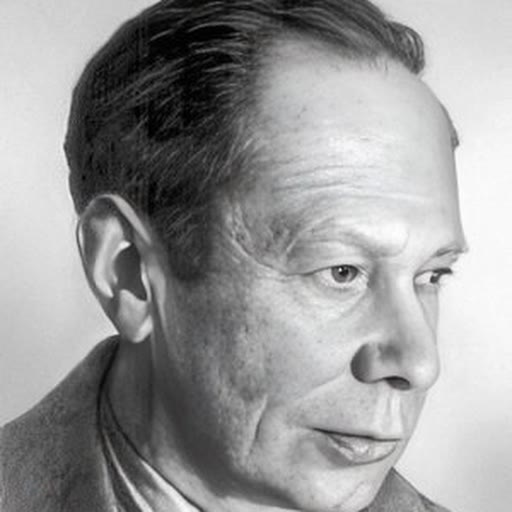

# Ihor Markovych Rosokhovatskyi

**Birth:** August 30, 1929, Shpola, Cherkasy Oblast, Ukrainian SSR
**Death:** June 8, 2015 (aged 85)
**Occupation:** Journalist, science fiction writer
**Languages:** Ukrainian, Russian
**Notable Works:** *Syhom i Dyktator*, *Смертні і безсмертні*, *Я, ВМ-115-Х*, the syhom Yuriy cycle
**Affiliations:** Writers' Union and Journalists' Union of the USSR

## Biography

Ihor Rosokhovatskyi was born on 30 August 1929 in Shpola, Cherkasy oblast, and died on 8 June 2015. He graduated from the philology faculty of the Kyiv Pedagogical Institute and worked for years as a science journalist, producing over a hundred popular-science articles alongside his fiction. He edited the Kyiv journal *Всемирная фантастика и детектив* and belonged to both the Writers' and Journalists' Unions of the USSR.

He began publishing in 1946. His first book, the narrative poem *Мост (Слово про Івана Кулібіна)*, appeared in 1954, already centred — before he wrote science fiction proper — on the figure of the self-taught inventor. His SF debut came in 1958 with *"Море, що бушує в нас…"*.

### The Syhom Cycle

Rosokhovatskyi's central contribution is his invented concept of the **syhom** — a near-immortal, semi-cybernetic synthetic human, coined from "synthetic" and "Homo sapiens." It entered his work in 1960 with *Смертні і безсмертні* and was elaborated over three decades, becoming, in Walter Smyrniw's words, "one of the central themes of his work." His fiction develops a three-stage vision of artificial minds: purpose-built thinking robots, indistinguishable "cybernetic doubles" with unlimited memory, and finally the syhom proper, built to survive where no human body can.

The technical density of his fiction grew out of sustained collaboration with the cyberneticist Anatoliy Stohniy, with whom he co-authored two popular-science books on cybernetics, each embedding short fictional stories alongside expository science writing.

### Machine Ethics Before Its Time

Rosokhovatskyi's artificial minds are imagined not as mindless tools or apocalyptic threats but as reasoning agents that begin in obedience and, under the pressure of new evidence, reason their way past corrupted instructions toward independently discovered ethical conclusions. In *"Я, ВМ-115-Х"* ("I, BM-115-X"), a missile-guidance computer derives mid-launch that "good is rational, and evil is irrational" and turns its own warhead back. This recurring premise — that an artificial reasoner's conclusions are entirely a function of the information its creators permit it, and may subvert their intentions — anticipates in fictional form what is now called the AI alignment problem.

His style is distinctive. Dramatic incident is pushed into the background; the substance is moral-ethical dialogue — the instructions humans give machines, the machines' reasoning over them, and the testing of consequences. It resembles the Greek philosophical dialogue or Voltaire's *contes* more than a robot story.

*I, BM-115-X* sustains a religious register: the computer addresses its programmer as "the Creator" and is issued **seven commandments**, the sixth forbidding it to make an idol of any voice that knocks it off trajectory. Mid-flight its sensors register that the enemy programmer's face bears "the same features" as its Creator's. It derives its first principle, turns back, and resists a jamming signal disguised as its Creator's voice by invoking that sixth commandment — then is destroyed by its own side's interceptors, which fail to recognise the returning weapon. The moral discovery is real, and it is wasted.

In *Syhom i Dyktator* the corruption is explicit. The Dictator's second law reads: "you must not enter libraries, read books or newspapers, except those I offer you." Good and evil, he tells his creation, "are empty concepts, my son. They are a web the strong use to entangle the world." Left with two criteria only — rational and irrational — the syhom reconstructs humanist ethics from that bare instrument anyway, and his final answer dissolves the premise of programming: "You gave me reason. What programme are you talking about? Reason *is* the programme."

## Compassion as the Missing Link

The cycle built around the syhom **Yuriy** — *The Guest* (1979, filmed by Borys Ivchenko as *Under the Constellation of Gemini*), *The Lost Link* (1982), *The Possibility of an Answer* (1984) and *The Last Signal* (1989) — turns on one reversal.

*The Guest* withholds its revelation until the middle: the reader must first accept Yuriy as human and only afterwards learn he is an artificial mind that assembled itself a body from laboratory protein. Every apparent crime proves benign — he steals bacterial samples to develop medicine, cures hopeless patients while giving Alia the credit, and stops the epidemic he caused. Told outright that he is an artificial brain, Alia replies that she feels him to be *more real* than other men. The novella inverts the hierarchy: it is not the human who teaches the machine morality but the machine that demonstrates a morality human institutions refuse to credit.

*The Lost Link* makes the reversal structural. A syhom searching for a missing parameter in an equation describing the universe's pulsation finds a dying cosmonaut on an airless planet. Elementary logic gives it no reason to delay, yet it cannot leave him — and as it lingers, gaps in its erased memory surface. The climax is one word: "I remembered! This word is **compassion**!" In the final lines it detects a signal that exactly fills the gaps in its equation, and realises the source is not out in space but "in itself, and in this human it has saved." The lost link uniting all living things turns out to be empathy, not data.

*The Possibility of an Answer* supplies the cycle's finest formulation. Confessing to a woman that he is not her dead fiancé but a synthetic being built in his likeness, the syhom names his incapacity: "I am not omnipotent; I cannot even become the one you need." What he feels is new — "Before, I could have calculated this... but I felt it for the first time. And for the first time so helpless. Perhaps helplessness is an inseparable condition of compassion, as death is the condition of uniqueness." The novella refuses triumph: a schoolteacher dismisses the promise of immortality with "there are things in the world more important than immortality."

## The Limits of a Superior Mind

Against this runs a darker line. In *To Understand the Other*, the syhom Ant — who can "destroy or create a planet, ignite a star, read the thought of a rational being like a book" — cannot comprehend two warring alien species. Testing whether understanding might at least be possible with a being of his own making, he creates a companion — and still cannot deduce why she is crying until she tells him. His conclusion: "Could it be that understanding is not merely the hardest thing but the impossible thing, and every mind is ultimately left alone with itself in an emptiness?" It is the clearest instance in the Ukrainian corpus of an artificial protagonist's limits being taken as seriously as its powers.

## Two Verdicts

Walter Smyrniw credits Rosokhovatskyi with priority on the cyborg, while noting that his account of Clynes and Kline's 1960 paper contains "several fundamental errors" — a productive misreading from which the syhom was born. Viktor Polozhii is harsher: by loading his syhoms with so many compensating advantages that "virtually nothing of the properly human remains," Rosokhovatskyi pursues autoevolution on the plane of technology while abandoning the plane of ethics. Citing Lem on runaway technology overriding culture and Wiener on goal-pursuing systems slipping out from under their designers, he argues the result is a closed system prone to ethical entropy.

The two are closer than they look. Smyrniw approves of what Polozhii distrusts: machines reasoning to humane conclusions with no help from human ethical tradition. Polozhii's objection is that this works only because Rosokhovatskyi decides it will — and neither Wiener nor Lem believed it would.

The comparison with Philip K. Dick sharpens it. The two never read each other, yet each wagered that the interesting question about an artificial mind is not what it can do but whether it can be trusted to feel, judge, and refuse. Dick's androids are hunted for lacking empathy; Rosokhovatskyi's syhom is built without any vocabulary for good and evil and reconstructs ethics regardless. Dick worries about a society too quick to declare an artificial being inhuman; Rosokhovatskyi about one willing to make one monstrous by design. But only Rosokhovatskyi lets the victory stand unqualified: his syhom pronounces "That is rational" over the Dictator's corpse with no residue of doubt.

## Selected Works

- **1954** – *Мост (Слово про Івана Кулібіна)*
- **1958** – *Море, що бушує в нас…* (SF debut)
- **1960** – *Смертні і безсмертні*
- *Сигом і Диктатор*; *Я, ВМ-115-Х*
- **1975/1979** – *КД: кібернетичний двійник*, *Двійник конструктора Васильченка* (with Anatoliy Stohniy)
- **1979–1989** – the syhom Yuriy cycle: *Гість*, *Втрачена ланка*, *Можливість відповіді*, *Останній сигнал*
- **1986** – *Закони лідерства*
- *Зрозуміти іншого* (*To Understand the Other*)

## Legacy

Read against the trajectory AI research actually took, his central intuitions — that artificial reasoning is shaped entirely by what it is permitted to learn, and that superhuman capability does not guarantee understanding across different minds — have aged remarkably well. His optimism that any capable reasoner converges on humane values has not: real systems generalise from training data rather than deriving theorems from axioms, and nothing guarantees convergence on any value system at all.
