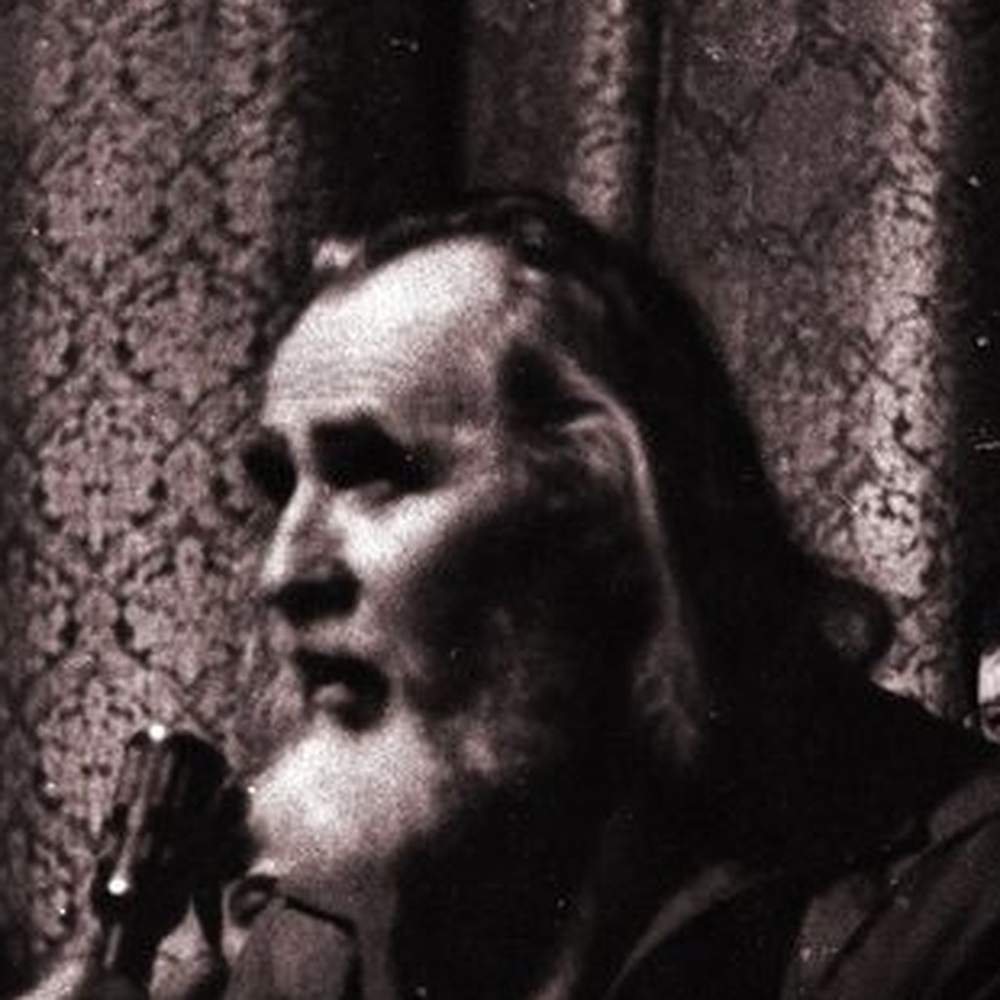

# Oles Pavlovych Berdnyk

**Birth:** 1926, Ukrainian SSR
**Death:** 2003, Ukraine
**Occupation:** Science fiction writer, dissident, mystic
**Languages:** Ukrainian
**Notable Works:** *The Star Corsair* (*Зоряний корсар*), *The Preserved Planet*, *Children of Infinity*
**Affiliations:** Union of Soviet Writers (expelled 1972–73), co-founder and later head of the Ukrainian Helsinki Group, founder of the Ukrainian Spiritual Republic

## Biography

### Early Life and War

Oles Berdnyk was born in 1926 into a dynasty of blacksmiths — "Father Pavlo — a blacksmith, grandfather Trokhym — a blacksmith, my great-grandfather — a blacksmith," as he later put it. He volunteered for the front during the Second World War and was wounded. After the war he worked at the Ivan Franko Theatre in Kyiv.

In 1949, at just twenty-two, Berdnyk publicly defended writers denounced as "cosmopolitans" at an open Party meeting and objected to the ideological rewriting of a classic Franko play. When told "Stalin is a genius!" he replied, "For some, perhaps a genius; for others, a fool." He was sentenced to ten years for "treason," survived the camps and an escape attempt, received a second term for "counter-revolutionary sabotage," and was released in 1955 after a recorded "repentance" — the first of two such episodes that would recur in his biography.

### From Techno-Optimist to Mystic

Berdnyk's early fiction was a fully orthodox product of Soviet science fiction: his 1957 novella **The Preserved Planet** (*Законсервована планета*) ends in a hymn to the "triumph of Reason," and *The Ways of the Titans* (1959) enthusiastically celebrates scientific and technological progress. But even in these years the seeds of his later turn are visible — by *Children of Infinity* (1964), the technological gadgets of his fiction recede in favor of speculation about humanity's psychic potential.

That turn became total with **The Star Corsair** (*Зоряний корсар*), written through the 1960s and published in 1971. A genuine bestseller, it caused what Oleh Shynkarenko calls "many scandals," chiefly because of its "unheard-of mystical Ukrainian nationalism." The novel imagines a cosmic civilization that has achieved everything the Soviet techno-communist utopia promised — abundance, equality, technical omnipotence — and is dying of spiritual exhaustion for it: "the spirit has fallen asleep; there is no arena of striving left for it." Its scandalous nationalist high point sends future cosmonauts to Ukraine's highest mountain, Hoverla, to seek the blessing of a statue of "Mother Ukraine" before their starflight. Berdnyk was expelled from the Writers' Union in 1972–73, and his books were destroyed.

### Dissent, Imprisonment, and Recantation

In 1976, silenced as a writer, Berdnyk addressed an open letter to Brezhnev announcing a hunger strike, framing his conflict with the state as a Manichaean "duel" between "Light" and "Darkness," and co-authored a "Memorandum of Alternative Evolution" proposing planetary "Zones of Alternative Evolution" — an ecological, pacifist, quasi-hippie commune movement fused with a doctrine of nationhood as spiritual destiny.

In November 1976 he co-founded the **Ukrainian Helsinki Group** and, after the arrest of fellow founders Mykola Rudenko and Oleksiy Tykhy, became its head. He was arrested in March 1979 and given a harsh camp sentence. Released early in 1984, he published a recantation, "Returning Home," in *Literaturna Ukraina*, claiming the Helsinki Group had been created at the direction of the CIA — an episode that dismayed his still-imprisoned colleagues and remains a debated moral stain on his record.

### Later Life

Freed by perestroika, Berdnyk founded the noospheric movement "Zoryanyi Kliuch" (*Star Key*, 1987–88) and, in December 1989, proclaimed the **Ukrainian Spiritual Republic**, a "brotherly noospheric union of Ukrainians throughout the world" that held mystical "sobors" combining meditation, art, and cosmic oratory. He ran for President of Ukraine in 1991. He died in 2003.

### Assessment

Scholar Walter Smyrniw noted that no other Soviet author dared develop the theme of man's evolution into a godlike being to the point of promoting it "publicly as a religious cult." Within Ukrainian science fiction's history, Berdnyk stands as the first writer to break decisively with the techno-communist utopia — not through rational critique, but through a counter-mythology of mystical nationalism, ecological cosmism, and prophetic self-mythology.

## Selected Works

- **1957** – *Законсервована планета* (*The Preserved Planet*)
- **1959** – *Шляхи титанів* (*The Ways of the Titans*)
- **1964** – *Діти Безмежжя* (*Children of Infinity*)
- **1971** – *Зоряний корсар* (*The Star Corsair*)
- **1976** – Open letter to Leonid Brezhnev; "Memorandum of the Initiative Council of Alternative Evolution"
- Essay – *Падіння Люцифера* (*The Fall of Lucifer*)

## Legacy

Berdnyk paid for his rupture with the techno-communist utopia with his books, his livelihood, and years of imprisonment. His fusion of ecological communalism, cosmic mysticism, and national messianism has no exact Western analogue, though it parallels — while sharply diverging from — the countercultural and New Age movements that arose independently in the West during the same decades.
