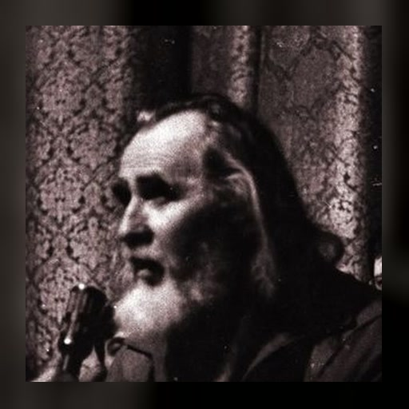

# Oles Pavlovych Berdnyk

**Birth:** 1926, Ukrainian SSR
**Death:** 2003, Ukraine
**Occupation:** Science fiction writer, dissident, mystic
**Languages:** Ukrainian
**Notable Works:** *The Star Corsair* (*Зоряний корсар*), *The Preserved Planet*, *Children of Infinity*
**Affiliations:** Union of Soviet Writers (expelled 1972–73), Ukrainian Helsinki Group, Ukrainian Spiritual Republic

## Biography

### Early Life and War

Oles Berdnyk was born in 1926 into a dynasty of blacksmiths — "Father Pavlo — a blacksmith, grandfather Trokhym — a blacksmith, my great-grandfather — a blacksmith." He volunteered for the front during the Second World War and was wounded, then worked at the Ivan Franko Theatre in Kyiv.

In 1949, at twenty-two, he defended writers denounced as "cosmopolitans" at an open Party meeting and objected to the ideological rewriting of a Franko play. When told "Stalin is a genius!" he replied, "For some, perhaps a genius; for others, a fool." He was sentenced to ten years for "treason," survived the camps and an escape attempt (the first plan involved sewing a balloon from smuggled aerostat silk), received a second term for "counter-revolutionary sabotage," and was released in 1955 after a recorded "repentance."

### From Techno-Optimist to Mystic

Berdnyk's early fiction was fully orthodox: his 1957 novella **The Preserved Planet** ends in a hymn to the "triumph of Reason," and *The Ways of the Titans* (1959) celebrates technological progress. But the seeds of the later turn are already visible — by *Children of Infinity* (1964) the gadgets recede in favour of humanity's psychic potential. External machines are being replaced by internal powers, rockets by willpower.

That turn became total with **The Star Corsair** (*Зоряний корсар*), written through the 1960s and published in 1971. A bestseller, it caused what Oleh Shynkarenko calls "many scandals," chiefly for its "unheard-of mystical Ukrainian nationalism." Its high point sends cosmonauts, in the year 2082, to Ukraine's highest mountain, Hoverla, where they find not a radio telescope but a shrine to "Mother-Ukraine — a warrior-maiden who, through the dust of centuries, had passed on into the cosmic future her living heart, her song, her will to be." Shevchenko, Lesia Ukrainka and Franko sit around her; the crew bows and asks her blessing. The future is reached not by leaving the nation behind, as Soviet internationalism required, but by carrying it. Berdnyk was expelled from the Writers' Union in 1972–73, and his books destroyed.

### Dissent, Imprisonment, and Recantation

In November 1976 he co-founded the **Ukrainian Helsinki Group** and, after the arrest of Mykola Rudenko and Oleksiy Tykhy, became its head. Arrested in March 1979, he received a harsh camp sentence. Released early in 1984, he published a recantation, "Returning Home," claiming the Group had been created at the direction of the CIA — an episode that dismayed his still-imprisoned colleagues and remains a debated moral stain.

### Later Life

Freed by perestroika, Berdnyk founded the noospheric movement "Zoryanyi Kliuch" (*Star Key*, 1987–88) and, in December 1989, proclaimed the **Ukrainian Spiritual Republic**, a "brotherly noospheric union of Ukrainians throughout the world" that held mystical "sobors" combining meditation, art, and cosmic oratory — as a political project almost contentless, its programme *was* its liturgy. He ran for President of Ukraine in 1991 and died in 2003.

## A Conservative Hippie Behind the Iron Curtain

Berdnyk's synthesis has no exact Western analogue: a local, right-wing variant of the hippie counterculture fused with cosmism, arrived at with virtually no contact with the West. On one axis, ecological communes, psychic evolution, free wandering, ascetic minimalism. He kept "a minimum of things," travelled on foot because "any transport machine alienates us from Nature," refused to own a desk ("I don't like desks or desk-chiefs," a pun aimed at bureaucracy), and admired Richard Bach and — half-jokingly — Castaneda. His 1990 programme reads as a hippie manifesto: abolition of empires, armies, prisons, executions, and money itself.

On the other axis, everything the Western counterculture embraced. Rock music was "a breakthrough of the demonic world... a narco-hypnotic resonance of the forces of anti-life"; beauty contests "a modern caravanserai where naked slave women are sold"; sex divorced from intimacy "the antipode of love, its counterfeit." Satan was a literal agent, "personified in many, in Hitler and in Stalin alike."

His self-mythology matched. Asked about a previous incarnation, he answered without hesitation: "I was a companion of Christ, His disciple. One of the twelve." The Slavs he derived from *Slovo*, the Logos: "literally, people of the Logos, children of God." Ukraine was elect: "Geographical Ukraine can be destroyed, bombed, economically strangled — but spiritual Ukraine, never."

## Inside *The Star Corsair*

The novel opens by inverting Soviet anthropology at a stroke. Where official fiction celebrated man as matter's triumphant self-organization, Berdnyk's narrator wonders: "The ancients said: the crown of nature, of creation. The flower of substance. But what if it is the opposite? Not a flower but a wound of matter? Its torment."

Its central diagnosis comes at a crisis congress of the dying civilization of Ara: "We have equalized the possibilities of all individuals. Everything is attainable. Everything exists. A mighty avalanche of technical intermediaries fulfills every trivial desire. The spirit has fallen asleep; there is no arena of striving left for it." Read in 1971 Kyiv, this is audacious — the realized technological utopia presented not as the end of history but as spiritual death. An escaped "madman," confined like the real dissidents to a psychiatric hospital, explains the failure in one image: "We folded up our wings, our immeasurable possibilities, into a casket of ancient dogmas, and used technical prostheses instead of plunging into our native cosmic element!"

The novel also contains a passage of unexpected relevance to the philosophy of artificial intelligence. Confronted with his civilization's cybernetic programme — "the apotheosis: thinking machines" — the narrator asks whether such beings could love. The reply distinguishes the simulation from the state: "The affect of love, but not love... Love is not an action but a state of all-understanding." Machines cannot achieve it, "for their knowledge is only an accumulation of parameters and constants." It is a 1971 formulation of what analytic philosophy would later debate as the problem of functional duplicates — and it sits opposite Volodymyr Savchenko's informationalist answer in *Self-Discovery* (1967), that "a human being is, above all, information." Berdnyk adds a twist: "Thinking machines are no exception. The time will come when they themselves will step onto the path you neglect."

The book ends not in argument but in liturgy. The insurgent Horior unmasks the demonic ruler Ariman — "You are no longer a man. YOU ARE ANTI-MAN! HOMO SATANIS!" — then preaches a rewritten Sermon on the Mount: "Men were told: thou shalt not kill! And I say: become immortal... Men were assured: resist not evil! And I call out: burn to ash the accursed world where evil has built its thousand-year nest." The form is Christ's; the content is antinomian insurrection. This is the structure of Berdnyk's revolt: not a critique of materialism but a **counter-revelation**, in which the Soviet order figures as the kingdom of darkness.

## The 1976 Documents

The open letter to Brezhnev announcing a hunger strike is documentary in its facts — "My books have been destroyed exactly as the Hitlerites did it in Germany in 1933. I have become a beggar" — and apocalyptic in its frame: "In the name of LIGHT I challenge the forces of DARKNESS to a duel... I can be killed, declared insane, repressed. All these paths are the defeat of DARKNESS!" Crucially, it does not renounce communism; it re-mystifies it. Berdnyk still speaks of building "a communist reality unprecedented on the planet." The utopian energy survives intact; only the metaphysics is swapped — matter for spirit, the Party for "Pre-eternal Life."

The Memorandum of Alternative Evolution declares nature itself diseased: "the notorious ecological balance is a balance of mutual devouring, a cosmic disease of World Life." Its remedy is a planetary network of reservations breeding a non-predatory biosphere, alongside a doctrine of "Spiritual or Cosmic Nations." A month earlier he had co-founded the Helsinki Group, and the friction with its legalist wing was mutual: Levko Lukianenko kept trying to bring him down to earth — "Oh, what cloud-borne things."

## Assessment

Walter Smyrniw noted that no other Soviet author dared develop the theme of man's evolution into a godlike being to the point of promoting it "publicly as a religious cult." Berdnyk was the first Ukrainian science-fiction writer to say in print that the techno-communist utopia was spiritually bankrupt, and he paid for it with his books, his livelihood, and years in the camps.

But the *direction* of the rupture defines its limits. Confronting a rationalist ideology that had failed, he did not radicalise rationality against it; he abandoned it for counter-myth. What his position lacks is a method for being wrong. This also illuminates the recantations of 1955 and 1984. A legalist dissident defends a *position*; a prophet bears a *mission*, and a mission can justify tactical surrender. In a cosmos where "for LIGHT there is no death," a forced confession is one more scene in a drama rather than a refutation. Mystical rebellion is heroic, but unlike rational dissent it is unfalsifiable even by its own collapse.

He is the exact counter-case to Volodymyr Savchenko: two contemporaries, one rupture, two opposite exits. Savchenko's leads toward information theory and the philosophy of mind. Berdnyk's leads toward the New Age and national messianism — energies that burned brightly against totalitarian pressure and dissipated without it. His mysticism "formed a certain pair" with the system it opposed: from today's vantage it "looks like a vivid dissident happening, but nothing more."

## Selected Works

- **1957** – *Законсервована планета* (*The Preserved Planet*)
- **1959** – *Шляхи титанів* (*The Ways of the Titans*)
- **1964** – *Діти Безмежжя* (*Children of Infinity*)
- **1971** – *Зоряний корсар* (*The Star Corsair*)
- **1976** – Open letter to Leonid Brezhnev; "Memorandum of the Initiative Council of Alternative Evolution"
- Essay – *Падіння Люцифера* (*The Fall of Lucifer*)

## Legacy

His fusion of ecological communalism, cosmic mysticism, and national messianism parallels — while sharply diverging from — the countercultural and New Age movements that arose independently in the West.
