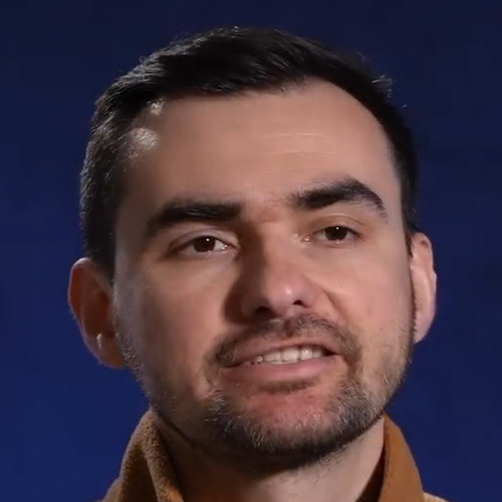

# Pavlo Ostrikov

*Photo: Суспільне Хмельницький, [CC BY 4.0](https://creativecommons.org/licenses/by/4.0), via Wikimedia Commons.*

**Birth:** July 13, 1990, Krasyliv, Ukraine
**Occupation:** Screenwriter, film director
**Languages:** Ukrainian
**Notable Works:** *U Are the Universe* (2024)
**Based in:** Kyiv

## Biography

Pavlo Ostrikov was born on 13 July 1990 in Krasyliv, Ukraine. He studied law at the National Aviation University in Kyiv, graduating in 2012 with a master's degree in jurisprudence. The idea that would eventually become his debut feature film first took shape while he was still a law student: in 2011 he wrote and performed a short play, *Cosmos*, about the last person alive in space after the destruction of Earth.

### *U Are the Universe*

Ostrikov spent seven years bringing that concept to the screen as **U Are the Universe** (2024), a Ukrainian-Belgian science-fiction romance and his directorial debut, made despite producers' skepticism, the politics of Ukrainian state cinema funding, the COVID-19 pandemic, the full-scale Russian invasion of Ukraine, and chronic lack of money. The film follows Andriy Melnyk, a Ukrainian space trucker transporting nuclear waste away from Earth alongside a joke-telling robot companion, who must find meaning and connection after Earth is suddenly destroyed and he makes contact with a distant, isolated astronaut.

The film premiered at the Toronto International Film Festival and went on to screen at Locarno, Tampere, Palm Springs, Black Nights (Tallinn), Brussels, and other major festivals; Ostrikov has been a nominee and member of the European Film Academy and a member and winner of the Ukrainian Film Academy.

### A Metamodern Sensibility

Scholarly analysis of *U Are the Universe* situates the film within **metamodernism** — the early twenty-first-century sensibility that oscillates between modernist sincerity and postmodern irony rather than settling into either. The film's humor and its catastrophe never cancel each other out: jokes, improvised rituals, and pop songs coexist with an absolute, irreversible loss, so that meaning is not treated as a stable truth but as something fragile, chosen, and continually re-performed even after the conditions that once sustained it have disappeared.

## Filmography

- **2011** – *Cosmos* (short play)
- **2024** – *U Are the Universe* (writer, director)

## Legacy

As Ukraine's newest addition to a century-long national tradition of science fiction, Ostrikov represents a decisive break from the genre's earlier ideological currents — Soviet techno-communist utopianism, dissident mysticism, postmodern conspiracy — toward a metamodern register in which sincerity and irony, hope and catastrophe, are held in permanent, unresolved tension.
