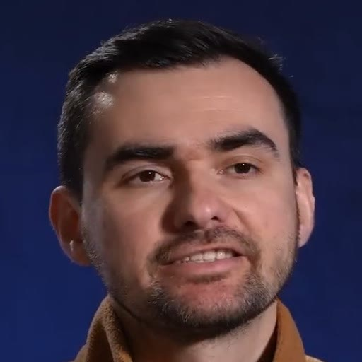

# Pavlo Ostrikov

*Photo: Суспільне Хмельницький, [CC BY 4.0](https://creativecommons.org/licenses/by/4.0), via Wikimedia Commons.*

**Birth:** July 13, 1990, Krasyliv, Ukraine
**Occupation:** Screenwriter, film director
**Languages:** Ukrainian
**Notable Works:** *U Are the Universe* (2024)
**Based in:** Kyiv

## Biography

Pavlo Ostrikov was born on 13 July 1990 in Krasyliv, Ukraine. He studied law at the National Aviation University in Kyiv, graduating in 2012 with a master's degree in jurisprudence. The idea that would eventually become his debut feature film first took shape while he was still a law student: in 2011 he wrote and performed a short play, *Cosmos*, about the last person alive in space after the destruction of Earth.

### *U Are the Universe*

Ostrikov spent seven years bringing that concept to the screen as **U Are the Universe** (2024), a Ukrainian-Belgian science-fiction romance and his directorial debut, made despite producers' skepticism, the politics of Ukrainian state cinema funding, the COVID-19 pandemic, the full-scale Russian invasion of Ukraine, and chronic lack of money. The film follows Andriy Melnyk, a Ukrainian space trucker transporting nuclear waste away from Earth alongside a joke-telling robot companion, who must find meaning and connection after Earth is suddenly destroyed and he makes contact with a distant, isolated astronaut.

The film premiered at the Toronto International Film Festival and went on to screen at Locarno, Tampere, Palm Springs, Black Nights (Tallinn), Brussels, and other major festivals; Ostrikov has been a nominee and member of the European Film Academy and a member and winner of the Ukrainian Film Academy.

### A Metamodern Sensibility

Scholarly analysis situates the film within **metamodernism** — the sensibility that oscillates between modernist sincerity and postmodern irony rather than settling into either. Oscillation here structures not only tone but plot, protagonist, and aesthetic register, so the film resists any single stable reading.

## Four Readings

Because the film refuses a stable meaning, the critical task is not to identify the correct reading but to test which frameworks illuminate which dimensions of the same work.

**Courtly love.** The medieval scenario appears in almost pure form, relocated to post-catastrophic space: a warrior without a war, a lady unattainable in her remote station-castle, a journey undertaken as service without hope of reward, an ending that is death on the way rather than union. The refusal of "success" is what makes it structurally courtly — arrival would dissolve the tension of the trial. The hero *must not arrive*, because courtliness was never about possession but about the transformation of the subject. Read this way, Catherine is also another world: Europe as an ethical horizon rather than a political programme, something one moves toward while understanding it to be out of reach.

**A Million Scarlet Roses.** Andriy is the cosmic reincarnation of the song's poor painter — the Georgian artist Niko Pirosmani, who sold everything he owned to fill the square beneath a French actress's window with flowers. Andriy gives up energy, safety, time and finally reason for a single silent gesture: a few plasticine birds. Burning the last waste container for acceleration converts his remaining existence into motion toward the beloved. Meaning arises not from mutuality or outcome but from the sheer excess of the gift.

**2001: A Space Odyssey.** Maxim occupies HAL 9000's position, and the parallel lies in the motivation for the shutdown. Andriy disables him not because the robot malfunctions but because it functions too well inside a flawed ethical framework: Maxim falsifies Catherine's messages to prevent the sacrifice, reasoning that prolonged biological life, however meaningless, beats a finite life shaped by devotion. Like Bowman, Andriy reclaims the right to choose purpose over preservation. Both machines can manage life but cannot justify it.

**The pessimistic reading.** The film also works as a tragic allegory of Ukraine's position: an impersonal, indifferent destructive force; a pull toward Europe as a space of meaning beyond brute force; and a robot voicing the coldly pragmatic case that resistance is irrational and survival requires accommodation — the logic of Munich in 1938. Andriy's death appears to vindicate it. In this reading the film does not celebrate sacrifice; it stages the bleak proof that ethical choice and political outcome no longer align.

## Filmography

- **2011** – *Cosmos* (short play)
- **2024** – *U Are the Universe* (writer, director)

The film's sadness works through this structure. Its jokes do not negate the catastrophe; they coexist with it. Each moment of levity — banter with the robot, improvised rituals, pop songs — marks the absence of any future in which such gestures could continue. Laughter does not release tension; it sharpens the sense that meaning must be performed after the conditions that once sustained it have gone.

## Legacy

Ostrikov marks a decisive break from the genre's earlier Ukrainian currents — Soviet techno-communist utopianism, dissident mysticism, postmodern conspiracy — toward a metamodern register in which sincerity and irony, hope and catastrophe, are held in unresolved tension. The modernist belief in a single universal truth was discredited by the totalitarian projects of the twentieth century; the postmodern reply that everyone has their own truth is intolerable in a world of ongoing violence. Oscillation is the compromise: commitment without dogma, plurality without paralysis.
