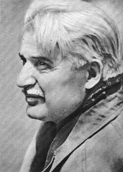

# Василь Павлович Бережній

## Біографія

**Василь Павлович Бережній** (26 червня 1918 — 19 березня 1988) — український письменник, журналіст і перекладач, найбільш відомий своїм внеском у науково-фантастичну літературу. Його твори виходили великими накладами й були перекладені багатьма мовами, здобувши авторові визнання в Україні та за кордоном.

### Дитинство і освіта

Василь Бережній народився в селі Бахмач Чернігівської області в селянській родині. Змалку виявляв інтерес до літератури та журналістики. Після загальної школи вступив до **Українського технікуму журналістики** в Харкові, який закінчив 1937 року. Під час навчання відвідав обсерваторію — це враження виявилося настільки сильним, що надихнуло його на перше науково-фантастичне оповідання *«Планета житиме»* (*Планета житиме*), опубліковане 1938 року.

### Журналістика і воєнні роки

Після технікуму Бережній працював журналістом у газетах *«Прапор комуни»* (*Прапор комуни*) у Бахмачі та *«Молодий комунар»* (*Молодий комунар*) у Чернігові. Кар'єру перервала Друга світова війна: він служив у танкових частинах Радянської армії, брав участь у боях під **Гродно і Барановичами**, а потім відступав через **Вязьму**, де дістав важке поранення. У 1943 році повернувся на фронт, воював на **1-му Білоруському фронті** та був відзначений численними бойовими нагородами.

### Повоєнна літературна діяльність

Після війни Бережній відновив журналістську роботу в Києві, друкуючись у газеті *«Молодь України»* (*Молодь України*) та журналах *«Дніпро»* (*Дніпро*), *«Вітчизна»* (*Вітчизна*) і *«Україна»* (*Україна*). Паралельно здобував вищу освіту — 1952 року закінчив **Київський національний університет імені Тараса Шевченка**. У цей період він писав нариси, оповідання й літературно-критичні статті, поступово переходячи до великих прозових форм.

### Наукова фантастика і найвідоміші твори

Бережній насамперед відомий своїм внеском в **українську наукову фантастику**. Його перший науково-фантастичний роман *«У зоряні світи»* (*У зоряні світи*) вийшов 1956 року накладом **65 000 примірників**, а 1958 року перевидано тиражем **100 000 примірників**. Твори Бережнього здобули широку популярність, і він став одним із провідних представників цього жанру.

Загалом письменник опублікував понад **п'ятнадцять науково-фантастичних романів** і **більш як п'ятдесят оповідань**, зібраних у **десяти збірках**. Його книжки перекладено **англійською, угорською, іспанською, латиською, молдовською, польською, російською, словацькою та французькою** мовами.

### Вибрана бібліографія

#### Романи

- **1956** – *У зоряні світи* (*To the Starry Worlds*)
- **1961** – *Блакитна планета* (*The Blue Planet*)
- **1963** – *Дем'янко Дерев'янко, або Пригоди електронного хлопчика* (*Demyanko Derevyanko, or the Adventures of the Electronic Boy*)
- **1965** – *Істина поруч* (*The Truth is Near*)
- **1970** – *Археоскрипт* (*Archeoscript*)
- **1971** – *Під крижаним щитом* (*Under the Ice Shield*)
- **1971** – *Сакура* (*Sakura*)
- **1975** – *Молодший брат Сонця* (*The Younger Brother of the Sun*)
- **1978** – *Космічний Гольфстрім* (*Cosmic Gulf Stream*)
- **1984** – *Лабіринт* (*Labyrinth*)

#### Збірки

- **1960** – *Оаза в льодах* (*Oasis in the Ice*)
- **1962** – *В небі — Земля* (*In the Sky — Earth*)
- **1970** – *У промінні двох сонць* (*In the Light of Two Suns*)
- **1971** – *Під крижаним щитом* (*Under the Ice Shield*)
- **1975** – *Повітряна лінза* (*The Air Lens*)
- **1978** – *Повернення «Галактики»* (*Returning "Galaxy"*)
- **1980** – *Космічний Гольфстрім* (*Cosmic Gulf Stream*)
- **1984** – *А до нас кит приплив* (*And a Whale Came to Us*)
- **1986** – *Лабіринт* (*Labyrinth*)

#### Оповідання

- **1938** – *Планета житиме* (*The Planet Will Live*)
- **1958** – *Чого не побачило скляне око* (*What the Glass Eye Didn't See*)
- **1959** – *Повернення «Галактики»* (*Returning "Galaxy"*)
- **1960** – *Оаза в льодах* (*Oasis in the Ice*)
- **1962** – *Таємнича статуя* (*The Mysterious Statue*)
- **1963** – *Останній рейс «Бурана»* (*The Last Flight of "Buran"*)
- **1970** – *Ефемерида кохання* (*The Ephemeris of Love*)
- **1971** – *Космічна Ніагара* (*Cosmic Niagara*)
- **1971** – *Контакт цивілізацій* (*Contact of Civilizations*)
- **1975** – *Таємниця Дому вічності* (*The Secret of the House of Eternity*)
- **1980** – *Homo Novus* (*Homo Novus*)
- **1986** – *Людина-маятник* (*The Pendulum Man*)
- **1986** – *Формула Космосу* (*The Formula of the Cosmos*)

### Перекладацька діяльність

Окрім власної творчості, Бережній перекладав **російські романи й п'єси** українською мовою, зокрема твори **А. Коптєлова, М. Погодіна та А. Софронова**. Також написав літературний портрет *«Олесь Гончар»* (1978).

### Міжнародне визнання і спадщина

Бережній **активно брав участь у міжнародних заходах науково-фантастичної спільноти**, зокрема:

- **1970** – Перший Всесвітній симпозіум письменників-фантастів у **Токіо, Японія**, у рамках EXPO-70
- **1976** – Третій Європейський конгрес письменників-фантастів у **Польщі**

Його внесок у літературу вплинув на ціле покоління українських читачів і письменників. На вшанування пам'яті Бережнього 2015 року в **Бахмачі Чернігівської області** одну з вулиць міста названо його іменем.

### Особисте життя

Більшу частину свого життя Бережній прожив у Києві. Його дружина — **Любов Флоріанівна Бережня**, лікарка. Подружжя виховало двох дітей: **Андрія Васильовича Бережнього** та **Оксану Василівну Бережню**. Онуки письменника — **Василь Андрійович Бережній, Ольга Андріївна Бережня та Юлія Андріївна Бережня**.

### Смерть

Василь Бережній пішов з життя **19 березня 1988 року** в Києві, залишивши по собі вагому літературну спадщину в **українській науковій фантастиці**.
