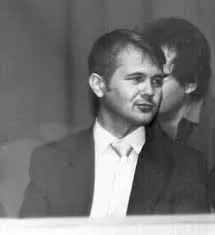

# Володимир Аполлінарійович Заєць

**Народився:** 9 вересня 1949 р., Велика Бугаївка, Васильківський район, Київська область, Українська РСР  
**Помер:** 20 грудня 2002 р., Ємен  
**Рід занять:** Письменник-фантаст, редактор, перекладач, педіатр  
**Мови:** Українська, Російська  
**Псевдоніми:** Велд Черноуз, Владімір Черноза  
**Визначні твори:** *Машина забуття*, *Темпонавти*, *Місто, якого не було*, *Тяжкі тіні*  
**Членство:** Член Спілки радянських письменників (1987), член Ради Українського клубу шанувальників наукової фантастики  

## Біографія

### Дитинство і освіта  
Володимир Заєць народився в родині службовців у **Великій Бугаївці Васильківського району Київської області**. Обрав медичну спеціальність і 1972 року закінчив **Київський медичний інститут** за фахом **педіатра**. Після завершення навчання працював **педіатром** у Вишгородській швидкій медичній допомозі.

### Літературна кар'єра  
Літературний шлях Зайця розпочався з **гумористичного оповідання**, надісланого до сатиричного журналу *Перець* у **1972 році**. Перший науково-фантастичний твір — *Були старого космогатора* (1978) — відкрив **гумористичний космічний пригодницький цикл** про Антонія Ендотелія, мандрівника й оповідача з космосу.

Упродовж кар'єри він писав **українською й російською мовами**, публікуючись в **українських журналах** (*Перець*, *Дніпро*, *Ранок*) і **ленінградському журналі «Аврора»**. Активно брав участь у житті української фантастичної спільноти та у **знаменитому малєєвському семінарі наукової фантастики**.

У **1991 році** Заєць став **головним редактором журналу «Флінт»**, що вийшов лише одним числом. Під час **розпаду Радянського Союзу** він упорядкував **антологію української наукової фантастики «Земля не обетованная» («Земля не обіцяна»)**, яка так і не вийшла друком.

### Останні роки і загадкова смерть  
Наприкінці **1990-х** Заєць переїхав до **Ємену**, де працював **педіатром за контрактом**. Він загинув за **загадкових обставин** **20 грудня 2002 року**. **Офіційною причиною смерті** назвали **отруєння метанолом**, однак виникли підозри, що його навмисно отруїли, аби ухилитися від виплати за контрактом. Спочатку письменника поховали в Ємені, і його **дружина Людмила Ткач** місяцями домагалася повернення тіла на батьківщину. Врешті-решт у **березні 2003 року** його перепоховали в **Києві**.

Його син, який теж став лікарем, **понад 25 років тому емігрував до Сполучених Штатів**. Пізніше туди виїхала й Людмила, і нині жодних контактів із ними немає.

---

## Літературні твори  

### Книги  
- **1984** – *Машина забуття* (*The Machine of Oblivion*)  
- **1986** – *Темпонавти* (*Temponauts*)  

### Повісті  
- **1985** – *Город, которого не было* (*Місто, якого не було*)  
- **1987** – *Земля не обетованная* (*Земля не обіцяна*)  
- **1990** – *Гипсовая судорога* (*Гіпсова судома*)  
- **1991** – *Тяжелые тени* (*Тяжкі тіні*)  

### Оповідання  
- **1973** – *Для профилактики* (*Для профілактики*)  
- **1974** – *Философ* (*Філософ*)  
- **1974** – *Свидание* (*Побачення*)  
- **1975** – *Интуиция* (*Інтуїція*)  
- **1975** – *Пошутил* (*Пожартував*)  
- **1978–1991** – *Цикл «Були старого космогатора»*  
- **1980** – *Дед Патратий* (*Дід Патратій*)  
- **1981** – *Темпонавты – так их назовут* (*Темпонавти — так їх назвуть*)  
- **1986** – *И будет день новый...* (*І буде день новий...*)  
- **1988** – *Побег* (*Втеча*)  
- **1989** – *Некоторые аспекты современного ведьмоведения* (*Деякі аспекти сучасного відьмознавства*)  
- **1990** – *Эффект фараона* (*Ефект фараона*)  

### Антології наукової фантастики  
- **1990** – *Пригоди, подорожі, фантастика-90* — **упорядник**  

### Фільмографія  
- **1984** – *Зустріч* — **сценарій мультиплікаційного фільму** (*Київнаучфільм, СРСР*)  

---

## Бібліографія  

### Визначні збірки  
- **1991** – *Тяжелые тени: Фантастическая повесть, рассказы* (*Тяжкі тіні: фантастична повість та оповідання*)  
- **2012** – *Були старого космогатора*  

### Публікації в пресі  
- **1978** – *Фантастика-78* — оповідання: *Були старого космогатора*  
- **1983** – *Фантастика-83* — оповідання: *Темпонавти — так їх назвуть*  
- **1987** – *Молодь* — повість: *Земля не обетованная*  
- **1990** – *Молодая гвардия* — повість: *Гипсовая судорога*  
- **1991** – *Флінт* — оповідання: *Марсіанський сувенір*  

### Переклади та редакційна робота  
- **1991** – Переклад роману Джеймса Хедлі Чейза «Міс Шумвей і чарівна паличка»  
- **1991** – Редактор журналу *Soviet Literature* — *Temponauts* (перекладено **англійською**)  
- **1983** – *Dražba na planetě Gij: Fantastika 83* — *Příběhy starého kosmogátora* (перекладено **чеською**)  

---

## Спадщина  
Володимир Заєць був помітною постаттю в **українській і радянській науковій фантастиці**, відомою своїм **іронічним і сатиричним стилем** та **глибоким інтересом до спекулятивної прози**. Його твори досліджували **людську природу, освоєння космосу та етичні дилеми науки**. Попри **трагічні й загадкові обставини смерті**, його літературний доробок залишається **значною частиною українсько-російської фантастичної спадщини**.
