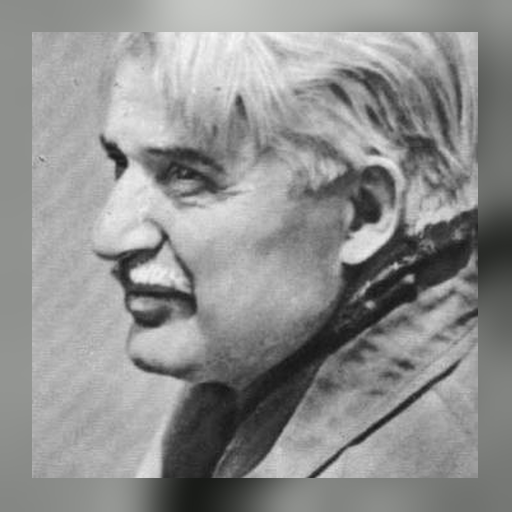

# Vasyl Pavlovych Berezhnyi

## Biography

**Vasyl Pavlovych Berezhnyi** (June 26, 1918 – March 19, 1988) was a Ukrainian writer, journalist, and translator, best known for his contributions to science fiction literature. His works were widely published and translated into multiple languages, earning him recognition both in Ukraine and abroad.

### Early Life and Education

Born in the village of Bakhmach, Chernihiv Oblast, into a peasant family, Berezhnyi showed an early interest in literature and journalism. After completing his general education, he enrolled in the **Ukrainian Technical School of Journalism** in Kharkiv, graduating in 1937. During his time in Kharkiv, he visited an observatory, an experience that left a profound impression on him and inspired his first science fiction story, *"The Planet Will Live"* (*Планета житиме*), published in 1938.

### Journalism and Wartime Experience

After completing his studies, Berezhnyi worked as a journalist for the newspapers *"Prapor Komuny"* (*Прапор комуни*) in Bakhmach and *"Molodyi Komunar"* (*Молодий комунар*) in Chernihiv. His career was interrupted by World War II, during which he served in the tank forces of the Soviet Army. He fought in the battles of **Grodno and Baranovichi**, later retreating through **Vyazma**, where he was severely wounded. Returning to the battlefield in 1943, he served on the **First Belarusian Front** and was awarded multiple military honors.

### Postwar Literary Career

After the war, Berezhnyi resumed his work as a journalist in Kyiv, contributing to newspapers such as *"Molod Ukrainy"* (*Молодь України*), and magazines including *"Dnipro"* (*Дніпро*), *"Vitchyzna"* (*Вітчизна*), and *"Ukraina"* (*Україна*). He also pursued higher education, graduating from **Taras Shevchenko National University of Kyiv** in 1952. During this period, he began writing essays, short stories, and literary critiques before transitioning to longer forms.

### Science Fiction and Notable Works

Berezhnyi is best known for his contributions to **Ukrainian science fiction**. His first science fiction novel, *"To the Starry Worlds"* (*У зоряні світи*), was published in 1956 with a print run of **65,000 copies**, followed by a reprint of **100,000 copies** in 1958. His works gained widespread popularity, and he became a leading figure in the genre.

Berezhnyi published over **fifteen science fiction novels** and **more than fifty short stories**, many of which were compiled into **ten collections**. His works were translated into numerous languages, including **English, Hungarian, Spanish, Latvian, Moldovan, Polish, Russian, Slovak, and French**.

### Selected Works

#### Novels

- **1956** – *To the Starry Worlds* (*У зоряні світи*)
- **1961** – *The Blue Planet* (*Блакитна планета*)
- **1963** – *Demyanko Derevyanko, or the Adventures of the Electronic Boy* (*Дем’янко Дерев’янко, або Пригоди електронного хлопчика*)
- **1965** – *The Truth is Near* (*Істина поруч*)
- **1970** – *Archeoscript* (*Археоскрипт*)
- **1971** – *Under the Ice Shield* (*Під крижаним щитом*)
- **1971** – *Sakura* (*Сакура*)
- **1975** – *The Younger Brother of the Sun* (*Молодший брат Сонця*)
- **1978** – *Cosmic Gulf Stream* (*Космічний Гольфстрім*)
- **1984** – *Labyrinth* (*Лабіринт*)

#### Collections

- **1960** – *Oasis in the Ice* (*Оаза в льодах*)
- **1962** – *In the Sky – Earth* (*В небі – Земля*)
- **1970** – *In the Light of Two Suns* (*У промінні двох сонць*)
- **1971** – *Under the Ice Shield* (*Під крижаним щитом*)
- **1975** – *The Air Lens* (*Повітряна лінза*)
- **1978** – *Returning "Galaxy"* (*Повернення «Галактики»*)
- **1980** – *Cosmic Gulf Stream* (*Космічний Гольфстрім*)
- **1984** – *And a Whale Came to Us* (*А до нас кит приплив*)
- **1986** – *Labyrinth* (*Лабіринт*)

#### Short Stories

- **1938** – *The Planet Will Live* (*Планета житиме*)
- **1958** – *What the Glass Eye Didn’t See* (*Чого не побачило скляне око*)
- **1959** – *Returning "Galaxy"* (*Повернення «Галактики»*)
- **1960** – *Oasis in the Ice* (*Оаза в льодах*)
- **1962** – *The Mysterious Statue* (*Таємнича статуя*)
- **1963** – *The Last Flight of "Buran"* (*Останній рейс «Бурана»*)
- **1970** – *The Ephemeris of Love* (*Ефемерида кохання*)
- **1971** – *Cosmic Niagara* (*Космічна Ніагара*)
- **1971** – *Contact of Civilizations* (*Контакт цивілізацій*)
- **1975** – *The Secret of the House of Eternity* (*Таємниця Дому вічності*)
- **1980** – *Homo Novus* (*Homo Novus*)
- **1986** – *The Pendulum Man* (*Людина-маятник*)
- **1986** – *The Formula of the Cosmos* (*Формула Космосу*)

### Translations and Contributions

In addition to his original works, Berezhnyi translated **Russian novels and plays** into Ukrainian, including works by **A. Koptyelov, M. Pogodin, and A. Sofronov**. He also authored the literary portrait *"Oles Honchar"* in 1978.

### International Recognition and Legacy

Berezhnyi was an **active participant in international science fiction events**, including:

- **1970** – First World Symposium of Science Fiction Writers in **Tokyo, Japan**, as part of EXPO-70
- **1976** – Third European Congress of Science Fiction Writers in **Poland**

His contributions to science fiction literature influenced an entire generation of Ukrainian readers and writers. In recognition of his legacy, a street in **Bakhmach, Chernihiv Oblast**, was named after him in **2015**.

### Personal Life

Berezhnyi lived in Kyiv for most of his life. He was married to **Liubov Florianivna Berezhna**, a doctor. They had two children: **Andriy Vasylovych Berezhnyi** and **Oksana Vasylivna Berezhna**. His grandchildren include **Vasyl Andriyovych Berezhnyi, Olha Andriivna Berezhna, and Yuliia Andriivna Berezhna**.

### Death

Vasyl Berezhnyi passed away on **March 19, 1988**, in Kyiv, leaving behind a lasting literary legacy in **Ukrainian science fiction**.

## From Techno-Communism to Postmodern Irony

Berezhnyi's seventy years (1918–1988) spanned revolutionary fervour, wartime trauma, Stalinist repression, the Khrushchev space age, and Brezhnev-era decay. His fiction tracks that whole arc, and it does so along a line that runs strikingly parallel to the history of positivism itself: from confidence that science would deliver happiness, through doubt, to the ironic relativism of the 1980s. Two books mark the poles — the 1956 novel *To the Starry Worlds*, naive and doctrinaire, and the 1986 collection *Labyrinth*, whose story *The Formula of the Cosmos* buries the earlier dream without ceremony.

His work remains barely studied. Oksana Tykhovska, one of only two scholars to devote an article to him, notes that there is "not a single literary study" of Berezhnyi — despite mass print runs and translations across Europe.

### 1956: The Moon as Ideological Stage

*To the Starry Worlds* appeared a year before Sputnik and sold out a first run of 65,000; the publisher raised the second printing to 100,000, which sold out too. Its characters do not converse so much as issue editorials, a habit carried over from Berezhnyi's decade of party journalism: "Only a great, highly organized collective — such as modern humanity — can take the step into space! ... We want to make the Moon a stronghold of advanced science, not a military base, as the magnates of imperialism are planning!"

The novel's ideological centre is a staged confrontation on the lunar surface between the Soviet professor Pluhar and Dick, representative of the firm "Atomik-Welt," who announces that "this territory, and everything on it, under it, and above it" belongs to his company — "we have documents!" Pluhar's reply is dry: "Perhaps your firms are selling the stars of the Milky Way wholesale and retail?" Dick dreams of an atomic catapult — "whoever holds the Moon, holds the Earth!" — and of a villa, a yacht, and "elegant women, ready for fun." He even twists the Manifesto into consumerism: "The proletariat has nothing to lose, but it can gain everything. *Gain!*" The Soviet Zahorskyi answers with a Latin tag: "your philosophy is that of a wolf. *Homo homini lupus est* — that's your creed."

This is not a debate but a political performance, and its most revealing feature is what Berezhnyi cannot imagine: that anyone outside the USSR might feel curiosity, or the thrill of exploration. The only motive he grants foreigners is enrichment.

### Performative Conformity

Berezhnyi's commitment was not, however, naive. He lived through the postwar Zhdanovshchina, when writers were disciplined through public self-criticism and coerced denunciation. A letter to Oles Honchar dated 29 August 1946 records his private verdict on one such gathering: "The meeting dragged on for a long time and was terribly boring. So many intrigues! So much political opportunism and speculation! So much pettiness and foolishness! All of it kept flying into my head — until it was buzzing. Of course, there were some good, serious, profound speeches. But there were very few of those." He knew, in other words, what the rhetoric of progress and collective achievement was concealing.

A second disillusionment was geopolitical. Soviet science fiction had imagined the Moon as a stage for confrontation between systems — cosmonauts debating philosophy with their Western counterparts. A 1963 Soviet song promised that "even our enemies have long been convinced" the USSR would get there first, addressing the Moon as a lover "long in love with Soviet people." What happened instead was that Americans stood alone in the Sea of Tranquility, speaking only to Houston. The stage Berezhnyi had written for never existed.

### The Evolution of a Joke

The change is easiest to see in his humour. In 1956 it is affectionate and situational: exploring an alien ruin, a daughter scolds her father — "Ah, Dad, why didn't you bring the vacuum cleaner from home!" A bureaucrat filling out travel papers writes "Space rocket" in the field marked *Type of transport*. The satire is gentle, still in love with the cosmic dream.

Thirty years later the jokes have turned. An astrophysicist mentions his plutonium-powered heart stimulator; his companion edges away from the table, and he reassures her that "it's not the plutonium used in the bomb dropped on Nagasaki. That was plutonium-239; I only have a little plutonium-238." What had been the emblem of Soviet progress now produces flinching. Told of a cosmic discovery, the same woman asks only whether it might have paid.

### The Lost Formula

*The Formula of the Cosmos* is set in a 1980s Kyiv whose streets still carry the names of Marx, Lenin, and Pushkin, now hollow. Kyrylo Fedotovych, a retired astrophysicist, queues for cheaper herring and mocks himself for still caring about cosmic mysteries — "*Комедія, та й годі*" ("A farce, nothing more"). He learns that a dead colleague's final manuscript, possibly containing a unifying formula of the universe, has been used by the widow to wrap fish and as toilet paper. "Those formulas killed him," she says, and she agrees to hand over what remains only once told it might fetch money — a detail that would have been unthinkable in 1956, and which quietly concedes that money mattered inside the USSR too.

Kyrylo dies when the widow accidentally triggers his cardio-stimulator. The manuscript is not the casualty of malice but of indifference: "The folder flew to the side, opened, and the wind instantly scattered the white sheets, throwing them above the rooftops, and they disappeared into the heights." Nobody thinks to stop it. Berezhnyi does not rage; he simply lets the fading happen. The tragedy is not that the scientist was wrong but that the world stopped caring what he represented.

Even the covers register the shift. The 1956 novel came from *Molod* — formerly *Young Bolshevik* — with weightless cosmonauts against a clean celestial field. *Labyrinth* came in 1986 from *Radiansky Pysmennyk*, its cover a maze of surreal architecture and a fragmented figure. That such an ideologically corrosive story could be published at all, five years before the USSR collapsed, suggests the censors had themselves stopped believing in the purpose of their work.

### Assessment

Berezhnyi's trajectory is emblematic of Ukrainian science fiction as a whole, which began by glorifying the positivist ideals of techno-communism and ended in disillusionment with technological progress — the same path travelled by positivism itself. By the late twentieth century science was no longer a religion promising happiness but a tool whose benefit or harm depended on who controlled it. Had the USSR collapsed sooner, Berezhnyi's postmodern turn might have coincided with parallel movements in free literatures. That he made the turn at all, and late, under censorship, shows how sharply he read the world around him.
