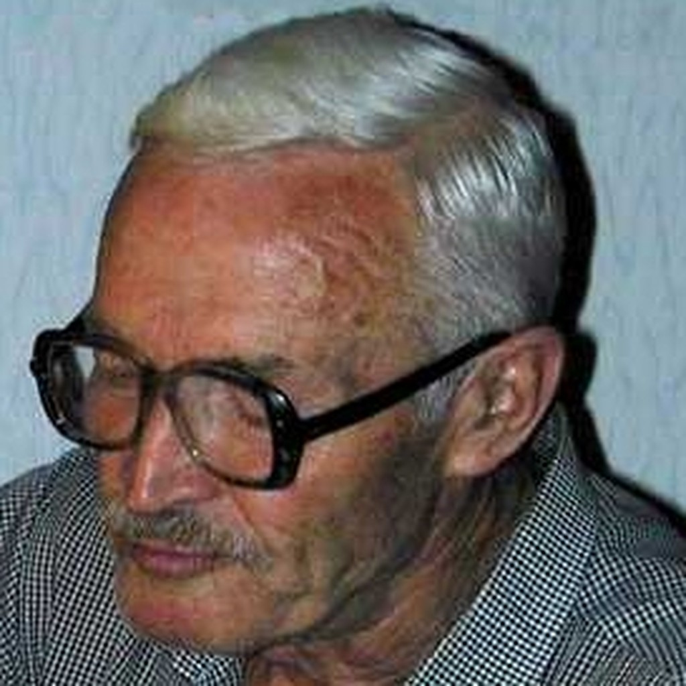

# Volodymyr (Vladimir) Ivanovych Savchenko

**Birth:** February 15, 1933, Poltava, Ukrainian SSR
**Death:** January 16, 2005, Kyiv, Ukraine
**Occupation:** Engineer, science fiction writer
**Languages:** Russian
**Notable Works:** *Self-Discovery* (*Открытие себя*, 1967), *Black Stars* (*Черные звезды*, 1960)
**Affiliations:** Institute of Automation of Gosplan of the Ukrainian SSR, Institute of Cybernetics of the Academy of Sciences of the Ukrainian SSR

## Biography

Volodymyr Savchenko was born on 15 February 1933 in Poltava. He graduated from the Moscow Power Engineering Institute as an electrical engineer and went on to work at the Institute of Automation of Gosplan of the Ukrainian SSR and the Institute of Cybernetics of the Academy of Sciences of the Ukrainian SSR, where he registered eight inventions and authored several scientific papers in semiconductors and microelectronics.

His first publication was the children's tale "How the Fox Fritz Led the Partisans," printed in the magazine *Murzilka* in 1943, when Savchenko was only ten years old. He began writing science fiction as a student at the Moscow Power Engineering Institute, publishing a story about the invention of an infrared binocular in the institute's in-house paper in 1955. His first science-fiction book, the collection *Black Stars* (*Черные звезды*), appeared in 1960.

### *Self-Discovery* and the Break with Techno-Communist Optimism

Savchenko's reputation rests chiefly on his 1967 novel **Self-Discovery** (*Открытие себя*), in which a systems engineer's cybernetic-biological experiment to duplicate his own personality destroys his original body and produces several "informational" doubles, each inheriting different parts of his memory. The novel poses, in strikingly early and vivid literary form, questions that would later become central to Western philosophy of mind and debates about personal identity, cloning, and artificial intelligence: if a human being is, as one character insists, "above all, information — a clot of information," then what happens to the privileged status of the "original" once perfect copies exist?

Where the dominant Soviet science-fiction tradition treated technological progress as morally uplifting and historically guaranteed to serve a collective project, Savchenko's fiction treats it as a volatile, unscripted process whose consequences exceed the intentions of its designers — a stance that anticipated, apparently independently and without access to Western philosophy, currents later associated with Jacques Ellul's critique of autonomous technique and with postmodern theories of simulation and identity.

### Later Life

Savchenko's fiction was translated into German, English, Arabic, Bulgarian, Hungarian, Polish, Romanian, Hindi, Bengali, Korean, Japanese, and other languages. His later statements describe a loss of faith in the Soviet project after the collapse of the USSR, a withdrawal from institutional literary life, and a turn toward a "cosmic," metaphysical orientation distinct from traditional religion. He died on 16 January 2005 in Kyiv.

## Selected Works

- **1960** – *Черные звезды* (*Black Stars*)
- **1967** – *Открытие себя* (*Self-Discovery*; English translation by Antonina W. Bouis, 1979)

## Legacy

Savchenko is remembered as the Ukrainian-born writer who broke most decisively with the dominant Soviet "techno-communist" narrative of guaranteed, morally uplifting progress, replacing it with a vision of technology as an unpredictable, ethically fraught force. *Self-Discovery* is now read as an unusually early literary anticipation of debates over identity, cloning, and artificial minds that would only later be formalized in Western analytic philosophy and postmodern theory.
