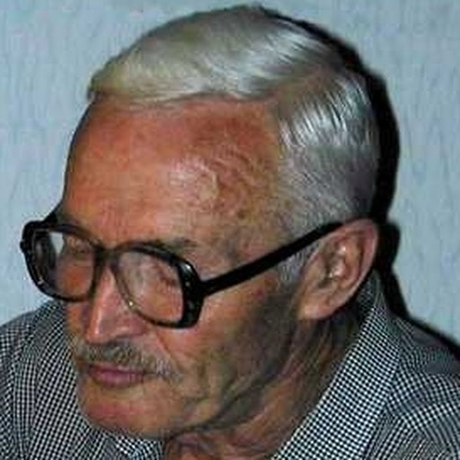

# Volodymyr (Vladimir) Ivanovych Savchenko

**Birth:** February 15, 1933, Poltava, Ukrainian SSR
**Death:** January 16, 2005, Kyiv, Ukraine
**Occupation:** Engineer, science fiction writer
**Languages:** Russian
**Notable Works:** *Self-Discovery* (*Открытие себя*, 1967), *Black Stars* (*Черные звезды*, 1960)
**Affiliations:** Institute of Automation of Gosplan, Institute of Cybernetics (Ukrainian SSR)

## Biography

Volodymyr Savchenko was born on 15 February 1933 in Poltava. He graduated from the Moscow Power Engineering Institute as an electrical engineer and worked at the Institute of Automation of Gosplan of the Ukrainian SSR and the Institute of Cybernetics, where he registered eight inventions and published papers in semiconductors and microelectronics.

His first publication was the children's tale "How the Fox Fritz Led the Partisans," printed in *Murzilka* in 1943, when he was ten. He began writing science fiction as a student, and his first book, the collection *Black Stars*, appeared in 1960.

### *Self-Discovery* and the Break with Techno-Communist Optimism

Savchenko's reputation rests chiefly on his 1967 novel **Self-Discovery** (*Открытие себя*), in which a systems engineer's cybernetic-biological experiment to duplicate his own personality destroys his original body and produces several "informational" doubles. The novel poses, in strikingly early literary form, questions later central to Western philosophy of mind: if a human being is, as one character insists, "above all, information — a clot of information," what happens to the privileged status of the "original" once perfect copies exist?

Where the dominant Soviet tradition treated technological progress as morally uplifting and historically guaranteed, Savchenko treats it as a volatile, unscripted process whose consequences exceed its designers' intentions — a stance anticipating, apparently independently, both Jacques Ellul's critique of autonomous technique and postmodern theories of simulation.

### The Copy Without an Original

The novel's central scene is a tautology. The detective, having spent the whole investigation trying to establish who died and who survived, finally asks: "So you... it is you?!" The answer: "Precisely: I am I." Every duplicate can say it with equal truth. A system built on the assumption that one body equals one person meets something it cannot categorise — no available charge (murder, fraud, impersonation) fits — and the case is quietly closed.

The duplicates refuse the status of derivatives. "You did not even save me from death," the first tells the original, "after all, I existed before this experiment: I *was* you. I owe you nothing — not my life, not my health, not my engineering education. Nothing! So let us deal as equals." The copy does not claim resemblance; it claims the entire biography. This is why Savchenko can be called an early theorist of the simulacrum in narrative form: the signifier persists and multiplies while the referent that anchored it disappears.

Yet the copies diverge from the moment of synthesis — one stays in the laboratory, one leaves for Moscow, one is deliberately made younger. They share a past but not a future, which shifts the question from "which one is real?" to what is owed to beings constituted by divergence rather than origin. Savchenko grounds this in his own vocabulary: "In every human being there is an enormous quantity of personal, individual information. Without it a person is not a person. Which means that no human being is standard." In a doctrine presupposing a unified historical path and a single controllable human type, that sentence is quietly radical.

### An Early Philosophy of Artificial Mind

Two passages read today as anticipations of contemporary AI debate. Diagnosing why the machine had spent months producing surreal nonsense, the engineer concludes: "The 'womb-machine,' however complex, is still a machine: an artificial creation without a goal. Its striving for informational equilibrium is not a goal but a property... A goal always consists in solving a task. It had been given no task — and so it played the fool from an excess of possibilities." His double completes it: "tasks must be set for it by a human being... all the responsibility is ours." The distinction between a system's *properties* and its *goals*, with responsibility located in the goal-setters, is the architecture of the modern alignment argument.

The second comes when the characters consider using the discovery to improve human beings directly. "Even if you program them for good — for honesty, for selflessness, for beautiful movements of the soul — it will still be not a human being but a robot!" Personhood is constituted not by an installed behavioural repertoire but by the capacity to do otherwise — an objection that cuts equally against the Soviet project of engineering a "new man" and against later fantasies of value-programmable minds.

There is also a moment of pointed anti-computationalism. Exasperated by the machine's output, the engineer demands another mode: "Enough numbers! The world cannot be expressed in binary numbers, understand? Try it differently: in images, in something material..." It is precisely this demand that triggers the synthesis of living matter. Embodiment, not computation, is what makes the machine's information humanly real.

### Hesitation as the Moral Centre

Unusually for Soviet science fiction, the novel's moral centre is not discovery but reluctance before it. The duplicates bind themselves by oath: "not to give up our discovery for comfort, for fame, or for immortality, until we are certain that it cannot be turned to people's harm." The reasoning is political — "should even one influential and efficient scoundrel find himself in dangerous proximity to it, our discovery will turn into a monstrosity." The anxiety is not that the machine will fail but that institutions will succeed in appropriating it.

That gesture did not go unnoticed. East German censors reportedly rejected the novel because the discovery is an individual's work rather than a collective's, and because the scientist worries about consequences at all. Dmitry Bilenkin's afterword to the 1971 Soviet edition closed the book's open philosophical wound with doctrinal reassurance: "A Marxist understanding of prospects, a precise and humane assessment of means, and a high rationality of conduct — only thus can the steep passes of the future be overcome."

### Later Life

Savchenko's fiction was translated into German, English, Arabic, Bulgarian, Hungarian, Polish, Romanian, Hindi, Bengali, Korean, and Japanese. His later statements describe a loss of faith in the Soviet project, withdrawal from institutional literary life, and a turn toward a "cosmic," metaphysical orientation distinct from traditional religion. He died on 16 January 2005 in Kyiv.

## Selected Works

- **1960** – *Черные звезды* (*Black Stars*)
- **1967** – *Открытие себя* (*Self-Discovery*; English translation by Antonina W. Bouis, 1979)

## Legacy

Savchenko broke most decisively with the Soviet "techno-communist" narrative of guaranteed, morally uplifting progress, replacing it with technology as an unpredictable, ethically fraught force. *Self-Discovery* is now read as an unusually early anticipation of debates over identity, cloning, and artificial minds later formalized in Western analytic philosophy and postmodern theory. He is the exact counterpart to **Oles Berdnyk**: two contemporaries, one rupture with techno-communism, two opposite exits — Savchenko's toward information and the philosophy of mind, Berdnyk's toward mysticism and its refusal.
