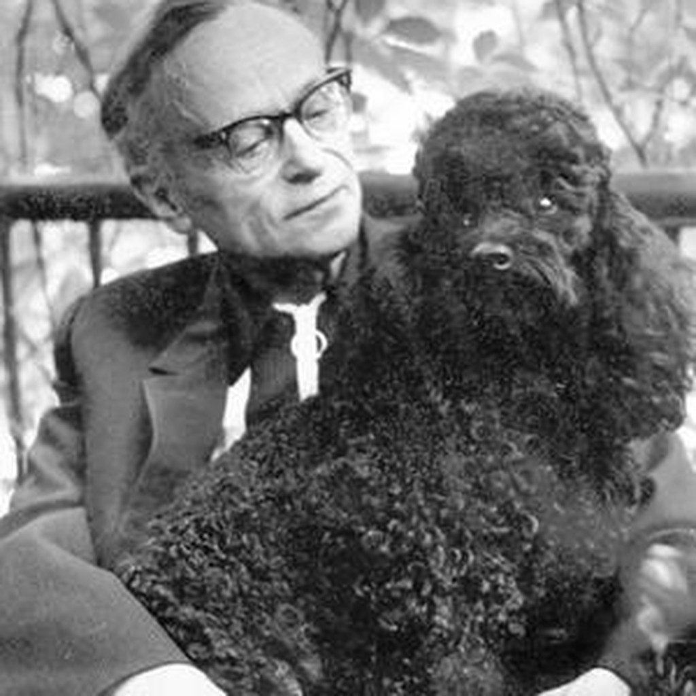

# Volodymyr Mykolaiovych Vladko

**Birth:** December 26, 1900 (January 8, 1901, New Style), St. Petersburg, Russian Empire
**Death:** April 21, 1974, Kyiv, Ukrainian SSR
**Birth name:** Volodymyr Mykolaiovych Yeremchenko
**Occupation:** Science fiction writer, journalist, radio host
**Languages:** Ukrainian
**Notable Works:** *Argonauts of the Universe*, *Aerotorpedoes Turn Back*, *Robotari Are Coming* (*Iron Mutiny*), *Raketoplan S-218*
**Affiliations:** Union of Soviet Writers, Ukrainian Institute of Journalism (Kharkiv)

## Biography

### Early Life and an Accidental Pen Name

Volodymyr Vladko was born **Volodymyr Mykolaiovych Yeremchenko** in St. Petersburg, the son of a printing-house technician and a midwife. He lost his father at fifteen and supported his family — a younger sister and two brothers — through newspaper piecework, private tutoring, and copying work while still a teenager; his first publications date to December 1917. Between 1917 and 1921 he worked for the Voronezh Commune newspaper and headed the propaganda department of the regional news agency Tsentropechat.

In 1921 he moved to Kharkiv, then the capital of Soviet Ukraine, where he worked for a decade as a journalist. It was during this period that a compositor's typesetting error truncated his byline "Владимир Еремченко" down to "Владко" — first recorded in *Kharkivskyi Proletarii* on 14 November 1926. The printer's accident gave Ukrainian science fiction one of its most durable pen names.

### A Suppressed Novel and a Censored Masterpiece

Vladko wrote his first science-fiction story, **Raketoplan S-218**, in 1926, though it was not published until 1930. His first full-length work, the novella **Robotari Are Coming** (*Ідуть роботарі*, 1931, later revised as *Iron Mutiny* / *Залізний бунт*), won a prize at the 1929 All-Ukrainian competition. His debut novel, **Aerotorpedoes Turn Back** (*Аероторпеди повертають назад*), published in 1934, was withdrawn from sale and destroyed almost immediately after release; only two of the original 10,000 printed copies are known to survive today.

His best-known novel, **Argonauts of the Universe** (*Аргонавти Всесвіту*), finished in 1933, was held up by censors wary after the previous ban and only serialized starting in 1935. It became one of the most popular Ukrainian science-fiction novels of the era — a 1935 first edition of 20,000 copies was followed by tens of thousands more over the following years — and was translated into Russian, Serbian, Croatian, and Japanese (with six separate Japanese editions). The cosmonaut Pavlo Popovych later praised the novel for its "precisely foreseen" depiction of weightlessness.

### War, Journalism, and Later Career

Vladko's 1941 anti-fascist novel *Syvyi Kapitan* (*The Grey-Haired Captain*) lost its original manuscript in the chaos of the war's opening months; he rewrote and republished it only after 1956. During the Second World War he served as a political commentator for Ukrainian-language radio in Saratov, then as a correspondent for the Soviet Information Bureau and Pravda, chairman of the Ukrainian SSR's chief repertoire committee (1947–51), and head of the Ukrainian section of *Literaturna Hazeta* (1951–56). He joined the Communist Party in 1944.

Only in 1956 did Vladko return in earnest to science fiction, revising *Argonauts of the Universe* and producing further novellas. For nearly two decades he also hosted the popular children's radio program *Besidy Profesora Hlobusa* (*Conversations with Professor Globus*). He was awarded two Orders of the Badge of Honor and, in 1973, the "Golden Cosmonaut" prize at an international congress of socialist-country science-fiction writers in Poznań. He married three times; his third wife, the poet and translator Maryna (Marietta) Vladko-Rekun (1930–2010), was senior literary editor of the journal *Vsesvit* and donated his personal archive to the National Museum of Literature of Ukraine after his death.

### Literary Method

Commemorative and pedagogical literature repeatedly calls Vladko the "Ukrainian Jules Verne," recognizing his insistence on technological plausibility — he revised his own fiction across decades to keep pace with advancing science. But scholars such as Walter Smyrniw and Viktor Polozhii note his fiction is equally organized around a Wellsian axis of future war and social extrapolation, fused into a distinctly Soviet claim: that superior Soviet science and superior Soviet social organization are one and the same proof of communism's inevitable historical triumph.

## Selected Works

- **1926 (pub. 1930)** – *Ракетоплан С-218* (*Raketoplan S-218*)
- **1931** – *Ідуть роботарі* (*Robotari Are Coming*; revised as *Залізний бунт*, *Iron Mutiny*, 1936/1967)
- **1934** – *Аероторпеди повертають назад* (*Aerotorpedoes Turn Back*) — suppressed shortly after publication
- **1935** – *Аргонавти Всесвіту* (*Argonauts of the Universe*)
- **1935** – *Чудесний генератор* (*The Wonderful Generator*)
- **1936** – *12 оповідань* (*12 Stories*)
- **1937** – *Нащадки скіфів* (*Descendants of the Scythians*)
- **1941** – *Сивий капітан* (*The Grey-Haired Captain*)
- **1956 onward** – *Позичений час* (*Borrowed Time*), *Фіолетова загибель* (*Violet Death*), and numerous further stories

## Legacy

Vladko was Ukrainian science fiction's first true genre specialist, sustaining a decades-long literary project across rockets, robots, and future war, always insisting his gadgets remain scientifically credible even as the science underneath them changed. His fiction, alongside Yuriy Smolych's, established what scholars call Soviet Ukrainian science fiction's "techno-communist utopia" — a fusion of technological and ideological triumph that shaped the genre's imagination for decades.
