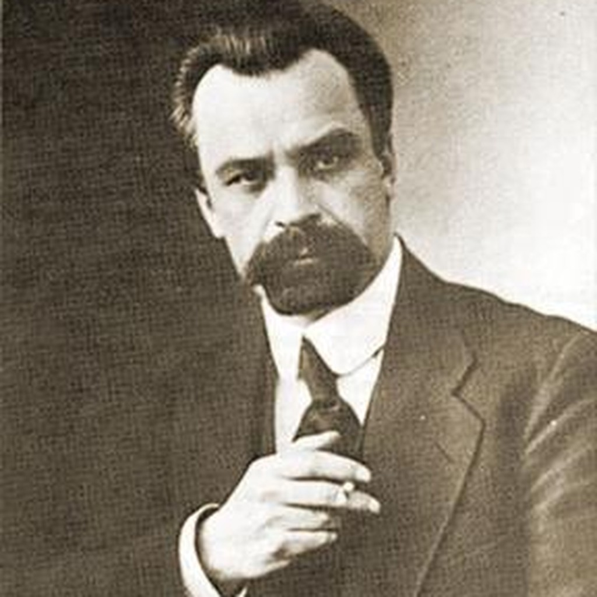

# Volodymyr Kyrylovych Vynnychenko

**Birth:** July 28, 1880, Veselyi Kut, Kherson province, Russian Empire
**Death:** March 6, 1951, Mougins, France
**Occupation:** Writer, playwright, politician, revolutionary
**Languages:** Ukrainian
**Notable Works:** *Сонячна машина* (*The Sun Machine*, 1928), *Записки Кирпатого Мефістофеля*, *Konkordyzm*
**Affiliations:** Revolutionary Ukrainian Party, Central Rada, Ukrainian People's Republic

## Biography

### From Peasant Poverty to Head of State

Volodymyr Vynnychenko was born on 28 July 1880 in the village of Veselyi Kut in Kherson province to a peasant family. He left the Yelysavethrad gymnasium without finishing his studies when his family needed money, and worked as a hired laborer for local landowners — an early experience of exploitation he would later cite as the origin of his political convictions. He joined the Revolutionary Ukrainian Party around 1900–1902 and was arrested for it before he turned twenty-two, the first of several arrests and prison terms, including eighteen months in the Kyiv fortress, that punctuated the following decade and a half of underground party work, illegal border crossings, and exile across Galicia and Western Europe.

By 1917 Vynnychenko had become one of the leaders of the Central Rada in Kyiv, and on 28 June 1917 he was placed at the head of the General Secretariat — the first Ukrainian national government of the twentieth century. He resigned seven months later, in January 1918, and after the collapse of the Hetmanate of Pavlo Skoropadskyi in late 1918, returned to power as one of the leaders, and for a period the head, of the Directory of the Ukrainian People's Republic, before breaking with its majority and leaving Ukraine for good in 1919–1920.

### Between Ukraine and Moscow

Vynnychenko did not simply join the anti-Bolshevik emigration. In June 1920 he travelled to Moscow to negotiate the return of his Foreign Group of Ukrainian Communists to Soviet political life, meeting with Grigory Zinoviev and Leon Trotsky. Trotsky bluntly refused any independent Ukrainian military formations, and Vynnychenko concluded, in his own diary, that "it is enough to become a communist to become a traitor to national liberation." His diaries from this period — spanning three published volumes covering 1911 to 1928 — offer an unusually candid, self-critical record of a revolutionary politician diagnosing his own movement's contradictions in real time.

In 1925 Vynnychenko settled permanently in Paris, a move his diary editors describe as the realization of his own dream of a "flight to the sun." He spent his final decades developing **Конкордизм** (*Concordism*), a philosophical system for "building happiness" grounded in the demand to "be honest with yourself."

### Literary Career

Vynnychenko was already a major figure in Ukrainian literature before his political career, and his fiction repeatedly returned to the same themes as his political life: power, self-deception, and the gap between ideals and their execution. His best-known work of speculative fiction, **Сонячна машина** (*The Sun Machine*, 1928), imagines an invention — a machine converting sunlight directly into edible "sun bread" — that collapses the money economy overnight. Rather than presenting this as a straightforward utopia, the novel undercuts its own techno-communist premise at every turn, showing a newly "liberated" humanity dissolving into confusion, hedonism, and a manifesto of freedom shouted over a riot. Contemporary scholars have read the novel's ambivalence as a direct outgrowth of Vynnychenko's own twice-failed experience of revolutionary power.

Two earlier, lesser-known texts anticipate the novel's concerns: the naturalist story *Біля машини* (*By the Machine*, 1900), in which workers seize a threshing machine's drive belt to force a wage settlement, and the 1917 novella *Записки Кирпатого Мефістофеля* (*Notes of a Snub-Nosed Mephistopheles*), whose narrator compares revolutionaries to moths repeatedly drawn to a lamp until their wings are broken.

## Selected Works

- **1900** – *Біля машини* (*By the Machine*)
- **1917** – *Записки Кирпатого Мефістофеля* (*Notes of a Snub-Nosed Mephistopheles*)
- **1928** – *Сонячна машина* (*The Sun Machine*)
- **1980–2010** – *Щоденник* (*Diary*), 3 vols., covering 1911–1928 (posthumous)
- Late work – *Конкордизм: система будування щастя* (*Concordism: A System for Building Happiness*)

## Legacy

Vynnychenko remains one of the towering and most contradictory figures of modern Ukrainian history: the only writer among the founders of the twentieth-century Ukrainian state, and a novelist who used the techno-communist utopia — a genre his contemporaries mostly wrote with unclouded confidence — to stage his own hard-won skepticism about whether any liberating machine, or any revolutionary government, can outrun the human beings it claims to free.
