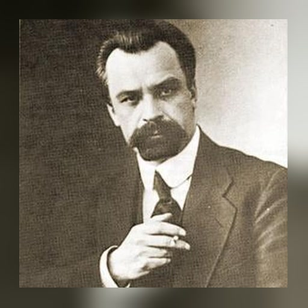

# Volodymyr Kyrylovych Vynnychenko

**Birth:** July 28, 1880, Veselyi Kut, Kherson province, Russian Empire
**Death:** March 6, 1951, Mougins, France
**Occupation:** Writer, playwright, politician, revolutionary
**Languages:** Ukrainian
**Notable Works:** *Сонячна машина* (*The Sun Machine*, 1928), *Записки Кирпатого Мефістофеля*, *Konkordyzm*
**Affiliations:** Revolutionary Ukrainian Party, Central Rada, Ukrainian People's Republic

## Biography

### From Peasant Poverty to Head of State

Volodymyr Vynnychenko was born on 28 July 1880 in the village of Veselyi Kut in Kherson province to a peasant family. He left the Yelysavethrad gymnasium without finishing his studies when his family needed money, and worked as a hired laborer for local landowners — an early experience of exploitation he would later cite as the origin of his political convictions. He joined the Revolutionary Ukrainian Party around 1900–1902 and was arrested for it before he turned twenty-two, the first of several arrests and prison terms, including eighteen months in the Kyiv fortress, that punctuated the following decade and a half of underground party work, illegal border crossings, and exile across Galicia and Western Europe.

By 1917 Vynnychenko had become one of the leaders of the Central Rada in Kyiv, and on 28 June 1917 he was placed at the head of the General Secretariat — the first Ukrainian national government of the twentieth century. He resigned seven months later, in January 1918, and after the collapse of the Hetmanate of Pavlo Skoropadskyi in late 1918, returned to power as one of the leaders, and for a period the head, of the Directory of the Ukrainian People's Republic, before breaking with its majority and leaving Ukraine for good in 1919–1920.

### Diagnosing His Own Defeat

Vynnychenko understood the structural cause of that double failure earlier than most. On 2 January 1918, with Bolshevik forces advancing on the republic he was trying to defend, he wrote: "without a nation it is truly difficult to create a national state. With only 'muzhiks,' with dark, browbeaten peasants who know only the soil they dig in, it is hard to fight for something unknown to them, never heard of. The Bolshevik they know and see in themselves; but a nation, a state — that is something abstract, far too large." Stanislav Kulchytskyi has argued that Vynnychenko grasped the obstacles to Ukrainian state-building better than anyone else then at the helm of the Republic — and better than the historians still trying, a century later, to explain the UNR's collapse.

He recorded the loss of office as an amputation: "The arms are gone, empty sleeves hang in their place, but the sensation remains: the palm itches, the little finger aches from an old rheumatism... and yet the feeling is that I have arms, that I wave them, that I clench my fists in anger."

### Between Ukraine and Moscow

Vynnychenko did not simply join the anti-Bolshevik emigration. In June 1920 he travelled to Moscow to negotiate the return of his Foreign Group of Ukrainian Communists to Soviet political life — "I am going into the camp of my opponents," he wrote, unsure whether he would grind them or they would grind him into "a powerless, helpless signboard." Watching Grigory Zinoviev evade one question after another, he noted drily that the man would probably behave differently if he were not chairman of the Comintern. The decisive meeting came on 19 June with Trotsky, who refused any independent Ukrainian military formations "decisively and categorically," and closed the matter with: "There can be no changes in the Party's policy." Vynnychenko drew his conclusion in the same entry: "it is enough to become a communist to become a traitor to national liberation."

His diaries — three volumes covering 1911 to 1928 — offer an unusually candid record of a revolutionary diagnosing his own movement's contradictions in real time. In 1925 he settled in Paris, a move his editors describe as the realization of his dream of a "flight to the sun." He spent his final decades developing **Конкордизм** (*Concordism*), a system for "building happiness" grounded in the demand to "be honest with yourself." Turning on Tolstoy's maxim "do not do as I do, but as I say," he called it "a pitiful weakness, a capitulation" — insisting that any philosophy of happiness must be proved on one's own body before it is preached.

## *The Sun Machine* (1928)

### The Invention

Post-war Germany is effectively ruled by the financial magnate Friedrich Mertens, who has bought the government, army, banks and press, and whose Berlin palace is built in a style the narrator calls "omneism" — grabbing and buying everything at once. Into this world the chemist Rudolf Shtor introduces the solar machine. Since the sun is the ultimate source of all food, and plants and animals merely middlemen carrying that energy to the body, why not cut out the middlemen? A mineral he calls **helionite** concentrates solar energy; passed through plant fibre it produces "sun bread," a violet-gold substance on which he has lived for eight days.

What makes the invention work is a drop of the maker's own sweat, discovered by accident when it fell into the apparatus during an overheated experiment. This rewrites the labour theory of value in literal, physical terms. Industrial capitalism converts labour into something abstract and extractable, purchasable from a worker and ownable by someone else; the solar machine demands a bodily contribution from whoever uses it. It cannot be owned at a distance — only practised. The anti-capitalist argument of the whole novel is contained, in miniature, in that drop of sweat.

Once the device spreads, money stops mattering almost overnight: crowds throw banknotes into the street, banks collapse, factories fall idle. Authority passes to the Committee of the Solar Machine. Around this runs a second plot: Princess Eliza, sworn to avenge her ruined family against Mertens, makes contact with the clandestine INARAK and resolves to marry him in order to destroy his empire from within.

### Utopia Undercut

Vynnychenko never lets the collapse of the money economy read as liberation. Freed from material need, the character Shpindler announces that humanity has become divine — "we are beings without community, without a state, without classes, without parties. So — we are gods" — and the passage recording the dissolution of "the state, power, courts, police, capital, exchanges, banks" is surrounded by scenes of people turning into "pigs, gods, and animals" in roughly equal measure, unable to decide what a life without compulsion is for. The manifesto of the Free Union of Creative Labor promises a "paradise garden," but it is a placard shouted at a half-drunk mob during a riot.

The style registers the same unease. Vitaliia Papish counts 759 separate instances of laughter vocabulary across the novel, and catalogues the recurring adverb *безжурно* ("carefree") attaching to characters even as catastrophe unfolds — Rudolf "carefree leafs through the screaming pages of the newspapers" reporting the disaster. The utopia feels manic rather than settled. Liudmyla Kotkova finds the novel's harshest review of its own premise voiced from inside the story: "Not every freedom is a good. The freedom of pornography is ruin for youth. The Solar Machine is pornography for immature humanity." Shtor is "carried to the summit by idolatrous hands, wrapped in deification" — sanctified for an invention he cannot control. Alina Kolomiiets, classifying the novel's sixty-odd characters by household, concludes that "the family is no different from a pack of animals — here everyone is for themselves."

### A Dissenting Techno-Communism

Vynnychenko belonged to a wider current of 1920s Ukrainian **techno-communist** fiction, in which a single invention delivers the future that revolution alone had failed to secure. Writers like **Sandro Kasyanyuk** worked from inside a triumphant Soviet Ukraine and treated the machine as a loyal servant of the party-state. Vynnychenko shares the premise but arrives at it from exile, after his attempt at political revolution had failed twice, and builds his own doubts into the machine. He stages the most total version of the dream precisely in order to ask what people actually do once it comes true.

Two earlier texts anticipate this. The naturalist story *Біля машини* (*By the Machine*, 1900) has workers seize a threshing machine's drive belt to force a wage settlement — the machine is inert capital, and the men win not technology but leverage over it. Thirty years later, helionite needs no strike and no belt: it removes the landlord's leverage by removing hunger. The 1917 novella *Записки Кирпатого Мефістофеля* supplies the psychology in advance, its narrator comparing revolutionaries to moths flung repeatedly from a lamp until "their wings are broken and they are thrown into the dark so hard that they can no longer fly back" — written the very year he took charge of the revolutionary government.

## Selected Works

- **1900** – *Біля машини* (*By the Machine*)
- **1917** – *Записки Кирпатого Мефістофеля* (*Notes of a Snub-Nosed Mephistopheles*)
- **1928** – *Сонячна машина* (*The Sun Machine*)
- **1980–2010** – *Щоденник* (*Diary*), 3 vols., covering 1911–1928 (posthumous)
- Late work – *Конкордизм: система будування щастя* (*Concordism: A System for Building Happiness*)

## Legacy

Vynnychenko remains one of the most contradictory figures of modern Ukrainian history: the only writer among the founders of the twentieth-century Ukrainian state, and a novelist who used the techno-communist utopia — a genre his contemporaries mostly wrote with unclouded confidence — to stage his own hard-won skepticism. He diagnosed his defeat twice: once analytically, in a diary written while it was still unfolding, and once dramatically, a decade later, in a novel asking what any liberating power, machine or government, requires of the people it claims to free. He would not pretend, even in fiction, that a machine could do the political work people had refused to do.
