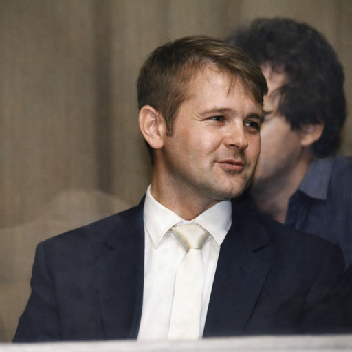

# Volodymyr Apollinaryovych Zayets

**Birth:** September 9, 1949, Velyka Bugayivka, Vasylkiv Raion, Kyiv Oblast, Ukrainian SSR  
**Death:** December 20, 2002, Yemen  
**Occupation:** Science fiction writer, editor, translator, pediatrician  
**Languages:** Ukrainian, Russian  
**Pseudonyms:** Veld Chernouz, Vladimir Chernoza  
**Notable Works:** *Temponauts*, *Plaster Cramp*, *Heavy Shadows*  
**Affiliations:** Union of Soviet Writers (1987); Council of the Ukrainian Science Fiction Fan Club  

## Biography

### Early Life and Education  
Volodymyr Zayets was born into a family of civil servants in **Velyka Bugayivka, Kyiv Oblast**. He graduated from the **Kyiv Medical Institute** in **1972** in **pediatrics**, then worked as a children's doctor at the Vyshhorod emergency care centre — in the shadow of the Kyiv dam, downstream of Chornobyl on the same reservoir.

### Literary Career  
Zayets began with a **humorous short story** submitted to the satirical magazine *Perets* in **1972**. His first science fiction work (1978) began a **humorous space adventure cycle** featuring Antonii Endotelius, a spacefaring Munchausen.

He wrote in both **Ukrainian** and **Russian**, publishing in *Perets*, *Dnipro*, *Ranok* and the Leningrad journal *Avrora*, participated in the **Maleyevka science fiction seminar**, and joined the Writers' Union in 1987.

In **1991** he became **chief editor of the magazine "Flint"**, which managed a single issue. His collection *The Unpromised Land*, prepared in 1990, was never printed: the publishing system of the disintegrating USSR had ceased to exist.

### Later Years and Mysterious Death  
After the Soviet collapse Zayets headed an ultrasound department at the Scientific Center for Radiation Medicine — created to treat the consequences of Chornobyl — for a few dozen dollars a month, and twice went to work as a physician in **Yemen**, where employers confiscated his passport, substituted an Arabic contract for the one he had signed, and paid fifty dollars a month of a promised six hundred. In December 2002, two days before his contract ended and immediately after his employer refused to settle accounts, he and two colleagues fell violently ill after drinking alcohol offered by a local intermediary. The colleagues recovered; Zayets lost his sight and died — a picture consistent, his widow observed, with **methanol poisoning**. His body reached Kyiv only in **March 2003**.

## An Unwitting Postmodernist

Zayets never read Derrida or Lyotard. Through the 1970s and 1980s the canonical texts of poststructuralism were untranslated and unavailable to a provincial Soviet physician writing humoresques for the satirical journal *Perets*. What reached him was not the theory but the **condition** it describes: life inside a grand narrative that had visibly died while remaining compulsory. He reinvented postmodern devices independently, as diagnostic necessity rather than borrowed fashion — a rare case of postmodernism arrived at symptomatically. Walter Smyrniw's 472-page survey of Ukrainian science fiction devotes one sentence to his work.

What Zayets possessed instead of theory was a clinician's eye, and his medicine is generative grammar rather than background colour. His toponyms are diagnostic puns. **Kifozovo** derives from *kyphosis*, the pathological curvature of the spine — a silent comment on a population from whose backs wind-up keys protrude like orthopaedic hardware. The planet **Firbolgia** fuses *fibromyalgia*, chronic diffuse pain with no localisable lesion: a society in pain whose cause no examination can find. Its officers bear names like Syn-cyti-dodu, from *syncytium*, a tissue in which cell boundaries dissolve into a continuous mass. Even his comic spacefarer, Antonii **Endotelius**, is named for the lining of blood vessels. Medicine trains its practitioners to distinguish a living organ from a necrotic one that keeps its shape, and Zayets applied that habit to social bodies.

### *Plaster Cramp* (1990)

A young idealist doctor is struck by a truck, walks away apparently unhurt, and takes a post in Kifozovo, where reality methodically fails. His colleagues prove to have wind-up keys protruding from their backs. The chief physician stops mid-sentence and "falls asleep" until wound — and is himself wound by a gigantic Hand descending from the ceiling.

The key is an exact figure for the performative hollowness of late socialism. The citizens of Kifozovo are not believers, nor even hypocrites — hypocrisy requires an inner reservation, and the dolls have none. They are performers of form. The novella's central horror is a staff meeting convened to frame an innocent paramedic: the protagonist watches his own hand rise to vote for her dismissal while inwardly dissenting. Under decorative communism the *body* is collectivised while the soul is left private — the inversion of the 1930s model, which demanded the soul.

The Hand is the sharper invention. The hierarchy appears to ascend conventionally, but the chief physician is a doll wound from above, and the Hand is attached to nothing anyone ever sees. Soviet citizens lived this daily: orders descended, but from whom? The General Secretary was visibly a doll; the Politburo wound him; what wound the Politburo? Zayets's chain of winding has no first winder.

The psychiatrist Petel completes the machinery by tying sanity to institutional loyalty: "Whoever perceives it differently is sick... If you had objected to the person of our esteemed chief physician, then I would have doubted your mental health." Failure to perceive absurdity as normal is treated as illness; health is adjustment to the keys.

The final revelation is that the protagonist has been dead since the accident and Kifozovo is a transitional hallucination — not a mystical flourish but the thesis. Decorative communism *is* a posthumous state, the afterlife of a project that died unannounced, populated by entities still moving because they were wound before the death occurred. Out of the closing fog steps Shem-Hamphorash, bearing the kabbalistic name of the unpronounceable Name of God, endlessly building an infectious-diseases ward left over from previous universes.

The title gathers this into one clinical image. A plaster cast immobilises a limb to heal it; a cramp is a living spasm. "Plaster cramp" is a contradiction in terms — the convulsion of something already rigid, a society in spasm inside its cast.

### *Heavy Shadows* (1991)

The same anatomy is projected onto the planet Firbolgia, a theocracy fusing an imperial economy with a compulsory theology of cosmic war between the divine Logos and the spirit of evil, Entrop. Every load-bearing element proves to be decoration concealing a vacancy. The supreme figure, the Untouchable — earthly incarnation of the Logos — is a rotating series of doubles: drugged, semi-conscious men with severed vocal cords, trained by actors to nod correctly. The reference is unmistakable to anyone who lived through Brezhnev, Andropov and Chernenko ruling in visible physical collapse while the anonymous Politburo spoke through them. The voice of God on Firbolgia is produced by destroying the organs of speech.

Every other tier replicates the structure. The martyred security director is murdered by his own apparatus. The terrorist sect is a state instrument. The epidemic is fictitious, and its diagnostic criterion — denial counts as proof of infection — is the pure form of the unfalsifiable accusation. Zayets needed no Foucault to grasp that the power to define illness is the power to define guilt; he had watched Soviet psychiatry exercise it.

The novella also corrodes the Strugatskys' "progressor" plot, in which an advanced Earth covertly guides a benighted planet. Zayets's Earthlings do not enlighten Firbolgia; they counterfeit it, substituting biocybers for the intellectuals sent to the House of Euthanasia. The contest of civilizations is a contest of forgeries, and Earth wins because its copies are kinder, not because its truth is higher.

### *The Temponauts* (1986)

Published by a children's house in a print run of 115,000 and addressed "to readers of middle school age," the collection is the laboratory where Zayets worked out a humour that corrodes every hierarchy it touches. The disguise worked so well that it hid the stories from critics entirely.

Its nearest thing to a manifesto comes when Endotelius, caught embellishing his exploits, refuses to apologise and explains himself: "the truth is… too serious a claim… to the monumentality of one's merits, to the desire to immortalize them. But to present them in the form of a joke — that is another matter entirely." Truth-telling is a claim to monumentality, the first stone of a pedestal. His lies are structurally honest; official truth is structurally mendacious, because its content may be accurate while its form is always a claim to power.

The travesties follow. In *The Labors of Heracles*, the founding myth of European culture is generated by a semi-literate king misreading the acronym on a time machine's casing; Cerberus is a starving black dog grateful for chocolate. In the title story, a civilization that can travel through time cannot search its own library, and Archimedes learns Archimedes' principle from a visitor who learned it at school. *Creating the Image* has a commercial writer descend into his own story to force his character to die on schedule — and be killed by him. *Such a Long-Awaited Meeting* deflates First Contact: the alien is identical to us down to the football, his planet named Ялмез — Земля reversed — and the earthman's verdict is the collection's most devastating line: "Everything is alike — it's terrifying. It isn't even interesting." *Hallucination* condenses *Plaster Cramp* into eight pages: a bored psychiatrist reasons the fisherman sane, cannot tolerate the corollary that the lake monster is real, and hypnotises him into disbelief — while the creature eats his soup kettle two metres from his face.

---

## Literary Works  

### Books  
- **1984** – *Машина забуття* (*The Machine of Oblivion*)  
- **1986** – *Темпонавти* (*Temponauts*)  

### Novellas  
- **1985** – *Город, которого не было* (*The City That Never Was*)  
- **1987** – *Земля не обетованная* (*The Unpromised Land*)  
- **1990** – *Гипсовая судорога* (*Gypsum Spasm*)  
- **1991** – *Тяжелые тени* (*The Heavy Shadows*)  

### Short Stories  
- **1973–1975** – *Для профилактики*, *Философ*, *Свидание*, *Интуиция*, *Пошутил*  
- **1978–1991** – *Цикл «Были старого космогатора»* (*Tales of the Old Cosmogator*)  
- **1980–1981** – *Дед Патратий*; *Темпонавты – так их назовут*  
- **1986** – *И будет день новый...* (*And There Will Be a New Day...*)  
- **1988–1990** – *Побег*; *Некоторые аспекты современного ведьмоведения*; *Эффект фараона*  

### Science Fiction Anthologies  
- **1990** – *Пригоди, подорожі, фантастика-90* (*Adventures, Travels, Science Fiction-90*) – **Editor**  

### Filmography  
- **1984** – *Встреча* (*Meeting*) – **Screenplay for an animated film** (*Kievnauchfilm Studio, USSR*)  

---

## Bibliography  

- **1991** – *Тяжелые тени* (*Heavy Shadows*) – novella and stories  
- **2012** – *Были старого космогатора* (*Tales of the Old Cosmogator*)  

### Translations and Editorial Work  
- **1991** – Translated *Miss Shumway and the Magic Wand* by James Hadley Chase  
- **1991** – Editor of *Soviet Literature* – *Temponauts* (translated into **English**)  
- **1983** – *Dražba na planetě Gij: Fantastika 83* – *Příběhy starého kosmogátora* (translated into **Czech**)  

---

## Legacy  
Volodymyr Zayets was a prominent figure in **Ukrainian and Soviet science fiction**, known for his **ironic and satirical style**.

The post-Soviet decade rewrote his life as a grim parody of his own fiction. The author who spent two novellas dissecting societies in which law and human decency had become decorative inscriptions on a dead structure ended inside precisely such a society, as its case study. Two months before his death he wrote to his wife from Yemen: "Here they can fleece you in an instant: no law, no rights, no human decency."
