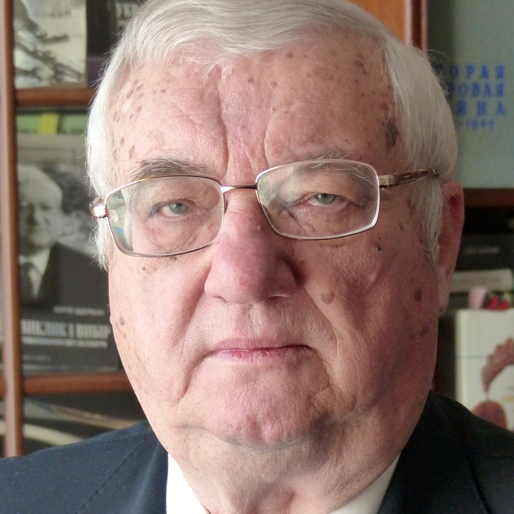

# Yurii Mykolaiovych Shcherbak

**Birth:** October 12, 1934, Kyiv, Ukrainian SSR
**Occupation:** Physician-epidemiologist, writer, ecologist, diplomat, politician
**Languages:** Ukrainian
**Notable Works:** *Час смертохристів* (*Time of the Death-Christs*, 2011), *Час Великої Гри* (2012), *Час тирана* (2014); *Чорнобиль* (*Chornobyl*)
**Affiliations:** Union of Soviet Writers, "Зелений Світ" (Green World), Ukrainian Helsinki Group era Interregional Deputies' Group, first Minister of Environmental Protection of independent Ukraine

## Biography

### Formation: Family, Medicine, and the KGB

Yurii Shcherbak was born on 12 October 1934 in Kyiv. By his own account his political consciousness was shaped early by family history: his father's stories of the Holodomor, and the arrest of his older brother — an eminent zoologist and corresponding member of the Academy of Sciences — on charges of Ukrainian nationalism.

Trained in medicine, Shcherbak specialized in epidemiology, and his doctoral research concerned the spread of rabies among wild foxes, work that he says drew him directly into the ecological problems that would define his public career. He became a writer, on his own telling, "thanks to the KGB": a 1959 search of his home turned up an Esperanto textbook, which officers mistook for a coded cipher book. The arrest cost him his manuscripts but, through literary contacts, opened the door to the Writers' Union; he was later silenced again under First Secretary Volodymyr Shcherbytsky and went unpublished in Ukraine for a decade.

### Chornobyl and the Turn to Ecology

After the 1986 Chornobyl disaster, ecology became Shcherbak's primary public vocation. As secretary of the Writers' Union of Ukraine, he was asked in 1987 to head its ecological commission — work he recalls as opening "a Pandora's box" of previously concealed information about the disaster's consequences. This led to the founding of the "Зелений Світ" (*Green World*) association, which he chaired, and then to his appointment as the **first Minister of Environmental Protection of independent Ukraine**, in which role he represented Ukraine at the 1992 Rio de Janeiro UN Earth Summit.

### Politics and Diplomacy

From ecology Shcherbak moved into parliamentary politics, joining the Interregional Deputies' Group in the late Soviet legislature alongside Andrei Sakharov, and then into diplomacy, serving as Ukraine's ambassador to **Israel, Canada, Mexico, and the United States**. He describes this turn as a patriotic duty — "to carry the truth about Ukraine to the world" — though his time as ambassador to Canada, amid the Melnychenko tape scandal, brought what he calls an evolution "from romantic illusions... to realism."

### Return to Fiction

After decades away from prose, Shcherbak returned to fiction in his late seventies with a dystopian trilogy set in the near future: **Час смертохристів: Міражі 2077 року** (*Time of the Death-Christs: Mirages of the Year 2077*, 2011), **Час Великої Гри: Фантоми 2079 року** (2012), and **Час тирана: Прозріння 2084 року** (2014). The trilogy imagines a collapsed, partitioned Ukraine maneuvered by warlords and a secretive "Club of Locarno" world government, and follows the intelligence officer Ihor Haiduk as he rises from disgraced confessor to providential leader. Critics have proposed a range of genre labels for the work — antiutopia, political thriller, postmodern dystopia — though Shcherbak himself describes it simply as "a sharp political thriller and an antiutopia."

## Selected Works

- *Причини і наслідки* (*Causes and Consequences*)
- **1998** – *Стратегічна роль України* (*The Strategic Role of Ukraine*)
- **2011** – *Час смертохристів: Міражі 2077 року*
- **2012** – *Час Великої Гри: Фантоми 2079 року*
- **2014** – *Час тирана: Прозріння 2084 року*
- *Україна в зоні турбулентності*

## Legacy

Shcherbak's career unites several distinct public lives — physician, ecologist who helped break open Chornobyl's official secrecy, first minister of a newly created state institution, ambassador on four continents, and, in his later years, a novelist projecting his own decades of geopolitical experience onto a speculative future. He has been described in Ukrainian criticism as a leading figure of the *shistdesiatnyky* ("Sixtiers") literary generation and, more ceremonially, as a "Patriarch" of contemporary Ukrainian letters.
