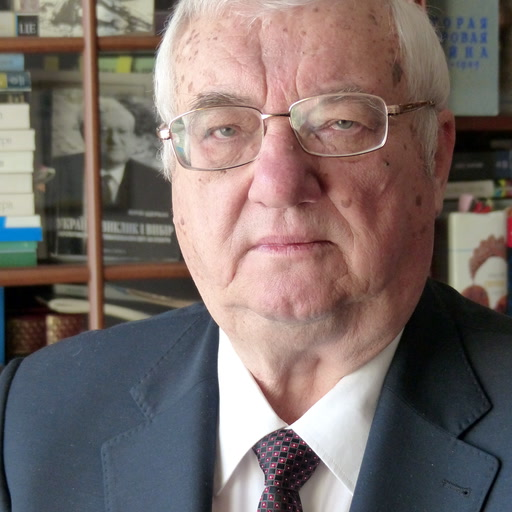

# Yurii Mykolaiovych Shcherbak

**Birth:** October 12, 1934, Kyiv, Ukrainian SSR
**Occupation:** Physician-epidemiologist, writer, ecologist, diplomat, politician
**Languages:** Ukrainian
**Notable Works:** the "Час" trilogy (2011–2014); *Чорнобиль* (*Chornobyl*)
**Affiliations:** Union of Soviet Writers; "Зелений Світ" (Green World); first Minister of Environmental Protection of independent Ukraine

## Biography

### Formation: Family, Medicine, and the KGB

Yurii Shcherbak was born on 12 October 1934 in Kyiv. He describes himself as "an anticommunist and anti-Soviet-minded person from about the age of 14–15," his political consciousness formed by his father's accounts of the Holodomor and by the arrest of his older brother — an eminent zoologist — on charges of Ukrainian nationalism.

Trained in medicine, Shcherbak specialized in epidemiology, his doctoral research concerning the spread of rabies among wild foxes — work that drew him into the ecological problems defining his public career. He became a writer, on his own telling, "thanks to the KGB": a 1959 search of his home turned up an Esperanto textbook, which officers mistook for a cipher book. The arrest cost him his manuscripts but opened the door to the Writers' Union; he was later silenced under Shcherbytsky and went unpublished in Ukraine for a decade — a career shaped from its first page by the same surveillance-and-concealment logic the trilogy would later project onto the whole world order.

### Chornobyl, Politics, and Diplomacy

After 1986, ecology became Shcherbak's primary public vocation. As secretary of the Writers' Union he headed its ecological commission from 1987 — work he recalls as opening "a Pandora's box" of concealed information about the disaster. This led to the "Зелений Світ" association, which he chaired, and to his appointment as the **first Minister of Environmental Protection of independent Ukraine**, representing Ukraine at the 1992 Rio Earth Summit.

He then entered parliamentary politics alongside Andrei Sakharov in the Interregional Deputies' Group, and diplomacy as ambassador to **Israel, Canada, Mexico, and the United States** — a turn he describes as the duty "to carry the truth about Ukraine to the world," though his Canadian posting, amid the Melnychenko tape scandal, brought an evolution "from romantic illusions... to realism."

### Return to Fiction

After decades away from prose, Shcherbak returned to fiction in his late seventies with a dystopian trilogy: **Час смертохристів** (*Time of the Death-Christs*, 2011), **Час Великої Гри** (2012), and **Час тирана** (2014). It imagines a collapsed, partitioned Ukraine maneuvered by warlords and a secretive "Club of Locarno" world government, following the intelligence officer Ihor Haiduk from disgraced confessor to providential leader. His publicistic collection *Україна в зоні турбулентності* was, by his own account, "a prelude" to it: the trilogy continues his nonfiction geopolitical commentary rather than departing from it. Critics have proposed a range of labels — antiutopia, political thriller, postmodern dystopia — though Shcherbak calls it "a sharp political thriller and an antiutopia."

## The Trilogy and Its Silence

The trilogy is written, marketed, and read as a sophisticated entry into postmodern Ukrainian dystopia. Its underlying structure is something else: the residual cognitive habit of a *shistdesiatnyk*, for whom history is steered by a hidden, namable hand that a truth-telling intelligentsia hero can expose and master — closer to **Oles Berdnyk's** cosmist prophecy than to the irony and deconstructed heroism defining postmodern dystopia elsewhere.

The paratext shows how this reading was secured. The publisher's blurb foregrounds the author's public biography before any claim about literary quality — the work of "the ex-ambassador of Ukraine to the USA, Canada, Mexico and Israel." The book advertises its credibility through accumulated public office before it advertises its style, and each credential makes ordinary literary objections feel disproportionate to the stature of the person criticized.

### Conspiracy as Literal Worldbuilding

In genuinely postmodern paranoid fiction, the hidden order behind events is left epistemologically unstable: the reader cannot tell whether the conspiracy is real, a symptom of paranoia, or a figure for diffuse power. Shcherbak's trilogy does not work this way. Its hidden world order is simply, narratively, true. The "Club of Locarno" is not a rumour characters debate but an operative fact that "declared Basmanov an enemy of humanity... and set a price of 1 billion globos on his head," and that later negotiates Ukraine's fate directly.

This is load-bearing: *змова* (conspiracy) occurs seven times in the first volume, eight in the second, twenty in the third. The villains voice the hidden order in the vocabulary of historical antisemitic conspiracy theory — "the world government of Judeo-liberal conspirators." These lines belong to characters the narrative plainly discredits, which could read as ironic distancing; but the defence does not hold, because the Club of Locarno really exists and really rules, in the same register of narrated fact as any other institution in the novel. The trilogy occupies an unstable position between satirizing conspiracy theory and structurally depending on it — a confusion DeLillo and Pynchon avoid precisely because there the reality of the hidden order stays in question.

### The Providential Hero

The three plots trace one arc: a disgraced confessing sinner becomes, by stages and without the narrative ever revisiting his self-indictment, the providential leader the myth around him predicted. In the first volume Haiduk calls himself "a servant of God" in a confessional diary admitting his betrayals; by the third he is Coordinator and General of the Army. Recent scholarship praises exactly this — Haiduk "gradually self-actualizes the genetically laid characteristics of a leader," becoming "a winner in the eternal conflict 'man–system'."

That last phrase marks the distance from the genre's model. Orwell's Winston Smith observes injustice to the point of defeat; *1984* is built to refuse the fantasy of a single redemptive hero overturning a total system. Shcherbak supplies that hero without irony, and is praised for supplying him. The structure is Berdnyk's naive cosmism in thriller furniture: one gifted individual, armed with superior moral and national clarity, decodes a hidden system that eluded everyone else and sets the world right by personal virtue.

### Where the Silence Breaks

Ukrainian criticism has registered the trilogy's genre hybridity, political urgency and moral seriousness in detail, but has almost uniformly declined to name its naivety or conspiracism. Oksana Holnyk comes closest, observing that "in the thickened colors of the depicted world, one senses the present, all of whose flaws are exaggerated, hypertrophied, caricatured" — then reclassifying the book downward, to "the genre of political pamphlet." A downgrade dressed as genre clarification is the nearest the record comes to a craft critique.

The silence is institutional and generational rather than total. The senior establishment supplied uniformly laudatory cover endorsements — Dziuba, Skurativskyi, Pavlychko, Petrovskyi — while the same book "provoked sharp rejection and polemic over the work's aesthetic value among the younger generation." Andrii Drozda, writing on a literary blog rather than a peer-reviewed venue: "I was laughing at almost every page. Yurii Shcherbak has written a very funny novel, a spectacular parody of the dystopian genre… If one reads it as a complete fake, written in a deliberately amateurish style, then one has to admit — it is a masterpiece." The silence governs the platforms where Shcherbak's authority carries most weight, and dissolves where it commands less deference.

## Selected Works

- *Причини і наслідки* (*Causes and Consequences*)
- **1998** – *Стратегічна роль України* (*The Strategic Role of Ukraine*)
- **2011** – *Час смертохристів: Міражі 2077 року*
- **2012** – *Час Великої Гри: Фантоми 2079 року*
- **2014** – *Час тирана: Прозріння 2084 року*
- *Україна в зоні турбулентності*

## Legacy

Shcherbak's career unites several public lives — physician, ecologist who helped break open Chornobyl's official secrecy, first minister of a newly created state institution, ambassador on four continents, and finally a novelist projecting decades of geopolitical experience onto a speculative future. He has been described as a leading figure of the *shistdesiatnyky* generation and, more ceremonially, as a "Patriarch" of Ukrainian letters.

The trilogy is that generation's last full-scale deployment, and Shcherbak meant every word of it. But published into a culture already saturated with internet-era conspiracy thinking and ironic detachment, it began telling a different truth than the one intended. Its sincerity is what makes its comic afterlife possible: a providential-leader myth so unguarded it reads as satire of providential-leader myths. A deliberately ironic text could not produce this effect, because deliberate irony already knows it is funny.
