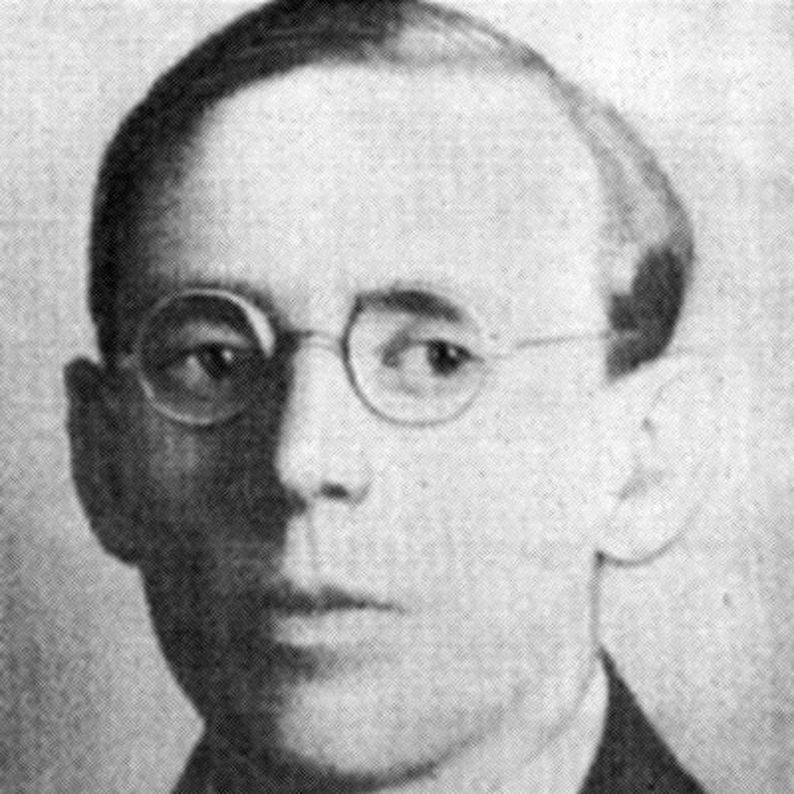

# Yuriy Kornyovych Smolych

**Birth:** 1900, Russian Empire
**Death:** 1976, Kyiv, Ukrainian SSR
**Occupation:** Novelist, theatre critic, memoirist
**Languages:** Ukrainian
**Notable Works:** *Beautiful Disasters* trilogy (*Прекрасні катастрофи*), *The Last Edgewood*, *Розповідь про неспокій* (memoir trilogy)
**Affiliations:** VAPLITE (Free Academy of Proletarian Literature), Technical-Artistic Group "A", Union of Soviet Writers

## Biography

### Early Life and the Kharkiv Literary Scene

Yuriy Smolych came to literature in Kharkiv — then the capital of Soviet Ukraine — by way of the theatre, working first as an actor and then as an assistant director before turning decisively to prose in the mid-1920s. He was fluent in the vocabulary of contemporary science and pseudoscience and became a member of the modernist writers' organization **VAPLITE** (Vilna Akademiia Proletarskoi Literatury), the most consequential and politically exposed literary circle of 1920s Ukraine. Alongside the poet Maik Yohansen, he co-founded the "Technical-Artistic Group A," a small Kharkiv faction experimenting with detective fiction, adventure plots, and speculative premises.

He married twice: first to Ada Skuratova, and later to Olena (Elena) Smolych, who survived him.

Smolych was personally close to the writer **Mykola Khvylovy**, the central figure of VAPLITE, and was present in the room with Khvylovy's body on the night of his suicide on 13 May 1933 — an event that shook the entire generation of Ukrainian modernist writers and marked a turning point in Smolych's own life.

Less commonly noted is that, before his literary career, the young Smolych had served in **Symon Petliura's forces** during the Ukrainian civil war, first as an artillery gunner and then as a clerk on an ataman's staff, while his elder brother was already a Denikinist émigré — a biographical fact some historians have linked to his later vulnerability to recruitment by the Soviet secret police.

### Recruitment as a Secret-Police Informant

In early 1935 Smolych was recruited by the Kharkiv NKVD and assigned the cryptonym **"Стріла" ("Strila" / "Arrow")** on 13 February 1935. He served as an informant for decades, filing detailed reports on fellow writers, including a notable 1940 report on the filmmaker **Oleksandr Dovzhenko**, preserved in Dovzhenko's own NKVD file. Declassified KGB memoranda show he continued to be consulted informally by his handler, Colonel Valentyn Tsurkan, into the 1970s. Even his own wife did not learn of this role for nearly twenty years. This dimension of Smolych's biography was reconstructed from the Sectoral State Archive of the Security Service of Ukraine by the historian Yaryna Tsymbal in 2020.

### Literary Career

Smolych's fiction debut in the genre was the 1925 novel *Останній Ейджевуд* (*The Last Edgewood*). He is best known, however, for the trilogy **Beautiful Disasters** (*Прекрасні катастрофи*): *Doctor Halvanesku's Estate* (*Господарство доктора Гальванеску*, 1929), *Another Beautiful Disaster* (*Ще одна прекрасна катастрофа*, 1932), and *What Happened Next* (*Що було потім*, 1934). The trilogy is widely regarded as the founding, most technically ambitious work of Ukrainian-language science fiction, following a Soviet Ukrainian scientist across Romania, the USSR, and the British Empire and its colonies as she confronts and ultimately survives a scientist's plan to convert workers into mechanized automatons.

After 1934 Smolych never returned to science fiction. He shifted instead to autobiographical fiction — the trilogy *Наші таємниці* (1936), *Дитинство* (1937), *Вісімнадцятилітні* (1938) — followed by war novels and postwar historical fiction. His most significant late work is the memoir trilogy **Розповідь про неспокій** (begun 1963, published 1968–1969, with a third volume in the early 1970s), which recovered, for the first time in Soviet Ukrainian print, substantial material on the VAPLITE generation, including the still-unrehabilitated Khvylovy.

### Assessment

The literary historian Walter Smyrniw has argued that Smolych's reputation as "founder of Ukrainian science fiction" reflects Soviet-era canon management more than literary merit, suggesting instead that it "would not be a mistake to call Yu. Smolych the founder of Ukrainian **ideological** fantasy." Smolych's trilogy is nonetheless credited with giving the genre its first serious, professionally executed, multi-volume foundation in Ukrainian letters.

## Selected Works

### Novels and Novellas
- **1925** – *Останній Ейджевуд* (*The Last Edgewood*)
- **1929** – *Господарство доктора Гальванеску* (*Doctor Halvanesku's Estate*)
- **1932** – *Ще одна прекрасна катастрофа* (*Another Beautiful Disaster*)
- **1934** – *Що було потім* (*What Happened Next*)
- **1941** – *Театр неизвестного актера*

### Autobiographical and War Fiction
- **1936** – *Наші таємниці*
- **1937** – *Дитинство*
- **1938** – *Вісімнадцятилітні*
- **1946** – *Вони не пройшли*
- **1950** – *Ми разом були в бою*
- **1956** – *Світанок над морем*
- **1958** – *Мир хатам, війна палацам*
- **1960** – *Реве та стогне Дніпр широкий*

### Memoirs
- **1968** – *Розповідь про неспокій*
- **1969** – *Розповідь про неспокій триває*
- **early 1970s** – Third memoir volume

## Legacy

Smolych's trilogy remains a foundational, if ideologically fraught, monument of Ukrainian science fiction — the first sustained, technically serious work in the genre, built by a writer whose social centrality, erudition, and literary skill made him equally valuable to the NKVD as an informant and to Ukrainian letters as a genre pioneer. His later memoirs recovered, however partially and under continued censorship pressure, some of the historical memory of the "Executed Renaissance" generation that his own reports had helped the state to surveil.
