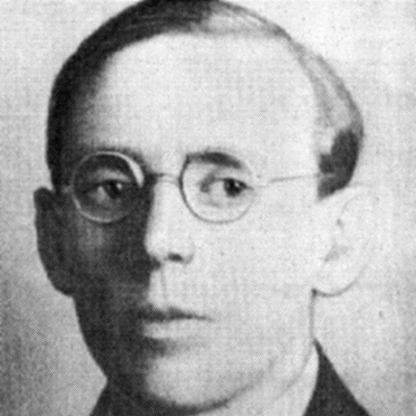

# Yuriy Kornyovych Smolych

**Birth:** 1900, Russian Empire
**Death:** 1976, Kyiv, Ukrainian SSR
**Occupation:** Novelist, theatre critic, memoirist
**Languages:** Ukrainian
**Notable Works:** *Beautiful Disasters* trilogy (*Прекрасні катастрофи*), *The Last Edgewood*, *Розповідь про неспокій* (memoir trilogy)
**Affiliations:** VAPLITE (Free Academy of Proletarian Literature), Technical-Artistic Group "A", Union of Soviet Writers

## Biography

### Early Life and the Kharkiv Literary Scene

Yuriy Smolych came to literature in Kharkiv — then the capital of Soviet Ukraine — by way of the theatre, working first as an actor and then as an assistant director before turning decisively to prose in the mid-1920s. He was fluent in the vocabulary of contemporary science and pseudoscience and became a member of the modernist writers' organization **VAPLITE** (Vilna Akademiia Proletarskoi Literatury), the most consequential and politically exposed literary circle of 1920s Ukraine. Alongside the poet Maik Yohansen, he co-founded the "Technical-Artistic Group A," a small Kharkiv faction experimenting with detective fiction, adventure plots, and speculative premises.

He married twice: first to Ada Skuratova, and later to Olena (Elena) Smolych, who survived him.

Smolych was personally close to the writer **Mykola Khvylovy**, the central figure of VAPLITE, and was present in the room with Khvylovy's body on the night of his suicide on 13 May 1933 — an event that shook the entire generation of Ukrainian modernist writers and marked a turning point in Smolych's own life.

Less commonly noted is that, before his literary career, the young Smolych had served in **Symon Petliura's forces** during the Ukrainian civil war, first as an artillery gunner and then as a clerk on an ataman's staff, while his elder brother was already a Denikinist émigré — a biographical fact some historians have linked to his later vulnerability to recruitment by the Soviet secret police.

### Recruitment as a Secret-Police Informant

In early 1935 Smolych was recruited by the Kharkiv NKVD and assigned the cryptonym **"Стріла" ("Strila" / "Arrow")** on 13 February 1935. He served as an informant for decades, filing detailed reports on fellow writers, including a notable 1940 report on the filmmaker **Oleksandr Dovzhenko**, preserved in Dovzhenko's own NKVD file alongside more than forty other informant cryptonyms. Declassified KGB memoranda show he continued to be consulted informally by his handler, Colonel Valentyn Tsurkan, into the 1970s. Even his own wife did not learn of this role for nearly twenty years. This dimension of Smolych's biography was reconstructed from the Sectoral State Archive of the Security Service of Ukraine by the historian Yaryna Tsymbal in 2020.

The reports were the work of a trained stylist, and that was the point: a flat denunciation was less useful to officers assessing reliability than a rounded psychological portrait. The Dovzhenko file records genuine pro-Soviet statements alongside private remarks calling NKVD interrogators "enemies and sadists," and a passage of real restraint describing Dovzhenko at Khvylovy's coffin — he took the dead man's head in both hands, kissed the sealed wound, turned, and left. Informing and friendship coexisted in one file. A Tsurkan memorandum of 20 May 1972 shows the same doubleness late in life: Smolych relays Lina Kostenko's distress almost verbatim and calls her "the most talented poetess in Ukraine," while in the same conversation dismissing the dissidents **Oles Berdnyk** and Mykola Rudenko as "psychiatrically ill."

### Literary Career

Smolych's fiction debut in the genre was the 1925 novel *Останній Ейджевуд* (*The Last Edgewood*). He is best known, however, for the trilogy **Beautiful Disasters** (*Прекрасні катастрофи*): *Doctor Halvanesku's Estate* (*Господарство доктора Гальванеску*, 1929), *Another Beautiful Disaster* (*Ще одна прекрасна катастрофа*, 1932), and *What Happened Next* (*Що було потім*, 1934). The trilogy is widely regarded as the founding, most technically ambitious work of Ukrainian-language science fiction.

After 1934 Smolych never returned to science fiction. He shifted instead to autobiographical fiction — the trilogy *Наші таємниці* (1936), *Дитинство* (1937), *Вісімнадцятилітні* (1938) — followed by war novels and postwar historical fiction. His most significant late work is the memoir trilogy **Розповідь про неспокій** (begun 1963, published 1968–1969, with a third volume in the early 1970s), which recovered, for the first time in Soviet Ukrainian print, substantial material on the VAPLITE generation, including the still-unrehabilitated Khvylovy. Its four-year passage through censorship is documented in his own diaries, which record battles with Holovlit over whether "the odious name" of Khvylovy could appear at all. By then the KGB was receiving reports on Smolych's manuscript from other informants — the agent had become a subject of the same surveillance he once served.

## The Trilogy

### A Map of World Capitalism

The trilogy's geography is not incidental. The first volume unfolds in Romania, on a landowner-scientist's estate protected from consequence by the Siguranța: capitalism in its backward, semi-feudal, peripheral form. The middle volume brings the maimed Halvanesku to the Soviet Union, where Soviet medicine — with a pointed nod to Bogdanov's blood-transfusion research — not only heals but "rejuvenates" him, extending humane treatment even to an enemy. The third moves to England, referred to throughout simply as "the island," and to colonial Bombay, against a background of uprisings in India, Madagascar, and Fiji: capitalism in its civilized, imperial form, colonies already alight.

The reader is thus led across a map of world capitalism, from wild periphery to imperial centre, with the USSR as the one island of humanity — physically present in a single volume yet presiding over all three. Where capitalist science maims the human being, socialist science repairs it.

### A Heroine Without a Suitor

The protagonist, "a young and skilful sportswoman" **Yuliya Sakhno**, is neither the object of a romantic plot nor in search of one — a marked departure from the conventions of her moment, when women were not yet reliably admitted to university study. She fires her pistol into the air to summon a ferryman, speaks fluent French, and pursues her own ends: a "new" human type who both acts and preaches.

### The Manifesto Scene

The first volume's confrontation between Sakhno and Halvanesku is the trilogy's one genuine piece of philosophical science fiction, translating Marxist categories of class and exploitation directly into biological language. The human organism, Halvanesku explains, is the most perfect machine, spoiled only by superfluous functions: "the human being has a tendency to think and to feel. Pitiful properties! They are not needed for work... And how much trouble arises from these stupid and superfluous properties! Mutinies, disturbances, revolutions! This must not be." His reply to Sakhno makes the class logic literal: "Under my project only this so-called proletariat is mechanized... I and those like me will live a full life, and you will supply us with means and luxuries. And no disturbances, no revolutions! Is a machine capable of revolution?" Facing conversion herself, she delivers the trilogy's most quoted line: "You will turn perhaps hundreds and thousands, but millions will crush you!"

The plot literalizes what Nikolai Berdyaev called "an almost Manichaean dualism" in the communist mind, dividing the world into the kingdoms of Ormuzd and Ahriman with no shades between. Exploitation becomes flesh. The scheme has a structural weakness, however: Smolych takes it as given that the estate's prosperity requires the experiments, never considering that new technology and reduced manual labour might achieve the same result. Admitting that would have blunted the demonization on which the trilogy depends.

### Automaton or Zombie?

Soviet editors noted that Smolych gave the Čapek robot theme "a wholly independent aspect," since a living human rather than a manufactured one undergoes robotization — and that the villain's surname plays on Luigi Galvani, physiologist of "animal electricity." Walter Smyrniw is harsher: Halvanesku removes the brain and installs a radio receiver in its place, cruder than an automaton, so that next to Čapek's robots Smolych's creations are "no more than zombies." Čapek's robots think, speak, and rebel — the philosophical point of *R.U.R.* Smolych's have had thought surgically removed and cannot rebel by definition. A creature incapable of consciousness was a far safer subject for Soviet science fiction than one capable of revolt.

### From Dialectic to Agitation

By the second volume the dialectical confrontation has given way to barely disguised agitation set in British-ruled Bombay — nine million organized Indian proletarians doing their work, the "pearl of the English crown" ready to fall — closer to a pamphlet than to the bioethical plot of the first book. Ideological statement has displaced dramatized ideological conflict.

The dates matter. A trilogy begun in 1929 by a relatively free Kharkiv modernist was finished in 1934 by a writer who had watched his closest literary patron die by suicide and was months from recruitment as agent "Strila." The narrowing on the page tracks the narrowing in his life. Smolych, on the page at least, became something like a zombie himself, broadcasting the party press through his characters.

## Assessment

Walter Smyrniw has argued that Smolych's reputation as "founder of Ukrainian science fiction" reflects Soviet-era canon management more than literary merit: earlier and arguably more inventive Ukrainian speculative writers stopped being reprinted once their work proved ideologically inconvenient, while Smolych's compliant fiction kept circulating for exactly that reason. Reprint frequency, on this account, measures ideological convenience rather than literary priority. Smyrniw offers a sharper title instead — "it would not be a mistake to call Yu. Smolych the founder of Ukrainian **ideological** fantasy" — which reframes the question: not whether Smolych founded the genre, but why the genre in its founding instance had to be ideological fiction first and speculative fiction second. Ukrainian Futurism and Group "A" offered freer models in principle, but by 1934 a novel that refused the Soviet-versus-capitalist template, or located its villainy inside the USSR, was not survivable for a writer in his position.

## Selected Works

### Novels and Novellas
- **1925** – *Останній Ейджевуд* (*The Last Edgewood*)
- **1929** – *Господарство доктора Гальванеску* (*Doctor Halvanesku's Estate*)
- **1932** – *Ще одна прекрасна катастрофа* (*Another Beautiful Disaster*)
- **1934** – *Що було потім* (*What Happened Next*)
- **1941** – *Театр неизвестного актера*

### Autobiographical and War Fiction
- **1936** – *Наші таємниці*
- **1937** – *Дитинство*
- **1938** – *Вісімнадцятилітні*
- **1946** – *Вони не пройшли*
- **1950** – *Ми разом були в бою*
- **1956** – *Світанок над морем*
- **1958** – *Мир хатам, війна палацам*
- **1960** – *Реве та стогне Дніпр широкий*

### Memoirs
- **1968** – *Розповідь про неспокій*
- **1969** – *Розповідь про неспокій триває*
- **early 1970s** – Third memoir volume

## Legacy

Smolych's case resists the two easiest readings — that the informant work was incidental to the literary achievement, or that it cancels it. The archival record points to a single mechanism producing both. The social centrality, erudition, and psychological insight that made him useful to the security services are the same qualities that equipped him to write Ukrainian science fiction's first ambitious, professionally executed work. Under the conditions of Kharkiv after 1933, a founding work of Ukrainian science fiction and a founding act of ideological compliance were not two things that happened to coincide in one writer. They were the same act, seen from two archives. His memoirs recovered, partially, the memory of the "Executed Renaissance" generation his own reports had helped the state surveil.
