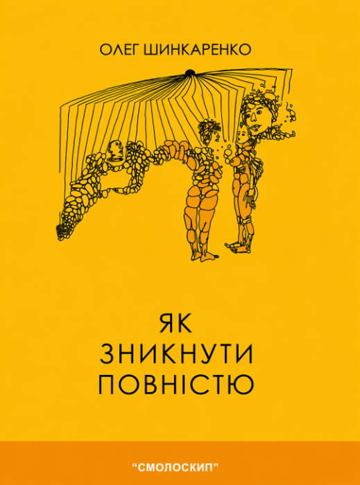
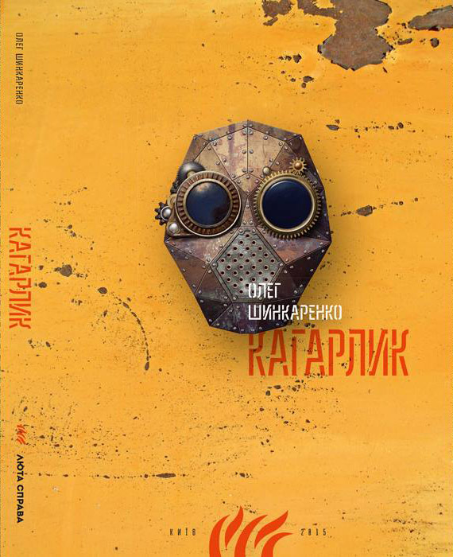
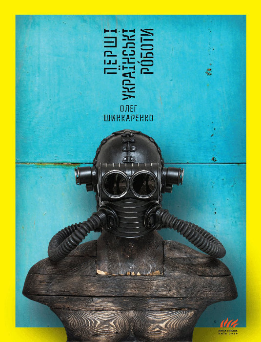
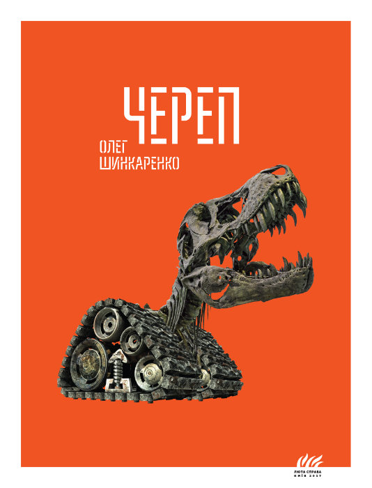

# Мої книги

П'ять прозових творів — від сюрреалістичних оповідань і постапокаліптичних романів до політично загостреної сатири. Кожен текст крізь метамодерну призму досліджує ідентичність, мову, пам'ять і досвід людини, яка живе в Україні.

---

  
  

    <strong><a href="yak/">Як зникнути повністю</a></strong>
    2006 · Коротка проза
    
Дебют, що перевіряє межі мови та стійкості читача — лауреат Літературної премії «Смолоскип».

  

  
  

    <strong><a href="kaharlyk/">Кагарлик</a></strong>
    2014 · Роман
    
Постапокаліптична Україна через сто років після російсько-української війни — де історія стала набором чуток, а ідентичність — конкуруючими завантаженнями.

  

  
  

    <strong><a href="robots/">Перші українські роботи</a></strong>
    2016 · Роман
    
Спекулятивний любовний трикутник, що руйнує власну логіку — запитуючи, чи залишилася хоч якась значуща межа між людиною та штучним.

  

  
  

    <strong><a href="cherep/">Череп</a></strong>
    2017 · Роман
    
Гротескна подорож крізь пропаганду й імперський міф — війна починається не зі зброї, а з мови, що стирає неоднозначність.

  

  
  

    <strong><a href="bandera/">Бандера Distortion</a></strong>
    2019 · Роман
    
Відмовляється звести Бандеру до єдиного сенсу — незручне дослідження того, як суспільства конструюють і ідеалізують чи демонізують історичних діячів.

  

