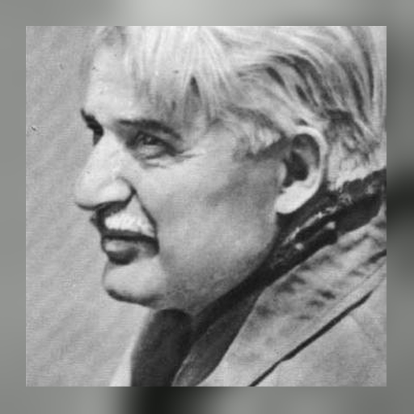
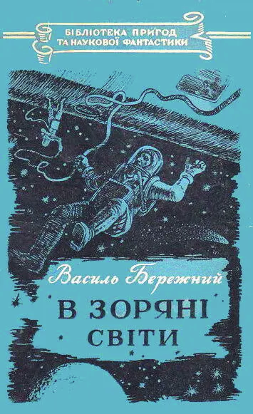
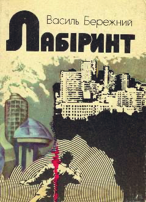

# Vasyl Berezhnyi: Collapse of Techno-Communism

**Oleh Shynkarenko (Pécs)**  
*SLAVIA časopis pro slovanskou filologii 95, 2026, 3, 280–296*  
[https://doi.org/10.58377/slav.2026.3.03](https://doi.org/10.58377/slav.2026.3.03)

The article examines the intellectual and literary evolution of Ukrainian science fiction writer Vasyl Berezhnyi (1918–1988) as a reflection of the broader decline of Soviet techno-communism. By contrasting his early utopian novel *В зоряні світи* [To the Starry Worlds, 1956] with his final collection *Лабіринт* [Labyrinth, 1986], the study traces a trajectory from the optimistic, state-sanctioned positivism of the early space age to a disillusioned, postmodern irony. The author argues that Berezhnyi’s transition from depicting science as a tool for socialist triumph to portraying it as a fragmented, forgotten relic mirrors the historical exhaustion of the Soviet ideological project and the failure of “the Moon Race”. Utilizing historical-biographical contextualization and comparative genre analysis, the research situates Berezhnyi within the repressive postwar literary environment and demonstrates how his later works, specifically the story *Формула Космосу* [The Formula of the Cosmos], serves as a tragic elegy for the techno-communist utopia.

**Keywords:** Vasyl Berezhnyi, Ukrainian science fiction, techno-communism, socialist realism, postmodernism, Soviet space age, intellectual evolution, positivism, ideological disillusionment, Cold War literature, Ukrainian literature of the 2nd half of the 20th century

---

The article traces the intellectual and ideological collapse of Soviet techno-communism[^1] through the philosophical and literary evolution of Vasyl Berezhnyi. Once a true believer in the unity of science and socialism, Berezhnyi became a powerful chronicler of that vision’s disintegration. His life and work mirrored the broader trajectory of 20th-century thought: from the optimistic positivism of the scientific age, through the self-correcting doubt of post-positivism, and finally into the ironic fragmentation of postmodern relativism.

This journey is not only historical – it is deeply personal. In the Soviet Union, science fiction served as a conduit for state ideology, projecting socialist aspirations into the cosmos:

> The primary and radical feature of this early Soviet SF was its clearly articulated ideological orientation […]. Official ideology, having realized the potentiality of SF as a convenient service genre, began purposefully to subjugate and use SF for its own confirmation. The interpenetration of ideology and fantasy turned SF into the means of affirming and legitimizing the official myth (Nudelman 1989, 40).

The works of Vasyl Berezhnyi remain largely unexplored. During the Soviet era, literary criticism paid little attention to works of science fiction. Any reflections on these texts appeared mainly in book prefaces and were mostly confined to plot summaries and comments of a purely ideological nature. There are only two articles on Berezhnyi (Tykhovska 2013, Volynskyi 1988) and a few pages in Walter Smyrniw’s study (Smyrniw 2019). Even the author of one of the two articles, Oksana Tykhovska, notes that there is “not a single literary study” about Berezhnyi. Yet, Berezhnyi is the author of “‘збірок повістей та оповідань, котрі масовими тиражами видаються й перевидаються українською мовою’ […], перекладені багатьма європейськими мовами“ (Tykhovska 2013, 172). The published articles cannot be called rigorous, as they focus mainly on retelling the plots of his works, fail to place Berezhnyi in the context of the literary process, do not mention the circumstances that led to his writing, and do not demonstrate the creative evolution of the author, often limiting themselves to subjective judgments without examples. For instance: “В. Бережний був світилом в історії української фантастики, він був новатором, мав багату уяву, але не дуже вдало зображував космічні подорожі.” (Smyrniw 2019, 183). Smyrniw does not explain or illustrate this conclusion. Literary critic Kost Volynskyi (1988, 14) devoted much space of his article to the history and specificity of the science fiction genre, summarizing the plots of Berezhnyi’s works, but provided only a few lines of actual analysis of the author’s writing.

Such an approach cannot be productive in literary studies, as none of the scholars or critics mentioned the historical context in which Berezhnyi was writing.

In the 1930s, Ukrainian literature suffered massive repression. Many prominent authors were physically eliminated by order from Moscow to weaken the literary process. These events are now known as the “Executed Renaissance” (Lavrinenko 1959). During World War II, Ukrainian literary and cultural life became more active due to temporarily weakened ideological pressure. Writers found space to address national and patriotic issues, reflecting both the fight against fascism and their hopes for the future. Many writers were evacuated during the war, with publishing houses and the Writers’ Union administration relocating to Ufa, Russia. Over a hundred participated either at the front or in partisan units, supporting front-line publications. Prominent figures such as M. Kulish, O. Teliga, and O. Olzhych tragically lost their lives due to conflict, persecution, or execution. The literature of this period was marked by patriotic and liberation motifs, philosophical reflection, and strong feelings of love for Ukraine and faith in victory. Key works include M. Bazhan’s *Клятва* [The Oath], A. Malyschko’s *Україно моя* [My Ukraine], P. Tychyna’s *Похорон друга* [Friend’s Funeral], M. Rylsky’s *Жага* [Longing] and *Слово про рідну матір* [Word about The Native Mother], and L. Pervomaisky’s *Земля* [The Land]. Works by O. Dovzhenko, V. Sosyura, and Yu. Yanovsky were harshly criticized and banned for their national content. The postwar years saw the emergence of the novel as a dominant genre, with O. Honchar’s trilogy *Прапороносці* [Standard-Bearers], M. Stelmakh’s *Велика рідня* [The Great Family], and G. Tyutyunnyk’s *Вир* [The Whirlpool] vividly depicting the events of WWII. Despite notable highly romantic novellas and cinema scripts, Socialist Realism became the dominant and increasingly enforced literary method during the early postwar construction of socialism.

Ukrainian science fiction could not be realistic due to understandable genre features, so it was guided by the principles of techno-communism. Vasyl Berezhnyi conscientiously adhered to these principles until the very idea of techno-communism exhausted itself by the 1980s. At that point, his creative work underwent a noticeable shift, eventually leading him to the sharp irony of postmodernism in the 1980s. Tracing this literary evolution is crucial, as it almost directly parallels the development of European positivism: from a fascination with science and technological progress to extreme relativism and skepticism. In this way, it becomes clear how, even within totalitarian societies like Ukraine in the 1950s–1980s, as discussed in this article, literature closely reflects the progression of public thought.

## From Positivism to Techno-Communism

The intellectual trajectory of modern science, and by extension science fiction, mirrors a broader philosophical evolution – from the dogmatic optimism of positivism to the skepticism of post-positivism and finally into the fragmented relativism of postmodernity. This journey reflects not merely a shift in methodology but a deep transformation in the collective belief about what science is, what it can achieve, and whether it still holds an exclusive claim on truth.

In the 19th century, Auguste Comte envisioned positivism as a secular theology where science would replace religion and guide humanity toward progress and peace. This optimism spread widely, influencing even Marxist ideologies that saw scientific development as historical destiny. However, the catastrophes of the 20th century showed that scientific advancements often fueled destruction rather than liberation. Reason and progress failed to prevent war and genocide; the nuclear bomb symbolized the ethical collapse of scientific triumphs. To address this, logical positivists argued for grounding knowledge in empirical verification, but their verification criterion proved philosophically weak. Karl Popper responded by proposing falsifiability as the measure for scientific theories, ushering in the era of post-positivism where knowledge remains provisional (Popper 1959). By the 1960s, Thomas Kuhn’s ideas of “paradigm shifts” and Paul Feyerabend’s challenge to scientific methods further weakened positivist confidence and highlighted the social factors behind science. Postmodern thinkers like Jean-François Lyotard (1984) and Michel Foucault (1980, 109–133) rejected universal truths, emphasizing that power and ideology shape knowledge rather than objective reality. Science, instead of occupying a privileged position, became just one “language game” among many. In the digital era, public trust in expertise has declined, and scientific claims are now filtered through social narratives, echo chambers, and algorithmic bias, making shared reality increasingly fragmented.

Positivism and Marxism (as communism or Marxism-Leninism) share profound ideological kinships rooted in their common faith in scientific methodology as the key to understanding and transforming society. Auguste Comte’s positivist philosophy proclaimed that “positivism has gradually taken possession of the preliminary sciences of Physics and Biology, and in these the old system no longer prevails. All that remained was to complete the range of its influence by including the study of social phenomena” (Comte 1853, 12), a conviction that Marx enthusiastically embraced when he declared his intention to analyze capitalism “with the precision of natural science” and compare his methodology to that of a physicist studying physical phenomena. Marx’s conception of “scientific socialism” explicitly adopted positivist principles, as he sought to establish historical materialism as an empirical science that could reveal the objective laws governing social development, proclaiming in *The Communist Manifesto* that “the theoretical conclusions of the Communists are in no way based on ideas or principles that have been invented, or discovered, by this or that would-be universal reformer” but rather derive from “actual relations springing from an existing class struggle” (Marx – Engels 1848, 22). Both positivism and Marxism rejected metaphysical speculation in favor of observable phenomena, with Marx adopting Comte’s emphasis on empirical verification while applying it to the study of economic relations and class struggle, thus creating what he termed a “scientific” analysis of capitalism’s inevitable contradictions. The convergence of these ideologies becomes most apparent in their shared teleological vision of progress, as Comte’s three-stage law of human development (theological, metaphysical, and positive) parallels Marx’s dialectical progression through modes of production toward the ultimate synthesis of communist society, both promising that scientific understanding would lead humanity from ignorance and conflict to rational organization and universal prosperity (Dobrenko 2007).

Socialist Realism emerged as a pseudo-literary formation deliberately constructed by the Soviet state to serve as the exclusive cultural doctrine that would transform literature into a tool of ideological control and mass propaganda of Marxism-Leninism. The doctrine was officially proclaimed at the First Congress of Soviet Writers in 1934, where Maxim Gorky articulated its foundational principles, but they were not so obvious:

> Socialist Realism is essentially a name applied to Soviet culture’s literary system rather than to a way of writing that is particularly “socialist” or “realist.” Indeed, the “socialist” aspects and “realist” aspects of Soviet literature are more functions of the “superstructure” than they are of the “base.” The “base” is the master plot. […] The primary function of the master plot is very similar to that of ritual understood in these terms. It shapes the novel as a sort of parable for the working-out of Marxism-Leninism in history (Clark 1981, 9).

The formation of Socialist Realism was not an organic literary evolution but rather a bureaucratic imposition designed to replace the diverse experimental movements that had flourished in the early Soviet period with a monolithic aesthetic that served state interests. Andrei Zhdanov, Stalin’s cultural enforcer, crystallized the doctrine’s ideological function.

> Именно потому, что советское государство и наша партия с помощью советской литературы воспитали нашу молодёжь в духе бодрости, уверенности в своих силах, именно поэтому мы преодолели величайшие трудности в строительстве социализма и добились победы над немцами и японцами (Zhdanov 1952, 13).[^2]

The core principles of Socialist Realism were explicitly propagandistic: works had to be proletarian (accessible to workers), typical (depicting everyday Soviet life), realistic (naturalistically rendered), and partisan (supportive of party aims). Stalin himself defined Socialist Realist artists as “engineers of human souls”, emphasizing their role in reshaping consciousness rather than pursuing artistic truth. The doctrine demanded the creation of “positive heroes” who embodied socialist virtues and demonstrated the transformation from individual spontaneity to collective consciousness, effectively turning literature into a vehicle for state mythology rather than authentic artistic expression.

Although Vasyl Berezhnyi’s works of the 1950s clearly belong to Socialist Realism, as I will demonstrate further in the text, the very nature of the science fiction genre is not realistic. For this reason, I propose to classify his most popular novel *В зоряні світи* (To the Starry Worlds, 1956) as techno-communist, and to examine further the dramatic evolution of this author from techno-communism to postmodernism, which will constitute the main theme of this article.

In my research, I employ a historical-biographical contextualization, grounding Berezhnyi’s literary evolution. It combines close textual reading of key passages with ideological critique, revealing the performative propaganda tone of Socialist Realist science fiction and tracing the shift from techno-communist utopianism to postmodern irony within Soviet cultural policy. I utilize comparative genre analysis and thematic evolution mapping – juxtaposing Berezhnyi’s work with European positivism, Marxism, and postmodernism – to illustrate how recurring motifs of space exploration, collective heroism, and technological ethics mirror broader ideological transformations.

Vasyl Berezhnyi was a very prolific author who wrote a great number of books. His complete bibliography includes 15 sci-fi novels, over 50 short stories, and 10 collections of selected works. For the purposes of my research, I decided to limit myself only to two artworks that are most strikingly ideologically opposed and polar: his first novel *В зоряні світи* – clumsy and filled with naive optimism, propaganda of techno-communism executed in exact accordance with the latest publications in the party press – and his last collection of stories *Лабіринт* (Labyrinth, 1986), published thirty years later, when the techno-communist utopia had long since collapsed, and the belated reports of party ideologists in the media were perceived like an evil mockery that provoked bitter postmodern irony in response, which is particularly noticeable in the short story *Формула Космосу* (The Formula of the Cosmos). My task is to show this evolution in literature, which determined my choice of works for consideration.

## General characteristics and development of style

<figure markdown="span">
  { width="260" }
  <figcaption>Vasyl Berezhnyi (1918–1988)</figcaption>
</figure>

Vasyl Pavlovych Berezhnyi (1918–1988) was a Ukrainian writer, journalist, translator, and one of the leading figures in mid-20th century Soviet science fiction. Born into a peasant family in the town of Bakhmach in Chernihiv region, Berezhnyi’s first steps into literature began through journalism. Berezhnyi’s early prose was deeply shaped by his journalistic work for the newspapers fully controlled by the Communist Party. This experience left a noticeable imprint on the stylistic and rhetorical features of his first novel *В зоряні світи*, where characters frequently speak not as individuals engaged in natural dialogue, but as vehicles for ideological messaging. Rather than expressing personal emotion or engaging in realistic conversation, they often deliver monologues that resemble editorials from Soviet newspapers – grand declarations in praise of communist ideals and the organizational superiority of the Soviet state. A representative example can be found in one of the novel’s speeches:

> Тільки великий, високоорганізований колектив, яким є сучасне людство, може зробити крок у космос! І ми безмірно щасливі, що рідна Вітчизна доручила нам здійснити перший політ у зоряні світи! Наша рідна радянська наука відкриває людству шлях до планет, шлях до невідомих таємниць природи в ім’я миру, в ім’я процвітання культури і добробуту всіх народів і рас: білих, чорних, червоних, жовтих. У нас чесна благородна мета, ось чому ми віримо в успіх, товариші!.. Наша мета – з’ясувати можливість використання Місяця для науки, для прогресу людства. Ми хочемо зробити Місяць форпостом передової науки, а не воєнною базою,[^3] як це планують магнати імперіалізму (Berezhnyi 1956, 5)![^4]

This passage typifies the performative and propagandistic tone of early Soviet science fiction, in which fictional characters often functioned less as complex individuals than as mouthpieces for state-sanctioned ideology.

Despite the author’s amateurish and politically charged language approach, the first novel received audience approval because readers were primarily drawn to its plot of a space journey to the Moon:

> Космічна подорож авторства В. Бережного мала феноменальний успіх. Оскільки повість вийшла за рік до того, як Радянський Союз запустив свій перший супутник (4 жовтня 1957 року), читачі прагнули прочитати твір, який стосувався вигаданої експедиції на Місяць. Щойно було розпродано 65 000 примірників першого накладу книги «В зоряні світи», видавець збільшив другий до 100 000, але й вони одразу ж розійшлися. (Smyrniw 2019, 181–182).

The story exemplified the optimistic spirit of techno-communism, presenting interplanetary exploration as a collective scientific effort led by rational, ethical Soviet minds. In this novel and many others that followed, Berezhnyi’s protagonists were scientists, workers, and engineers – figures of the socialist vanguard – united by a drive for knowledge. Technology was a force for harmony, the cosmos a frontier not of conquest, but of cooperation. These themes were in perfect alignment with Soviet ideological goals during the Khrushchev and early Brezhnev eras, when faith in science and progress formed a core component of state propaganda.

Yet the most remarkable feature of Berezhnyi’s biography is how his later works depart from the triumphal tone of his early fiction. The 1980s were marked by stagnation, ideological fatigue, and growing public disillusionment with the Soviet project. In this period, Berezhnyi’s tone shifted. His story *Формула Космосу*, written in the early 1980s, is a poignant critique of the system he once celebrated. The cosmic ideals of earlier decades here rendered tragic, even absurd and comic form.

Berezhnyi’s biography is more than a chronicle of literary production. It is a psychological and ideological arc: from youthful fascination with the stars, through mid-century confidence in socialism and science, to late recognition of the frailty of those dreams. His fiction – once instruments of utopia – became in the end elegies for it. That contradiction makes Vasyl Berezhnyi not merely a propagandist, but a deeply reflective figure in Ukrainian and Soviet literature: one who recorded, in prose and metaphor, the entire rise and fall of a twentieth-century ideology.

## The Evolution of Humor in the Works of Vasyl Berezhnyi

The humor in Vasyl Berezhnyi’s prose transforms from the buoyant techno-optimism of his early novel *В зоряні світи* to the weary pessimism of his later short story *Формула Космосу*, featured in his final collection *Лабіринт* [The Labyrinth]. Berezhnyi’s style evolved from lighthearted situational humor to bitter irony and tragicomedy, reflecting deeper shifts in Soviet society and ideology.

In his early novel, humor often arises from the joyful absurdities of space exploration and the clash between cosmic scale and mundane Soviet reality. For example, in a scene where the main characters explore the dusted ruins of an alien civilization, a daughter jokingly scolds her father for not bringing a cleaning device from Earth: “Ах, тату, чому ви не захопили з дому пилосос” (Berezhnyi 1956, 88)![^5]

This line is spoken when the characters enter an alien archaeological site. The juxtaposition of a historic extraterrestrial discovery with an ordinary household cleaning tool creates a moment resembling a sitcom. The humor here stems from enthusiasm, innocence, and a sincere belief in the accessibility of space.

In another episode, a Soviet bureaucrat fills out travel documents for a space mission as if it were an ordinary domestic trip: “[…] у графi ‘Найменування транспорту’ поставив: ‘Космiчна ракета’[…]” (Berezhnyi 1956, 51).[^6]

Here Berezhnyi mocks the rigidity of Soviet paper forms and their inability to accommodate the fantastic. However, the satire is gentle and affectionate, still rooted in admiration for the cosmic dream.

Thirty years later, in *Формула Космосу*, humor becomes darker and more layered, often revealing the disconnect between technological progress and human fear. In one memorable scene, astrophysicist Kirilo Fedotovych casually mentions to Violetta Mykhailivna that he has an implanted electronic heart stimulator powered by a plutonium battery. Her reaction is instant: “Віолетта Михайлівна трохи відсунулась від столика. – Та не бійтесь, це не той плутоній, яким була начинена бомба, скинута на японське місто Нагасакі. То плутоній-239, а в мене трішечки плутонія-238” (Berezhnyi 1986, 55).[^7]

This scene is comical not only for its absurd reassurance – “only a little plutonium” – but for how it satirizes the shift in public perception: where once nuclear power symbolized progress and heroism, it now inspires anxiety and avoidance. Technology, once a proud symbol of Soviet futurism, has become a source of unease, even suspicion. The humor highlights how human fears catch up with scientific triumphs when ideology fades.

Later, Kirilo speaks with the woman, who seems interested only in whether his scientific work could have brought material rewards:

> – А що, йому могли б i заплатити?  
> – Заплатити? Це не те слово […] Озолотили б!  
> – Невже дорогоцiнне камiння (Berezhnyi 1986, 58–59)?[^8]

This exchange caricatures the materialism and scientific illiteracy of a woman confronted with a cosmic discovery she cannot appreciate. Her flat-footed responses highlight the tragedy of genius being ignored or misunderstood in a petty society.

In *В зоряні світи*, Berezhnyi’s humor reflects youthful optimism, faith in progress, and joy in discovery. The jokes are inclusive, celebratory, and grounded in the belief that science and humanity are naturally aligned.

By contrast, *Формула Космосу* presents a more disillusioned worldview. Humor becomes a tool for critique, sorrow, and survival. It is no longer just about laughing *with*, but sometimes about laughing *against*.

This shift mirrors Berezhnyi’s personal aging, but also the historical context: by 1986, the dream of Soviet techno-communism was faltering. The promises of space-age utopia gave way to stagnation, cynicism, and the rise of consumer triviality. Berezhnyi’s humor matured into something more philosophical, more tragic, and more humane.

## Bright techno-communist dreams

Vasyl Berezhnyi’s *В зоряні світи* is a utopian science fiction novel centered on the first Soviet manned mission to the Moon and the functioning of an orbital space station called The Rose of the Cosmos. The story follows a collective of Soviet scientists and engineers – including the central character, Professor Ivan Pluhar – as they pioneer interplanetary travel with unwavering dedication to scientific progress and communal effort. Berezhnyi depicts a harmonious vision of a future shaped by socialist ideals: peaceful exploration, scientific cooperation, and technological advancement used to benefit humanity, rather than control or exploit it. Through emotional moments, political tension, and philosophical dialogues, the novel reaffirms faith in humanity’s future in space, provided it is guided by the values of collectivism, peace, and knowledge rather than capitalist ambition.

The text reflects techno-communism through several key ideas: the communal development of space technologies, the ethical use of science for collective human advancement, and sharp critiques of capitalist monopolies. The mission to the Moon is portrayed not as an act of national rivalry or conquest but as a universal civilizational step enabled by socialist cooperation and historical scientific heritage: “[…] щоб створити отаку ракету, людство мусило пройти в своєму розвитку тисячі років! Треба було відкрити механіку, створити металургію, побудувати величезні заводи, електростанції[…] Потрібно було винайти радіо […]” (Berezhnyi 1956, 7).[^9]

Scientific progress is framed as a shared achievement of generations, culminating in a peaceful, collective effort to explore space. The space station The Rose of the Cosmos is powered by solar energy and designed for peaceful research, contrasting with Western capitalist space programs presented in the novel as militarized and profit-driven: “Троянда – це заатмосферна наукова база і міжпланетний вокзал… Колектив наукових працівників уже відкрив стільки нового…” (Berezhnyi 1956, 4).[^10]

In opposition, Berezhnyi presents a capitalist antagonist, Dyk, a monopolist who desires absolute control using advanced technology. His ideology starkly contrasts with the communist ethos of the main crew: “А при сучасному розвитку науки й техніки, влада помножується, посилюється у сто, в тисячу крат” (Berezhnyi 1956, 72)![^11] He imagines the Moon as a weapons platform: “Встановлюй атомну катапульту і роби контроль над всякою країною… Хто тримає Місяць, той володіє Землею!” (Berezhnyi 1956, 39)[^12]

Berezhnyi does not even entertain the idea that inhabitants of other, non-communist countries might also be interested in scientific discoveries, feel the thrill of pioneering exploration, or thirst for travel. The only purpose he ascribes to people outside the USSR is personal enrichment and opposition to communism.

In one of the most ideologically charged scenes in the novel, Berezhnyi dramatizes the direct clash between the Soviet vision of science and the capitalist drive for domination. The dialogue between the Soviet professor Pluhar and the capitalist representative Dick highlights this stark contrast: “Я єсть директор і представник фірми ‘Атомік-Вельт’, – відрекомендувався по радіо чужий скафандр. – Я єсть командир експедиції Дік” (Berezhnyi 1956, 58).[^13] This is followed by Dick asserting his company’s ownership of the Moon: “Ця територія і все, що на ній, під нею і над нею – все це власність нашої фірми. У нас є документи” (Berezhnyi 1956, 58)![^14] Pluhar responds to that with bitter irony: “Може, ваші фірми оптом і вроздріб продають зорі Чумацького шляху” (Berezhnyi 1956, 59)?[^15]

This scene is not just a moment of narrative tension – it is a sharp ideological allegory. The capitalist is depicted as absurd and delusional in his belief that celestial space can be privatized. The Soviet scientist, grounded in reason and ethics, rejects this notion categorically: “Мир, праця, наука – ось що нас приваблює” (Berezhnyi 1956, 59)![^16]

This confrontation encapsulates the techno-communist worldview: technology and science must serve human progress, peace, and collective good, not imperialist ambition or private gain. Thus, Soviet propaganda could justify any actions of its government: after all, Soviet scientists strive for peace and progress for humanity, while their counterparts in capitalist countries only want to enrich themselves and establish control.

The next is one of the most ideologically charged scenes in the novel, and it offers a clear, almost theatrical confrontation between a Soviet communist scientist (professor Pluhar) and a Western capitalist representative (Dick). Vasyl Berezhnyi, writing during the Soviet period, is deeply influenced by state propaganda, and this dialogue showcases that bias unmistakably. Such an approach was very typical of Soviet science fiction during those years:

> The social space of these fantastic worlds… is always split, antagonistically polarized by the conflict between gigantic and irreconcilably hostile powers: the world proletariat and the world bourgeoisie, city and village, civilization and barbarity, West and East (Nudelman 1989, 40).

The capitalist is portrayed as greedy, manipulative, and absurd, while the Soviet character is noble, rational, and devoted to peace and science. This dialogue – titled *Філософія Діка* (Dick’s Philosophy) – is a textbook example of Soviet propaganda fiction, dramatizing a stark ideological clash between capitalist hedonism and communist moralism. It is written not as a neutral philosophical exchange, but as a highly scripted confrontation, designed to ridicule and discredit capitalist values while affirming the moral, intellectual, and historical superiority of communism.

This scene exemplifies how Berezhnyi, influenced by Soviet propaganda, builds a Manichean world: the East is moral, peaceful, and communal; the West is greedy, militaristic, and absurd. The dialogue simplifies real geopolitical complexities into a clash between noble Soviet science and exploitative Western capitalism.

It is not an objective debate – it is political performance. Still, it powerfully reflects techno-communist ideology, where technology serves peace and collective knowledge, while capitalism seeks to turn the universe into a marketplace. This didactic contrast may seem exaggerated today, but it’s a valuable artifact of its time and ideology.

Dick represents the Western capitalist elite, portrayed as shallow, greedy, and corrupted by luxury: “Глупо сидіти на цьому безлюдному світилі, коли там, над самісіньким морем – розкішна вілла […]. Шикарне авто. Яхта. І елегантні, готові до веселощів жінки” (Berezhnyi 1956, 70)![^17] This is not casual banter, but it is a deliberate caricature. He fantasizes about wealth, indulgence, and sexual pleasure instead of contributing to science or humanity. He is not just selfish, he is almost comically decadent.

Zahorskyi, the Soviet character, is the moral counterweight. He is honest, hardworking, repelled by Dick’s worldview: “Ху, гидко слухати. І як вас, отаких циніків, носить Земля” (Berezhnyi 1956, 70)?[^18] He speaks with moral clarity and personal integrity, embodying “the New Soviet Man” – rational, altruistic, collectivist, productive.

Dick, on the other hand, presents a simplistic, utilitarian worldview: “Суть життя... не в тому, щоб створювати... а щоб... користуватись” (Berezhnyi 1956, 71)![^19] He openly embraces the idea that value lies not in creation, but in consumption. This is propaganda shorthand for capitalist parasitism – the notion that elites exploit the labor of others for private luxury.

To make his “philosophy” more grotesque, he even tries to co-opt Marxist language: “А що говорить ваша, комуністична біблія? – ‘Пролетаріату нічого втрачати, а придбати він може все’. Придбати” (Berezhnyi 1956, 71)![^20]

This line twists revolutionary slogans into bourgeois consumerism,[^21] reducing socialist struggle to greed. It’s a classic propaganda move: to depict the capitalist not just as wrong, but as cynical, intellectually dishonest, and morally bankrupt.

Zahorskyi’s response is immediate and absolute: “Шкода тільки, що ‘філософія’ ваша вовча. Homo homini lupus est – ось ваше кредо” (Berezhnyi 1956, 71).[^22]

By invoking the Latin proverb “Man is a wolf to man”, Zahorskyi unmasks capitalism as social Darwinism, and contrasts it with Marxism: “Iдеали соціалістичної революції […] знищують всяку експлуатацію” (Berezhnyi 1956, 71)![^23]

He draws a line between redistribution for justice and redistribution for domination, affirming communism not as another version of elite power, but as a genuine attempt to end exploitation.

Dick attempts a last defense, citing historical elites: “Плебеї та раби гнулися під важкою ношею життя… але патриції їли із срібних та золотих блюд” (Berezhnyi 1956, 71).[^24]

The implication is: history always had winners and losers – so why not aim to be a winner? This fatalistic worldview is again designed to show that capitalism normalizes inequality, whereas communism challenges it.

This dialogue is not a conversation – it’s an ideological duel written entirely from a Soviet didactic perspective. Every line Dick speaks is crafted to sound selfish, tone-deaf, or morally empty. Every reply from Zahorskyi reasserts the nobility, logic, and humanism of socialism. The characters are not just people, they are symbols in a Cold War narrative: West = decadence and domination, while USSR = labor, dignity, and moral clarity.

## Performative Conformity: Berezhnyi amid Postwar Literary Purges

Yet Vasyl Berezhnyi’s commitment to communist ideology was not naive. As documented by recent research into postwar literary culture in the USSR, writers in the Soviet Union – especially Ukrainian writers – were subject to intense ideological pressure. Following WWII, Stalinist campaigns like the 1946–47 “Zhdanovshchina”[^25] sought to “discipline” and humiliate writers who showed even minor deviations from the official party line. Through performative rituals of political self-criticism, confessions, and forced condemnations, the Soviet literary establishment worked not merely through terror, but through humiliation and coerced conformity.

Berezhnyi witnessed and participated in these rituals. In a letter to fellow writer Oles Honchar,[^26] dated August 29, 1946, he expressed disillusionment with the ideological performances of that year’s party-controlled writers’ conference:

> Оце вчора закінчилися збори письменників. Секретар по пропаганді ЦК КП(б)У Литвин[^27] зробив доповідь про помилки на ідеологічному фронті, особливо на фронті літератури. Потім – дебати. Виступило чоловік 30. Збори йшли довго і нудно. Скільки інтриг! Скільки політичної кон’юнктурної спекуляції! Скільки дріб’язковості і глупства! І все то те влітало в мою голову – аж вона гуділа. Були, звичайно, і хороші, серйозні, глибокі виступи. Але таких мало було (Stepanenko 2012, 267).[^28]

This quote captures the psychological violence of the time: the pressure to play along and to act “as if” one believed, even if genuine faith was absent. Scholars like Iulia Kysla (2018) have shown how such rituals – public displays of fake repentance, unanimous resolutions, and theatrical loyalty – were key mechanisms of Stalinist control over intellectual life.

It is within this context of performative conformity that Berezhnyi’s ideological transformation must be understood. He was a witness to and a participant in the symbolic violence of postwar cultural purges. He saw firsthand how writers were forced to denounce colleagues, rewrite their works, and perform loyalty. He knew that the utopian rhetoric of techno-communism, with its slogans of “progress”, “peace”, and “collective achievement”, masked a machinery of humiliation and ideological coercion.

Last, but not least, Berezhnyi’s disenchantment with techno-communism was deeply influenced by a geopolitical setback that resonated on an emotional and ideological level – the Soviet Union’s failure to win the Moon Race. This defeat was not just technical – it struck at the heart of the techno-utopian ideology that Berezhnyi had once embraced. In the imagined future of early Soviet science fiction, space was a stage for ideological confrontation: heroic Soviet cosmonauts would meet their Western counterparts not only in orbit, but in philosophical debate. Instead, the American astronauts stood alone on the lunar surface, speaking only to Houston and planting a single national flag. There was no “capitalist” versus “communist” dialogue in the Sea of Tranquility – only silence, dust, and American triumph.

Berezhnyi, whose early work such as *В зоряні світи* (1956) depicted socialist cooperation in space as the culmination of human progress, could not ignore the harsh reality: the ideological stage for which he wrote never existed. The Moon was not the site of grand confrontations between communism and capitalism. There were no cosmonauts to debate philosophy with the Americans, no socialist utopia materializing on lunar soil. The entire ideological framing collapsed under the weight of empirical defeat. What remained was only the echo of slogans in Soviet newspapers – abstract, performative, and increasingly hollow.

As a result, later in the 1980s Berezhnyi’s once-fiery techno-communist zeal faded, replaced by disillusionment, subtle irony, and a recognition that science – like literature – could be co-opted by power. The cosmos no longer symbolized the future of socialism, but the unreachable silence beyond ideology.

## The lost Formula of the Cosmos

What makes Berezhnyi’s trajectory especially significant is the sheer temporal breadth of his life and work. Living for seventy years (1918–1988), he was not merely a chronicler of one ideological moment, like many of his peers. Rather, he became a literary witness to – and a participant in – a series of profound historical transformations. His lifespan bridged the early revolutionary fervor of Soviet communism, the wartime trauma, the height of Stalinist repression, the optimistic surge of Khrushchev’s space age, and the creeping stagnation and ideological decay of the Brezhnev era. Berezhnyi transgressed from one worldview into another, carrying with him the fading embers of techno-utopian hope into the fractured, ironic postmodernity of the 1980s.

It is important to note how differently the covers of Berezhnyi’s two books were designed by Soviet publishing houses controlled by the Communist Party. The 1956 novel *В зоряні світи* was published by the publishing house Molod, previously known as Young Bolshevik, a publishing house aimed at raising ideologically loyal communists. The second book, *Лабіринт*, published in 1986, came out in Radiansky Pysmennyk (Soviet Writer), which published only works by members of the Writers’ Union of Ukraine.

The contrast between the covers of Vasyl Berezhnyi’s 1956 and 1986 books reveals a striking transformation in the tone and outlook of Ukrainian science fiction across three decades. The 1956 cover of *В зоряні світи* exudes the clarity, optimism, and techno-communist confidence typical of the early space age. Bold lines, weightless cosmonauts, and a clean celestial backdrop reflect the Soviet dream of mastery over the cosmos, a vision full of rationality and heroism.

<figure markdown="span">
  { width="330" }
  <figcaption>Fig. 1. The cover of Vasyl Berezhnyi’s novel <em>В зоряні світи</em> (Molod, 1956)</figcaption>
</figure>

In contrast, the 1986 cover of *Лабіринт* introduces a darker, postmodern aesthetic: layered urban environments, surreal architectural forms, and a fragmented figure evoke confusion, alienation, and loss of ideological certainty. Here, the future is no longer a straight path to the stars – it is a maze of psychological and societal complexity. This shift mirrors the broader cultural evolution from utopian belief in science to critical, introspective inquiry into the nature of reality and progress.

<figure markdown="span">
  { width="330" }
  <figcaption>Fig. 2. The cover of Vasyl Berezhnyi’s short story collection <em>Лабіринт</em> (Radiansky Pysmennyk, 1986)</figcaption>
</figure>

By the time he penned *Формула Космосу* (a short story from the *Лабіринт* collection) in the final decade of his life, Berezhnyi presents a profoundly different narrative. The dream of techno-communism is not merely questioned, it is quietly buried under the dust of disillusionment, irony, and forgotten genius.

The setting of the story, Kyiv in the 1980s, is symbolic of the broader decline of ideological belief. Streets still bear the names of communist titans and Russian cultural idols – Karl Marx, Lenin, Pushkin – but these names now ring hollow, vestiges of a belief system that the characters no longer live by. The protagonist, Kirilo Fedorovych, a retired astrophysicist, moves through a decaying cityscape and his inner landscape equally worn out. His thoughts drift from scientific ambition to the practical challenge of buying cheaper herring. Once a dreamer, now he queues in Soviet grocery stores and internally mocks himself for still caring about cosmic mysteries: “Комедія, та й годі” (Berezhnyi 1986, 49).[^29]

What makes this story a striking farewell to techno-communist optimism is its treatment of scientific legacy. Kirilo encounters the widow of a fellow scientist, Chaetsky, whose final work – a manuscript possibly containing the unifying *Формула Космосу* – was used to wrap fish and as toilet paper. The woman, Violetta, is indifferent to her late husband’s discoveries. For her, the formulas are detritus from a failed life. “Його вбили оці формули” (Berezhnyi 1986, 53),[^30] she says bluntly. That Berezhnyi allows this dismissiveness to go unchallenged shows how far the belief in science-as-salvation has fallen. The intellectual has become a relic, his work dismissed, his values obsolete. The woman agreed to give the scientist her late husband’s notes only when he promised that the Formula of the Cosmos could be sold for a large sum of money. This detail, in contrast to the first novel where Soviet people were willing to sacrifice their lives for the ideals of science, appears especially comical. Suddenly, Berezhnyi acknowledged that money was needed not only in capitalist countries.

The final scene cements the story’s thematic break from the 1950s vision. Kirilo, carrying the reconstructed manuscript, dies suddenly when Violetta slips on the ice in the street, falls, and crashes into his cardio-stimulator with her leg, accidentally damaging the device. The most tragic detail is not his death, but what happens to the manuscript: “Папка відлетіла вбік, розкрилася, і вітер миттю розметав білі аркуші, пожбурив їх вище дахів, і вони зникли у високості” (Berezhnyi 1986, 66).[^31]

The Formula of the Cosmos is not published. It is not even preserved. It is scattered by the wind, lost to a society that no longer believes in such things. This moment is poetic, brutal, and deeply symbolic: the dream of a universal scientific truth, once envisioned as the cornerstone of the Soviet future, is now mere paper drifting into the sky.

In *Формула Космосу*, Berezhnyi does not rage against the death of the dream. He merely shows it, faded, neglected, and finally gone. The scientist becomes a tragic figure, not because he was wrong, but because his world no longer values what he stands for. The techno-communist utopia that once soared through Berezhnyi’s early work was here, quietly and irreversibly, fallen to Earth.

In 1986, there were still five years left until the end of the USSR, and the publication of such an ideologically damaging story for the Communist Party by Radiansky Pysmennyk seemed very strange. This indicates that even state censors at that time had stopped believing in the purpose of their work and were sabotaging the ban on “incorrect” books.

## Conclusion

The evolution of Vasyl Berezhnyi’s creative path is highly emblematic for Ukrainian science fiction, which began with the triumphant glorification of positivist ideals of techno-communism and ultimately arrived at a profound disillusionment with science and technological progress. A similar trajectory was traced by the philosophy of positivism itself. By the end of the twentieth century, science had ceased to be perceived as a new religion guaranteed to bring happiness to humanity, and was instead regarded merely as a tool for achieving certain technological advances – discoveries that could bring either benefit or harm, depending on the goals of those who controlled the means of production.

Berezhnyi’s works from his later period began to speak more honestly about reality. Even science fiction, in its wildest imaginings of remote worlds, must remain truthful with the reader and not simply serve the interests of the ruling party – a standard possible only when publishing houses are free of state control. Had the USSR collapsed sooner, it is quite likely that Berezhnyi’s postmodern turn would have coincided with similar trends in the science fiction of countries not subject to dictatorship. Yet even this belated change in literary direction shows that the author was keenly perceptive and deeply understood the world around him.

## References

*   **Bastani 2019**: Bastani, A.: *Fully Automated Luxury Communism: A Manifesto*. London 2019.
*   **Berezhnyi 1956**: Бережний, В.: *В зоряні світи: Науково-фантастична повість*. Київ 1956.
*   **Berezhnyi 1986**: Бережний, В.: *Лабіринт: Науково-фантастичні повісті та оповідання*. Київ 1986.
*   **Clark 1981**: Clark, K.: *The Soviet Novel: History as Ritual*. Chicago 1981.
*   **Comte 1853**: Comte, A.: *The Course in Positive Philosophy*. Martineau, H. [trad.]. London 1853.
*   **Dobrenko 2007**: Dobrenko, E.: *Political Economy of Socialist Realism*. New Haven 2007.
*   **Feyerabend 1975**: Feyerabend, P.: *Against Method: Outline of an Anarchistic Theory of Knowledge*. London 1975.
*   **Foucault 1980**: Foucault, M.: *Power/Knowledge: Selected Interviews and Other Writings, 1972–1977*. New York 1980.
*   **Josephson 2010**: Josephson, P. R.: Technological Utopianism in the Soviet Union. *Technology and Culture* 51, 2010, 2, 355–378.
*   **Kuhn 1962**: Kuhn, T. S.: *The Structure of Scientific Revolutions*. Chicago 1962.
*   **Kysla 2018**: Kysla, Iu.: *Rethinking the Postwar Era: Soviet Ukrainian Writers under Late Stalinism, 1945–1949*. PhD dissertation. University of Alberta 2018.
*   **Lavrinenko 1959**: Лавриненко, Ю.: *Розстріляне Відродження. Антологія 1917–1933*. Париж – Мюнхен 1959.
*   **Lyotard 1984**: Lyotard, J.-F.: *The Postmodern Condition: A Report on Knowledge*. Bennington, G. – Massumi, B. [trad.]. Minneapolis 1984.
*   **Marx – Engels 1848**: Marx, K. – Engels, F.: *The Communist Manifesto*. London 1848.
*   **Nudelman 1989**: Nudelman, R.: Soviet Science Fiction and the Ideology of Soviet Society. *Science Fiction Studies* 16, 1989, 1, 38–66.
*   **Polozhii 1986**: Положій, В.: Погляд із минулого: Спроба стислого нарису з історії української і радянської фантастики. In: Славинский, Н. [ed.]: *Подорож без кінця*. Київ 1986, 165–218.
*   **Popper 1959**: Popper, K.: *The Logic of Scientific Discovery*. London 1959.
*   **Shynkarenko 2025**: Shynkarenko, O.: Sandro Kasyanyuk: Enfant Terrible of Ukrainian Techno-Communism. *Slavia* 94, 2025, 4, 430–441.
*   **Smyrniw 2019**: Смирнів, В.: *Українська фантастика: історичний і тематичний огляд*. Пасько, И. et al. [trad.]. Харків 2019.
*   **Stepanenko 2012**: Степаненко, М.: Листи Василя Бережного до Олеся Гончара (1946–1986). *Рідний край* 27, 2012, 2, 267.
*   **Tykhovska 2013**: Тиховська О.: Морально-етична проблематика прози В. Бережного крізь призму мотиву подорожі у часі («Сакура», «Повітряна лінза», «Лабіринт»). *Науковий вісник Ужгородського університету. Серія: Філологія. Соціальні комунікації* 29, 2013, 1, 172–176.
*   **Volynskyi 1988**: Волинський К.: Фантаст Василь Бережний. In: Бережний В.: *Вибрані твори: Наук.-фантаст. повісті та оповідання*. Київ 1988, 5–16.
*   **Zhdanov 1952**: Жданов, А.: *Доклад о журналах «Звезда» и «Ленинград»*. Москва 1952.

---

**Faculty of Humanities and Social Sciences, University of Pécs**  
Oleh Shynkarenko  
Pécs, [singingfoot@gmail.com](mailto:singingfoot@gmail.com)  
ORCID: 0009-0001-1690-8967

[^1]: The term “techno-communism” represents a largely informal and unofficial concept primarily circulating in online discourse and academic debates, lacking a single definitive origin or scholarly founder. While no specific individual can be credited with coining the term, it emerges from broader discussions of technological utopianism that gained momentum in the early 21st century digital culture. The concept relates closely to “Fully Automated Luxury Communism” (FALC), a term popularized by Aaron Bastani’s 2019 book, though its origins trace to the British activist group Plan C in the mid-2000s, who spotted the slogan “Luxury for All” at a Berlin demonstration (Bastani 2019). However, the techno-communist framework extends beyond FALC to encompass various theories linking technological advancement with communist ideological goals. Contemporary usage of “techno-communism” typically appears in discussions of post-scarcity economics, automation, and digital socialism across platforms like Reddit, academic blogs, and political commentary (Bastani 2019). The term has gained traction among leftist futurists who argue that technological developments – particularly artificial intelligence, automation, and renewable energy – could enable the transition to communist abundance that Marx envisioned. Importantly, this terminology acknowledges a historical precedent: the Soviet Union of the 1920s represented what could retroactively be called “techno-communism” in practice. Lenin’s famous declaration that “communism equals Soviet power plus the electrification of the whole country” exemplified this technological determinism (Josephson 2010). The early USSR’s massive technology transfer from American industrial methods, combined with ambitious electrification and industrialization programs, distinguished Soviet communism from agrarian or guerrilla variants in Asia, South America, and Africa through its explicit grounding in technological progress and industrial modernity. I also discussed the term techno-communism in my earlier paper (Shynkarenko 2025, 431–432).
[^2]: “It is precisely because the Soviet state and our Party, with the help of Soviet literature, educated our youth in a spirit of cheerfulness and confidence in their own strength that we were able to overcome the greatest difficulties in building socialism and achieve victory over the Germans and the Japanese.”
[^3]: This is a frequently repeated manipulation in Soviet propaganda that is still used today in speeches by Russian politicians: “We must obtain this territory as our own, or else military bases of other countries will appear there.” Such justifications were precisely voiced during the occupation of Crimea and the eastern regions of Ukraine in 2014.
[^4]: “Only a great, highly organized collective – such as modern humanity – can take the step into space! And we are immensely happy that our beloved Motherland has entrusted us with carrying out the first flight into the starry worlds! Our native Soviet science is opening the path to the planets for humanity, the path to the unknown mysteries of nature in the name of peace, in the name of the flourishing of culture and the well-being of all nations and races: white, black, red, yellow. We have an honest and noble goal – that is why we believe in success, comrades! Our goal is to explore the possibility of using the Moon for science and the progress of humanity. We want to make the Moon a stronghold of advanced science, not a military base, as the magnates of imperialism are planning!”
[^5]: “Ah, Dad, why didn’t you bring the vacuum cleaner from home!”
[^6]: “in the field ‘Type of transport’ he wrote: ‘Space rocket’”
[^7]: “Violetta Mikhailovna moved away from the table a little. – Don’t worry, it’s not the plutonium used in the bomb dropped on the Japanese city of Nagasaki. That was plutonium-239; I only have a little plutonium-238.”
[^8]: “– So, would he have been paid for it? – Paid? That’s not the word... He would have been showered in gold! – You mean precious stones?”
[^9]: “to create such a rocket, humanity had to develop over thousands of years! It had to discover mechanics, create metallurgy, build giant factories and power plants […]. It had to invent the radio […].”
[^10]: “The Rose is an extra-atmospheric scientific base and interplanetary station […]. The collective of scientists has already made so many discoveries […].”
[^11]: “With the current development of science and technology, power multiplies, strengthens a hundred, a thousandfold!”
[^12]: “Install an atomic catapult and exert control over every country […]. Whoever holds the Moon, holds the Earth!”
[^13]: “’I director and representative of firm ‘Atomik-Welt’’, announced the foreign spacesuit over the radio. ‘I commander of expedition, Dick.’”
[^14]: “This territory, and everything on it, under it, and above it – all of it is property of our firm. We have documents!”
[^15]: “Perhaps your firms are selling the stars of the Milky Way wholesale and retail?”
[^16]: “Peace, labor, science – that’s what attracts us!”
[^17]: “It is foolish to sit on this deserted celestial body when over there, right by the sea – a luxurious villa… A fancy car. A yacht. And elegant women, ready for fun!”
[^18]: “Ugh, it’s disgusting to listen to. How does the Earth even stand people like you, such cynics?”
[^19]: “The essence of life... is not to create... but to... make use of things!”
[^20]: “And what does your communist Bible say? – ‘The proletariat has nothing to lose, but it can gain everything.’ Gain!”
[^21]: Bourgeois consumerism denotes an economic and social system in which personal wealth accumulation and consumption of luxury goods are elevated as primary life purposes, reflecting capitalist values of individualism, material indulgence, and social hierarchy maintained through market competition.
[^22]: “It’s just a pity that your ‘philosophy’ is that of a wolf. Homo homini lupus est – that’s your creed.”
[^23]: “the ideals of the socialist revolution... eliminate all exploitation!”
[^24]: “the plebeians and slaves bent under the heavy burden of life… but the patricians dined from silver and gold dishes.”
[^25]: Zhdanovshchina was an ideological campaign launched by Soviet official Andrei Zhdanov in 1946 to enforce strict control over culture. It demanded that literature, music, and science serve communist ideals, rejecting “formalism” and “cosmopolitanism”. Writers and artists were expected to promote socialist realism or face criticism, censorship, or worse. Though Zhdanov died in 1948, his policies shaped Soviet cultural life well into the early 1950s.
[^26]: Oles Honchar (1918–1995), a celebrated Ukrainian novelist and public intellectual, actively supported Soviet propaganda through his adherence to Socialist Realist principles and participation in state-sponsored campaigns that extolled wartime heroism, socialist unity, and allegiance to Communist Party ideology. His 1968 novel *Sobor* marked a pivotal turn, introducing subtle critiques of bureaucratic stagnation and moral decay within Soviet society that sparked both acclaim and controversy.
[^27]: Konstantin Lytvyn (1907–1994), Ukrainian Soviet statesman who served as Minister of Culture of the Ukrainian SSR (1953–1956) and held key propaganda posts in the Communist Party, orchestrated the looting and destruction of Western Ukrainian museum collections – removing and incinerating thousands of artworks and books under the pretext of combating “bourgeois nationalist” culture – thus inflicting lasting damage on Ukraine’s cultural heritage.
[^28]: “Yesterday, the writers’ meeting finally ended. The secretary for propaganda of the Central Committee of the Communist Party of Ukraine, Lytvyn, gave a report on mistakes on the ideological front, especially in literature. Then came the debates. About 30 people spoke. The meeting dragged on for a long time and was terribly boring. So many intrigues! So much political opportunism and speculation! So much pettiness and foolishness! All of it kept flying into my head – until it was buzzing. Of course, there were some good, serious, and profound speeches. But there were very few of those.”
[^29]: “A farce, nothing more.”
[^30]: “Those formulas killed him.”
[^31]: “The folder flew to the side, opened, and the wind instantly scattered the white sheets, throwing them above the rooftops, and they disappeared into the heights.”
