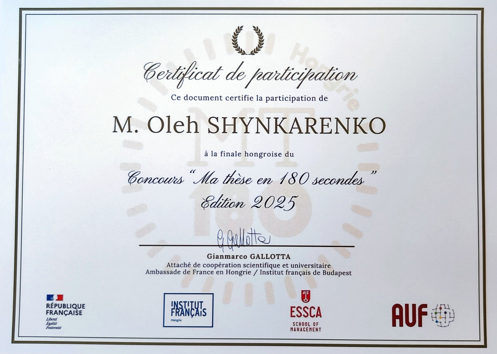

# Моя участь у MT180 – Національний фінал 2025

## Що таке MT180?

**Ma Thèse en 180 Secondes (MT180)** — міжнародний франкомовний конкурс, натхненний *Three Minute Thesis (3MT®)*, розробленим Квінслендським університетом в Австралії. Він дає аспірантам можливість представити тему свого дослідження — за **три хвилини**, **французькою мовою** та **зрозумілою для широкої аудиторії мовою**.

Концепцію було прийнято у **2012 році в Квебеку** асоціацією **Acfas** (Association francophone pour le savoir), після чого вона поширилася по всьому **франкомовному світу**.

**Національний фінал** MT180 відбувся **25 березня 2025 року**.

---

## Мій досвід

Мені випала честь брати участь у **Національному фіналі MT180 2025 року** як **одному з п'яти фіналістів**, кожен з яких представляв різний академічний і культурний бекґраунд:

- **2 учасники з Сирії**
- **1 з Бурунді**
- **1 з Угорщини**
- **І я сам**

Моя дисертація присвячена **історії та філософії української науково-фантастичної літератури**, зокрема тому, як вона **відображає інтелектуальну траєкторію європейського позитивізму** — від **техно-оптимізму** до **постмодерного песимізму**.

Щоб донести цю складну й абстрактну тему за три хвилини, я перетворив свою дисертацію на **франкомовний реп-виступ**. Такий творчий формат дав мені змогу **зацікавити аудиторію**, спростити щільні філософські ідеї та відзначити культурні ритми науки і сторителінгу.

---

## Мій реп про дисертацію MT180

```markdown
Yo! écoute bien, c'est l'histoire d'un Ukrainien,  
Ma thèse ? La Science-Fiction, mon feu et mon lien.  
Les étoiles, les machines et les mondes lointains,  
Moi, petit gosse déjà, tu sais, je rêvais sans fin.

La Science-Fiction d'Ukraine et le positivisme  
Avançaient un peu ensemble, comme le même organisme.  
De techno-espoir aux désillusions,  
Un rêve brisé, tu sais, la même chanson.

Ils rêvaient du ciel, d'un monde en lumière,  
Mais la guerre a teint leurs vies en poussière.  
Les bombes ont parlé, il n'y a plus d'idéal,  
Le communisme? Bof! Juste un mirage fatal.

Comme le positivisme rêvant trop grand,  
Auguste Comte disait : "Kant nous ment".  
La science seule ? Pas ouf! C'était leur cri,  
Mais même la science, au fond, s'est trahie.

Tous les cygnes sont blancs ? Vraiment ?  
Un seul noir - et hop!-hop!-hop! - fini l'argument.  
Lyotard, Foucault ont tout dynamité,  
La vérité? Bof! Un mythe pour dominer.

Deux cents ans à chercher l'ultime vérité,  
L'amour vrai, les vrais hommes et la sincérité.  
Mais nul n'a compris ce que ça signifiait,  
Que faire, que croire? Ah bon?! Et que murmurer?

Kant, Comte, Sartre, Foucault, et cætera,  
Chacun son récit, chacun sa Torah.  
J'donne pas de leçon. C'est pas mon rôle,  
Le bonheur des uns fait le malheur des drôles.

À chacun son poison, chacun son destin,  
Le monde est bien plus vaste qu'on l'imaginait. Fin!
```

---

## Сертифікат

Участь у MT180 була не лише викликом у сфері наукової комунікації, а й можливістю поєднати **академічну думку з творчим виступом**. Представлення своєї дисертації у форматі репу — це спосіб відсвяткувати **перетин науки, літератури та культури** і довести, що навіть найскладніші ідеї можна передати **чітко, з ритмом і душею**.


