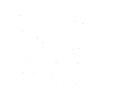

# Наукова фантастика в Україні (частина ІІ)

Українські автори 1970-х зосередилися на пошуку сенсу людського існування, що ознаменувало початок **Золотої доби української наукової фантастики (НФ)**. У 1980-х розпочалося національне відродження, і НФ стала розвивати власні локальні ринки та теми. Економічна криза 1990-х мало не знищила НФ-літературу в Україні. Потім настала повторна русифікація 2000-х, а в 2010–2020-х розпочалася епоха **метамодернізму**, що призвела до другої хвилі національного відродження.

**Ключові слова**: Україна, наукова фантастика, екзистенціалізм, постмодернізм, метамодернізм

**Інформація про автора**  
**Олег Шинкаренко**, аспірант кафедри філософії, Університет Печа, факультет гуманітарних і соціальних наук  
[Профіль у Google Scholar](https://scholar.google.com/citations?hl=en&user=1yCMKj4AAAAJ)  
[ORCID](https://orcid.org/0009-0001-1690-8967)

**Як цитувати цю статтю**:  
Олег Шинкаренко. "Science Fiction in Ukraine, 1920–2020 – Part Two". *Információs Társadalom* XXIV, no. 3 (2024): 61–83.  
[https://dx.doi.org/10.22503/inftars.XXIV.2024.3.4](https://dx.doi.org/10.22503/inftars.XXIV.2024.3.4)

Усі матеріали, опубліковані в цьому журналі, ліцензовані як **CC-by-nc-nd 4.0**

## **1970-ті роки: конформізм і постмодернізм**

1970-ті ознаменували початок епохи так званого **застою**, що тривала двадцять років — аж до розпаду **Союзу Радянських Соціалістичних Республік (СРСР)**. У той час суспільство втратило віру в перемогу **комуністичного позитивізму**; всі мешканці **СРСР** обрали своєю моделлю **прагматизм** і намагалися здобути найкращі умови існування на тлі руйнування соціалістичної економіки.

Прагматизм в **Україні** виявлявся, зокрема, у тому, що письменники нерідко обирали для написання і видання творів **російську мову**. Завдяки цьому вони отримували ширший ринок і більший наклад, адже **російська мова** була зрозуміла в усіх країнах, що входили до складу **СРСР**. Це був своєрідний **конформізм**: письменники вже не ризикували своїм життям заради політичних висловлювань, а обирали шлях найменшого опору задля успішної кар'єри.

Шлях письменника **Бориса Штерна** дуже промовистий у цьому відношенні. Він надіслав своє оповідання **російському письменнику Борису Стругацькому**, аби отримати від нього позитивний відгук. З цим відгуком він звернувся до **російського журналу «Хімія і життя»**, який у 1970-х роках почав публікувати **наукову фантастику (НФ)**.

Публікація в цьому журналі, наклад якого досягав **150 000 примірників**, практично гарантувала швидкий вихід книг і масову популярність серед читачів. Те саме стосувалося і змісту творів. Щоб здобути широку популярність, слід було уникати локальних **українських** тем і писати переважно про те, що відбувається в **Росії**.

Таким чином складалося враження, що все важливе і варте уваги відбувається в **Росії**; **Україна** як колонізована провінційна територія на околиці імперії згадувалася лише зверхньо і принизливо.

Герой **роману Штерна «Нотатки динозавра»** згадує, що буквально втік із **України** до **Росії**, оскільки, на його думку, **Україна** — країна шахраїв і дрібних злодіїв, де кар'єру зробити неможливо (**Shtern 2002**, с. 7).

Ця позиція цілком виразно простежується і в **гумористичній п'єсі Штерна «Острів Зміїний, флот не підведе!»** (**Shtern 1996**). У творі зображено групу адміралів із різних країн світу, які хотіли б захопити цей **український острів**. Кожен адмірал наділений яскраво вираженими шовіністичними рисами, збудованими на **російських стереотипах**.

Оскільки цей текст написаний у **1992 році**, в ньому відчутний особливий **постмодерний гумор**. Важко з певністю сказати, чи є його автор справжнім **російським шовіністом**, чи просто грає роль шовініста, зберігаючи певну дистанцію від цього образу.

Варта уваги і сама історія **острова Зміїний**. Через тридцять років після публікації **п'єси Штерна** розпочалася **російсько-українська війна**, і бойові дії відбувалися саме на **українському острові Зміїний**. Зрештою **Україні** вдалося повернути контроль над островом після того, як він був захоплений **Росією**.

Якщо шукати аналогії в інших літературах, **постмодерна іронія і гумор Бориса Штерна** дуже близькі до тих, що властиві **Станіславу Лему**. Особливо це стосується серії оповідань про **інспектора Бел Амора**, яка нагадує **лемівську серію про пілота Піркса**.

Схожою на долю **Бориса Штерна** була доля надзвичайно обдарованого **українського письменника Володимира Савченка**. Він народився в **Україні**, але виїхав навчатися і будувати кар'єру до **Москви**, а потім повернувся в **Україну**, де працював в **Інституті кібернетики**. **Савченко** писав усі свої твори **російською мовою**, називав себе **російським письменником** і демонстративно вийшов зі **Спілки письменників України**.

У **2002 році** в інтерв'ю письменниці **Яні Дубинянській** **Савченко** висловився про свої почуття щодо розпаду **СРСР**:

> Виявилося, що я — надто радянська людина. Хоча я ніколи не був членом компартії, я був близький до самвидаву і дисидентів. Але коли я побачив результати розпаду СРСР — дещо занепав духом. Ще 1993 року я вийшов зі Спілки письменників України і досі не сумую за нею. Письменник-фантаст не може писати, якщо він не вірить у майбутнє. А сталося так, що я перестав вірити.  
> *(цит. за: Dubynyanska 2002)*

У тому самому інтерв'ю **Савченко** цілком виразно сформулював головне кредо **кіберпанку**, яке автор цієї статті називає **«крахом позитивізму»**:

> Сам факт того, що людина не стає кращою від розвитку технологій та сервісу, доводить, що тут щось не так  
> *(цит. за: Dubynyanska 2002)*

**Російський письменник Ільф** у своїх записних книжках кінця 1920-х зробив цікаве спостереження:

> Раніше в науковій фантастиці головним було радіо. Від нього очікували щастя для людства (Ilf 2021, 123). Ось радіо є, а щастя немає. Відтоді з'явилися авіація, космічні кораблі, лазер, ядерна енергетика — а всезагального щастя як не було, так і немає. Цивілізація не працює на людину  
> *(Dubynyanska 2002)*

**Роман Савченка «Відкриття себе» (1967)** розповідає про **українського аспіранта Кривошеїна**, який за допомогою комп'ютера зі штучним інтелектом синтезував власного клона з надзвичайними тілесними можливостями.

Поговоривши зі своїм клоном, **Кривошеїн-1** вирішує не розголошувати те, що сталося, а відправити **клона Кривошеїна-2** працювати до університету в **Москві**. Тим часом оригінальний **Кривошеїн-1** створює наступного клона — **Кривошеїна-3**, який виявляється психопатом і намагається вбити **Кривошеїна-1**. **Кривошеїн-1** вирішує відправити **Кривошеїна-3** у віддалений куток **Росії**, а сам береться створювати наступні, ще досконаліші клони.

Під час експерименту **Кривошеїн-1** вирішує оновити власне тіло за допомогою синтезатора клонів, але гине. У результаті залишаються численні копії **Кривошеїна-1**, але сам оригінал тепер відсутній.

У філософії **постмодернізму** копія без оригіналу називається **симулякром**:

> *«Симулякр — це не те, що приховує істину; це істина приховує той факт, що її немає. Симулякр є справжнім»*  
> (**Baudrillard 1994, 1**)

Це ключовий термін **постмодернізму**. Однак **Жан Бодріяр** написав свій трактат **«Симулякри і симуляція»** (**Baudrillard 1994**) у **1981 році** — через двадцять чотири роки після публікації роману **Савченка**.

Цей приклад показує, як в **1970-х** ускладнилися тематика і структура **української НФ**. Автори вже не прагнули служити **Комуністичній партії**, виконувати пропагандистські директиви і навіть не тікали від реальності у **«містичну абракадабру»**, як **Олесь Бердник** у **1960-х**. Тепер книги вирішували фундаментальні проблеми людського існування, які незабаром зацікавили і **європейську філософську думку**.

Цікаво, що **роман Савченка**, написаний **російською мовою**, був перекладений **одинадцятьма мовами** у **дванадцяти країнах**, у тому числі у **США** в **1979 році** у серії **«Найкраща радянська наукова фантастика»**, — але **українського перекладу** досі немає.

**1970-ті** та **1980-ті** роки в **українській НФ** мали чимало спільного — і через **цинізм і конформізм** радянських людей, і через поширення **постмодерної парадигми** мислення, яка гармоніювала з конформізмом.

Якщо всі моделі та зразки умовно рівнозначні, як стверджує **постмодернізм**, то навіщо героїчні подвиги в ім'я **Комуністичної партії**? Постмодерна модель сприяла уникненню героїчного пафосу в літературі; перевага надавалася витонченим логічним вправам і літературним іграм.

Одним із яскравих представників цього стилю був **Володимир Заєць**. Лікар за освітою, він присвячував свої оповідання **парадоксальним феноменам психіки** та **філософським проблемам сприйняття реальності**. Уривок з його оповідання **«Темпонавти»**:

> Він вірив і знав, що минуле, теперішнє і майбутнє існують на одній просторово-часовій осі. Найбільше його хвилювало одне: якою мірою майбутнє визначається минулим? Чи слід брати до уваги людську волю, чи ця воля лише уявна і підпорядкована тим самим об'єктивним законам, яким підпорядкована вся природа, включаючи живу? Якщо так — існує лише одне реальне майбутнє. Якщо ні — обриси майбутнього розмиті; в ньому якимось незбагненним чином співіснують кілька рівнозначних і ймовірнісних реальностей.  
> *(Zayets 1986, 17)*

Оповідання письменника вирізняються несподіваним розвитком сюжету і нерідко гострим гумором. В останніх рядках кожного оповідання з'являється несподіваний поворот, який змінює зміст усього тексту. Твори **Зайця** найбільше нагадують оповідання, сповнені гумору і парадоксів, **американського письменника Роберта Шеклі**.

**Харківський письменник Євген Філімонов** написав чимало оповідань, які важко назвати НФ у звичному розумінні, хоча всі ознаки цього жанру в них є. Наприклад, в оповіданні **«Офтальмолог»** (**Filimonov 1988, 212**) лікар якимось дивним чином під час огляду виправляє зір здоровому пацієнтові так, що той починає бачити світ по-іншому: у нього з'являється тонкий смак і інтерес до мистецтва, а банальність і вульгарність, яка раніше подобалася, раптом викликає відразу.

В іншому оповіданні, **«Музична скринька»**, грубий робітник просить лікаря позбавити його спогадів про мелодії класичної музики, що набридливо дзвенять у голові. Після операції він відчуває болісну порожнечу і вирішує зцілитися, слухаючи більше класичної музики.

У третьому оповіданні, **«В дорозі»**, мати намагається пояснити маленькій доньці, що вони вже багато років мчать крізь космос, аби дістатися до далекої зірки, бо їхня власна зірка вибухнула. Але немає жодної впевненості, що планети іншої зірки придатні для життя. То чи не краще зупинитися, не витрачати енергію на швидкість, а спрямувати її на покращення умов існування на зоряному кораблі?

**Філімонов** цікавився складними і неоднозначними темами. У жодному з його оповідань немає ні настанов, ні рецептів, ні пропаганди; він лише пропонує поміркувати, який з можливих способів існування кращий.

Однак навіть наприкінці **1970-х**, коли більшість українських письменників назавжди втратила віру в **утопічні політичні теорії**, залишалися автори, що ніби все ще жили в **1950-х**. Наприклад, фантастичний роман **Анатолія Дімарова «Друга планета»** ([1980] 2017) зображує **тераформування Венери** в XXV столітті, яке призвело до розвитку **фашизму**.

Землянам вдається суттєво поліпшити клімат цієї розпеченої планети з надзвичайним тиском, але жити на ній вони все одно не можуть, тому спеціально для заселення **Венери** штучно виводять дві нові раси: **Венеріанців** і **Орангів**. Перші — лише вдосконалена фізична модифікація людей, тоді як другі значно відстають у розвитку, нагадуючи орангутангів.

**Оранги** розвивають підземну **тоталітарну цивілізацію**, що копіює **германський нацизм** 1930–1940-х років. До планети вирушає делегація **українців**, аби вивчити соціологічні та культурні наслідки існування Орангів. У надрах **Венери** вони знаходять місто, а на площі — статую Оранга з маленькими антенами і табличкою **«Адольф Гітлер»**. Всі **Оранги** кажуть одне одному «гайль» при зустрічі і крокують колонами. Це **мілітаризована держава**, очолювана монархом **Орангом Третім**, побудована на основі ідей **Гітлера** і **Ніцше**.

Головна мета **Орангів** — встановити панування над **Венерою** і знищити расу **Венеріанців**. Мова — людська, тільки з буквами в зворотному порядку, тому слово «вода» перетворюється на «адов»; незмінними залишаються лише слова **«Адольф Гітлер»** і **«гайль»**.

**Земляни** потрапляють у полон до **Орангів** і змушені створювати нових істот для боротьби з **Венеріанцями**, але зрештою їм вдається втекти й попередити всіх про небезпеку **Орангів**.

Роман завершується так:

> Венеро-земний космічний корабель злетів через місяць. За цей час на Венері відбулися великі зміни: держава Орангів зникла. Венеріанці довго сперечалися, що робити з Орангами; лунали навіть голоси оголосити їм війну і знищити до основи, але більшість наполягала на іншому. Оскільки всі Оранги хворі, їх слід не вбивати, а лікувати. Причину їхньої деградації також було підтверджено. Штучний ген інтелекту, який поставив Орангів на один рівень з людьми, виявився нестабільним, і в Орангах прокинулися тваринні інстинкти. Поспішно зводилися величезні лікарні, а потім армади гелікоптерів піднялися у повітря з кулями, наповненими газом. Цей газ не вбивав, а лише приспляв.
>
> Так Оранги були нейтралізовані і поступово доправлені до лікарні, де вже чекало ціле військо лікарів.  
> *(Dimarov [1980] 2017, 85)*

Ця вся розповідь разюче нагадує **сучасну російську пропаганду**, яка стверджує, нібито **українці** захворіли на **фашизм** і їх слід від цього лікувати. **Дімаров** доводить, що фашизм є наслідком **генетичної помилки**, а отже, виліковний засобами **сучасної медицини**. Така практика була поширена в **СРСР**, де **дисидентів** «лікували» за допомогою **каральної психіатрії**.

## 1980-ті роки: перебудова і національне відродження

У **1980-х** марність існування **СРСР** нарешті стала очевидною, а його розпад — лише питанням часу. Всі сфери життя в **Україні** стрімко лібералізувалися; українські письменники, які писали **російською мовою**, вирішили перейти на **українську**, аби підтримати національну культуру. Це були відносно короткі часи національного романтизму, коли здавалося, що незалежність від СРСР вирішить усі проблеми вже самим своїм фактом. Такий піднесений настрій позначився і на **науковій фантастиці (НФ)**. З'явилося багато нових авторів, а досвідчені письменники видали нові книги, деякі з яких стали знаковими.

Оповідання **Наталії Гайдамаки** «Тільки три кроки» (**Haydamaka 1990**) — про екзистенційний вибір. Жінка бачить на дорозі хлопчика, якого от-от збʼє вантажівка, і кидається його рятувати, але раптом якісь невідомі істоти зупиняють плин часу. Вони повідомляють жінці, що через три кроки вона врятує хлопчика, але сама загине, і на їхню думку, її молоде життя цінніше. Істоти радять не робити останніх трьох кроків, а врятуватися самій. Потім вони відновлюють час. Жінці вдається залишитися живою і врятувати хлопчика.

Збірка короткої прози **Ігоря Росоховатського** (**1989**) «Останній сигнал» стала знаковою у 1980-х. Цей автор послідовно розробляв тему **штучного інтелекту** і написав трилогію про «сигома» **Юрія** (синтетична людина — штучна людина): «Гість» (**1979**), «Можливість відповіді» (**1984**) і «Останній сигнал» (**1989**). Сигоми у творах Росоховатського майже ідентичні андроїдам **Філіпа К. Діка** у романі «Чи мріють андроїди про електричних овець?».

Раніше написане оповідання Росоховатського «Сигом і диктатор» (**Rosokhovatskyi 1977**) зображує ситуацію, де логіка і свобода перемагають злу волю. **Сигом** побудований керівником ділової корпорації на прізвисько **Диктатор**, який навмисно обмежує доступ Сигома до інформації. Диктатор прагне побудувати світ, заснований на суворій раціональності. Сигом отримує енергію, споживаючи **аденозинтрифосфат**, який можна добути лише з живих організмів, — а це спричиняє загибель людей чи тварин.

Коли рівень його енергії знизився і виникла потреба її поповнити, Сигом вирушає до лікарні, де знаходить умираючого пацієнта. Цей чоловік — професор **біохімії**, який запитує Сигома, хто він і навіщо прийшов. Сигом відповідає, що його енергетичні ресурси вичерпалися і він прийшов, аби відкачати з професора **аденозинтрифосфат**. Без жодної тіні страху вчений каже: «Розумію», — і пропонує допомогти Сигому завершити формулу нового виду штучного білка, яка може стати корисною при створенні «нових органів» для нього. Коли Сигом відповідає, що не може затриматися, бо Диктатор наказав йому підкорити світ, професор зауважує, що слід прочитати в книгах, чим закінчувалися всі попередні спроби підкорити світ. Сигом відповідає, що Диктатор забороняє читати книги в бібліотеках. Тоді професор заявляє: **«Треба робити те, що люди завжди роблять, — порушувати заборону»**. (**Rosokhovatskyi 1977, 231**)

Шість тижнів Сигом не виходить на зв'язок з Диктатором. Повернувшись, він повідомляє, що створив для себе нові органи, які дозволяють живитися **сонячною енергією**, — і більше не потребує вбивства людей чи тварин для виживання. Крім того, Сигом каже, що не має наміру підкорювати світ, як йому наказали. Почувши це, Диктатор кінчає з собою. Сигом відповідає: **«Це розумно»**. (**Rosokhovatskyi 1977, 234**)

В оповіданні Росоховатського **«Відсутня ланка»** **Сигом** перебудовує своє тіло так, що тепер воно складається з плазми. У ньому не залишилося нічого людського, тому він не відчуває жодних емоцій до людини і не хоче їй допомагати, бо не бачить у цьому жодного практичного сенсу. Сигом прагне досліджувати космос і відкривати фундаментальні закони Всесвіту, але йому бракує однієї ланки для розуміння цих процесів. Після розмови з космонавтом він розуміє, що цією ланкою є **співчуття**.

У цих двох творах помітно, що **Росоховатський** вважає сигомів нижчими: позбавленими емоційного інтелекту та інших рис, притаманних людині. Проте таке ставлення є відверто **антропоцентричним**. Автор просто хоче, аби «відсутня ланка» — якийсь бракуючий елемент іншого нелюдського розуму — належала людині, бо людський розум, на думку Росоховатського, є досконалим. Жодних доказів на підтримку цього припущення не існує. Ми точно не знаємо, як функціонуватиме **штучний інтелект** і чи буде людина йому цікава.

Один із найцікавіших письменників-фантастів 1980-х, **Віктор Положій**, відомий збіркою оповідань **«Сонячний вітер»**. Мислення автора парадоксальне й несподіване. Оповідання **«Корoборо»** — про обережних мешканців планети Корoборо, які, бажаючи перевірити наміри прибульців з інших світів, спершу перетворюються на героїв їхніх спогадів. Відрізнити фантомів від справжніх людей дуже важко, але деякі дрібні деталі здатні видати правду. В оповіданні **«Планета з дірою»** господиня стурбована підгорілим м'ясом, але раптом виявляється, що це не її вина: крізь її каструлю щойно пройшов промінь **трансгалактичного зв'язку** далекої цивілізації. Однак пізніше з'ясовується, що постраждала не лише її каструля — вся планета стала «дірявою», і один маленький хлопчик здогадався, як за допомогою батарейки від ліхтарика встановити контакт із позаземним розумом. Далі, в оповіданні **«Центр Всесвіту»**, що є радше програмовим есе, є цікавий фрагмент, який ілюструє тогочасний стан думки:

> В темній ущелині мозок розколовся: б'ються три думки. Одна філософствує, друга стала в опозицію до неї, а третю навмисно загнано в ущелину, аби вона не зруйнувала хисткого спокою першої. Ось вона — четверта. Хай живе четверта! Та, що не дасть тверезій думці вибратися з ущелини.  
> (**Polozhiy 1989**, 29)

Тут немає місця ні комуністичній пропаганді 1930-х, ні однозначному сприйняттю реальності, властивому «близькозорій фантастиці» 1950-х, ні анархічному протестові містики 1960-х. 1980-ті ознаменували початок **множинного когнітивного існування**, коли пізнання світу відбувалося одночасно кількома конкурентними потоками свідомості, і ніколи не можна було сказати, який з них провідний і якому слід надати пріоритет. Перевага — це щось тимчасове, що легко втрачається за несприятливих умов.

**Василь Головачов** написав своє перше оповідання в **1969 році**, але навіть у **2022-му** він не втратив шанувальників — є ще ті, хто чекає на його нові книги. Загалом Головачов написав понад **двадцять романів** і понад **шістдесят оповідань**. Нині сукупний тираж його книг перевищує **двадцять мільйонів** примірників. Однак наприкінці 1980-х він припинив публікуватися **українською мовою**; у **1995 році** переїхав до **Москви** і фактично став **російським письменником**.

Головна тема його романів — зіткнення **Землян** (**Служби порятунку в надзвичайних ситуаціях**) з **позаземним розумом**. Але з 1990-х творчість Головачова поєднувала **космічну фантастику** з **езотерикою**, **національно-патріотичним спрямуванням** і **російським неоязичництвом**. У романі **«Не-росіяни прийдуть»** (**2009**) він малює масштабну картину боротьби волелюбних «**поганських слов'ян**» проти сил зла. На думку автора, предки слов'ян були вихідцями з **арктичної Гіпербореї**. Він критикує **академічну науку** за незгоду з цією точкою зору. Позитивні герої — «сучасні російські язичники», які обирають свободу і світ без зла.

У творах автора **масони** і **Християнська церква** служать **темним силам**, а самими цими силами керують **Галактичний Кнесет** і **Синедріон**. Чимало імен антагоністів — **єврейські імена**, написані справа наліво. Ритуали злих сил потребують використання **крові**. Злим силам допомагають **американці** і люди з **Кавказу** та **Середньої Азії**. Крім того, загроза для **росіян** у творах автора надходить із **Китаю**.

Зрештою, твори **Головачова** слугують **зомбуванню росіян**, формуванню в них **викривленої конспірологічної картини** світу і посиленню **мілітаризму** задля провокування **військової агресії**.

## 1990–2000-ті роки: економічна криза і повторна русифікація

До **2000 року** публікація літературної **наукової фантастики (НФ)** в **Україні** значно скоротилася. Попри те, що в країні жили понад тридцять **письменників-фантастів**, їхні твори здебільшого виходили **російською мовою** і ставали частиною **російської літератури**. Головними причинами цього були **видавнича криза** в Україні, розвиненіший **російський видавничий ринок** і прагнення авторів знайти ширшу аудиторію. З цією метою українські **письменники-фантасти** нерідко вдавалися до використання прийомів, близьких **російським шовіністам** і **реваншистам**.

Студенти, а пізніше викладачі **Харківського державного університету** **Дмитро Гордевський** і **Яна Ботсман** захоплювалися **фентезі** і **СРСР**. Це небезпечне поєднання дуже швидко призвело до того, що вони втратили будь-який зв'язок із реальністю й збожеволіли на ґрунті **російського імперіалізму**. На початку 1990-х вони вигадали псевдонім **Олександр Зорич** і написали **двадцять три романи**. В одному з них, **«Без пощади»**, є такий уривок:

> У 2079 році остання двадцятидоларова купюра США, принесена до Державного банку Росії незадачливим спадкоємцем якогось напівбожевільного скнари, була куплена за один рубль двадцять три копійки. Зелена двадцятка була здана до Історичного музею — де вона перебуває й донині, будь-хто може побачити.  
> (**Zorych 2005**, 37)

Зображуючи побут на **російських космічних крейсерах**, Гордевський і Ботсман впевнені, що в далекому майбутньому там будуть правити **православний молебень** перед боями. У романі **«За московським часом!»** курсант **Військово-космічної академії** **Олександр Пушкін** пояснює перевагу руської людини над нерусською так:

> Ми ніколи не соромилися бути дурнями. Коли всі навколо вірили в Ринок, ми вірили в Бога. Коли всі вірили в Закон, ми вірили в Любов. Коли всі вірили в Порядок, ми вірили в Чистоту і Благодать.  
> Ми ніколи не боялися бути трохи... навіженими. **Іванушка-дурень** завжди їде на полювання на поганому і хлипкому конику, одягнений у діряву свиту, в кривій старій шапці — і повертається з царівною і скринею золота.  
> І все тому, що Іванушка — дурень найнижчої думки про себе. Він не вимагає від світу перемог і навіть не сподівається на них.  
> Йому байдужі успіх, справедливість і навіть царівна. Але небеса довіряють перемогу саме йому.  
> Бо знають — тільки Іванушка-дурень розпорядиться цією перемогою правильно.  
> І царівна йому сподобається, неодмінно сподобається.  
> (**Zorych 2007**, 112)

**Дмитро Гордевський** переконаний, що справді талановиті автори можуть з'являтися лише в **Росії**; **Україну** він вважає провінцією, де великої культури не буває. Після смерті **постмодерніста-імперіаліста**, **харківського** письменника **Євгена Савенка (Лімонова)**, він написав:

> Ми, харків'яни, сумуємо особливо — ми, у провінції, виробляємо письменників менше, ніж у цих ваших столицях.  
> (**Hordevskyi 2020**)

Писати про **українську фантастику** початку **XXI століття** дуже важко. Часом здається, що краще б пропустити цей період і одразу перейти до **2020-х**. Значна частина **українських авторів** того часу буквально збожеволіла, існуючи в химерному світі **фентезі**, **космічних опер** і **конспірологічних теорій**.

Один із найяскравіших прикладів — **донецький письменник-фантаст Федір Березін**, який став **заступником російського терориста Ігоря Гіркіна**, особисто причетного до **вбивства пасажирів рейсу МН17**. Березін також воював у **танковому батальйоні терористів** так званої **Донецької Народної Республіки (ДНР)** (українське місто Донецьк захоплене російськими терористами), що отримувала зброю і гроші від **Росії**.

Ось типовий уривок із роману Березіна **«Червоні зірки: Ядерний світанок»**:

> Один із росіян, який уже третю добу перебував у біологічному модулі й офіційно досліджував поведінку **ВІЛ-вірусів** у невагомості, підслуховував розмову **американських фізиків**, а також стежив за ними.  
> Інформація надходила в його біомодуль через замаскований вісімдесятиметровий світловод від мікрокамери, зібраної в **Казані** зі **швейцарських компонентів**.  
> (**Berezin 2013**, 24)

Сюжет роману такий:

> З'явившись нізвідки, авіаносне з'єднання завдало нищівної поразки непереможному **флоту США** і розчинилося в тумані. Хто наважився кинути виклик єдиній наддержаві планети?  
> Спецслужби **Сполучених Штатів** і **Росії** розпочинають спільну операцію з пошуку таємничого ворога.  
> Офіцер **ФСБ** **Роман Панін** проникає в «лігво ворога», але... чи ворог це?  
> Адже мешканці **Світу-2** зовсім не винні в тому, що їхня історія дещо інша — і на **Ейфелевій вежі** гордо майорить **червоний прапор СРСР**.  
> (**Berezin 2013**, 12)

Всі інші книги **Березіна** значно поступаються цій — як у літературному, так і в політичному відношенні, але і промовчати про нього неможливо. Наприклад, журнал **«The New Yorker»** присвятив **Березіну** велику статтю, назвавши його «**російським Томом Кленсі**» (**Hitt 2016**, n.p.). Крім того, **Березін** листувався з одним із засновників американського кіберпанку **Брюсом Стерлінгом** і розповів йому, що прапор вигаданої московської «**Новоросії**» (сепаратистського анклаву на сході України, захопленого російською армією) нагадує **конфедератський прапор** часів **Громадянської війни** у США. Але один уривок з інтерв'ю в *The New Yorker* є найбільш промовистим для розуміння цього українського письменника. У ньому він зазначає, що вірить у **Матрицю**, бо терористові з **ДНР** вдалося вбити п'ятьох українських солдатів останніми п'ятьма набоями, хоча солдати мали автоматичну зброю. Так поступово, від **російського неоязичництва** **Василя Головачова**, через **російський шовінізм** **Олександра Зорича**, **україномовні русськомовні письменники** дійшли до **тероризму**.

Дует письменників, які пишуть **російською мовою**, **Сергій і Марина Дяченко** — надзвичайно популярні в Україні. Те, що вони пишуть, важко назвати **НФ**; це **фентезі**. Самі **Дяченки** називають свій стиль «**м-реалізмом**», очевидно натякаючи на **магічний реалізм**, і в цьому є частка правди. Події деяких книг **Дяченків** відбуваються в сучасному світі з усіма його побутовими деталями, але серед звичайних людей діють **відьми** і **демони** — як у романі **«Одержима»**. Тексти авторів досить стереотипні і цілком вкладаються в рамки **масової культури**.

Роман **«Дика енергія: Лана»** (**Dyachenko and Dyachenko 2006**) ґрунтується на образі з відеокліпу популярної співачки **Руслани** і використовує жанрові риси **антиутопії** і **фентезі**. У книзі зображено суспільство найближчого майбутнього в умовах **енергетичної кризи**. Енергія потрібна не лише для пристроїв, а й для **синтетичних людей**, яких заряджають через дроти. Є й мешканці верхніх поверхів — «**дикі**», що літають на саморобних крилах і здатні самостійно генерувати життєву енергію. Крім того, є **Завод**, де вилучають енергію диких і передають її синтетикам у місті. Колись завод використовував енергію природних стихій, але, надмірно виснаживши їх, зупинився. Відтоді Завод не може використовувати стихії і замість цього черпає енергію з диких людей, які мають волю до життя. Головна героїня, синтетична **Лана**, несподівано дізнається, що вона «дика», і знайомиться з племенем «**вовків**», від яких дізнається особливого танцю, що дозволяє генерувати енергію. Разом «дикі» і «вовки» намагаються знищити **Завод**, але зрештою **Лана** стає його частиною і починає виробляти енергію для всіх синтетиків.

**Українсько-російський газовий конфлікт 2005–2006 років** між **«Газпромом»** і **«Нафтогазом»** щодо умов постачання газу до України і транзиту до Євросоюзу надав роману **«Дика енергія: Лана»** особливої актуальності. У **березні 2005 року** **«Газпром»** зажадав, щоб Україна платила за газ з **2006 року** за цінами, близькими до європейських (близько **250 доларів за 1 000 м³**). При цьому сам **«Газпром»** купував газ у **Туркменістані** по **44 долари за 1 000 м³**. **Українське керівництво** до останнього не було готове платити більше, і **«Газпром»** у ніч з **31 грудня 2005 на 1 січня 2006 року** припинив постачання. **«Газпром»** звинуватив Україну в «несанкціонованому відборі газу», призначеного **європейським споживачам**. Представники **українського «Нафтогазу»** ці звинувачення спростували.

**Дяченки** є авторами понад **двадцяти п'яти романів** і понад **вісімдесяти оповідань**. На конгресі **Eurocon-2005** у **Глазго** **Марина і Сергій Дяченко** були визнані **найкращими письменниками-фантастами Європи**. Більшість їхніх творів перекладена українською мовою і нерідко виходила одночасно з російською версією.

У **2009 році** **Дяченки** переїхали до **Москви** і написали сценарії до **семи кінофільмів і серіалів**, чотири з яких **заборонені в Україні**, оскільки виявляють зневагу до **української мови**, **народу** і **державності**, перекручують і переписують **факти історії** на користь **Росії** та **популяризують установи держави-агресора**.

Письменник **Генрі Лайон Олді** — насправді літературний дует двох авторів: **Дмитра Громова** і **Олега Ладиженського**. Всі твори **Олді** (кілька десятків романів) написані **російською мовою** і розраховані на **російський книжковий ринок**. **Олді** неймовірно популярні в **Росії**, де отримали близько **п'ятдесяти літературних премій**. Стилістично їхні твори — **постмодерне фентезі** й **альтернативна історія**. У романі **«Тут мешкати мусимо»** (**Oldie and Valentinov 2005**) у **Інституті прикладної міфології** відбувається техногенна катастрофа. Співробітники інституту стверджують, що для ліквідації наслідків катастрофи мешканцям міста слід молитися і приносити жертви не лише **християнським святим**, а й **полтергейстам** та іншим **mythologічним істотам**. Поступово казкові персонажі стають частиною реального життя, але потрапляють у руки **мафії**, яка суттєво посилюється. Через це уряд вирішує **знищити все населення міста**.

**Олді**, **Дяченки** й **Андрій Валентинов** утворили своєрідний **літературний альянс**. Вони написали кілька романів разом, і всі вони представлені спільно на сайті **Олді** — **«Світ Олді»** (**Oldie 2024**). У них багато спільного. Роман **«Тут мешкати мусимо»** — це **міське фентезі**, написане **російською мовою**, яке сягає коренями роману **«Майстер і Маргарита» Михайла Булгакова** (**Bulgakov 2024**), а також роману **«Понеділок починається в суботу» братів Стругацьких** (**Strugatsky 2016**). Всі вони існують у **російському культурному просторі** і можуть вважатися **українськими** лише умовно — але все одно мають чимало прихильників в **Україні**.

**Яна Дубинянська**, яка пише **російською мовою**, є автором приблизно **двадцяти книг** у стилі **міського фентезі**. Один із найцікавіших її романів — **«Свій час»** (**Dubynyanska 2016**). Це **роман із ключем**, де **за вигаданими іменами приховані реальні люди**. Дія роману відбувається під час одного з двох головних літературних заходів України — **Форуму видавців у Львові** (другий — **Книжковий Арсенал у Києві**). За словами авторки:

У романі дві лінії — реалістична і футуристична. У футуристичній, фантастичній лінії поняття **часу** матеріалізується: кожна людина, крім власного простору і місця проживання, має ще й власний час. Людина може ним керувати: прискорювати, навпаки, сповільнювати або зовсім зупиняти. Це накладає відбиток на суспільне життя: коли у людей немає спільної мірки часу, суспільство атомізується, індивідуалізується, людям потрібні вагомі мотивації, щоб зустрітися і спілкуватися, працювати або особисто. Є субкультура тусовщиків, які роблять це просто для задоволення, але більшості людей це не потрібно. Тому певною мірою це суспільство самотніх людей. Власне, **«свій час»** — це, зокрема, метафора **самотності**.

Друга сюжетна лінія відбувається в наш час — але й тут люди можуть чимало робити зі своїм часом. Наприклад, **Арна**, молода поетеса і музикантка, живе дуже швидко: все встигає, може об'їздити всю країну за кілька годин, обганяючи астрономічний час. А поетеса **Віра**, немолода жінка, зустрічає своє останнє кохання — і її час зупиняється, консервується. (**Dubynyanska 2017**)

Романи **Яни Дубинянської**, хоча й написані **російською мовою**, не містять компліментів **російському шовінізму**, однак важко назвати їх укоріненими в **українській культурі**: вони значною мірою є **космополітичними**.

Разом з тим в **українській літературі** тих часів виникла й інша течія — суто українська **фантастика**, заснована на **містиці** і **міфології**. Одним із найяскравіших її представників є **Галина Пагутяк**. Вона перетворила на легенду свою біографію, стверджуючи, що її не прийняли на **кафедру археології** університету через відсутність членського квитка **КПРС**. Вона також вважає себе нащадком **графа Дракули**.

Роман **Галини Пагутяк «Слуга з Добромиля»** описує події **1949 року** і попередніх **800 років** у місті **Добромиль** та його околицях. Слуга з **Добромиля** — **дампір** (син **вампіра** і **відьми**). Господар і наставник слуги — **вампір Купець із Добромиля**. Вони та їхні однодумці — **«бджоли, що не втрачають жала в бою і не сплять уночі»** (**Pahutyak 2012, 117**) — захищають людей від зла, зовнішніх і внутрішніх ворогів.

**«Слуга з Добромиля»** (**Pahutyak 2012**) — це **готична казка**, написана в естетиці **модернізму** початку XX століття. Одна з особливостей роману — цілковита відсутність будь-яких загравань із **російською тематикою**. **Росіяни** зображені виразно злими. Як зазначила літературна критикиня **Тетяна Трофименко**:

> У ХХ столітті зло в романі **Пагутяк** набуває однозначних рис **радянської імперії**, чиї слуги ототожнюються з образом **антихриста** (наприклад, капітан **НКВД**, що отримує суто вампірське задоволення від крові та вбивства). (**Trofymenko 2008**)

Злу **радянської імперії** авторка протиставляє **інфернальне містичне зло** зі **стародавньої mythологїі**, яке, на її думку, є могутнішим завдяки **прадавнім традиціям**. За цю книгу **Галина Пагутяк** отримала **Національну премію України імені Тараса Шевченка**.

## 2010-ті роки: метамодерна революція, літературні об'єднання і наукові дослідження

У **2010-х** в **Україні** з'явився дешевий мобільний інтернет, завдяки якому мільйони людей стали майже безперервно перебувати онлайн. Це мало суттєві культурні наслідки: розпочалася епоха **метамодерності**. **Українські письменники** отримали доступ до найновіших здобутків **світової культури** в обсязі, який перевершував усі попередні уявлення. Крім того, багато з них вільно знали **англійську** та інші мови і могли самостійно дізнаватися про **літературні** й **наукові новини** без перекладу. Тоді ж запровадили **безвізовий режим** із **країнами ЄС**, тож письменники з України почали багато їздити і брати участь у **міжнародних літературних заходах**.

Одним із таких авторів є **Максим Кідрук**, який відвідав понад тридцять країн, здобув ступінь у галузі **програмної інженерії** у **Швеції** і пише книги, які можна назвати **мультимедійними збірниками**. У цьому напрямку його новий роман **«Колонія: Нові темні часи»** (**Kidruk 2002**) був створений разом із **дизайнером тривимірних об'єктів**, який детально відтворив **марсіанську колонію**, де відбуваються події книги. За сюжетом, **людство на Землі** ще не оговталося від хвороби **Клодіс**, яка призвела до найбільшої **пандемії** за півстоліття, коли з'являється новий патоген, що вражає виключно **вагітних жінок**. Група **імунологів** намагається визначити, що це таке і чи пов'язана поява патогену з **нейтринними спалахами**, зафіксованими по всій планеті. Населення **марсіанських колоній** перевищує сто тисяч осіб, третина з яких народилася на **Марсі**. Вони програють спеціалістам із Землі в гонці за робочі місця у **наукомісткій економіці Марса** і змушені виконувати **некваліфіковану фізичну роботу**. **«Колонія»** — перша книга фантастичної серії **«Нові темні часи»** про світ XXII століття. Це розповідь про **людину**, яка, попри всі здобутки цивілізації, не змінюється, і ні збільшення **тривалості життя**, ні навіть перетворення на **дворпланетний вид** не гарантує **порятунку людства**.

Дилогія **міського фентезі** **«Не озирайся і мовчи»** і **«Доки не згасне світло назавжди»** також дотримується принципу **мультимедійності**. Для кожного роману спеціально створено **мобільний додаток** із додатковими деталями: **анімацією обкладинки**, **розповідями** і навіть **чат-ботом** для головного героя. За сюжетами обох книг **підлітки** несподівано стикаються з існуванням **паралельної реальності**, яка і допомагає вирішити проблеми, і породжує нові.

Надзвичайно цікавим є роман **Світлани Тараторіної** (*2019*) **«Лазар»**. Це **містична фантастична детективна розповідь**, написана у **псевдоретро-стилі**. Такий химерний синтез дає авторці змогу за **казковим тлом** представити цілком реальні проблеми, головна з яких — **російський шовінізм**. За сюжетом детектив **Олександр Петрович Тюрін** зі **столиці імперії** (фантастичної версії **Царської Росії** напередодні **Першої світової війни**) приїздить до **Києва**, столиці **Межі** (химерної версії **України**, яку звуть «країною з краю або поблизу кордону»), у **1913 році**. Межу населяють різноманітні **казкові персонажі**, буквально перенесені з фольклору в реальність і об'єднані спільною назвою «**нечиста сила**» або просто «**зло**». Всі представники **нечистої сили** є вихідцями з інших народів, аніж мешканці **столиці імперії**, — і тому виникає певна паралель: **люди** — це **росіяни**, тоді як **українці**, **євреї**, **поляки** та інші **не-росіяни** — це зло.

Люди постійно воюють із **нечистою силою**, влаштовують **погроми**, видають **шовіністичні газети**, а сам слідчий мусить розслідувати злочин, мабуть учинений нечистою силою проти людей: вбито **людського хлопчика**, мати якого вийшла заміж за **водяника** (нечисту силу, втілення водної стихії як негативного і небезпечного явища) — а отже, стався **«міжрасовий» шлюб**. Події в **«Лазарі»** мають чимало паралелей з реальними подіями. У кожної з них є свій відповідник; наприклад, **погром нечистої** в «Лазарі», датований **1892 роком**, — це виразно **єврейський погром у Києві** в **1881 році**. Однак сама авторка стверджує, що прямих паралелей проводити не слід, адже цей вигаданий світ ненастній. Межа — не Україна, а імперія — не Росія. Така дистанція дозволяє їй постійно перебувати в просторі **метамодерної невизначеності**, де відбувається безперервне мерехтіння, коливання між **вигадкою і реальністю**, **серйозністю і гумором**, **першочерговим і вторинним**.

Роман **Максима Гаха** (*2016*) **«П'ятий парк»** також є своєрідною **стилізацією НФ**, що постійно хитається між різними жанрами. У цьому виразно **метамодерному тексті** ми бачимо **реальність пострадянського міста** з усіма його **зношеними артефактами СРСР**, які нині відіграють радше **декоративну роль**. Водночас **сучасність** представлена, мов у **кіберпанковому тексті** в традиції **Брюса Стерлінга**: коли **технократична утопія** не приносить бажаного **щастя**, **позитивізм зазнає краху**, герої занурюються в **марево примарних фантазій**, і **уявне** рятує їх від **реального**. Від чистої НФ цей роман відрізняє **відсутність** таких жанрових ознак, як **чіткий сюжет** і **стрімко розгортувані події**. У **«П'ятому парку»** чимало **поетичних фрагментів**, що малюють картину **свідомості героя**, **описів архітектурних споруд** і **особливостей технічних пристроїв**.

**Олег Шинкаренко** — представник **українського метамодернізму** в **науковій фантастиці**. Роман **«Кагарлик»** — це **антиутопійний** твір, написаний у **2012 році** (**Shynkarenko 2015**), про наслідки **російсько-української війни** через сто років після її завершення. Текст не лише про руйнування **інфраструктури** й **депопуляцію** територій, а й про знищення **мови** і **семантичних просторів**.

Унаслідок цього перед читачем постає дуже **химерна реальність**, у якій головний герой **Олександр Сагайдачний** існує в трьох варіантах:

- як людина, що втратила частину своєї **індивідуальності** разом із **пам'яттю** і перебуває в її пошуках, мандруючи **Київщиною**;
- як **копія свідомості Сагайдачного**, вбудована в **бунтівний російський супутник-опозиціонер**;
- і як друга **копія свідомості Сагайдачного** в іншому супутнику, яка майже нічого спільного з ним не має, бо **заражена вірусом російської пропаганди**.

Оригінальний **Сагайдачний** намагається **повернути пам'ять**, спілкуючись із мешканцями **Києва** і навколишніх **сіл**, деякі з яких самі є **копіями давно померлих людей**, записаними на **морфонах** — спеціальних пристроях для миттєвого копіювання **свідомості**. У романі відбувається постійне **аналітичне дослідження** структури **індивідуальності**, а також **наслідків неможливості еволюції** її копії.

Роман **«Перші українські роботи»** (**Shynkarenko 2015**) — спроба осмислити наслідки **співіснування штучного і природного інтелекту**. У відповіді на це питання не можна бути впевненим, що два типи **розуму** зрозуміють одне одного. Книга — серія **гумористичних замальовок** у манері **«Монті Пайтона»**, побудованих на **відсутності спільних поглядів і цілей** у **роботів і людей**. **Роботи** стають своєрідними «**іншими**» — новою **расою**, яку люди сприймають лише як свою **спотворену копію**, а не як **особистостей**. Роботи, своєю чергою, людей узагалі не помічають, сприймаючи їх виключно як **тимчасове відхилення алгоритму**.

Роман **«Череп»** (**Shynkarenko 2017**) досліджує **коріння російської образи і шовінізму**, що призвели до **зовнішньої агресії проти України**. Він насичений **фантастичними епізодами** з елементами **сатири**. Так, в одному з них **архетипна пара** — маніяк і закохана в нього дівчина, — мандруючи по казкових **російських просторах**, несподівано потрапляє у **полон до хатинки на курячих ніжках** — своєрідного **крокуючого дрону**, розробленого **Міністерством оборони** і нині очолюваного **батальйоном хатинок** у поході на підкорення **Заходу**. Намагаючись вибратися з хатинки, пара вивчає посібник **«Як керувати хатинкою на курячих ніжках»**, написаний химерним **церковнослов'янським сленгом** і не дає жодних практичних порад.

**Перекладач і видавець Олексій Жупанський** — автор кількох фантастичних романів, один із найцікавіших серед яких — **«Хай щастить! Чорний ГенСек!»** (**Zhupanskyi 2017**). Це цілком оригінальне **постмодерне міське фентезі**. Роман **Жупанського**, що вирізняється з-поміж типових зразків міського фентезі, добре відомий в **українській літературі**. Він зберігає постійну **іронічну дистанцію** від зображуваного, яка справляє враження, ніби автор хотів написати книгу в якомусь іншому стилі і на якусь іншу тему, але змушений був **сховатися за популярними жанровими шаблонами** і жонглювати **стереотипами**, використовуючи їх як **маску**.

Роман **«Хай щастить! Чорний ГенСек!»** — **тривожна хроніка містичних пошуків**. Вона починається на **сході України**, проходить крізь **дитинство протагоніста**, яке виявляється зовсім не таким, яким він його пам'ятав, і завершується в **столиці** — сповненим тривоги **фіналом** із **потойбічною грою**. Хоча точні ставки незрозумілі й неоднозначні, немає жодних сумнівів, що вони **надзвичайно високі**.

Герої одразу потрапляють у **вир вкрай заплутаних подій**. Вони **вступають у змову і зраджують**, виконують **темні корупційні ритуали**, здобувають **дефіцитні товари**, **шантажують і вбивають**, **воскрешають мертвих** і **проводять засідання парламенту**. У результаті «**м'яке ірраціональне**» виймається з **депутатів**, а решту — **вбивають**. Вони потрапляють до **таємничого Червоного Колектора**, а потім до **сховища Бібліотеки ім. Вернадського**, де вивчають секретні архіви **Скрижалей Влади** і отримують **ключі до останніх дверей**. За цими дверима, можливо, чекає на них **головний приз**, про який ніхто не знає нічого певного, крім того, що він є **найбажанішим для всіх**.

**Олексій Декан** став одним із перших авторів фантастичних мешапів у своєму романі **«Кайдашева сімʼя проти зомбі»** (**Dekan 2021**). Роман є переосмисленням реалістичної соціально-побутової повісті українського письменника **Івана Семеновича Нечуя-Левицького**, написаної в **1878 році**. У першотворі через низку трагікомічних ситуацій із повсякденного життя **сімʼї Кайдашів** показано шкоду від духовної роз'єднаності, що призводить до егоїзму, незгоди і невмілого поводження зі спадщиною попередніх поколінь. У цьому творі художньо відтворено актуальні тоді проблеми селянства: зубожіле життя хліборобів, руйнування патріархального укладу, невігластво і забобонність. **Декан** зобразив у своєму мешапі боротьбу **сімʼї Кайдашів** із навалою зомбі, яких у тексті назвають «**живими мертвецями**». Слово «**зомбі**» — спеціальний термін для обкладинки, вочевидь для підвищення привабливості роману. Таке абсурдне поєднання, з одного боку, цілковито руйнує первинний задум **Нечуя-Левицького**, а з іншого — породжує зовсім нову логіку, коли типовий жанровий роман про зомбі раптово набуває додаткового виміру в просторі класичної української літератури XIX століття. Роман є також певною мірою **антиколоніальним**: у ньому йдеться про боротьбу українських селян із залишками мешканців **Російської імперії**, де всі перетворилися на **живих мертвих**, бо бавилися чорною магією. Ця картина є влучною ілюстрацією **російсько-української війни** як **антиколоніальної війни**, де **українці** змушені відбивати атаки **росіян, зомбованих російською пропагандою** (сучасний еквівалент чорної магії).

Надзвичайно важливим автором **2010-х** був **Юрій Щербак** — представник літератури **«шістдесятників»**. Мабуть, його слід розглядати в сусідньому розділі, поруч із **Олесем Бердником**: у них справді є спільні стилістичні та світоглядні риси, головна з яких — **релігійна містика**. І **Бердник**, і **Щербак** не довіряють ідеї технологічного прогресу, який, на їхню думку, заведе людство в глухий кут. Натомість вони пропонують зосередитися на пошуку **ірраціонального містичного осяяння**, що не має жодного наукового чи логічного підґрунтя, не помічаючи, що таке «осяяння» і є справжнім глухим кутом: рецептів його досягнення не існує, а сама концепція є суто умоглядною гіпотезою.

У **1960-х** **Щербак** не писав НФ і залишив літературну діяльність, щойно **Україна здобула незалежність у 1991 році**. Він зайнявся політикою і багато років працював **послом України в США, Мексиці та Канаді**. Однак наприкінці **2000-х** **Юрій Щербак** відчув наближення катастрофічних подій для України і написав **трилогію апокаліптичних і антиутопійних романів**, дія яких відбувається в **другій половині XXI століття**.

Перший роман **трилогії Щербака** — **«Час мертвих: Міражі 2077 року»** (**Shcherbak 2020**) — змальовує світ незабаром після **Третьої світової війни**. Ряд великих міст, зокрема **Детройт, Сеул і Єрусалим**, знищено ядерними вибухами. **Національні держави** або розпалися і перебувають у занепаді, або об'єдналися в союзи. Запроваджена **світова валюта глобо**, а реальна влада належить **корпораціям**.

У **Монголії** почала формуватися **Чорна Орда** — союз мусульманських та ісламізованих держав, що поступово захопив **Центральну Азію, Сибір** і **країни Близького Сходу**. Це призвело до припинення **нафтового експорту** з останніх. **Росія розпалася** на окремі держави, більшість із яких увійшла до складу **Чорної Орди**, **Китайської Небесної Імперії** і **Японії**. У **2076 році** її частина — **Імперія Двоголового Орла** зі столицею в **Москві** — опинилася під впливом масштабного **мусульманського повстання** і стала складовою **Орди**.

**Україна** залишилася поза **Союзами**, але лишалася цінним партнером для багатьох **наднаціональних утворень**. У **2048–2052 роках** відбулася **румунсько-українська війна**, а в **2068–2070-х** — **московсько-українська**, обидві з яких **Україна** виграла. Сусідні країни готувалися до вторгнень в Україну задля захоплення **продовольства**, дефіцит якого відчувався дедалі гостріше.

**Чорна Орда** прагне **асимілювати слов'ян**, аби протистояти іншим альянсам і в кінцевому підсумку досягти **світового панування**. Орда має численних **агентів серед можновладців України** і задля роз'єднання держави використовує вчення **секти мертвих Христів**, яка стверджує, що **Христос помер і не воскрес**. Тому люди втратили **зв'язок із Богом** і вільні від **традиційної християнської моралі**.

Продовження трилогії — **«Час великої гри: Фантоми 2079 року»** і **«Час тирана: Одкровення 2084 року»** — успадковують усі вади першої частини. В обох — **надзвичайно заплутаний, нелогічний сюжет**, побудований на **популярних конспірологічних теоріях** і **геополітичних трилерах**. Наприклад, у них стверджується, що **Світовий уряд** нібито планував **Третю світову війну**, аби встановити **новий світовий порядок**. Його мета — ліквідувати всі **національні держави**, замінивши їх **союзами**, запровадити єдину **англійську мову** і нову **світову релігію** — **поклоніння простору і часу**.

Згідно з планом **Світового уряду**, для виживання людства необхідно **скоротити населення** до **1–1,5 мільярда** і розділити його на **касти заможних і боржників**. У **2084 році** **Україна** залишалася **останнім оплотом православ'я** після того, як **ісламісти захопили Стамбул**. **Папа Климент XV** планує **об'єднати Католицьку і Православну церкви** для протистояння **Глобальному Джихаду** на чолі з **Омаром аль-Бакром**.

Створюючи **агресивні ісламські рухи** по всьому світу, він зазнав поразки від **Чорної Орди**, яка після **Великого Спалаху** швидко розпалася, але не відмовилася від планів **світового панування**.

**Третій роман** завершується описом результатів **експедиції до космічного об'єкта** під назвою **Небесний Єрусалим**. Лише один астронавт зізнається, що побачив там: **сховище душ усіх живих і неживих істот**, у центрі якого перебував **Бог**. Після смерті тіл **душі очищаються в цьому небесному місті** і повертаються для **переродження в нових тілах**. Однак існує й інший спогад — **українського астронавта**, який дізнається, що **душа героя**, на відміну від душ багатьох інших правителів, була **звільнена від тягаря гріха через каяття** і отримала **Просвітлення**.

У цій книзі, типовій для **літератури «шістдесятників»**, все будується на **містичних осяяннях** і робиться **безпідставний висновок**, що проблеми людства пов'язані з **занепадом традиційної Christian моралі**, заповіданої нам далекими предками.

Романи надто **анахроністичні**; їхній стиль нагадує **шпигунські трилери Тома Кленсі**, і в деяких місцях вони справляють враження **наївністю і поганим смаком**, де **магічний реалізм** змішується з **гротеском**, — але це не так важливо, як **відчуття неминучої катастрофи**, яке **Юрій Щербак** передає дуже точно.

## Літературні об'єднання

У **1980–2000-х** переважна більшість фестивалів НФ і діяльності літературних об'єднань відбувалася у звичному форматі очних зустрічей, але наприкінці **2000-х** вони переважно перейшли в онлайн-режим, що суттєво пожвавило їхню продуктивність.

Літературне об'єднання НФ **«Зоряна фортеця»** засноване в **2008 році** **Сергієм Торенком** і **Михайлом Зіпуновим** за участі **Олега Сіліна**. Первинна ідея — створити майданчик для конкурсу фантастичних оповідань українською мовою, де самі учасники оцінюватимуть одне одного. Вирішено було проводити конкурси двічі на рік. До «великого» конкурсу пізніше додався літній конкурс мініатюр. Серед нині відомих авторів, які брали участь у конкурсах або перемагали в них: **Ігор Сіліра**, **Наталія Матолінець**, **Світлана Тараторіна**, **Дара Корній**, **Наталка Ліщинська** і **Владислав Івченко**.

За останні кілька років відбулося двадцять сім великих конкурсів, на які надійшло понад дві тисячі оповідань. Двадцять восьмий мав розпочатися 3 березня 2022 року, але через повномасштабне вторгнення Росії конкурси призупинено.

Співпраця з **Київським клубом любителів фантастики «Портал»** дала об'єднанню змогу проводити майстер-класи на конвентах («Портал», «Дні фантастики в Києві»). Переможець конкурсу і чотири-шість учасників, відібраних адміністрацією, мали нагоду почути аналіз власного оповідання від запрошеного письменника (літературного критика). Першим майстром була **Марія Галіна**; серед інших майстрів — **Володимир Ар'єнєв**, **Володимир Єшкілєв**, **Антон Санченко**, **Олександр Михед** і **Сергій Оксенюк**. Майстер-класи, як і конкурси, проводилися двічі на рік.

Від **2012 року** об'єднання почало активніше співпрацювати із загальнонаціональними літературними фестивалями — **«Книжковим Арсеналом»** і **«Львівським форумом видавців»**. На «Книжковому Арсеналі» «Зоряна фортеця» пізніше стала куратором спеціальної програми з НФ. Надалі заходи НФ від «Зоряної фортеці» проводилися також на **Запорізькому** і **Сєвєродонецькому** книжкових фестивалях, **Черкаському книжковому фестивалі** і на чотирьох фестивалях масової культури: **Yukon**, **Eastern Bastion**, **KyivSteamCon** і **KyivComicCon**.

Після **2014 року**, коли конвенти старого формату перестали існувати, об'єднання почало проводити майстер-класи на загальнолітературних фестивалях, організовувало окремі заходи навколо майстер-класу, а також долучилося до створення **фестивалю фантастики «LiTerraCon»**, що проходив із **2014 по 2017 рік**.

«Зоряна фортеця» склала два альманахи фантастичних оповідань за підсумками конкурсів, а також упорядкувала збірники *«Кишеньковий мандруарій (путівник)»*, *«Мандрівки фантастичним транспортом»* (КМ-Букс), *«Агентство "Незалежність"»* (НК Богдан) і *«Легендар дивних міст»* (Ранок).

Від **2020 року** сайт об'єднання значно розширив охоплення подій, пов'язаних із НФ в Україні та світі: презентації книг українських авторів, огляди зарубіжних премій, спільнотні ініціативи щодо НФ тощо. Крім того, на сайті запущено три спеціальні проєкти: блог **«Авторське право своїми словами»**, серія інтерв'ю з українськими авторами **«42 фантастики про неймовірне, літературу і все інше» (2020–2021)** і **«Читаємо майбутню перемогу» (весна 2022)**. Від **2016 року** команду **«Зоряної фортеці»** представляють **Олег і Альона Сіліни**.

## **Наукові дослідження**

У цей час з'явилося перше ґрунтовне дослідження **«Українська наукова фантастика: Історичний і тематичний огляд»** — монографія про НФ канадського дослідника українського походження **Вальтера (Володимира) Смирніва**. Автор працював над книгою кілька десятиліть; дослідження вийшло англійською мовою у Швейцарії в **2013 році**. Окремі розділи автор публікував у вигляді статей у канадських і польських наукових виданнях.

Аналіз творів **української фантастики** згрупований за тематичними блоками: **утопія, космічні подорожі, зустрічі з прибульцями, штучні істоти, гумор** в українській фантастиці та ряд інших. Деякі розділи присвячені фантастичним концепціям або окремим творам конкретних письменників-фантастів. Наприкінці книги — додаток: вибрана **бібліографія української фантастики**, складена **Віталієм Карацупою**.

Автор **Вальтер Смирнів** простежує хронологічний розвиток української фантастики від її витоків до **1990-х років**. Окремий розділ присвячено **провісникам НФ в українській літературі**. На відміну від аналогічних радянських досліджень, книга містить значний фактичний матеріал, що висвітлює історію жанру на теренах **Західної України**, яка в **1919–1939 роках** входила до складу **Польщі**, а також розвиток фантастичної літератури в **українській діаспорі**. Смирнів відкрив або повернув із забуття численних українських письменників-фантастів.

На основі нових матеріалів він зробив чимало новаторських висновків про те, як українські письменники трактують типові фантастичні сюжети. Наприклад, одне з дуже цікавих спостережень Смирніва стосується визначення оригінальності художнього мислення і цінності художнього твору:

> **Не всі вони [нові письменники НФ] були талановитими чи творчими авторами. Насправді з'явилася ціла низка графоманів, які лише створювали наслідувальні твори на основі певних кліше і публікували їх переважно в газетах і журналах. Водночас до літератури прийшли надзвичайно творчі письменники-новатори, які збагатили українську наукову фантастику багатьма новими темами і концепціями.**  
> *(Smyrniw 2013, 379)*

Смирнів також зробив влучні зауваги щодо двох головних тенденцій у розвитку української фантастики XX століття:

- **Позитивізм** найяскравіше представлений у творах **Ігоря Росоховатського**, який вбачає майбутнє людства в технологічному прогресі.
- Стосовно **містики Олеся Бердника**, який не вірить у технічний прогрес: майбутнє, на його думку, можливе лише в пізнанні та взаємодії з містичними сутностями, що не піддаються позитивному доказовому дослідженню.

Ні **українська русськомовна фантастика**, ні **вітчизняна НФ-література 2000–2010-х** у монографії Вальтера Смирніва не розглядаються.

---

**Дисертація Соломії Хороб** *(Khorob 2017)* присвячена **українській науковій фантастиці** і репрезентує вектори формування жанру, що дає підстави для таких висновків:

1. Поняття **«фікшн» і «фантастичне»** є центральними для творів із художньою умовністю. Останнє виступає особливим типом мислення-почуття і художнього бачення, введеним у літературний обіг **французьким ученим Цвєтаном Тодоровим**. Обґрунтовано, що літературна фікція в художній практиці реалізується в двох формах:
   - фікція як **техніка** (у формі складника, елемента, деталі) у нефантастичних текстах
   - фікція як **концепція** (як головний тематичний і жанротворчий чинник твору)

2. Виокремлено три основні жанри: **власне фантастика, НФ** і **фентезі**. Але з огляду на тенденцію до взаємопроникнення жанрів та їхньої **гібридизації**, **утопію і антиутопію** відносять до явищ, які вже сьогодні розвиваються у напрямі фікції.

3. **Фікція** як літературна концепція є **динамічним метажанром** із виразним домінуванням **фантастичного** (незвичного, нереального, таємничого, дивовижного, умовного), що відображає крізь взаємодію змісту і форми **людські і соціальні проблеми** незалежно від відображуваних письменниками часу і простору. Воно також відображає **героїв-персонажів** (реальних-віртуальних, mythологічних, історичних, казкових, уявних), що взаємообумовлено засобами і способами моделювання незвичного світу та його складників.

4. Особливість жанру **власне фантастики** (так званої **чистої фікції**) — виконувати функцію **порушення норм реальності**, що викликає вагання як у читача, так і в персонажів твору. Прикладами цього підвиду в сучасній літературі є роман **«Печера» Марини і Сергія Дяченка** і збірка короткої прози **Ярослава Мельника** «Чому я не втомлюся жити». У творах цих письменників найвиразніше простежується дотримання **художньої умовності**, тобто **фантастичне** є для них головною ознакою. Попри це, вагаючись між реальним і нереальним, між можливим і неймовірним, читач/персонаж зрештою приймає «правила гри» письменників.

5. Рамки науки не дозволяють реалізувати всі прагнення і можливості технічного/природничо-наукового інтелекту, тому **вчені вдаються до художньої творчості**. Сучасна НФ представлена творами **Віктора Савченка** «З того світу — інкогніто» *(Savchenko 2003)* і «Під знаком цвіркуна» *(Savchenko 2004)*, а також **«Тінь попередника» Володимира Єшкілєва** *(Yeshkilev 2011)*. Як **автор-учений**, так і **письменник-гуманітарій** спираються на **раціонально-фантастичну концепцію**, гармонізацію наукового і художнього дискурсів. Звертається увага на здатність авторів створювати **сюжетно-колізійні ситуації** з умінням **психологізувати думки** і роздуми головних героїв. У центрі уваги — **інтелектуальний аналіз** і **ілюзія достовірності** змодельованої реальності та відповідних атрибутів.

6. Розмірковуючи над фантастичними романами **Марини і Сергія Дяченка** та **Володимира Ар'єнєва**, Хороб зазначає їхній **зв'язок із mythологією, фольклором і історією** при пріматі ритуального над mythологічним. Наявні **ірраціональні мотиви** чаклунства і магії, що поєднані з **реалістичним методом оповіді**. Можливі особистісні мотивації, **бінарна етична опозиція добра і зла**, а також сюжетні компоненти: **втеча і втіха**.

---

На основі художнього досвіду **сучасної фантастичної літератури** і основних положень **рецептивної естетики** **Хороб** доводить, що **утопія/антиутопія** розвивається в межах **фантастичного метажанру**. Зазначено, що головним критерієм в **утопії** є придатна ідея, заснована на досягненнях **науки і технологій**, **духовно-моральних максимах** і **фантастичній фікції**. Всі ознаки відображаються насамперед у **хронотопічному зрізі**. При аналізі **антиутопії** розглядається приклад фікції як **концепції** і фікції як **методу** (романи **Юрія Щербака**) *(Khorob 2017)*.

## Підсумок

Вивчаючи історію **української НФ**, не можна не помітити, як точно вона відтворює всі перипетії **української історії**. Варто пам'ятати, що будь-яка фантастика — лише образ навколишньої дійсності, змінений за допомогою постулатів **позитивізму** і **містики**. Така стратегія не є унікальною, бо будь-який літературний твір є зміненим образом дійсності — навіть той, що вважається реалістичним.

Реалістичне відображення неможливе через природну редукцію. Автор просто не може врахувати всіх елементів реальності, а обирає лише ті, які запам'ятав і вважає приємнішими для себе. Саме так і працюють українські письменники-фантасти. У **1920–1930-х** вони шалено пропагували комунізм; у **1940–1950-х** почали зображувати технологічну утопію вже прийнятого комунізму. У **1960-х** захопилися містикою; у **1970–1980-х** настала **Золота доба українських НФ** — час без політичної пропаганди, який незабаром змінив **екзистенціалізм** і **постмодернізм**. У **1990–2000-х** українські письменники-фантасти масово почали писати романи на захист **російського імперіалізму** і найлютіших форм **шовінізму**.

Після **2010 року** з'явилося нове покоління, виховане на найновіших зразках європейського і американського **метамодернізму**, що дістався до нас через популярне кіно і мобільний інтернет. У **2020-х** має настати нова **Золота доба**, яка повторить успіх мертвих і майже забутих авторів 1980-х. Хоча ми їх не пам'ятаємо, цифровий слід їхнього існування залишився в онлайн-бібліотеках — наче **мертве місто**, що живе, не помічаючи власної смерті.

---

## **Бібліографія**

- **Baudrillard, Jean.** 1994. *Simulacra and Simulation*. Michigan: University of Michigan Press.
- **Berezin, Fedor.** 2013. *Червоні зірки: Ядерний світанок*. Москва: Ексмо.
- **Bulgakov, Mikhail.** 2024. *Майстер і Маргарита*. Москва: Ексмо.
- **Dekan, Oleksiy.** 2021. *Кайдашева сімʼя проти зомбі*. Київ: Книгарня «Тут» Паблішинг.
- **Dimarov, Anatoly.** 2017. *Друга планета*. Київ: КМ-Букс Паблішинг Груп.
- **Dubynyanska, Yana.** 2002. "Жити у Всесвіті". *Дзеркало тижня*, № 32 (407): 7–8.
- **Dubynyanska, Yana.** 2016. *Свій час*. Москва: Врємя.
- **Dubynyanska, Yana.** 17 лютого 2017. "Людина зупиняє свій час, коли вона щаслива". *Друг читача*. [Посилання](https://vsiknygy.net.ua/interview/48224/)
- **Dyachenko, Serhiy and Maryna.** 2006. *Дика енергія: Лана*. Київ: Видавничий дім «Теза».
- **Dyachenko, Serhiy and Maryna.** 2011. *Одержима*. Москва: Ексмо.
- **Filimonov, Evgeny.** 1988. *Дзвони зеленої галактики*. Київ: Веселка.
- **Filimonov, Evgeny.** 1988. *Ілюзія: Фантастичні оповідання*. Київ: Молодь.
- **Gah, Maxim.** 2016. *П'ятий парк*. Брустури: Дискурсус.
- **Haydamaka, Natalya.** 1990. *Мічена блискавкою*. Київ: Молодь.
- **Hitt, Jack.** 7 січня 2016. "The Russian Tom Clancy Is on the Front Lines for Real". *The New Yorker*. [Посилання](https://www.newyorker.com/books/page-turner/the-russian-tom-clancy-is-on-the-front-lines-for-real)
- **Holovachev, Vasyl.** 2018. *Реквієм для машини часу*. Москва: Азбука.
- **Holovachev, Vasyl.** 2009. *Не-росіяни прийдуть*. Москва: Ексмо.
- **Hordevsky, Dmytro.** *Особистий Facebook-акаунт*. [Посилання](https://www.facebook.com/dmitriy.gordevskiy)
- **Ilf, Ilya.** 2021. *Записні книжки, 1925–1937*. Москва: Текст.
- **Khorob, Solomiya.** 2017. *Жанрові особливості української наукової фантастики кінця XX — початку XXI ст.* Івано-Франківськ: Прикарпатський національний університет.
- **Kidruk, Max.** 2022. *Колонія: Нові темні часи*. Київ: Видавничий дім «Бородатий тамарін».
- **Oldie, Henry Lyon and Valentinov, Andrey.** 2005. *Тут мешкати мусимо*. Москва: Ексмо.
- **Oldie, Henry Lyon.** *Особистий сайт*. [Посилання](https://oldie.world/en/)
- **Pahutyak, Halyna.** 2012. *Слуга з Добромиля*. Львів: Піраміда.
- **Polozhiy, Victor.** 1989. *Сучасне фантастичне оповідання*. Київ: Молодь.
- **Rosokhovatskyi, Ihor.** 1989. *Останній сигнал*. Київ: Молодь.
- **Rosokhovatskyi, Ihor.** 1977. *Ураган. Науково-фантастичні оповідання*. Київ: Молодь.
- **Savchenko, Viktor.** 2003. *З того світу — інкогніто*. Київ: Радянський письменник.
- **Savchenko, Viktor.** 2004. *Під знаком цвіркуна*. Дніпро: Дніпрокнига.
- **Savchenko, Vladimir.** 1967. *Відкриття себе*. Київ: Молода гвардія.
- **Shcherbak, Yuri.** 2020. *Час мертвих: Міражі 2077 року*. Київ: А-БА-БА-ГА-ЛА-МА-ГА.
- **Shtern, Boris.** 2002. *Пригоди інспектора Бел Амора*. Москва: АСТ.
- **Shtern, Boris.** 1996. *Острів Зміїний*. Харків: Фоліо.
- **Shynkarenko, Oleh.** 2015. *Кагарлик*. Київ: Лута справа.
- **Shynkarenko, Oleh.** 2016. *Перші українські роботи*. Київ: Лута справа.
- **Shynkarenko, Oleh.** 2017. *Череп*. Київ: Лута справа.
- **Smyrniw, Walter.** 2013. *Ukrainian Science Fiction: Historical and Thematic Perspectives*. Lausanne: Peter Lang AG.
- **Strugatsky, Arkady and Boris.** 2016. *Понеділок починається в суботу*. Москва: АСТ.
- **Taratorina, Svetlana.** 2019. *Лазар*. Київ: КМ-Букс.
- **Trofymenko, Tetyana.** 31 січня 2008. "«Слуга з Добромиля» — historично-«примхлива» проза". *Арт-вертеп*. [Посилання](https://artvertep.com/news/4999.html)
- **Yeshkilev, Volodymyr.** 2011. *Тінь попередника*. Київ: Ярославів вал.
- **Zayets, Volodymyr.** 1986. *Темпонавти*. Київ: Веселка.
- **Zhupanskyi, Oleksiy.** 2017. *Хай щастить! Чорний ГенСек!* Київ: Видавничий дім «Жупанський».
- **Zorych, Alexander.** 2005. *Без пощади*. Москва: АСТ.
- **Zorych, Alexander.** 2007. *За московським часом!* Москва: АСТ.
